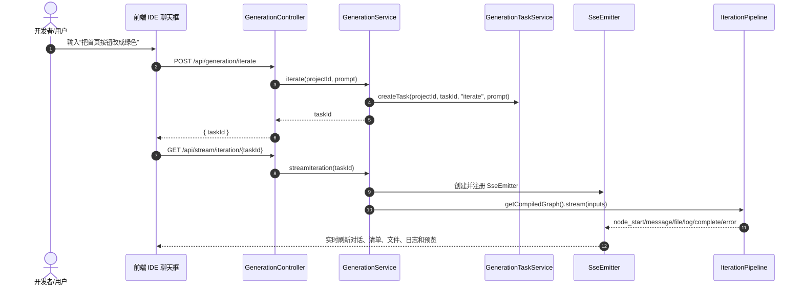
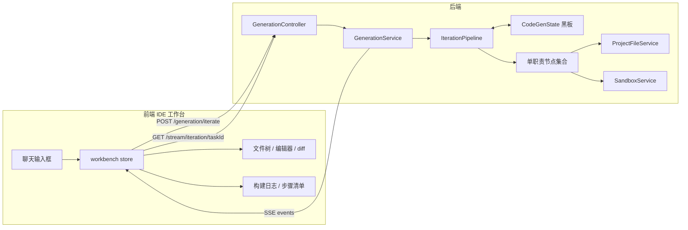
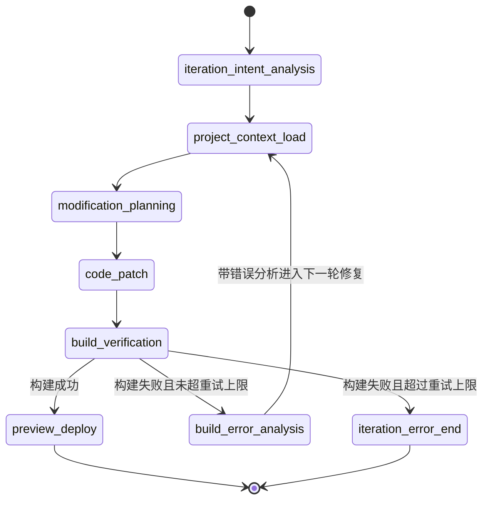
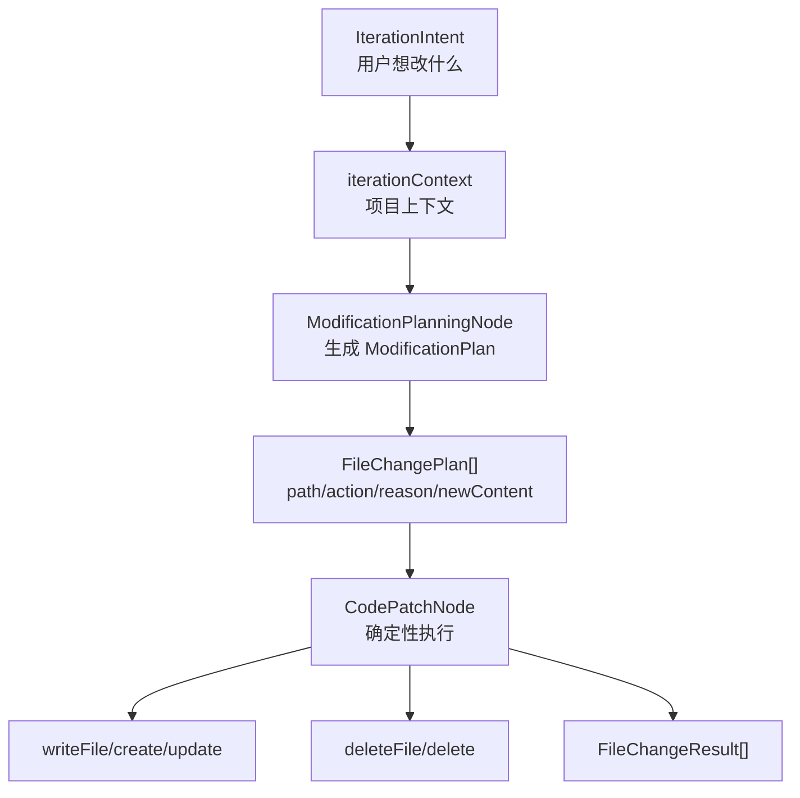
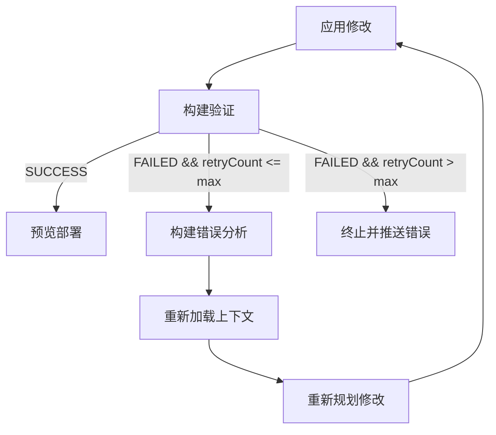
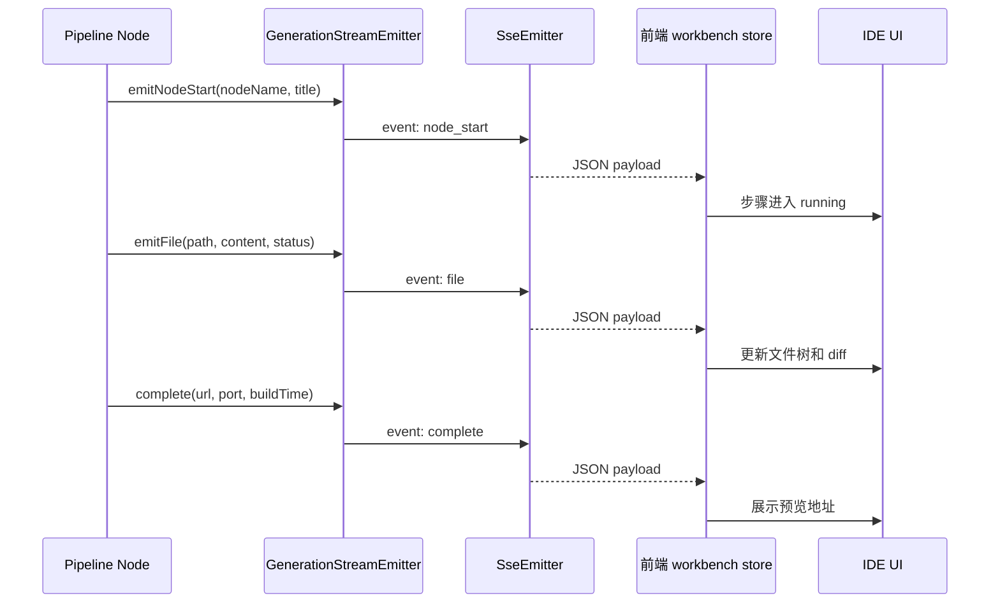
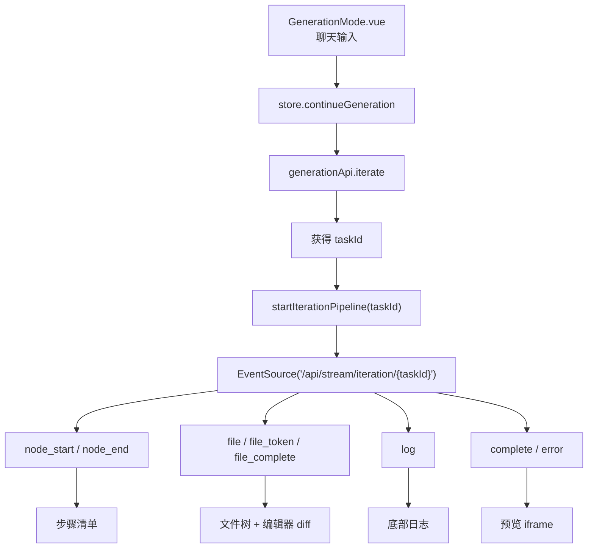

# 对话式迭代智能体开发者导读

本文面向后续维护 LingmaForge 智能体能力的开发人员，解释当前“一句话生成项目之后，通过 IDE 对话继续修改代码”的后端与前端实现。阅读本文时建议先不要从某一个节点类钻进去，而是先理解整体链路：前端聊天框提交修改请求，后端创建迭代任务，SSE 打开后由 `GenerationService` 驱动 `IterationPipeline`，LangGraph4j 按固定图依次执行多个节点，节点之间通过 `CodeGenState` 黑板传递结构化数据，最后由文件服务落库并触发构建验证与预览部署。

如果你只想快速定位入口，请从这两个接口开始看：

- `POST /api/generation/iterate`：创建对话式迭代任务，返回 `taskId`。
- `GET /api/stream/iteration/{taskId}`：订阅并启动本轮迭代流水线，前端通过 SSE 接收节点进度、文件变更、日志、完成或错误事件。

对应代码入口是：

- 后端 Controller：`lingmaForge-backend/src/main/java/com/lingmaforge/backend/workbench/web/GenerationController.java`
- 后端服务编排：`lingmaForge-backend/src/main/java/com/lingmaforge/backend/workbench/service/GenerationService.java`
- 迭代状态图：`lingmaForge-backend/src/main/java/com/lingmaforge/backend/workbench/ai/pipeline/IterationPipeline.java`
- 前端提交与订阅：`lingmaForge-frontend/src/stores/workbench.ts`

## 一、先从哪个接口开始看

对话式迭代不是直接让大模型拿到一段 prompt 后自由修改项目，而是拆成“创建任务”和“订阅执行”两个步骤。这样做的原因是：修改过程可能持续几十秒到数分钟，期间需要持续向前端推送进度、文件变更和构建日志；如果把所有逻辑塞进一个普通 HTTP 请求里，前端无法获得类似 Cursor 的连续反馈，也难以支持停止任务、节点状态展示、文件 diff 和构建结果同步。

第一步，前端聊天框调用 `generationApi.iterate(projectId, prompt)`。这个方法位于 `lingmaForge-frontend/src/api/generation.ts`，实际请求后端 `POST /api/generation/iterate`。后端 `GenerationController.iterate()` 调用 `GenerationService.iterate()`，该方法只做任务创建：校验项目存在、生成 `taskId`、写入任务表、保存用户聊天消息，然后把 `taskId` 返回给前端。

第二步，前端拿到 `taskId` 后调用 `startIterationPipeline(taskId)`，用 `EventSource` 打开 `/api/stream/iteration/{taskId}`。后端 `GenerationController.streamIteration()` 调用 `GenerationService.streamIteration()`。这个方法会创建 `SseEmitter`，注册 `GenerationStreamEmitter`，启动心跳，然后把真正的执行逻辑丢给异步 executor。也就是说，真正的智能体流水线不是在 `POST /iterate` 里执行，而是在 SSE 连接建立后执行。



## 二、整体架构怎么做的

当前实现采用“固定 LangGraph4j 状态图 + 黑板状态 + 单职责节点”的方式。固定图是刻意选择：我们先把最小闭环稳定下来，不引入动态监督者、向量检索、人工审批和长期记忆。固定图的好处是调用链清晰，测试可控，每个节点的输入输出都能通过 `CodeGenState` 看见。等这条链路稳定后，再加监督者模式或策略模式会更自然。

核心对象是 `CodeGenState`。它继承 LangGraph4j 的 `AgentState`，相当于整条流水线共享的黑板。每个节点不直接调用下一个节点，也不把 Java 参数一层层传下去，而是读取 `CodeGenState` 中自己需要的字段，然后返回一个 `Map<String, Object>` 作为状态更新。LangGraph4j 根据 `channels()` 定义把状态合并回黑板。比如 `iterationIntent`、`modificationPlan` 这类单值字段使用 LastValue 语义；`modifiedFiles` 这种列表字段使用 appender 语义。

对话式迭代流水线的主要状态字段如下：

- `iterationPrompt`：本轮用户修改指令。
- `iterationIntent`：意图分析结果，对应 `IterationIntent`。
- `iterationContext`：读取出的项目上下文摘要，包含框架、依赖、文件路径和候选文件内容。
- `modificationPlan`：结构化修改计划，对应 `ModificationPlan`。
- `modifiedFiles`：实际应用文件变更后的结果列表，对应 `FileChangeResult`。
- `buildErrorAnalysis`：构建失败后的结构化错误分析，对应 `BuildErrorAnalysis`。
- `qualityReviewResult`：为后续评估优化模式预留的质量评审结果。



## 三、IterationPipeline 的状态图

`IterationPipeline` 是本次对话式迭代能力的主干。它在 `@PostConstruct init()` 中构建 LangGraph4j `StateGraph<CodeGenState>`，把各节点注册进去，然后声明边和条件边。

正常路径如下：

1. `iteration_intent_analysis`：理解用户本轮想改什么。
2. `project_context_load`：根据意图读取项目上下文和候选文件内容。
3. `modification_planning`：让模型生成结构化修改计划。
4. `code_patch`：按照计划调用文件服务执行 create / update / delete。
5. `build_verification`：复用已有构建验证节点。
6. `preview_deploy`：构建成功后启动或更新预览。

失败路径如下：如果 `build_verification` 得到 `BuildStatus.FAILED`，且 `retryCount <= maxRetryCount`，图会进入 `build_error_analysis`。该节点读取构建日志和本轮修改计划，输出 `BuildErrorAnalysis`，然后回到 `project_context_load`，重新加载上下文并再次规划修改。超过最大重试次数后进入 `iteration_error_end`，向前端发送错误事件。



这个图体现的是“构建-修复循环模式”。注意当前实现没有让监督者动态选择节点，也没有让模型直接在任意阶段调用任意工具。模型只在意图分析、修改规划、构建错误分析这几个边界清晰的节点里输出结构化对象；文件落库和构建验证由确定性 Java 代码执行。

## 四、使用了哪些设计模式

### 1. 计划-执行模式

计划-执行模式是当前迭代链路的核心。`ModificationPlanningNode` 负责“计划”，它调用 `IterationAgent.planModification(prompt, projectContext, intent)`，输出 `ModificationPlan`。这个计划不是一段自然语言，而是一个可序列化的结构化对象，包含 summary、changes、risks。每个 `FileChangePlan` 里有 path、action、reason、newContent。

`CodePatchNode` 负责“执行”。它不再问大模型，而是逐条读取 `FileChangePlan`，把 `create` 和 `update` 映射为 `ProjectFileService.writeFile(projectId, path, newContent, status)`，把 `delete` 映射为 `ProjectFileService.deleteFile(projectId, path)`。这种拆分非常重要：模型适合做语义规划，但不应该在落库阶段继续自由发挥；落库应该是可审计、可测试、可回放的确定性代码。



### 2. 构建-修复循环模式

这套系统不是“模型改完就结束”，而是把构建验证放进闭环。`BuildVerificationNode` 执行构建，如果成功就进入预览部署；如果失败，`IterationPipeline.routeAfterBuild()` 会检查 `retryCount`。未超过上限时进入 `BuildErrorAnalysisNode`，把构建日志结构化为 `BuildErrorAnalysis`，再回到上下文加载和修改规划阶段。这样一来，模型下一轮规划不只知道用户想改什么，还能知道上一轮为什么构建失败。

当前循环是一个 MVP：`BuildErrorAnalysis` 已写入黑板，但后续节点主要通过重新读取上下文和原始 prompt 继续规划。下一步可以把 `buildErrorAnalysis` 显式拼入 `ProjectContextLoadNode` 或 `ModificationPlanningNode` 的上下文，使修复更定向。



### 3. 黑板模式

`CodeGenState` 是黑板模式。所有节点共享同一个状态对象，但每个节点只关心自己的输入字段和输出字段。比如 `IterationIntentAnalysisNode` 读取 `iterationPrompt` 和 `iterationContext`，写入 `iterationIntent`；`ProjectContextLoadNode` 读取 `iterationIntent`，写入 `iterationContext`；`ModificationPlanningNode` 读取 `iterationPrompt`、`iterationContext`、`iterationIntent`，写入 `modificationPlan`。

黑板模式的好处是节点之间低耦合。你可以替换某个节点，只要它读写的状态字段契约不变，下游节点就不需要改。它也方便测试：`IterationNodesTest` 可以直接构造一个 `CodeGenState`，调用某个节点的 `execute()`，断言返回的 Map 里是否包含目标状态更新。

### 4. 观察者模式

前端并不是轮询任务状态，而是通过 SSE 观察后端事件。后端抽象出 `GenerationStreamEmitter`，节点通过 `emitNodeStart()`、`emitNode()`、`emitFile()`、`emitLog()`、`complete()`、`error()` 等方法发送事件。`GenerationService.SseStreamEmitter` 是它的具体实现，内部把事件序列化后发送给 Spring `SseEmitter`。

这种方式符合观察者模式：后端任务执行者只负责发布事件，前端 `EventSource` 订阅事件并更新 UI。前端 store 会根据事件类型更新聊天消息、步骤清单、文件树、diff、日志和预览状态。



### 5. 策略模式的雏形

当前系统还没有完整的策略选择器，但已经有策略模式的雏形。`IterationPipeline.routeAfterBuild()` 根据 `BuildStatus` 和 `retryCount` 选择下一步路由：成功走 `preview_deploy`，失败未超限走 `build_error_analysis`，失败超限走 `iteration_error_end`。这就是最小的路由策略。

后续如果要增强为真正的策略模式，可以抽出 `IterationRouteStrategy` 或 `RepairStrategy`，让不同项目、不同错误类型、不同模型能力选择不同修复路线。例如依赖错误走依赖修复策略，类型错误走代码修复策略，样式需求走 UI 优化策略。

### 6. 模板方法模式

所有节点继承 `AbstractCodeGenNode`。这个抽象类封装了节点执行前后的通用动作：根据 `taskId` 从 `GenerationStreamRegistry` 获取 emitter，设置 `GenerationContext`，发送节点开始事件，并在节点结束时发送节点结束事件和清理 ThreadLocal。具体节点只需要实现自己的业务逻辑。

这就是模板方法模式的味道：公共执行框架在父类里，差异化逻辑在子类里。它让每个节点保持短小，也避免每个节点重复写 SSE 上下文注册和清理代码。

### 7. 适配器模式

`GenerationService.SseStreamEmitter` 是一个适配器。节点只依赖 `GenerationStreamEmitter` 接口，并不知道底层是 Spring 的 `SseEmitter`。`SseStreamEmitter` 把领域事件方法适配为具体 SSE event：`emitFile()` 变成 `event: file`，`emitLog()` 变成 `event: log`，`complete()` 变成 `event: complete`。

适配器模式的价值在于，未来如果要把事件推送改为 WebSocket、消息队列或任务日志持久化，节点层不需要改，只要换一个 `GenerationStreamEmitter` 实现。

### 8. 工厂模式

`AgentFactory` 负责创建 `IterationAgent`。节点不直接组装 LangChain4j `AiServices`，而是通过工厂拿到 Agent。这样模型配置、工具注入、系统提示词加载都集中在工厂里，节点只关心调用哪个 Agent 方法。

这降低了节点对模型基础设施的耦合。后续要按场景切换模型、切换提示词、注入更多工具，优先看 `AgentFactory`，不要把模型构建逻辑散落到各个节点里。

## 五、每个核心类负责什么

### GenerationController

`GenerationController` 是 HTTP 和 SSE 的入口层。它只做请求映射和简单参数转发，不承载智能体逻辑。对话式迭代相关方法是 `iterate()` 和 `streamIteration()`。如果你要确认前端请求路径是否正确，先看这里；如果你要改执行逻辑，不要在 Controller 里写，应该进入 `GenerationService` 或 `IterationPipeline`。

### GenerationService

`GenerationService` 是任务生命周期管理层。它负责创建任务、保存聊天消息、创建 SSE 连接、注册流式 emitter、启动异步执行、标记任务完成或失败、清理心跳和注册表。

对话式迭代最关键的方法是 `runIteration()`。它构造 LangGraph4j 输入：

```java
inputs.put(CodeGenState.PROJECT_ID, String.valueOf(projectId));
inputs.put(CodeGenState.TASK_ID, taskId);
inputs.put(CodeGenState.ITERATION_PROMPT, prompt);
```

然后调用：

```java
iterationPipeline.getCompiledGraph().stream(inputs)
```

这说明从服务层开始，迭代任务就已经进入状态图，而不是直接调用旧的 `IterationAgent.modify()`。

### IterationPipeline

`IterationPipeline` 是智能体编排层。它不处理 HTTP，不处理数据库任务表，也不直接读写文件；它只声明状态图结构，定义节点顺序和构建后的条件路由。

阅读这个类时重点看三块：

1. `addNode(...)`：有哪些节点被注册进图。
2. `addEdge(...)`：正常路径怎么走。
3. `addConditionalEdges(...)` 和 `routeAfterBuild(...)`：构建成功、失败、超限分别去哪。

### CodeGenState

`CodeGenState` 是状态契约层。新增一个节点时，要先问：这个节点读什么字段，写什么字段？如果字段需要跨节点共享，就应该在 `CodeGenState` 中声明常量、channel 和类型访问器。

对 LangGraph4j 来说，状态值需要可序列化，所以新增模型都实现了 `Serializable` 并声明 `serialVersionUID`。本次新增的模型包括 `IterationIntent`、`ModificationPlan`、`FileChangePlan`、`FileChangeResult`、`BuildErrorAnalysis`、`QualityReviewResult`。

### IterationAgent

`IterationAgent` 是模型能力接口。它现在提供三个结构化方法：

- `analyzeIntent(prompt, projectContext)`：输出 `IterationIntent`。
- `planModification(prompt, projectContext, intent)`：输出 `ModificationPlan`。
- `analyzeBuildError(buildLog, plan)`：输出 `BuildErrorAnalysis`。

旧的 `modify(String)` 仍保留，主要用于迁移期兼容，不再是新迭代流水线的主路径。开发时应优先扩展结构化方法，而不是继续堆一个自由文本大 prompt。

### IterationIntentAnalysisNode

该节点负责把用户自然语言修改请求变为 `IterationIntent`。它不会读取文件，也不会改文件。它的边界是“理解意图”：修改类型、摘要、可能涉及的文件、是否需要构建验证。

### ProjectContextLoadNode

该节点负责把项目上下文装载成文本摘要。它先读取 `ProjectService.getProjectContext(projectId)`，再根据 `IterationIntent.targetFiles` 决定读取哪些文件。如果意图没有给出目标文件，它会从项目文件列表中最多选取 8 个作为兜底上下文。

### ModificationPlanningNode

该节点负责让模型输出结构化修改计划。它读取用户指令、项目上下文和意图分析结果，输出 `ModificationPlan`。这个计划是下游文件落库的唯一依据。

### CodePatchNode

该节点是确定性执行层。它读取 `ModificationPlan.changes`，逐条调用 `ProjectFileService`。这是一个非常关键的安全边界：模型不直接落库，落库由 Java 根据结构化计划执行。当前 MVP 使用完整文件替换，后续可以利用已有 `patchFile` API 扩展到行级 patch。

### BuildVerificationNode 和 BuildErrorAnalysisNode

`BuildVerificationNode` 复用已有构建验证逻辑，执行 npm 构建并写入 `BUILD_STATUS`、`BUILD_ERROR`、`RETRY_COUNT` 等状态。`BuildErrorAnalysisNode` 在构建失败后调用模型，把构建日志转换成结构化错误分析，供下一轮修复使用。

## 六、前端怎么配合

前端入口在 `lingmaForge-frontend/src/stores/workbench.ts`。当用户在 IDE 右侧聊天框输入修改需求时，`GenerationMode.vue` 调用 `store.continueGeneration(val)`。store 内部调用 `generationApi.iterate(projectId, trimmed)` 创建任务，然后调用 `startIterationPipeline(taskId)` 打开 `/api/stream/iteration/{taskId}`。

前端对 SSE 事件的处理大致如下：

- `node_start`：把对应步骤设置为 running。
- `node_end`：把对应步骤设置为 done。
- `message`：追加 AI 消息。
- `file`：更新文件树、激活文件、展示 diff。
- `log`：追加构建日志。
- `complete`：更新预览地址、构建耗时和项目状态。
- `error`：停止生成并展示错误。



## 七、作为开发人员如何阅读和调试

建议按下面顺序阅读，不要一开始就跳到 LangGraph4j 内部：

1. 先看 `GenerationController.iterate()` 和 `streamIteration()`，确认外部 API。
2. 再看 `GenerationService.iterate()` 和 `runIteration()`，确认任务如何创建、SSE 如何启动、状态图输入怎么构造。
3. 然后看 `IterationPipeline.init()`，确认图的节点顺序和失败路由。
4. 接着看 `CodeGenState`，理解每个节点通过哪些字段通信。
5. 最后逐个看 `IterationIntentAnalysisNode`、`ProjectContextLoadNode`、`ModificationPlanningNode`、`CodePatchNode`、`BuildErrorAnalysisNode`。
6. 如果要看模型输出格式，进入 `IterationAgent` 和 `src/main/resources/prompts` 下的 prompt 文件。
7. 如果要看前端如何展示，进入 `workbench.ts` 的 `startIterationPipeline()` 和 `GenerationMode.vue` 的聊天区域。

调试时推荐先跑小测试，而不是直接跑完整 SpringBoot 集成测试：

```powershell
cd lingmaForge-backend
.\mvnw.cmd "-Dtest=CommonModelSerializationTest,CodeGenStateTest,IterationNodesTest,IterationPipelineTest,GenerationServiceIterationTest,GenerationServiceTest" test
```

前端可以跑：

```powershell
cd lingmaForge-frontend
npm test
npm run type-check
```

如果完整 `mvn test` 失败并提示 H2 文件数据库被锁，例如 `data/lingmaforge.mv.db` already in use，优先检查是否有后端服务、IDE 测试进程或其他 Java 进程占用了该文件。这类失败和迭代智能体代码本身不一定相关。

## 八、后续扩展建议

当前版本是固定图 MVP，下一步可以沿着现有设计自然扩展：

1. **监督者模式**：在 `IterationPipeline` 前面增加 supervisor 节点，根据用户请求判断走 UI 修改、功能开发、bug 修复、依赖调整还是只回答问题。
2. **评估-优化模式**：使用 `QualityReviewResult`，在 `code_patch` 或 `build_verification` 后增加质量评估节点，必要时返回规划阶段优化。
3. **策略模式**：把 `routeAfterBuild()` 抽为策略接口，根据 `BuildErrorAnalysis.category` 选择不同修复策略。
4. **行级 patch**：扩展 `FileChangePlan` 或新增 patch 模型，接入 `ProjectFileService.patchFile()`，减少整文件替换风险。
5. **人工审批**：在 `ModificationPlan` 之后增加审批节点，让前端展示计划，用户确认后再进入 `CodePatchNode`。
6. **上下文检索**：`ProjectContextLoadNode` 当前按目标文件或前 8 个文件兜底，后续可加入符号索引、依赖图、向量检索或最近编辑文件作为上下文选择策略。

总体原则是：模型负责理解和规划，Java 服务负责确定性执行，LangGraph4j 负责状态流转，SSE 负责可观察性。只要保持这四个边界清晰，后续加更多智能体模式时系统不会变成一团不可调试的大 prompt。
