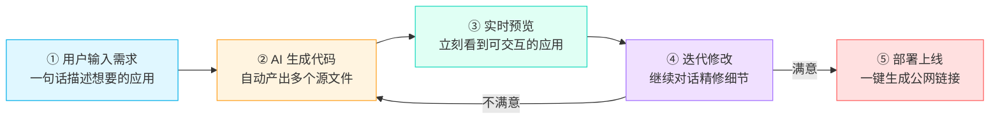
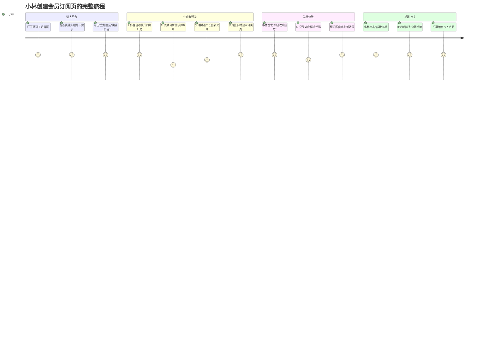
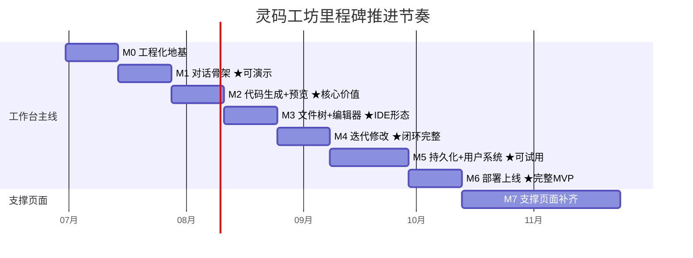
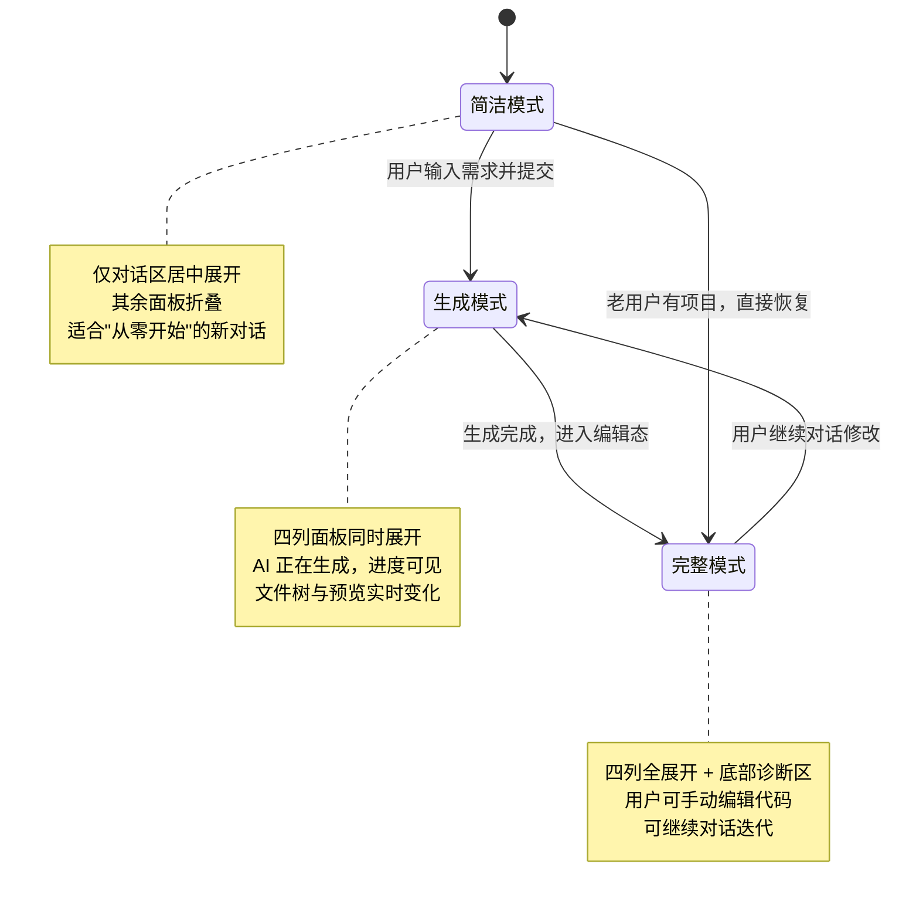
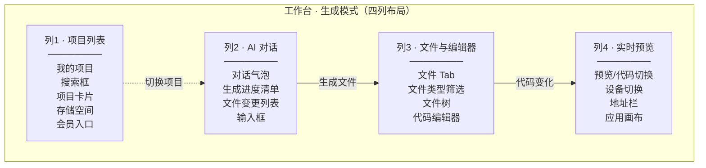
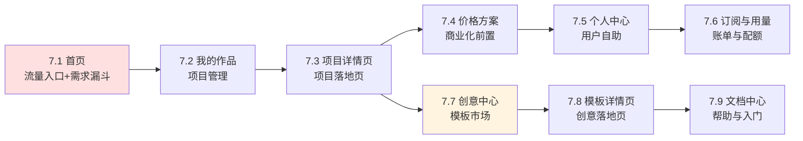
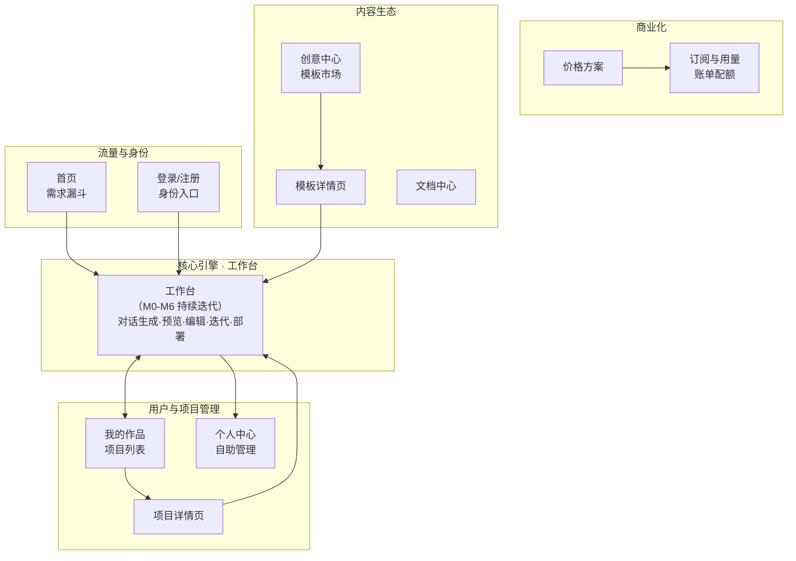
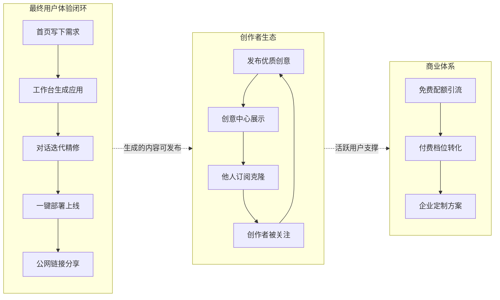

# 灵码工坊 (LingmaForge) · 产品需求文档 (PRD)

> **文档定位**：这是一份面向所有人的产品文档。它不讲技术实现，不讲前后端架构，只回答三个问题——**这个产品是什么？每个阶段做完之后世界多了什么？最终用户能看到什么？** 任何角色（产品、设计、运营、开发、投资人）读完都能对项目有完整一致的认知。

---

## 一、产品概述

### 1.1 一句话定义

**灵码工坊是一个「对话即开发」的 AI 应用生成平台——用户用一句自然语言描述需求，平台自动生成一个可预览、可修改、可部署的完整应用。**

### 1.2 产品要解决的问题

传统的应用开发门槛极高：要懂编程语言、要搭工程框架、要配环境、要写大量样板代码、要处理部署运维。一个普通人哪怕有一个绝佳的产品点子，从想法到上线往往需要数周乃至数月，且必须依赖专业开发者。

灵码工坊要把这条路径压缩成几分钟。它服务的不是「会写代码的人」，而是「有想法但不会写代码的人」，以及「会写代码但想跳过重复劳动的人」。它的核心承诺是：

> **你只需要描述你想要什么，剩下的交给平台。**

### 1.3 目标用户

| 用户类型 | 典型场景 | 平台价值 |
|---|---|---|
| 非技术创业者 / 产品经理 | 有个产品点子，想快速做个原型验证 | 几分钟生成可交互原型，无需找开发 |
| 中小企业主 | 需要官网、订阅页、表单页等轻量应用 | 不养技术团队也能拥有自己的应用 |
| 独立开发者 | 想跳过脚手架和样板代码，聚焦业务 | 用对话生成骨架，再手动精修 |
| 设计师 / 运营 | 想把设计稿或活动页快速变成可用网页 | 文字描述即可生成可上线页面 |

### 1.4 核心价值主张

- **零门槛**：不需要写一行代码，自然语言就是开发语言。
- **即时可见**：说出来的同时就能看到结果，所见即所得。
- **可迭代**：不满意就继续对话修改，像和设计师沟通一样自然。
- **可上线**：满意了一键部署，拿到公网链接即可分享给全世界。

### 1.5 产品对标与差异化

灵码工坊对标 Bolt.new、v0、Lovable 等海外 AI 应用生成平台。差异化在于两点：一是**面向中文用户**，从交互到生成内容都贴合国内使用习惯；二是内置**「创意中心」模板市场**，用户不仅能从零生成，还能订阅、克隆他人发布的优质创意作为起点，形成创作者生态。

---

## 二、产品全貌：核心闭环

灵码工坊的全部价值，凝结在一个五步闭环里。这个闭环是产品的脊椎，脊椎之外的所有页面都是支撑骨架。**脊椎没跑通之前，所有支撑页面都是空壳；脊椎跑通之后，所有支撑页面共享同一个真实可用的产品内核。**

这五步构成了产品的命脉。整个项目的实施过程，本质上就是**把这五步从「不存在」逐步变成「丝滑可用」**的过程。后续的每个里程碑，都是在给这条脊椎接上一节骨头、一层肌肉。

---

## 三、核心使用流程：一个用户的完整旅程

为了让所有人直观理解产品，我们跟随一个典型用户「小林」走一遍完整旅程。小林是一个不懂代码的创业者，想做一个会员订阅页面。

这个旅程里出现的每一个画面、每一次交互，都是后续里程碑要逐一实现的产品形态。文档第四部分将按里程碑顺序，详细说明每个阶段把旅程的哪一段变成现实。

---

## 四、分阶段实施计划

项目按 **M0 到 M7 共八个里程碑**推进。每个里程碑结束都必须是一个**可演示的版本**——没有「做了一半但演示不了」的阶段。贯穿始终的铁律是：**工作台是唯一持续迭代的页面，M0 到 M6 全在同一条工作台战线上逐层叠加，绝不提前分散精力去做其他页面。**

下面逐个里程碑展开。每个里程碑都包含：**这一阶段要达成什么、具体做哪些事、涉及哪些页面及其内容与交互逻辑、阶段结束时的演示效果**。

---

### M0 · 工程化地基 —— 把一堆原型变成可开发的工程

#### 阶段目标

在 M0 之前，灵码工坊只是一堆静态的 HTML 原型图：九个独立的页面文件，每个文件里都重复抄写了一遍导航栏和图标，没有任何工程框架、没有路由、没有数据、没有后端。它们是漂亮的「设计稿」，但还不是「产品」。

M0 的任务是完成从「设计稿」到「可开发工程」的跨越。这一阶段不产生任何用户可见的新功能，它的全部价值在于为后续所有里程碑打下地基：搭好前后端工程骨架、统一设计语言、抽离公共组件。**地基打得越稳，后面盖楼越快。**

#### 这一阶段完成的事情

- **建立工程框架**：前端从零初始化一个现代工程，支持路由跳转、状态管理、热更新开发；后端搭建起服务骨架，能启动、能连数据库、能返回标准格式的响应。
- **统一设计系统**：从九份原型里散落的样式里，提炼出一套统一的设计语言——主色、辅色、圆角、间距、字体层级，全部沉淀为可复用的设计变量。以后任何页面都从这套变量取值，保证视觉一致性。
- **抽离公共组件**：九份原型里重复了九遍的顶部导航栏、页脚、按钮、输入框、图标，全部抽成可复用组件。尤其是一百多个内联 SVG 图标，合并成统一的图标系统，一个图标名引用一处，再不复制造垃圾。
- **数据库基础**：建立最基础的三张表（用户、项目、项目文件），跑通数据库迁移流程，为后续持久化做准备。

#### 涉及页面与内容

M0 阶段**不还原任何原型页面**，只搭骨架。唯一可见的产物是一个带统一导航栏的空白页面，以及一个能返回健康检查接口的后端服务。

#### 阶段演示效果

启动前端，能看到一个带顶部导航栏的空白页面，导航栏的菜单项可以点击（虽然目标页还没内容）；启动后端，接口能正常响应。**这一步看似平淡，但它意味着项目从此脱离「一堆静态文件」的状态，进入「可工程化迭代」的正轨。**

---

### M1 · 工作台对话骨架 —— 第一次可演示

#### 阶段目标

这是整个项目的**第一个可演示里程碑**，意义在于让产品第一次「活过来」。

M1 要实现的核心体验是：用户打开工作台，看到一个居中的大输入框，输入一句话需求，AI 像真人一样逐字流式回复。此时 AI 还不会真的生成代码（那是 M2 的事），但「对话」这个最基本的交互形态要先立住——输入要顺、回复要流畅、不能卡顿断连。

**这一阶段遵循「先 fake 后 real」原则**：AI 的回复可以先用脚本模拟的假数据驱动，目的是先把交互体验打磨到位，等体验对了再接真实 AI。因为如果一开始就纠缠于真实 AI 接入，很容易陷入「功能有了但体验很糙」的泥潭。

#### 工作台的「三态模式」

工作台是整个产品最复杂的页面，它有三种视图状态，会根据用户所处的阶段自动切换：

M1 阶段只实现「简洁模式」——对话区居中展开，其余面板暂不显示。

#### 涉及页面：工作台（简洁模式）

工作台页面在这个阶段呈现的内容：

- **顶部工作台工具栏**：显示面包屑路径（工作台 › 当前项目名）、项目标题（可编辑）、运行状态指示灯、运行/停止/部署/分享等操作按钮。这些按钮在 M1 多数还是占位，但视觉框架先到位。
- **居中的对话区**：这是 M1 的主角。包含三部分：
  - **AI 问候语**：进入工作台时，AI 主动发一句欢迎语，引导用户开始描述需求。
  - **消息列表**：展示用户和 AI 的对话气泡。AI 的回复支持流式逐字渲染，支持基础的文字格式。
  - **输入框**：底部的大输入框，支持「Enter 发送、Shift+Enter 换行」，旁边有发送按钮和示例 prompt 快捷按钮。
- **空状态引导**：当还没有任何对话时，输入框下方展示几个示例 prompt（如「做一个待办事项应用」「做一个会员订阅页」），用户点击即可一键填入输入框，降低「不知道说什么」的心理门槛。

#### 交互逻辑

1. 用户进入工作台，看到简洁模式：居中的对话区，AI 的问候语，空的消息列表，底部的输入框。
2. 用户在输入框输入「做一个待办事项应用」，按 Enter 发送。
3. 用户消息立即出现在消息列表中，AI 开始「思考」。
4. AI 的回复以流式方式逐字出现，模拟真实对话节奏（M1 用假数据驱动）。
5. 用户可以继续输入，形成多轮对话。

#### 阶段演示效果

> 打开工作台，看到一个居中的大输入框和 AI 的问候语。输入「做一个待办事项应用」，AI 流畅地逐字回复。整个对话过程丝滑不卡顿、不断连。示例 prompt 可点击填入，Enter 发送、Shift+Enter 换行都符合直觉。

**这是项目第一次让外人看到「它会动、会回应」，是从 0 到 1 的心理跨越。**

---

### M2 · 代码生成 + 实时预览 —— 核心价值初见

#### 阶段目标

如果说 M1 让产品「活过来」，那 M2 让产品**「值钱」**。

M1 的 AI 只会聊天，不会干活。M2 要让 AI 真正干活——用户说「做一个带搜索功能的通讯录页面」，AI 不再只是回复文字，而是**真正生成出网页代码，并且在预览区实时渲染出一个可交互的通讯录页面**。这是产品核心价值第一次具象化：用户第一次亲眼看到「我说的需求，变成了一个能用的东西」。

这一阶段，工作台从「简洁模式」切换到「生成模式」——四列面板同时展开，让用户一边看 AI 生成文件、一边看预览区实时变化。

#### 工作台「生成模式」的四列布局

工作台的核心是一个类 IDE 的四列布局，这是整个产品最复杂、也最有辨识度的界面：

M2 阶段先让四列都能显示出来，但功能重点在「列3 文件区」和「列4 预览区」的联动。M1 已完成的「列2 对话区」继续承接用户输入。

#### 涉及页面：工作台（生成模式，新增文件区与预览区）

**列3 · 文件区**（M2 首次出现）：
- **文件 Tab 与筛选**：顶部显示文件数量统计（如「18 文件」），可按类型筛选（页面/组件/接口）。
- **文件树**：树形展示 AI 生成的文件结构，按 `src/pages`、`src/components` 等目录组织。M2 阶段，AI 每生成完一个文件，文件树就**实时多出一个节点**，让用户直观感受到「东西正在被创造出来」。
- **代码编辑器**：嵌入一个专业级代码编辑器（VS Code 同款内核），支持语法高亮。点击文件树节点，编辑器加载对应文件内容。M2 阶段编辑器以只读展示为主，手动编辑能力留到 M3。

**列4 · 实时预览区**（M2 首次出现）：
- **预览/代码切换**：可在「看应用效果」和「看代码」之间切换。
- **设备切换**：桌面端 / 手机端视角切换，预览不同屏幕下的效果。
- **地址栏**：显示应用的访问地址和刷新按钮。
- **应用画布**：核心区域，实时渲染 AI 生成的前端应用。M2 阶段，每当 AI 生成或修改代码，预览区**自动刷新**，用户立刻看到最新效果。

**列2 · AI 对话区**（M1 基础上增强）：
- AI 的回复气泡里，除了文字，开始展示**生成进度清单**：需求分析 → 执行规划 → 页面生成 → 接口生成 → 样式优化 → 预览验证，每一步实时显示「进行中 / 已完成 / 等待中」。
- 同时展示**文件变更列表**：列出本次生成涉及哪些文件，标注是「新增」还是「修改」。

#### 交互逻辑

1. 用户在对话区输入「做一个带搜索功能的通讯录页面」，提交。
2. 工作台从简洁模式**动画展开为四列生成模式**。
3. AI 在对话区流式回复，同时展示生成进度清单（需求分析→规划→生成...逐项点亮）。
4. 文件树区：AI 每生成一个文件（如 `index.html`、`style.css`、`app.js`），文件树实时长出对应节点。
5. 预览区：代码生成到一定程度后，预览画布自动渲染出一个可交互的通讯录页面——有搜索框、有联系人列表、能输入名字实时过滤。
6. 用户可以切换设备视角看手机端效果，点击文件节点查看代码。
7. 若生成失败，给出友好错误提示，可重新生成。

#### 阶段演示效果

> 输入「做一个带搜索功能的通讯录页面」，AI 开始干活。文件树一个接一个长出文件，对话区进度清单逐项打勾，右侧预览区渐渐浮现出一个真实的通讯录页面——能搜索、能滚动、能点击。用户第一次体验到「我说的，真的变成了能用的东西」。

**这一步让产品的核心价值第一次可被感知、可被验证。从这一刻起，灵码工坊不再只是个聊天框，而是一个能创造应用的工坊。**

---

### M3 · 文件树 + 编辑器 —— AI IDE 形态完整

#### 阶段目标

M2 让 AI 能生成应用，但用户只能「看」，不能「改」——预览出的应用如果有个小地方不满意，用户只能继续用对话让 AI 改，无法亲手微调。M3 要补上这个缺口，让工作台成为一个**完整的 AI IDE**：用户既能看 AI 生成的文件结构，又能亲手在编辑器里修改代码，改完预览立刻更新。

这一阶段，工作台进入「完整模式」——四列全展开，且新增底部诊断区。文件树、编辑器、预览三者形成**三方实时联动**：点文件→编辑器打开→预览同步。

#### 涉及页面：工作台（完整模式）

**列3 · 文件区**（M2 基础上增强为可编辑）：
- **文件树增删改**：用户可在文件树中手动新建文件、删除文件、重命名，不再只是 AI 单向生成。
- **生成中「生长」动画**：AI 生成文件时，文件树节点带渐显动画，强化「正在生成」的感知。
- **代码编辑器升级为可编辑**：从 M2 的只读展示升级为完整编辑能力——支持语法高亮、代码补全、多文件切换。一文件一缓存模型，切换文件不卡顿。
- **手动编辑保存**：用户改完代码，按 Ctrl+S 保存，触发预览刷新。

**列4 · 预览区**（M2 基础上升级预览引擎）：
- 预览能力从「单文件 HTML」升级为**支持多文件项目**（如完整的 Vue 项目，含组件、样式、入口），能渲染更复杂的应用。
- 编辑器代码一变，预览自动热更新，无需手动刷新。

**底部诊断区**（M3 首次出现）：
工作台底部新增一条可折叠的诊断面板，包含四个 Tab：
- **运行日志**：实时输出应用运行的日志（安装依赖、路由生成、组件生成等），像真实开发控制台。
- **构建**：展示构建过程与结果。
- **部署**：部署相关（M6 启用）。
- **用量**：展示本次生成的 Token 消耗、预计费用等（与后续订阅体系挂钩）。

#### 交互逻辑

1. AI 生成一个多文件 Vue 项目（如 `App.vue` + 若干组件 + `style.css`），文件树完整展示目录结构。
2. 用户点击文件树的 `App.vue`，编辑器加载该文件内容，语法高亮显示。
3. 用户在编辑器里手动改了一行代码，按 Ctrl+S 保存。
4. 预览区自动刷新，反映出用户的修改。
5. 用户切换到「运行日志」Tab，看到应用运行过程的日志输出。
6. AI 生成过程中，代码边生成边在编辑器里显示（流式填充），用户能实时看到代码「被写出来」的过程。

#### 阶段演示效果

> 生成一个多文件的 Vue 项目，文件树展示完整的目录结构。点击任意文件，编辑器流畅加载并高亮显示代码。亲手改一行代码、Ctrl+S 保存，预览区立刻更新。底部诊断区像专业 IDE 一样显示运行日志。整个工作台已经是一个形态完整的 AI IDE——AI 会写，人也能改，二者协同。

**这一步让工作台从「AI 的展示台」进化为「人机协作的工作台」，AI IDE 的形态正式确立。**

---

### M4 · 迭代修改 —— 闭环体验完整

#### 阶段目标

M3 之后，用户能生成应用、能手动改代码，但还有个关键缺口：**多轮对话的增量修改**。

真实场景里，用户很少一次生成完美应用，往往是「先生成个大概，然后反复说改这里、改那里」。M2 的生成是「从无到有」，M4 要补上「从有到优」——用户在已有项目上继续对话，AI 能听懂上下文，**只改该改的地方，不重写无关文件**。

这一步做完，产品的核心闭环才真正完整：输入→生成→预览→**迭代**→（部署）。用户可以无限次地和 AI 对话精修，直到满意。

#### 涉及页面：工作台（完整模式 + 对话历史）

**列2 · AI 对话区**（增强）：
- **多轮对话历史**：完整保留当前项目的所有对话记录，用户随时可回看之前说过什么、AI 改了什么。
- **diff 高亮**：当 AI 修改某个文件时，编辑器里高亮显示改动行（类似 Git 的差异对比），让用户一眼看清「这次改了哪里」。
- **增量修改而非全量重写**：AI 收到「把导航栏改成深色」时，只修改导航栏对应的样式代码，其他文件纹丝不动。这点体验至关重要——如果每次小修改都重写整个项目，既慢又可能破坏已有成果。

**列3 · 文件区**（增强撤销重做）：
- **版本快照**：每次 AI 修改前，自动保存一个文件快照。
- **撤销 / 重做**：用户不满意 AI 的修改，可一键回退到上一个版本，像文档的撤销一样自然。

#### 交互逻辑

1. 用户已有一个 AI 生成的博客页面。
2. 用户在对话框说「把导航栏改成深色」。
3. AI 理解上下文，只修改导航栏对应的 CSS 文件，对话区展示 diff：编辑器高亮显示被改的几行。
4. 预览区刷新，导航栏变成深色，其余不变。
5. 用户觉得不好看，点击「撤销」，回退到修改前的版本。
6. 用户继续说「再加一个搜索框」，AI 增量添加搜索功能，对话历史完整保留。

#### 阶段演示效果

> 生成一个博客页面后，说「把导航栏改成深色」，AI 只改了导航栏的样式，编辑器里清晰高亮这几行改动，预览区导航栏变深、其他不变。不满意？一键撤销回上一版。再继续说「加个搜索框」，AI 增量添加。整个对话历史完整可回溯，每一次修改都精准、可控、可逆。

**这一步让产品从「一次性生成器」进化为「可持续协作的伙伴」，核心闭环体验完整闭环。用户可以放心地反复打磨，因为每次修改都精准、可逆。**

---

### M5 · 持久化 + 用户系统 —— 可对外试用

#### 阶段目标

M0 到 M4，工作台已经能跑通完整的生成-预览-迭代闭环，但有个致命问题：**关掉浏览器，一切消失**。项目没保存、用户没账号、刷新页面就回到原点。这样的产品只能自己玩，没法给别人用。

M5 要解决「数据不丢」和「身份识别」两件事——让用户能注册登录、能创建项目、能保存、能下次回来继续。**做完这一步，产品才真正具备「对外试用」的条件。**

#### 涉及页面

**新增页面：登录 / 注册页**
- 一个独立的登录页（而非弹窗），左右分栏：左侧是品牌吉祥物展示区，传递产品调性；右侧是表单区。
- 支持「邮箱 + 密码」注册登录，支持「验证码登录 / 密码登录」切换。
- 预留第三方登录入口（GitHub / 微信 / Google）——M5 阶段先不实现，留到后续。
- 登录后跳转工作台。

**工作台 · 列1 项目列表区**（首次接入真实数据）
- 之前 M1-M4 左侧的项目列表都是假数据，M5 起从后端加载用户真实的项目。
- 显示项目卡片：项目名、状态（已部署/开发中/草稿）、更新时间。
- 支持搜索、按「最近/收藏」筛选。
- 底部显示存储空间用量和会员升级入口。

**工作台 · 自动保存**
- 用户在编辑器里的任何改动、AI 的任何生成，都自动保存到后端。
- 刷新页面、关闭浏览器、换台电脑登录，项目和代码都还在。

#### 交互逻辑

1. 新用户访问平台，被引导到登录页，注册一个账号（邮箱+密码）。
2. 登录后进入工作台，左侧项目列表为空，提示「新建项目」。
3. 用户新建一个项目，开始对话生成应用。
4. 生成过程中，所有文件、对话自动保存。
5. 用户关闭浏览器。次日重新登录，左侧项目列表里有昨天的项目，点开继续编辑，一切如昨。

#### 阶段演示效果

> 注册一个账号，创建一个项目，生成应用，关掉浏览器。第二天重新登录，昨天的项目和代码原封不动地等在那里，点开就能继续。多项目之间自由切换，每个项目独立保存。数据再也不丢了。

**这一步让产品从「自娱自乐的 demo」升级为「可对外试用的真产品」。可以邀请真实用户来用了。**

---

### M6 · 部署上线 —— 完整 MVP

#### 阶段目标

M5 让应用能保存，但应用还「困」在工作台里——只有创建者能在平台内预览，没法分享给别人。M6 要打通最后一公里：**用户点一下「部署」，应用变成一个公网可访问的链接，任何人打开浏览器就能用。**

至此，核心闭环五步全部跑通：输入 → 生成 → 预览 → 迭代 → **部署**。产品成为一个**完整的 MVP（最小可行产品）**，具备端到端的真实价值。

#### 涉及页面：工作台（部署能力接入）

**列1 工具栏 · 部署按钮**（启用）：
- 顶部工具栏的「部署」按钮正式启用。
- 点击后进入部署流程：打包应用静态资源 → 上传到托管服务 → 生成公网链接。

**部署状态展示**：
- 部署中：显示进度（构建中 → 上传中 → 发布中）。
- 部署成功：展示公网链接，可一键复制、一键在浏览器打开、一键分享。
- 部署失败：给出失败原因，支持一键重试。

**部署历史**：
- 每次部署都记录版本，可查看历史部署、可回滚到任意历史版本。

#### 交互逻辑

1. 用户在工作台完成应用生成与迭代，满意了。
2. 点击工具栏「部署」按钮。
3. 工作台显示部署进度，约 30 秒后提示「部署成功」。
4. 展示一个公网链接，如 `https://app.lingma-forge.com/p/xxxxx`。
5. 用户复制链接发给合伙人，合伙人在自己浏览器打开，看到一个真实可用的应用。
6. 用户后续修改了应用，可重新部署生成新版本，旧版本仍可回滚。

#### 阶段演示效果

> 在工作台点「部署」，30 秒后拿到一个公网链接。把这个链接发给别人，对方打开就是一个真实可用的应用——不需要注册、不需要安装，打开即用。部署历史里每次版本都留着，随时可回滚。

**这一步标志核心闭环彻底打通，产品成为完整的 MVP。从「想法」到「上线」的全流程，在灵码工坊里一气呵成。**

---

### M7 · 支撑页面逐步补齐 —— 产品化

#### 阶段目标

M0 到 M6，全部精力都聚焦在工作台这一条主线上，核心闭环已完整可用。但一个完整的产品除了「工作台」这个核心引擎，还需要一系列**支撑页面**来承担流量入口、用户管理、商业化、内容生态等职能。

M7 阶段，核心引擎已经稳固，开始逐个补齐支撑页面。**每个支撑页面都是独立交付，且都共用 M0-M6 打磨好的同一个真实产品内核**——不是另起炉灶做静态页，而是把真实功能包装成不同入口。

支撑页面按依赖关系排序，优先补对核心闭环贡献最大的：

#### 各支撑页面内容与逻辑

**7.1 首页 —— 流量入口与需求漏斗**
首页是用户接触产品的第一站，核心使命是「用最短路径把用户的需求转化成一次生成」。页面包含：
- **Hero 区**：醒目的产品主张「灵感一触即发」，配品牌吉祥物和动态的代码生成动画（模拟 AI 写代码的过程），传递产品调性。
- **需求输入框**：Hero 区直接放一个输入框，用户落地即可写下需求，点「立即生成」直接跳转工作台并带上需求——**这是首页最重要的转化路径，把访客变成用户。**
- **创意工坊卡片**：展示精选的生成案例（SaaS 官网、订阅商城、数据看板等），让访客直观看到「能生成什么样的应用」，激发想象。
- **实时动态**：展示其他用户正在生成什么，营造活跃氛围。
- **数据指标**：开发效率、项目可用率、创意组件数等，建立信任。

**7.2 我的作品 —— 项目管理**
用户管理自己所有项目的页面，从工作台左侧栏独立出来的完整版。包含：
- **统计卡片**：全部项目数、已部署数、开发中数、草稿数。
- **项目网格**：卡片式展示所有项目，含缩略图、状态、更新时间、页面数、接口数。
- **搜索与筛选**：按名称/类型搜索，按全部/最近/收藏/回收站筛选。
- **最近动态**：展示项目级的操作记录（部署成功、更新组件等）。
- **新建项目**：入口跳转工作台。

**7.3 项目详情页 —— 项目落地页**
点击「我的作品」里某张卡片后的落地页，集中展示单个项目的全貌与操作入口：项目信息、文件结构、部署历史、对话记录、一键打开工作台继续编辑等。（此页原型待补画。）

**7.4 价格方案 —— 商业化前置**
展示三档订阅方案（基础版 ¥19/月、专业版 ¥49/月、尊享版 ¥99/月），用对比表详细列出各档在「AI 生成、项目部署、团队协作、服务支持」四个维度的差异，配 FAQ 解答常见疑问，底部引导企业用户联系销售。这是商业化的核心转化页。

**7.5 个人中心 —— 用户自助管理**
用户管理个人信息的入口，侧边菜单含：个人资料、我的作品、收藏、订单与发票、账号安全、通知设置。资料区展示头像、昵称、玩家 ID、会员等级；账户概览区展示项目数、部署数、用量等概览数据。

**7.6 订阅与用量 —— 账单与配额**
管理订阅和监控用量的页面。包含：
- **当前方案详情**：展示当前订阅档位、价格、剩余天数、续费进度条。
- **用量指标卡**：AI 生成次数、Token 用量、部署时长、团队席位四项配额的消耗进度。
- **账单与支付记录**：历史账单表格，可下载发票。
- **支付方式管理**：绑定的支付方式。
- **订阅设置**：自动续费开关、续费提醒、用量提醒、取消订阅。

**7.7 创意中心 —— 模板市场（差异化亮点）**
这是灵码工坊区别于竞品的差异化功能——一个创意模板市场。用户不仅能从零生成，还能浏览、订阅、克隆他人发布的优质创意作为起点。页面三栏布局：
- **左侧筛选**：按分类（企业官网/电商订阅/数据看板等）、标签、价格、排序筛选。
- **中间轮播+卡片**：顶部精选创意轮播展示，下方创意卡片网格（缩略图、标题、评分、订阅量、创作者）。
- **右侧榜单**：热门创作者、本周上新、创意趋势。
- **核心交互**：每个创意卡片可「订阅」或「克隆」——克隆即把该创意作为模板复制成自己的项目，进入工作台二次修改。**这让灵码工坊从一个工具进化为一个创作者生态。**

**7.8 模板详情页 —— 创意落地页**
点击创意中心卡片后的详情页，展示单个创意的完整介绍、预览、订阅量、评分、创作者信息，以及「克隆到工作台」的核心操作入口。（此页原型待补画。）

**7.9 文档中心 —— 帮助与入门**
开发者文档与帮助中心，三栏布局：左侧目录导航、中间正文（快速开始、核心概念、AI 生成、项目部署、API 参考、SDK 等）、右侧本页导航与 AI 助手。内容可随产品迭代逐步填充。

#### 阶段演示效果

> 支撑页面逐一就位：访客从首页输入需求一键进工作台；用户在「我的作品」管理项目；价格页引导付费；个人中心自助管理；创意中心让优质模板被复用、让创作者被看见。整个产品从「一个能用的工作台」成长为「一个完整的产品体系」。

**这一步让产品从「核心引擎可用」走向「完整产品形态」，具备商业化与生态运营的能力。**

---

## 五、页面全景与职责总览

整个产品共九个核心页面（外加 M7 待补的项目详情页、模板详情页），按角色分为「核心引擎」与「支撑体系」两类：

| 页面 | 角色 | 所属里程碑 | 核心职责 |
|---|---|---|---|
| 工作台 | 核心引擎 | M0-M6 | 对话生成、预览、编辑、迭代、部署，产品命脉 |
| 登录/注册 | 身份入口 | M5 | 用户注册登录，进入工作台的前提 |
| 首页 | 流量入口 | M7.1 | 需求漏斗，把访客变成用户 |
| 我的作品 | 项目管理 | M7.2 | 管理所有项目 |
| 项目详情页 | 项目落地 | M7.3 | 单项目全貌与操作 |
| 价格方案 | 商业化 | M7.4 | 订阅档位展示与转化 |
| 个人中心 | 用户自助 | M7.5 | 个人信息与设置 |
| 订阅与用量 | 账单配额 | M7.6 | 订阅管理与用量监控 |
| 创意中心 | 模板市场 | M7.7 | 创意浏览、订阅、克隆 |
| 模板详情页 | 创意落地 | M7.8 | 单创意详情与克隆 |
| 文档中心 | 帮助入门 | M7.9 | 文档与 AI 助手 |

---

## 六、最终呈现：产品完成态

当所有里程碑走完，灵码工坊呈现为一个**完整的 AI 应用生成平台**。它的完整面貌是这样的：

**对最终用户而言**，灵码工坊是一个「会听话的工坊」：你打开首页，写下「我要一个会员订阅页」，几秒后你就看到一个真实的订阅页在预览区跳动；你说「按钮改圆角」「加个优惠券入口」，它一一照做且只改该改的；你点「部署」，30 秒后拿到一个公网链接，发出去任何人都能用。从想法到上线，全程不写一行代码，几分钟搞定。

**对创作者而言**，灵码工坊还是一个生态：你把做好的应用发布到创意中心，别人订阅、克隆你的创意，你成为被关注的创作者。好的创意被复用、被传播，形成正向循环。

**对平台而言**，灵码工坊是一个可商业化的产品：免费用户有配额限制，专业版/尊享版解锁更高额度与团队协作；用量、账单、订阅管理一应俱全；企业版提供私有化部署与专属支持。

这就是灵码工坊的完整脉络：**一个以「对话生成应用」为核心引擎，以「创意中心」为差异化生态，以「订阅体系」为商业闭环的 AI 应用生成平台。** 它从一句需求出发，最终长成一个让创造更简单的工坊——任何人，有想法，就能成事。

---

## 附：里程碑速查表

| 里程碑 | 阶段定位 | 核心交付 | 演示效果 |
|---|---|---|---|
| **M0** | 工程化地基 | 前后端骨架、设计系统、公共组件 | 带导航栏的空白页 + 后端启动 |
| **M1** | 对话骨架 ★ | 工作台简洁模式、流式对话 | 输入需求，AI 流式回复 |
| **M2** | 代码生成+预览 ★ | 工作台生成模式、文件树、实时预览 | 输入需求，生成真实可交互应用 |
| **M3** | 文件树+编辑器 ★ | 工作台完整模式、可编辑编辑器、诊断区 | 多文件项目、手动改代码、预览联动 |
| **M4** | 迭代修改 ★ | 多轮对话、diff 高亮、撤销重做 | 增量修改、精准可控可逆 |
| **M5** | 持久化+用户系统 ★ | 登录注册、项目 CRUD、自动保存 | 关浏览器不丢，重登继续 |
| **M6** | 部署上线 ★ | 部署按钮、公网链接、部署历史 | 一键部署，30秒拿公网链接 |
| **M7** | 支撑页面 ★ | 首页/作品/价格/个人中心/创意中心/文档 | 完整产品体系，商业化与生态 |

> ★ 标记的里程碑结束后均可对外演示。整个项目通过这八个里程碑，把「一堆静态原型图」逐步变成「一个完整可用的 AI 应用生成平台」。
