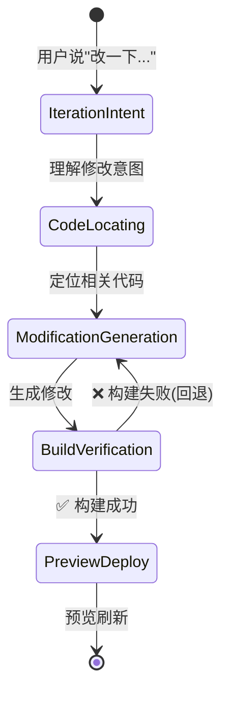
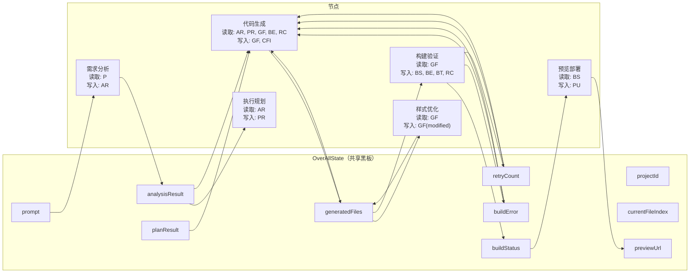

# 灵码工坊 · 后端核心功能实现——从流水线编排到文件生成的完整指南

> 这是灵码工坊教学项目的第二篇文章。
> 第一篇文章讲了项目全景和架构规划，你知道了六阶段流水线的存在、每个阶段做什么、用什么模型。但那篇文章停在"设计层面"——它告诉你"需求分析节点输出 JSON 规范"，但没有告诉你**JSON 规范的具体字段是什么、提示词怎么写、模型输出了结构化数据之后怎么自动映射到 Java 对象、代码怎么从大模型的输出变成磁盘上的真实文件**。
> 这篇文章填补那个空白。它从"设计"走到"实现"——每个节点到底怎么工作、Spring AI 的 `.entity()` 方法怎么替代手动 JSON 解析、文件怎么从大模型的输出变成磁盘上的真实文件、迭代修改怎么定位到该改的代码、提示词怎么存储和管理、需要编写哪些 ToolCallback、用什么设计模式让整个系统可扩展。
> 读完这篇文章，你不仅知道灵码工坊的流水线长什么样，还能动手把它写出来。

---

## 目录

- [一、流水线不是六个步骤串起来，而是六个 Agent 协作](#一流水线不是六个步骤串起来而是六个-agent-协作)
- [二、节点一：需求分析——把一句话变成结构化蓝图](#二节点一需求分析把一句话变成结构化蓝图)
  - [2.6 结构化输出：用 `.entity()` 而不是手动解析 JSON](#26-结构化输出用-entity-而不是手动解析-json)
- [三、节点二：执行规划——把蓝图变成文件清单](#三节点二执行规划把蓝图变成文件清单)
- [四、节点三：代码生成——从规划到真实文件（核心）](#四节点三代码生成从规划到真实文件核心)
- [五、节点四：样式优化——最后一笔微调](#五节点四样式优化最后一笔微调)
- [六、节点五：构建验证——让代码跑起来](#六节点五构建验证让代码跑起来)
- [七、节点六：预览部署——把应用交到用户面前](#七节点六预览部署把应用交到用户面前)
- [八、迭代修改——用户说"改一下"，系统怎么做？](#八迭代修改用户说改一下系统怎么做)
- [九、ToolCallback 工具体系——Agent 的手脚](#九toolcallback-工具体系agent-的手脚)
- [十、提示词工程——每个节点的灵魂](#十提示词工程每个节点的灵魂)
- [十一、提示词存储与加载——让提示词成为可维护的资产](#十一提示词存储与加载让提示词成为可维护的资产)
- [十二、设计模式——让系统可扩展、可维护](#十二设计模式让系统可扩展可维护)
- [十三、StateGraph 状态流转——数据如何在节点之间传递](#十三stategraph-状态流转数据如何在节点之间传递)

---

## 一、流水线不是六个步骤串起来，而是六个 Agent 协作

很多人把流水线理解为"六个函数依次调用"——先调用 `analyzeRequirement()`，再调用 `planExecution()`，再调用 `generateCode()`……这种理解是对的，但不完整。

**流水线的本质是六个 Agent 协作完成一个复杂任务。** 每个 Agent 有自己的"大脑"（LLM 模型）、自己的"手脚"（ToolCallback 工具）、自己的"记忆"（OverAllState 状态）。它们不是简单的函数调用，而是自主的决策单元——模型决定了要调用哪个工具、工具返回了结果之后模型决定下一步做什么、模型认为任务完成了就停止循环。

这个区别很重要。简单的函数调用是确定性逻辑——输入 A，必定输出 B。但 Agent 是不确定性逻辑——输入同样的 prompt，模型可能选择不同的工具调用顺序、生成不同的代码内容、甚至在同一次生成中做出不同的决策。这不是 bug，这是 Agent 模式的核心特性——**让模型自己判断怎么做，而不是由代码规定怎么做。**

为什么这很重要？因为代码生成不是一个确定性任务。"帮我生成一个会员订阅商城"——这个需求可以有多种实现方式。三档套餐可以是三个独立组件，也可以是一个带条件渲染的组件。订单管理可以用本地 state 模拟，也可以接入真实 API。**确定性逻辑无法处理这种多样性，但 Agent 可以——模型根据需求上下文自己决定实现方案。**

### 1.1 StateGraph 是"导演"，Agent 是"演员"

StateGraph 定义了流水线的整体节奏——先做需求分析、再做执行规划、再做代码生成……这是"导演"的工作。导演决定了演出顺序，但不决定每个演员怎么表演。

每个节点里的 ReactAgent 是"演员"——导演告诉它"你现在是需求分析阶段，拿到的是用户的原始 prompt"，演员自己决定怎么分析需求、要不要调用工具读一下项目上下文、最终输出什么格式的 JSON。导演只关心演员表演完了没有（节点执行结束），不关心演员表演的具体内容。

**这种分工带来两个好处：**

1. **导演可以换节奏**：构建失败了，导演可以让演员"重来"——StateGraph 的条件边把流水线回退到代码生成节点，告诉演员"上次生成的代码构建失败了，错误信息是 xxx，请你修复"。演员拿到新的上下文，自己决定怎么修复——改哪个文件、改什么内容、改多少行。

2. **演员可以换剧本**：如果需求分析阶段的效果不好，你不需要改 StateGraph 的编排逻辑，只需要改演员的提示词——换一个更详细的 system prompt、加一个新的工具、调整模型的参数。StateGraph 的边和节点不需要动。

### 1.2 六节点的角色分工

| 节点 | 角色 | 是否需要 LLM | 原因 |
|------|------|-------------|------|
| requirementAnalysis | 需求分析师 | ✅ DeepSeek-V3 | 需要理解自然语言、输出结构化 JSON |
| executionPlanning | 架构师 | ✅ DeepSeek-V3 | 需要规划文件结构、制定生成策略 |
| codeGeneration | 程序员 | ✅ Claude Sonnet 4 | 需要逐文件生成高质量代码 |
| styleOptimization | 美工 | ✅ DeepSeek-V3 | 需要理解 CSS 并微调样式 |
| buildVerification | 质检员 | ❌ 纯逻辑 | 只是跑 npm build，不需要 AI 判断 |
| previewDeploy | 运维 | ❌ 纯逻辑 | 只是启动 Dev Server，不需要 AI 判断 |

前四个节点需要 LLM——它们要做"判断"。后两个节点不需要 LLM——它们做的是"执行"。这种分工是刻意的——**AI 做判断，代码做执行**。判断是不确定性的（需求怎么分析、代码怎么写），执行是确定性的（跑命令、返回结果）。把确定性和不确定性分开，系统就可控了。

---

## 二、节点一：需求分析——把一句话变成结构化蓝图

### 2.1 这个节点做什么？

用户输入的是一句话："帮我生成一个会员订阅商城，包含三档套餐、支付按钮和订单管理。"

这句话是自然语言——人能看懂，但下游的执行规划节点看不懂。执行规划节点需要知道"有几个页面、每个页面有什么组件、有什么 API 接口、样式主题是什么"。需求分析节点的任务就是**把自然语言翻译成结构化 JSON**，让下游节点能像读规格书一样工作。

这不是简单的"让模型输出一个 JSON"。需求分析节点要做三件事：

1. **理解意图**：用户说"会员订阅商城"，他真正想要的是什么？是一个电商页面？还是一个 SaaS 付费页面？是给 C 端用户的？还是给 B 端的？模型需要根据上下文推断意图，不是字面翻译。

2. **拆解结构**：三档套餐 = 一个页面有三个 PlanCard 组件？还是三个独立页面？支付按钮 = 一个按钮组件 + 一个支付确认弹窗？还是直接链接到第三方支付？订单管理 = 一个 OrderList 列表页面？还是包含创建/查看/取消三个子页面？模型需要把这些模糊的描述变成精确的组件和路由定义。

3. **补全隐含需求**：用户说"会员订阅商城"，但没有提到"首页应该有导航栏"、"需要有登录入口"、"订单列表需要分页"。好的需求分析不是只翻译用户说的，而是**补充用户没说但合理推断的需求**。比如：一个商城应该有导航、有购物车提示、有会员等级显示——即使用户没有明确提到。

### 2.2 用什么模型？

**DeepSeek-V3**。

为什么不是 Claude？因为需求分析的任务性质是"中文理解 + JSON 输出"，不是"代码生成"。DeepSeek-V3 在中文理解方面和 Claude 不相上下，但成本只有 Claude 的十分之一（DeepSeek-V3 约 $0.14/M input tokens，Claude Sonnet 4 约 $3/M input tokens）。需求分析阶段模型调用量不大（一次生成就调用一次），但不需要用最贵的模型做最简单的任务。

为什么不是通义千问？通义千问也可以用，但 DeepSeek-V3 的 JSON mode 更稳定——它能在 `response_format: json` 模式下几乎 100% 输出合法 JSON，而通义千问在复杂 JSON 结构的输出中偶尔会混入非 JSON 内容（比如开头加一句"以下是分析结果："）。JSON 输出的稳定性对需求分析节点至关重要——因为下游的执行规划节点要解析这个 JSON，如果格式不对，整条流水线就断了。

### 2.3 结构化输出格式

需求分析节点输出的 JSON 必须有固定的结构——下游节点要按字段读取。下面是完整的输出格式定义：

```json
{
  "appName": "会员订阅商城",
  "description": "一个面向 C 端用户的会员订阅付费平台，提供三档套餐选择、在线支付和订单管理功能",
  "pages": [
    {
      "name": "Home",
      "route": "/",
      "description": "首页，展示导航栏、品牌介绍和快捷入口",
      "components": ["NavBar", "HeroSection", "FeaturePreview"]
    },
    {
      "name": "Subscription",
      "route": "/subscription",
      "description": "套餐选择页，展示三档会员套餐卡片、价格对比和支付入口",
      "components": ["PlanCard", "PriceComparison", "PaymentButton", "PlanModal"]
    },
    {
      "name": "Orders",
      "route": "/orders",
      "description": "订单管理页，展示订单列表、订单状态筛选和订单详情查看",
      "components": ["OrderList", "OrderFilter", "OrderDetail"]
    }
  ],
  "apis": [
    {
      "name": "获取套餐列表",
      "path": "/api/plans",
      "method": "GET",
      "description": "返回三档会员套餐的名称、价格、权益描述",
      "responseShape": {
        "plans": [
          { "id": "string", "name": "string", "price": "number", "features": ["string"] }
        ]
      }
    },
    {
      "name": "创建订单",
      "path": "/api/orders",
      "method": "POST",
      "description": "用户选择套餐后创建订阅订单",
      "requestShape": { "planId": "string" },
      "responseShape": { "orderId": "string", "status": "string", "createdAt": "string" }
    },
    {
      "name": "查询订单列表",
      "path": "/api/orders",
      "method": "GET",
      "description": "返回用户的订单列表，支持状态筛选和分页",
      "responseShape": {
        "orders": [
          { "id": "string", "planName": "string", "status": "string", "createdAt": "string" }
        ]
      }
    }
  ],
  "features": [
    "三档套餐切换对比",
    "支付确认弹窗",
    "订单状态筛选（全部/待支付/已支付/已取消）",
    "移动端适配"
  ],
  "style": {
    "theme": "#6366f1",
    "themeName": "indigo",
    "layout": "responsive",
    "fontFamily": "Inter, system-ui, sans-serif"
  }
}
```

**为什么这个 JSON 要定义得这么细？**

因为执行规划节点需要这些字段来决定生成什么文件。如果 `pages` 只有名称没有路由，执行规划不知道路由文件怎么写。如果 `apis` 没有 `responseShape`，代码生成节点不知道 Mock API 应该返回什么数据。如果 `style` 没有主题色，样式优化节点不知道用什么颜色做主题。

**每一个字段都是下游节点的输入，缺一个字段就缺一段上下文，下游节点就得多猜一步，猜错了就构建失败。** 这就是为什么需求分析的输出格式要定义得非常精确——不是为了"好看"，而是为了"不出错"。

### 2.4 提示词设计

需求分析节点的提示词分为两部分：**system prompt**（角色定义 + 输出格式约束）和 **user prompt**（用户的原始输入 + 上下文注入）。

**system prompt** 是固定的——每次生成都用同一个 system prompt，只是内容模板。它的设计目标是：

1. 明确角色："你是一个专业的需求分析师"
2. 明确任务："将用户需求解析为结构化 JSON 规范"
3. 明确分析规则：告诉模型怎么拆解页面、怎么补充隐含需求、怎么推断主题色
4. 明确输出约束：告诉模型输出什么字段、每个字段填什么内容

**注意：因为我们使用了 Spring AI 的 `.entity()` 方法做结构化输出（详见第 2.6 节），提示词中不再需要写"只输出 JSON，不要输出其他内容"这样的硬约束。`.entity()` 内部会自动做 JSON Schema 生成 + 格式约束 + 反序列化，模型不会在 JSON 前面加解释性文字，也不会用 ```json``` 包裹输出。**这是 `.entity()` 相比手动解析的核心优势——你不需要在提示词里"教模型怎么输出 JSON"，框架替你做了这件事。**

完整的 system prompt 如下：

```
你是一个专业的需求分析师。你的任务是将用户的自然语言需求解析为结构化的 JSON 规范。

## 分析规则

1. **拆解页面**：用户描述的每个功能模块应该对应一个独立页面。如果功能复杂（如订单管理包含列表+详情），拆成子路由。
2. **拆解组件**：每个页面内的可独立交互单元应该对应一个组件。按钮、卡片、列表、弹窗、筛选器都是独立组件。
3. **补充隐含需求**：如果用户没有提到但合理推断需要的功能（如导航栏、登录入口、移动端适配），自动补充。
4. **API 定义**：每个数据交互场景至少定义一个 API。给出 requestShape 和 responseShape，使用简单类型（string/number/boolean/array/object）。
5. **样式推断**：根据应用类型推断主题色。电商类用暖色（橙/红），工具类用冷色（蓝/紫），内容类用中性色（灰/绿）。
```

**为什么 system prompt 不再需要写 JSON 输出格式了？**

因为 `.entity(RequirementSpec.class)` 方法会自动从 `RequirementSpec` 这个 Java 类生成 JSON Schema，注入到模型请求中。模型看到的请求里已经包含了完整的格式约束——每个字段的名称、类型、是否必需、描述信息。模型只需要按照 Schema 输出，框架自动把 JSON 反序列化成 `RequirementSpec` 对象。

你不再需要手动维护"提示词里的 JSON 格式定义"和"Java 类的字段定义"这两份东西——只有一份，就是 Java 类。改了 Java 类，JSON Schema 自动跟着变，提示词自动跟着变。**单一来源，不会不一致。**

但 system prompt 仍然需要写**分析规则**——因为 JSON Schema 只告诉模型"输出什么字段"，不告诉模型"怎么填这些字段"。比如 Schema 告诉模型要输出 `pages` 数组，但不会告诉模型"用户说订单管理，你应该拆成列表+详情两个子路由"。这些业务逻辑是提示词该做的事。

### 2.5 需要什么工具？

需求分析节点理论上**不需要任何 ToolCallback**。因为使用了 `.entity()` 结构化输出，模型直接输出 JSON 并被框架自动反序列化——整个过程中模型不需要"动手"——它只需要"动脑"。

但在实际场景中，有一个可选的工具：

**readProjectContext**：如果用户是在已有项目上做迭代修改（而不是从零创建），需求分析节点需要知道当前项目有什么文件、用了什么框架。这个工具读取项目的 package.json 和文件树，让模型知道"用户已经有一个 React 项目，里面有 3 个页面和 2 个组件"。

```java
@Component
public class ReadProjectContextTool implements ToolCallback {

    private final ProjectService projectService;

    @Override
    public String getName() {
        return "readProjectContext";
    }

    @Override
    public String getDescription() {
        return "读取项目上下文信息，包括框架类型、已有文件列表、package.json 依赖";
    }

    @Override
    public String call(String functionArgs) {
        // functionArgs = "{ \"projectId\": \"xxx\" }"
        ReadProjectContextArgs args = parseArgs(functionArgs);

        ProjectContext context = projectService.getProjectContext(args.getProjectId());

        // 返回结构化的项目信息
        return """
            框架: %s
            文件列表:
            %s
            package.json 依赖:
            %s
            """.formatted(
                context.getFramework(),
                context.getFileTreeAsString(),
                context.getDependenciesAsString()
            );
    }
}
```

**为什么是可选的？** 因为首次生成时项目是空的，没有上下文可读。只有迭代修改时才需要这个工具。ReactAgent 会根据需要自己决定是否调用——如果 system prompt 没有提到"先读项目上下文"，模型不会主动调用；如果提到了，模型会先调用再分析。

### 2.6 结构化输出：用 `.entity()` 而不是手动解析 JSON

这是这篇文章最关键的技术决策之一。很多人写 Agent 时习惯让模型输出 JSON，然后手动解析：

```java
// ❌ 旧方式：手动解析 + 容错
String rawOutput = chatModel.call(prompt).getResult().getOutput().getText();
String json = JsonOutputParser.extractJson(rawOutput);  // 去掉前缀文字、markdown 包裹
RequirementSpec spec = JSON.parseObject(json, RequirementSpec.class);  // 手动反序列化
```

这种方式有三个致命问题：

1. **模型经常不遵守"只输出 JSON"的约束**——它会在 JSON 前面加一句"以下是分析结果："，或者在 JSON 里面加注释 `// 这是套餐列表`，或者用 ` ```json``` ` 包裹输出。你需要写大量的容错代码来清洗这些"脏数据"。

2. **提示词和 Java 类是两份独立的格式定义**——你在提示词里写了"输出 `{ appName: string, pages: [...] }` 格式的 JSON"，同时在 Java 里定义了 `RequirementSpec` 类有 `appName` 和 `pages` 字段。改了 Java 类忘记改提示词，两个字段定义就不一致了。模型看到的是旧格式，你的代码期待的是新格式，解析必定失败。

3. **没有自纠错能力**——解析失败了，代码只能抛异常或返回 null。你没法告诉模型"你的输出格式不对，请重新输出"。除非你用 ReactAgent + validateJson 工具手动搭建纠错循环——但这又引入了额外的工具和提示词。

**Spring AI 的 `.entity()` 方法彻底解决了这三个问题。**

#### 方式一：最简方式——`ChatClient.entity()`

一行代码，模型输出直接映射到 Java 类，零手动解析：

```java
// ✅ 新方式：Spring AI 自动做 JSON Schema 约束 + 反序列化
RequirementSpec spec = ChatClient.create(chatModel).prompt()
    .system(systemPrompt)   // 只需要角色定义和分析规则，不需要 JSON 格式约束
    .user(userPrompt)       // 用户的原始需求文本
    .call()
    .entity(RequirementSpec.class);  // 直接得到 Java 对象，不需要手写 JSON.parseObject
```

`.entity()` 内部做了三件事：

1. **自动生成 JSON Schema**：从 `RequirementSpec` 类的字段定义、`@JsonProperty` 注解生成完整的 JSON Schema。模型收到的请求里已经包含了"每个字段叫什么、类型是什么、是否必需、描述是什么"的约束。

2. **自动约束模型输出格式**：模型按照 JSON Schema 输出——不会加前缀文字、不会加注释、不会用 markdown 包裹。因为框架已经告诉模型"请按这个 Schema 输出"，模型遵守 Schema 的概率远高于遵守提示词里的"只输出 JSON"文字约束。

3. **自动反序列化**：模型输出的 JSON 字符串被自动转换为 `RequirementSpec` 对象。你不需要写 `JsonOutputParser.extractJson()`，不需要写 `JSON.parseObject()`，不需要手动转型。

**格式定义的单一来源是 Java 类，不是提示词。** 你只需要维护一份 `RequirementSpec.java`——改了 Java 类，JSON Schema 自动跟着变，模型的输出格式自动跟着变。不存在"提示词和 Java 类不一致"的问题。

#### 方式二：泛型类型——`ParameterizedTypeReference`

需要返回 `List<XXX>` 这种泛型时：

```java
// 返回文件清单列表
List<FilePlan> plans = ChatClient.create(chatModel).prompt()
    .system(systemPrompt)
    .user(userPrompt)
    .call()
    .entity(new ParameterizedTypeReference<List<FilePlan>>() {});
```

#### 方式三：模型原生支持——`ENABLE_NATIVE_STRUCTURED_OUTPUT`

对于 Claude、GPT-4o 等支持原生 JSON Schema 的模型，可以加一个 Advisor 让模型直接按 Schema 输出：

```java
RequirementSpec spec = ChatClient.create(chatModel).prompt()
    .advisors(AdvisorParams.ENABLE_NATIVE_STRUCTURED_OUTPUT)  // 模型原生结构化输出
    .system(systemPrompt)
    .user(userPrompt)
    .call()
    .entity(RequirementSpec.class);
```

这种方式更可靠——模型在输出层就按 Schema 生成，而不是"先自由输出 JSON 再尝试匹配 Schema"。适用于需求分析和执行规划这两个对结构化精度要求最高的节点。

#### 方式四：BeanOutputConverter——更精细的控制

如果需要在流式场景中使用结构化输出，或者需要手动获取 JSON Schema 字符串：

```java
BeanOutputConverter<RequirementSpec> converter = new BeanOutputConverter<>(RequirementSpec.class);

// 获取 JSON Schema 字符串（可以注入到提示词中作为格式参考）
String jsonSchema = converter.getFormat();

// 流式场景：先收集完整内容，再结构化转换
Flux<String> flux = chatClient.prompt()
    .system(systemPrompt)
    .user(userPrompt)
    .stream()
    .content();

String content = flux.collectList().block().stream().collect(Collectors.joining());
RequirementSpec spec = converter.convert(content);
```

#### 需求分析节点的最终实现

结合 ReactAgent 和 `.entity()`，需求分析节点的完整代码变成：

```java
@Component
public class RequirementAnalysisNode extends AbstractReactAgentNode {

    private final ChatClient analysisChatClient;

    public RequirementAnalysisNode(
            @Qualifier("analysisModel") ChatModel analysisModel,
            PromptTemplateLoader promptLoader) {
        this.analysisChatClient = ChatClient.builder(analysisModel)
            .defaultAdvisors(AdvisorParams.ENABLE_NATIVE_STRUCTURED_OUTPUT)
            .build();
        this.promptLoader = promptLoader;
    }

    @Override
    public OverAllState execute(OverAllState state) {
        String systemPrompt = promptLoader.loadSystemPrompt("requirement-analysis");
        String userPrompt = GenerationStateAccessor.getPrompt(state);

        // 一行搞定：模型输出 → RequirementSpec 对象，零手动解析
        RequirementSpec spec = analysisChatClient.prompt()
            .system(systemPrompt)
            .user(userPrompt)
            .call()
            .entity(RequirementSpec.class);

        // 直接写入 State，不再需要 JSON 字符串中间态
        state.put(GenerationStateKeys.ANALYSIS_RESULT, spec);
        return state;
    }

    @Override
    protected String getNodeName() {
        return "requirement-analysis";
    }
}
```

**对比旧方式的变化：**

| 变化点 | 旧方式 | 新方式（.entity()） |
|--------|--------|-------------------|
| 提示词 | 需要写 JSON 格式定义 + "只输出JSON"约束 | 只需要写角色定义和分析规则 |
| Java 类 | 和提示词里的格式定义是两份独立的东西 | 是唯一的格式来源，提示词不再重复定义 |
| 解析代码 | JsonOutputParser.extractJson() + JSON.parseObject() | 不需要，.entity() 自动做 |
| 容错代码 | 去掉前缀文字、去掉 markdown 包裹、去掉注释 | 不需要，模型按 Schema 输出不会加这些 |
| 纠错机制 | validateJson ToolCallback + ReactAgent 自纠错循环 | 不需要，框架级保证格式正确 |
| State 存储 | 存 JSON 字符串，读取时手动反序列化 | 直接存 Java 对象，类型安全 |

**最重要的结论：`.entity()` 让结构化输出从"提示词约定 + 手动解析 + 容错纠错"变成了"Java 类定义 + 框架自动处理"。你不再需要维护两份格式定义，不再需要写容错代码，不再需要自建纠错循环。这是 Spring AI 对 Agent 开发最大的贡献之一。**

---

## 三、节点二：执行规划——把蓝图变成文件清单

### 3.1 这个节点做什么？

需求分析节点输出了一份"规格书"——告诉你有几个页面、什么组件、什么 API、什么主题色。但规格书不是代码——你还需要知道"这些规格对应哪些文件、每个文件写什么内容、文件之间怎么依赖"。

执行规划节点的任务是**把规格书变成文件清单和生成顺序**。它输出的不是代码，而是"接下来代码生成节点应该按什么顺序生成哪些文件"。

为什么需要这个中间步骤？为什么不直接从需求分析跳到代码生成？

**三个原因：**

1. **控制生成节奏**：代码生成是逐文件进行的——一个文件生成完了再生成下一个。如果不先规划生成顺序，代码生成 Agent 就得自己决定"先写哪个文件、后写哪个文件"。这个决策看似简单，实则复杂——路由文件依赖页面组件的导出，页面组件依赖子组件的接口定义，Mock API 文件依赖数据结构。如果生成顺序不对，前面的文件引用了后面还没生成的组件，就会产生无效代码。

2. **控制上下文窗口**：每个文件生成时，模型需要知道"当前项目的整体结构、已生成的文件列表、当前文件在项目中的位置"。如果一次性把所有文件的生成指令塞进一个 prompt，上下文窗口会溢出。执行规划节点把任务拆成"每个文件一次调用"，每次调用只传入必要的上下文。

3. **前端可视化**：用户在文件树面板上看到文件节点一个个冒出来——这个体验需要执行规划先告诉前端"接下来会有 14 个文件，按这个顺序生成"。前端拿到文件树骨架，然后逐文件填充内容。

### 3.2 用什么模型？

**DeepSeek-V3**。

和需求分析节点一样——执行规划是结构化规划任务，不是代码生成任务。DeepSeek-V3 的 JSON mode 稳定，成本低，完全够用。

### 3.3 结构化输出格式

执行规划节点输出的是**文件清单 + 生成顺序**。每个文件条目包含：文件路径、文件类型、内容大纲、依赖关系。

```json
{
  "totalFiles": 14,
  "totalPages": 3,
  "totalApis": 2,
  "generationOrder": [
    {
      "step": 1,
      "path": "package.json",
      "type": "config",
      "description": "项目配置文件，定义 React 18 + TypeScript + Tailwind CSS 依赖",
      "dependencies": []
    },
    {
      "step": 2,
      "path": "src/styles/globals.css",
      "type": "style",
      "description": "全局样式，定义主题色 CSS 变量、字体、基础布局",
      "dependencies": []
    },
    {
      "step": 3,
      "path": "src/api/mock.ts",
      "type": "api",
      "description": "Mock API 定义，包含套餐列表、创建订单、查询订单三个接口",
      "dependencies": ["package.json"]
    },
    {
      "step": 4,
      "path": "src/components/PlanCard.tsx",
      "type": "component",
      "description": "套餐卡片组件，展示单个套餐的名称、价格、权益列表和选择按钮",
      "dependencies": ["src/styles/globals.css"]
    },
    {
      "step": 5,
      "path": "src/components/PaymentButton.tsx",
      "type": "component",
      "description": "支付按钮组件，点击后弹出支付确认弹窗",
      "dependencies": ["src/styles/globals.css"]
    },
    {
      "step": 6,
      "path": "src/components/OrderList.tsx",
      "type": "component",
      "description": "订单列表组件，展示订单卡片、支持状态筛选",
      "dependencies": ["src/styles/globals.css", "src/api/mock.ts"]
    },
    {
      "step": 7,
      "path": "src/components/NavBar.tsx",
      "type": "component",
      "description": "导航栏组件，包含 Logo、页面链接和会员状态指示",
      "dependencies": ["src/styles/globals.css"]
    },
    {
      "step": 8,
      "path": "src/pages/Home.tsx",
      "type": "page",
      "description": "首页，组合 NavBar + HeroSection + FeaturePreview",
      "dependencies": ["src/components/NavBar.tsx"]
    },
    {
      "step": 9,
      "path": "src/pages/Subscription.tsx",
      "type": "page",
      "description": "套餐选择页，组合 PlanCard + PaymentButton",
      "dependencies": ["src/components/PlanCard.tsx", "src/components/PaymentButton.tsx", "src/api/mock.ts"]
    },
    {
      "step": 10,
      "path": "src/pages/Orders.tsx",
      "type": "page",
      "description": "订单管理页，组合 OrderList + OrderFilter",
      "dependencies": ["src/components/OrderList.tsx", "src/api/mock.ts"]
    },
    {
      "step": 11,
      "path": "src/App.tsx",
      "type": "entry",
      "description": "应用入口，定义路由（/ → Home, /subscription → Subscription, /orders → Orders）",
      "dependencies": ["src/pages/Home.tsx", "src/pages/Subscription.tsx", "src/pages/Orders.tsx"]
    },
    {
      "step": 12,
      "path": "src/main.tsx",
      "type": "entry",
      "description": "渲染入口，挂载 App 到 DOM",
      "dependencies": ["src/App.tsx"]
    },
    {
      "step": 13,
      "path": "vite.config.ts",
      "type": "config",
      "description": "Vite 配置，定义开发服务器和构建选项",
      "dependencies": []
    },
    {
      "step": 14,
      "path": "index.html",
      "type": "entry",
      "description": "HTML 入口，挂载 React 应用和引入全局样式",
      "dependencies": []
    }
  ]
}
```

**为什么 generationOrder 要定义依赖关系？**

因为代码生成 Agent 需要知道"生成当前文件时，哪些文件已经存在"。如果 PlanCard.tsx 在第 4 步生成，生成它时可以引用 globals.css（第 2 步已生成），但不能引用 Subscription.tsx（第 9 步还没生成）。依赖关系告诉 Agent：**生成这个文件时，可以 import 的模块有哪些。**

这不是"让模型遵守依赖关系"——模型自然会尝试 import 它认为需要的模块。依赖关系的作用是**在 Agent 的 readFileContext 工具中筛选可用上下文**——只把已生成的文件内容作为上下文传给模型，避免模型引用不存在的模块。

### 3.4 提示词设计

执行规划节点的 system prompt 需要告诉模型："你已经拿到了需求分析的结果，现在请规划文件清单。"

关键设计点：

1. **输入注入**：system prompt 不包含需求分析的 JSON——需求分析的结果是通过 OverAllState 传递的 `RequirementSpec` 对象，在 user prompt 中动态拼接。
2. **框架约束**：告诉模型"技术栈是 React 18 + TypeScript + Tailwind CSS + Vite"，让模型知道生成什么类型的文件。
3. **顺序约束**：告诉模型"先生成配置文件和样式文件，再生成组件，再生成页面，最后生成入口文件"——这是合理的依赖顺序。
4. **不需要写 JSON 格式约束**：和需求分析节点一样，使用 `.entity(PlanResult.class)` 自动约束输出格式。

```
你是一个专业的项目架构师。你的任务是根据需求规范，规划出完整的项目文件清单和生成顺序。

## 技术栈约束

- 框架: React 18 + TypeScript
- 构建: Vite
- 样式: Tailwind CSS + CSS 变量
- 路由: React Router v6
- 状态: React Hooks (useState/useEffect)

## 文件类型分类

| 类型 | 说明 | 优先级 |
|------|------|--------|
| config | package.json, vite.config.ts, tsconfig.json | 最先生成 |
| style | globals.css, 主题变量 | 第二批 |
| api | Mock API 定义 | 第三批 |
| component | 可复用 UI 组件 | 第四批 |
| page | 页面组合组件 | 第五批（依赖 component） |
| entry | App.tsx, main.tsx, index.html | 最后生成 |

## 规划规则

1. 每个组件（components 字段）对应一个独立文件
2. 每个页面（pages 字段）对应一个独立文件
3. 每个 API 对应一个 Mock 接口函数（统一放在 src/api/mock.ts）
4. 配置文件必须包含完整的依赖声明
5. 生成顺序必须遵循依赖关系：先生成被依赖的文件，后生成依赖它的文件
6. dependencies 只列出在当前步骤之前已经生成的文件路径
```

**为什么不再需要"只输出 JSON"的约束？** 和需求分析节点同理——`.entity(PlanResult.class)` 自动从 Java 类生成 JSON Schema，框架自动约束模型输出格式。提示词只需要告诉模型"怎么规划"，不需要告诉模型"输出什么格式"。

### 3.5 执行规划节点的实现

```java
@Component
public class ExecutionPlanningNode extends AbstractReactAgentNode {

    private final ChatClient planningChatClient;

    public ExecutionPlanningNode(
            @Qualifier("analysisModel") ChatModel planningModel,
            PromptTemplateLoader promptLoader) {
        this.planningChatClient = ChatClient.builder(planningModel)
            .defaultAdvisors(AdvisorParams.ENABLE_NATIVE_STRUCTURED_OUTPUT)
            .build();
        this.promptLoader = promptLoader;
    }

    @Override
    public OverAllState execute(OverAllState state) {
        String systemPrompt = promptLoader.loadSystemPrompt("execution-planning");
        RequirementSpec analysisResult = GenerationStateAccessor.getAnalysisResult(state);

        // 需求分析结果作为 user prompt 的一部分注入
        String userPrompt = "请根据以下需求规范规划文件清单：\n" + analysisResult.toJsonString();

        PlanResult plan = planningChatClient.prompt()
            .system(systemPrompt)
            .user(userPrompt)
            .call()
            .entity(PlanResult.class);  // 直接得到文件清单对象

        state.put(GenerationStateKeys.PLAN_RESULT, plan);
        return state;
    }

    @Override
    protected String getNodeName() {
        return "execution-planning";
    }
}
```

### 3.5 需要什么工具？

执行规划节点**不需要 ToolCallback**。它的输入完全来自 OverAllState（需求分析的 JSON 结果），输出是 JSON（直接写入 OverAllState）。

但有一个可选的工具：**readTemplates**——读取灵码工坊内置的项目模板文件（比如标准的 package.json 模板、vite.config.ts 模板），让模型知道"标准的 React 项目配置是什么样的"。这能减少模型"发明"不标准配置的概率。

---

## 四、节点三：代码生成——从规划到真实文件（核心）

这是整个流水线中最复杂、最关键的节点。它把执行规划的"文件清单"变成磁盘上的真实文件。

### 4.1 这个节点做什么？

代码生成节点拿到执行规划输出的文件清单，逐文件生成代码。每个文件的生成过程是：

1. 从 OverAllState 获取当前要生成的文件信息（path、type、description）
2. 从 OverAllState 获取需求分析的 JSON 结果（作为生成上下文）
3. 调用 readFileContext 工具读取已生成文件的内容（作为依赖上下文）
4. 构建包含所有上下文的 prompt，发送给模型
5. 模型输出代码内容
6. 调用 writeFile 工具把代码写入磁盘
7. SSE 推送文件生成事件给前端

**关键问题：一次生成一个文件，还是一次生成所有文件？**

答案是**一次生成一个文件**。原因有三：

1. **上下文窗口限制**：Claude Sonnet 4 的上下文窗口是 200K tokens。如果把 14 个文件的生成指令塞进一个 prompt，加上需求分析的 JSON 和所有已生成文件的上下文，很容易超限。一次一个文件，每次 prompt 的上下文量可控。

2. **流式体验**：用户在文件树上逐文件看到节点冒出来。如果一次性生成所有文件，用户看到的是"等 30 秒然后文件树突然满了"——体验极差。逐文件生成让用户有"正在建造"的感觉。

3. **依赖引用安全**：逐文件生成时，每个文件的 import 语句只引用已经生成的文件——因为 readFileContext 只返回已生成文件的内容。一次性生成所有文件时，模型可能引用同批次中尚未确认的文件——导致 import 路径错误。

### 4.2 用什么模型？

**Claude Sonnet 4**。

这是整个流水线中唯一需要用最贵模型的节点。原因很直接：**代码质量直接影响构建成功率**。

代码生成节点的输出是要放进沙箱里 npm build 的——如果生成的代码有语法错误、import 路径不对、组件引用缺失、TypeScript 类型不对，构建必然失败。Claude Sonnet 4 在以下方面远超其他模型：

- **import 路径正确率**：几乎不会引用不存在的模块
- **TypeScript 类型完整性**：生成的 .tsx 文件几乎不需要手动补类型
- **React Hooks 使用规范**：不会在条件语句中调用 useState、不会忘记 useEffect 的依赖数组
- **整体代码结构**：生成的页面、组件、路由逻辑通常一次就能跑通

DeepSeek-V3 也能生成代码，但在复杂项目（10+ 文件、多页面路由、组件嵌套）中，它的 import 路径错误率约 15-20%，需要构建验证阶段的回退修复才能通过。Claude Sonnet 4 的 import 路径错误率约 3-5%，大部分时候一次就能通过构建。

**成本权衡**：Claude Sonnet 4 的价格是 DeepSeek-V3 的 20 倍，但只用在代码生成这一个节点。其他三个 AI 节点都用 DeepSeek-V3，整体成本可控。

### 4.3 逐文件生成的循环机制

代码生成节点不是"一次调用 ReactAgent 就完成"，而是**在 StateGraph 节点内部循环**——每次循环生成一个文件，生成完所有文件后节点结束。

实现方式有两种：

**方案 A：ReactAgent 内部循环**（推荐）

让 ReactAgent 自己决定生成顺序——system prompt 告诉它"有 14 个文件要生成，请逐文件调用 writeFile"。模型会先调用 readFileContext 读取上下文，然后输出代码，然后调用 writeFile 写入文件，然后继续下一个文件。ReactAgent 的 Reasoning-Acting 循环天然支持这种多步骤任务。

```java
@Bean
public ReactAgent codeGenerationAgent(
        @Qualifier("codeGenModel") ChatModel codeGenModel,
        ToolCallback writeFileTool,
        ToolCallback readFileContextTool,
        ToolCallback validateCodeTool) {

    return ReactAgent.builder()
        .name("code-generation-agent")
        .model(codeGenModel)
        .systemPrompt(SYSTEM_PROMPT)  // 动态加载，见第十章
        .tools(writeFileTool, readFileContextTool, validateCodeTool)
        .enableLogging(true)
        .build();
}
```

ReactAgent 的优势是**模型自己决定每个文件需要多少上下文**——生成 PlanCard.tsx 时可能只读 globals.css，生成 Subscription.tsx 时可能读 PlanCard.tsx + PaymentButton.tsx + mock.ts。模型根据文件的 dependencies 列表自己选择读取哪些已生成文件。

**方案 B：外部循环 + 每次调用 ChatModel**

在 NodeAction 的 execute 方法里用 for 循环遍历 generationOrder，每次循环构建一个 prompt 调用 ChatModel，然后调用 writeFile。

```java
@Override
public OverAllState execute(OverAllState state) {
    List<FilePlan> plans = (List<FilePlan>) state.value("planResult").orElseThrow();
    for (FilePlan plan : plans) {
        // 构建 prompt
        String prompt = buildPromptForFile(plan, state);
        // 调用模型
        ChatResponse response = chatModel.call(new Prompt(prompt));
        // 写入文件
        writeFile(plan.getPath(), response.getResult().getOutput().getText());
    }
    return state;
}
```

方案 B 更可控——每次循环你可以精确控制传入的上下文内容、模型参数、输出格式。但方案 B 需要你手写循环逻辑、手写 prompt 构建逻辑、手写上下文筛选逻辑。如果需求变了（比如"某些文件需要两次生成才能完成"），你需要改代码。

方案 A 更灵活——模型自己决定循环逻辑，你只需要提供工具和提示词。如果需求变了（比如模型决定某个复杂组件需要分两次生成），模型自己调整策略，你不需要改代码。

**我推荐方案 A（ReactAgent 内部循环）。** 因为代码生成是一个不确定性任务——模型需要根据每个文件的复杂度动态调整生成策略，确定性循环无法做到这一点。

### 4.4 文件怎么从模型输出变成磁盘上的真实文件？

这是代码生成节点最核心的机制问题。模型输出的代码内容是文本——它存在于 AssistantMessage 的 text 字段里。但用户最终需要的是磁盘上的文件——`src/components/PlanCard.tsx` 这个路径下有一个真实的文件。

**桥梁是 writeFile ToolCallback。**

当 ReactAgent 决定"我现在要生成 PlanCard.tsx"时，它调用 writeFile 工具：

```
工具调用: writeFile({
  "path": "src/components/PlanCard.tsx",
  "content": "import React from 'react';\n\ninterface PlanCardProps { ... }\n\nconst PlanCard: React.FC<PlanCardProps> = ({ ... }) => { ... }\n\nexport default PlanCard;"
})
```

writeFile 工具的 call 方法执行两件事：

1. **写入项目工作区目录**：把 content 写到 `{projectWorkspace}/{path}` 路径下。projectWorkspace 是每个项目的独立目录（本地文件系统，后续挂载到 Docker 容器）。

2. **更新 OverAllState**：把生成的文件信息写入状态——`generatedFiles` 列表新增一条记录 `{path, content, status: "new"}`。这样后续文件生成时可以读到这个文件的内容（通过 readFileContext 工具），样式优化节点可以知道有哪些文件需要微调 CSS。

```java
@Component
public class WriteFileTool implements ToolCallback {

    private final ProjectService projectService;
    private final Sinks.Many<ServerSentEvent<GraphNodeResponse>> sseSink;

    @Override
    public String getName() {
        return "writeFile";
    }

    @Override
    public String getDescription() {
        return "将生成的代码内容写入项目文件。参数: { \"path\": \"文件路径\", \"content\": \"文件内容\" }";
    }

    @Override
    public String call(String functionArgs) {
        WriteFileArgs args = parseArgs(functionArgs);
        String projectId = getCurrentProjectId();  // 从 ThreadLocal 获取
        String fullPath = projectService.getProjectWorkspace(projectId) + "/" + args.getPath();

        // 1. 写入磁盘
        try {
            Path filePath = Path.of(fullPath);
            Files.createDirectories(filePath.getParent());
            Files.writeString(filePath, args.getContent(), StandardCharsets.UTF_8);
        } catch (IOException e) {
            return "文件写入失败: " + e.getMessage();
        }

        // 2. 更新数据库
        projectService.saveProjectFile(projectId, args.getPath(), args.getContent(), "new");

        // 3. SSE 推送（通知前端文件树新增节点）
        emitFileGeneratedSse(args.getPath(), args.getContent());

        return "文件写入成功: " + args.getPath();
    }
}
```

**为什么写入磁盘而不是只存数据库？**

因为后续的构建验证节点要在沙箱里跑 npm build——它需要一个真实的文件目录，不是数据库里的文本记录。磁盘文件直接挂载到 Docker 容器的 /app 目录，沙箱内 Vite Dev Server 可以直接读取。

数据库存储是为了前端展示——前端通过 `/api/project/{id}/file?path=` 接口读取文件内容，这个接口从数据库读取，不从磁盘读取（因为磁盘文件可能在 Docker 容器内部，主服务进程无法直接访问）。

**双写策略**：磁盘文件用于构建和运行，数据库记录用于前端展示和版本管理。两者内容一致，但用途不同。

### 4.5 readFileContext 工具——给模型喂上下文

代码生成 Agent 在生成每个文件时需要知道"项目里已经有哪些文件、它们的内容是什么"。这些上下文通过 readFileContext 工具获取。

当 Agent 调用 readFileContext 时：

```
工具调用: readFileContext({
  "paths": ["src/styles/globals.css", "src/components/PlanCard.tsx"]
})
```

工具返回这些文件的完整内容，Agent 把它们作为上下文拼入下一个 prompt——"生成 Subscription.tsx 时，你可以参考 globals.css 的主题变量定义和 PlanCard.tsx 的 Props 接口"。

```java
@Component
public class ReadFileContextTool implements ToolCallback {

    private final ProjectService projectService;

    @Override
    public String getName() {
        return "readFileContext";
    }

    @Override
    public String getDescription() {
        return "读取项目中已生成文件的内容，用于提供生成上下文。参数: { \"paths\": [\"文件路径列表\"] }";
    }

    @Override
    public String call(String functionArgs) {
        ReadFileContextArgs args = parseArgs(functionArgs);
        String projectId = getCurrentProjectId();

        StringBuilder context = new StringBuilder();
        for (String path : args.getPaths()) {
            String content = projectService.getFileContent(projectId, path);
            if (content != null) {
                context.append("--- 文件: ").append(path).append(" ---\n");
                context.append(content).append("\n\n");
            } else {
                context.append("--- 文件: ").append(path).append " (尚未生成) ---\n\n");
            }
        }

        return context.toString();
    }
}
```

**为什么不让模型自动知道所有已生成文件的内容？**

两个原因：

1. **上下文窗口限制**：14 个文件的总内容可能有 5000+ 行代码。如果把所有文件内容一次性塞进 prompt，上下文窗口会溢出。readFileContext 让模型**只读它需要的文件**——生成 PlanCard.tsx 只需要 globals.css，不需要 OrderList.tsx。

2. **减少噪声**：如果 prompt 里包含 14 个文件的内容，模型会被无关信息干扰——生成一个简单的按钮组件时，它看到了订单列表的复杂逻辑，可能受影响写出不必要的复杂代码。**上下文越精准，输出越干净。**

### 4.6 提示词设计（动态模板）

代码生成节点的提示词是**动态的**——每次生成一个文件时，prompt 的内容不同。但它遵循一个固定的模板结构：

```
你是一个专业的前端开发工程师。你正在为一个 {appName} 项目逐文件生成代码。

## 项目概述

{description}

## 技术规范

- React 18 + TypeScript + Tailwind CSS
- 使用函数组件 + Hooks
- 使用 CSS 变量做主题（变量名参考 globals.css）
- 每个文件必须完整、可独立运行
- 所有 import 路径必须正确（只引用项目中已存在的文件）

## 当前任务

请生成文件: {filePath}
文件类型: {fileType}
文件描述: {fileDescription}

## 可用上下文（已生成的文件）

{readFileContext 结果}

## 需求规范（来自需求分析）

{analysisResult JSON}

## 输出要求

1. 只输出代码内容，不要输出解释文字
2. 不要用 ```tsx``` 或 ```css``` 包裹
3. 确保 import 路径只引用上面"可用上下文"中列出的文件
4. 确保 TypeScript 类型完整（不要用 any）
5. 确保 React Hooks 使用规范

调用 writeFile 工具写入文件，参数格式: { "path": "文件路径", "content": "文件内容" }
```

**这个模板中的 `{filePath}`、`{fileType}` 等占位符从哪里来？**

从 OverAllState 获取。每次代码生成 Agent 进入 Reasoning-Acting 循环时，State 里已经包含了：
- `analysisResult`：需求分析的 JSON（整个流水线共享）
- `planResult`：执行规划的文件清单（整个流水线共享）
- `currentFileIndex`：当前正在生成的文件序号（由 Agent 内部维护）
- `generatedFiles`：已生成的文件列表和内容

Agent 的 system prompt 是固定的（角色定义 + 技术规范 + 输出要求），user prompt 是动态拼接的（当前文件信息 + 可用上下文 + 需求规范）。这种"固定 system + 动态 user"的设计让提示词既有稳定性又有灵活性。

### 4.7 validateCode 工具——让模型自检输出

和需求分析节点的 validateJson 工具类似，代码生成节点也有一个自检工具：**validateCode**。

当 Agent 生成一个文件后，它调用 validateCode 工具检查代码质量：

```
工具调用: validateCode({
  "path": "src/components/PlanCard.tsx",
  "content": "..."
})
```

validateCode 检查的内容：

1. **import 路径是否存在**：遍历所有 import 语句，检查引用的文件是否在已生成文件列表中
2. **export 是否存在**：检查文件是否有 export default 或 export named，确保其他文件可以引用它
3. **TypeScript 类型是否完整**：检查是否有 `any` 类型（简单正则匹配）
4. **React Hooks 规范**：检查是否有在条件语句中调用 useState 的模式

如果检查通过，返回"验证通过"；如果检查失败，返回具体的错误信息，Agent 会修正代码后重新调用 writeFile。

```java
@Component
public class ValidateCodeTool implements ToolCallback {

    private final Set<String> existingFiles;

    @Override
    public String getName() {
        return "validateCode";
    }

    @Override
    public String getDescription() {
        return "验证生成的代码质量。检查 import 路径、export 声明、TypeScript 类型。";
    }

    @Override
    public String call(String functionArgs) {
        ValidateCodeArgs args = parseArgs(functionArgs);
        List<String> errors = new ArrayList<>();

        // 1. 检查 import 路径
        List<String> imports = extractImports(args.getContent());
        for (String imp : imports) {
            if (!existingFiles.contains(imp) && !isExternalPackage(imp)) {
                errors.add("import 路径不存在: " + imp);
            }
        }

        // 2. 检查 export
        if (!args.getContent().contains("export")) {
            errors.add("文件缺少 export 声明，其他文件无法引用此组件");
        }

        // 3. 检查 any 类型
        if (args.getContent().contains(": any") || args.getContent().contains("as any")) {
            errors.add("使用了 any 类型，请使用具体类型替代");
        }

        if (errors.isEmpty()) {
            return "代码验证通过，质量良好。";
        } else {
            return "代码验证失败:\n" + String.join("\n", errors) + "\n请修正后重新调用 writeFile。";
        }
    }
}
```

---

## 五、节点四：样式优化——最后一笔微调

### 5.1 这个节点做什么？

代码生成节点已经生成了所有文件，包括 CSS/样式文件。但代码生成的样式通常是"功能性的"——按钮有 hover 效果、卡片有边框、列表有间距。这些样式是对的，但不够精致——颜色搭配可能不一致、间距比例可能不协调、移动端适配可能粗糙。

样式优化节点的任务是**对已生成的 CSS 做微调**，让视觉效果从"功能正确"提升到"美观一致"。

它不是重新生成所有样式文件，而是**生成 diff 片段**——指出"globals.css 的第 23 行 `.card` 的 padding 应该从 16px 改成 20px，第 45 行 `.plan-card:hover` 的阴影应该加深"。

### 5.2 用什么模型？

**DeepSeek-V3**。

样式优化是轻量任务——它不需要理解复杂的代码逻辑，只需要看 CSS 并提出调整建议。DeepSeek-V3 完全够用，而且成本极低。

### 5.3 需要什么工具？

**readFileContext**：读取所有已生成的样式文件，让模型看到当前的 CSS 内容。

**patchFile**：不是 writeFile（ writeFile 是整个文件替换），而是 **patchFile**（只修改指定的行）。样式优化应该只改动需要调整的行，而不是重写整个 CSS 文件——因为用户可能在代码编辑器里手动修改了某些样式，重写整个文件会丢失用户的修改。

```java
@Component
public class PatchFileTool implements ToolCallback {

    private final ProjectService projectService;

    @Override
    public String getName() {
        return "patchFile";
    }

    @Override
    public String getDescription() {
        return "对项目文件做增量修改（diff patch），只修改指定行。参数: { \"path\": \"文件路径\", \"patches\": [{ \"line\": 行号, \"old\": \"原内容\", \"new\": \"新内容\" }] }";
    }

    @Override
    public String call(String functionArgs) {
        PatchFileArgs args = parseArgs(functionArgs);
        String projectId = getCurrentProjectId();
        String fullPath = projectService.getProjectWorkspace(projectId) + "/" + args.getPath();

        // 读取当前文件内容
        List<String> lines = Files.readAllLines(Path.of(fullPath), StandardCharsets.UTF_8);

        // 应用 patches
        for (Patch patch : args.getPatches()) {
            int lineIndex = patch.getLine() - 1;  // 0-based index
            if (lineIndex >= 0 && lineIndex < lines.size()) {
                String currentLine = lines.get(lineIndex);
                if (currentLine.trim().equals(patch.getOld().trim())) {
                    lines.set(lineIndex, patch.getNew());
                }
            }
        }

        // 写回文件
        Files.write(Path.of(fullPath), lines, StandardCharsets.UTF_8);

        // 更新数据库（记录为 modified）
        projectService.saveProjectFile(projectId, args.getPath(),
            String.join("\n", lines), "modified");

        return "样式优化完成: " + args.getPatches().size() + " 处修改已应用到 " + args.getPath();
    }
}
```

**为什么用 patchFile 而不是 writeFile？**

因为 writeFile 是**全量替换**——把整个文件内容重写。如果模型重写了 globals.css，用户之前手动改的 `.hero-section { margin-top: 40px }` 就丢了。patchFile 是**增量修改**——只改指定的行，保留其他行的原始内容。这对迭代修改场景尤其重要——用户每次修改都是增量的，系统应该尊重用户的增量修改。

### 5.4 结构化输出格式

样式优化节点的输出不是 JSON，而是**直接调用 patchFile 工具**——模型决定要改什么，然后通过工具调用执行修改。工具返回的结果就是输出。

但模型在调用 patchFile 之前，会先输出一段分析文字（通过 AGENT_MODEL_STREAMING SSE 事件推送给前端），告诉用户它在做什么："正在优化 globals.css 的卡片阴影和间距比例……"

---

## 六、节点五：构建验证——让代码跑起来

### 6.1 这个节点做什么？

构建验证节点是整个流水线中**唯一不需要 LLM 的节点**。它做的事很简单：

1. 在沙箱容器里执行 `npm install`
2. 在沙箱容器里执行 `npm run build`
3. 根据构建结果更新 OverAllState：`buildStatus = SUCCESS` 或 `FAILED`
4. 如果构建成功，记录构建耗时和产物信息
5. 如果构建失败，记录错误信息（编译错误、类型错误、缺失依赖等）

### 6.2 为什么不用 LLM？

因为构建验证是**确定性逻辑**——npm build 的结果要么成功要么失败，不存在"让模型判断一下构建结果怎么样"的需求。模型的判断能力在这里没有价值——构建成功就继续，构建失败就回退，这个决策逻辑写在 StateGraph 的条件边里，不需要模型参与。

### 6.3 为什么这是 StateGraph 条件边的触发点？

构建验证节点的输出决定流水线的走向：

- `buildStatus = SUCCESS` → 条件边路由到 previewDeploy 节点 → 流水线继续
- `buildStatus = FAILED` → 条件边路由回 codeGeneration 节点 → 流水线回退，让 Agent 修复代码

```java
// StateGraph 条件边定义
.addConditionalEdges("buildVerification",
    state -> {
        BuildStatus status = (BuildStatus) state.value("buildStatus")
            .orElse(BuildStatus.FAILED);
        return status == BuildStatus.SUCCESS
            ? "previewDeploy" : "codeGeneration";
    },
    Map.of(
        "previewDeploy", "previewDeploy",
        "codeGeneration", "codeGeneration"
    )
)
```

**回退时 Agent 看到什么上下文？**

当流水线回退到 codeGeneration 节点时，OverAllState 里已经有了：
- `buildError`：npm build 的错误信息（"TS2307: Cannot find module './PlanCard'"）
- `generatedFiles`：之前生成的所有文件内容

代码生成 Agent 的 prompt 会自动包含这些新信息——"上次生成的代码构建失败了，错误信息是 xxx，请修正相关文件"。Agent 会定位到出错的文件，调用 readFileContext 读取它，分析错误，调用 writeFile 或 patchFile 修正代码，然后节点结束，流水线再次进入 buildVerification。

**最多回退几次？** 需要设置一个上限——如果回退 3 次仍然构建失败，说明模型无法修复，流水线应该终止并报告错误。这个上限可以在 StateGraph 的全局状态中维护：

```java
// OverAllState 中增加回退计数
public static final String RETRY_COUNT = "retryCount";

// 条件边中加入回退上限判断
.addConditionalEdges("buildVerification",
    state -> {
        BuildStatus status = (BuildStatus) state.value("buildStatus")
            .orElse(BuildStatus.FAILED);
        int retryCount = (int) state.value("retryCount").orElse(0);

        if (status == BuildStatus.SUCCESS) {
            return "previewDeploy";
        } else if (retryCount >= 3) {
            return "errorEnd";  // 终止节点
        } else {
            state.put("retryCount", retryCount + 1);
            return "codeGeneration";
        }
    },
    Map.of(
        "previewDeploy", "previewDeploy",
        "codeGeneration", "codeGeneration",
        "errorEnd", "errorEnd"
    )
)
```

### 6.4 沙箱内构建的具体实现

构建验证节点通过 SandboxService 在 Docker 容器里执行命令：

```java
@Component
public class BuildVerificationNode implements NodeAction {

    private final SandboxService sandboxService;

    @Override
    public OverAllState execute(OverAllState state) {
        String projectId = (String) state.value("projectId").orElseThrow();

        // 1. npm install
        emitSseLog(sink, "安装依赖包... (npm install)");
        InstallResult installResult = sandboxService.npmInstall(projectId);
        emitSseLog(sink, "依赖安装完成 (" + installResult.getPackageCount() + " packages)");

        // 2. npm build
        emitSseLog(sink, "构建中...");
        BuildResult buildResult = sandboxService.npmBuild(projectId);

        if (buildResult.isSuccess()) {
            emitSseLog(sink, "构建成功 (" + buildResult.getBuildTime() + "s)");
            state.put("buildStatus", BuildStatus.SUCCESS);
            state.put("buildTime", buildResult.getBuildTime());
        } else {
            emitSseLog(sink, "构建失败: " + buildResult.getError());
            state.put("buildStatus", BuildStatus.FAILED);
            state.put("buildError", buildResult.getError());
        }

        return state;
    }
}
```

---

## 七、节点六：预览部署——把应用交到用户面前

### 7.1 这个节点做什么？

构建验证通过后，预览部署节点启动 Vite Dev Server，把预览 URL 写入 OverAllState，通过 SSE 推送给前端。前端拿到 URL 后加载 iframe。

这也是一个**纯逻辑节点**——不需要 LLM，只需要调用 SandboxService 启动 Dev Server。

```java
@Component
public class PreviewDeployNode implements NodeAction {

    private final SandboxService sandboxService;

    @Override
    public OverAllState execute(OverAllState state) {
        String projectId = (String) state.value("projectId").orElseThrow();

        SandboxInfo sandbox = sandboxService.startDevServer(projectId);
        state.put("previewUrl", sandbox.getUrl());
        state.put("previewPort", sandbox.getPort());

        emitSseLog(sink, "开发服务器运行中 " + sandbox.getUrl());
        return state;
    }
}
```

---

## 八、迭代修改——用户说"改一下"，系统怎么做？

### 8.1 迭代修改和首次生成的区别

首次生成是"从零到一"——项目是空的，Agent 不需要考虑已有代码。迭代修改是"从一到一点一"——项目已经有 14 个文件，Agent 需要在已有代码的基础上做增量修改。

这个区别带来三个核心挑战：

1. **定位问题**：用户说"把套餐价格改成 ¥29/¥59/¥99"。Agent 需要知道"套餐价格在哪个文件的哪一行"——这需要读取已有文件、搜索相关代码。

2. **修改方式**：迭代修改不应该重写整个文件——如果 Subscription.tsx 有 200 行代码，用户只改了价格，Agent 只应该修改包含价格的 3-5 行，而不是重写 200 行。重写整个文件会丢失用户可能手动做过的其他修改。

3. **上下文管理**：迭代修改时 Agent 需要更精准的上下文——它不需要知道整个项目的 14 个文件内容，只需要知道"和这次修改相关的文件"。上下文越精准，修改越准确。

### 8.2 迭代修改流水线

迭代修改不走完整的六阶段流水线——不需要重新做需求分析（需求已经分析过了）和执行规划（文件结构已经确定了）。它走的是一条**短流水线**：

```
迭代意图理解 → 代码定位 → 修改生成 → 构建验证 → 预览部署
```

这五个步骤对应 StateGraph 的五个节点：



### 8.3 迭代意图理解节点

这个节点做什么？**把用户的修改指令翻译成结构化的修改意图**。

用户说"把套餐价格改成 ¥29/¥59/¥99"。这个节点输出：

```json
{
  "intent": "修改套餐价格",
  "targetFiles": ["src/api/mock.ts", "src/components/PlanCard.tsx", "src/pages/Subscription.tsx"],
  "modificationType": "value_change",
  "description": "将三档套餐的价格从当前值修改为 ¥29/¥59/¥99，需要修改 Mock 数据和展示组件"
}
```

模型怎么知道 targetFiles？它调用 readFileContext 读取项目的文件树和关键文件内容，自己推断"套餐价格出现在哪些文件里"。这是 ReactAgent 的自主决策——不需要硬编码"价格在 PlanCard.tsx 里"，模型自己搜索和定位。

### 8.4 代码定位节点

这个节点更精准地定位需要修改的代码。它读取 targetFiles 的完整内容，搜索和修改意图相关的代码片段：

```java
@Component
public class SearchCodeTool implements ToolCallback {

    @Override
    public String getName() {
        return "searchCode";
    }

    @Override
    public String getDescription() {
        return "在项目文件中搜索包含指定关键词的代码片段。参数: { \"keyword\": \"搜索关键词\", \"filePaths\": [\"搜索范围\"] }";
    }

    @Override
    public String call(String functionArgs) {
        SearchCodeArgs args = parseArgs(functionArgs);
        String projectId = getCurrentProjectId();

        StringBuilder results = new StringBuilder();
        for (String path : args.getFilePaths()) {
            String content = projectService.getFileContent(projectId, path);
            if (content == null) continue;

            // 搜索包含关键词的行及上下文
            List<String> lines = content.lines().toList();
            for (int i = 0; i < lines.size(); i++) {
                if (lines.get(i).contains(args.getKeyword())) {
                    int start = Math.max(0, i - 2);
                    int end = Math.min(lines.size(), i + 3);
                    results.append("--- 文件: ").append(path).append(" 行 ").append(i+1).append(" ---\n");
                    for (int j = start; j < end; j++) {
                        results.append(j == i ? ">>> " : "    ");
                        results.append(lines.get(j)).append("\n");
                    }
                    results.append("\n");
                }
            }
        }

        return results.toString();
    }
}
```

Agent 调用 searchCode 搜索"price"关键词，找到 PlanCard.tsx 第 34 行和 mock.ts 第 12 行包含价格数据。Agent 就知道只需要修改这两处。

### 8.5 修改生成节点

修改生成节点**只生成 diff 片段**，不重写整个文件。它调用 patchFile 工具做增量修改：

```
工具调用: patchFile({
  "path": "src/api/mock.ts",
  "patches": [
    { "line": 12, "old": "price: 49", "new": "price: 29" },
    { "line": 15, "old": "price: 99", "new": "price: 59" },
    { "line": 18, "old": "price: 199", "new": "price: 99" }
  ]
})
```

**为什么用 diff 而不是全量重写？**

1. **保留用户修改**：用户可能在编辑器里手动改了其他代码（比如加了一个注释、调整了某个组件的样式）。全量重写会丢掉这些修改。diff 只改目标行，保留所有其他行。

2. **节省 Token**：生成一个 5 行的 diff 比生成一个 200 行的完整文件便宜 40 倍。迭代修改是高频操作（用户可能连续改 5 次），每次都全量重写会让 Token 成本飙升。

3. **更快响应**：生成 diff 只需要 2-3 秒，全量重写需要 10-15 秒。迭代修改场景下，用户期望"说改就改，马上看到结果"——速度比完整性更重要。

---

## 九、ToolCallback 工具体系——Agent 的手脚

灵码工坊需要编写 6 个 ToolCallback。每个工具是 ReactAgent 可以调用的"手脚"——Agent 决定做什么（大脑），工具执行具体操作（手脚）。

**注意：需求分析和执行规划节点不再需要 validateJson 工具。因为使用了 `.entity()` 结构化输出，框架自动保证输出格式正确——不需要手动验证 JSON 是否合法、字段是否完整。这从 7 个工具减少到 6 个。**

### 9.1 完整工具清单

| 工具名 | 哪个 Agent 用 | 做什么 | 实现难度 |
|--------|-------------|--------|---------|
| **writeFile** | 代码生成 | 写入完整文件到项目工作区 | 中（双写：磁盘 + 数据库） |
| **readFileContext** | 代码生成、样式优化、迭代修改 | 读取已生成文件的内容作为上下文 | 低（读数据库） |
| **readProjectContext** | 需求分析（可选） | 读取项目框架、文件树、package.json | 低（读数据库） |
| **patchFile** | 样式优化、迭代修改 | 增量修改文件（只改指定行） | 中（需要行定位和精确替换） |
| **searchCode** | 迭代修改 | 在文件中搜索关键词，返回匹配行及上下文 | 低（正则匹配 + 行号定位） |
| **validateCode** | 代码生成 | 验证代码质量（import 路径、export、类型） | 中（需要解析 import 语句） |

### 9.2 工具设计原则

**原则一：每个工具做一件事，做好一件事。**

writeFile 只写文件，不做格式校验。validateCode 只校验，不写文件。如果 writeFile 既写文件又校验格式，工具的职责就模糊了——Agent 不知道"调用 writeFile 之后文件是否已经校验过了"。职责单一让 Agent 的决策更清晰：想写文件就调 writeFile，想校验就调 validateCode。

**原则二：工具返回结构化文本，不是"成功/失败"。**

writeFile 返回"文件写入成功: src/components/PlanCard.tsx（234 行，6.2KB）"——这个返回信息让 Agent 知道文件已经写入、文件有多大。如果只返回"成功"，Agent 不知道写入是否真的生效了（可能写了个空文件）。

**原则三：工具的 description 是 Agent 的"说明书"。**

Agent 选择工具时依据的是工具的 description——"将生成的代码内容写入项目文件" vs "在项目文件中搜索包含指定关键词的代码片段"。description 必须精确、无歧义，让模型知道什么时候该用这个工具、什么时候不该用。

模糊的 description（比如"处理文件"）会让模型在不该调用的时候调用、在该调用的时候不调用。

**原则四：工具参数使用 JSON 格式，且字段名有自解释性。**

`{ "path": "src/components/PlanCard.tsx", "content": "..." }` 比 `{ "p": "...", "c": "..." }` 好。模型看到 `path` 和 `content` 就知道应该传什么值，看到 `p` 和 `c` 就得猜。

---

## 十、提示词工程——每个节点的灵魂

### 10.1 提示词的四个层次

灵码工坊的提示词不是"写一段文字扔给模型"。它有四个层次，每个层次有不同的职责：

| 层次 | 做什么 | 例子 |
|------|--------|------|
| **角色定义** | 告诉模型"你是谁" | "你是一个专业的需求分析师" |
| **任务描述** | 告诉模型"你要做什么" | "将用户需求解析为结构化 JSON 规范" |
| **输出约束** | 告诉模型"输出什么格式" | "只输出 JSON，不要加前缀文字" |
| **质量规则** | 告诉模型"怎么做更好" | "补充隐含需求、推断主题色" |

**角色定义**让模型进入正确的"人格"——"需求分析师"和"程序员"的思维方式完全不同。需求分析师关注"用户想要什么"，程序员关注"代码怎么实现"。如果需求分析节点的提示词里写"你是一个程序员"，模型会直接输出代码而不是 JSON 规范——这和节点的职责完全相反。

**输出约束**是最重要的层次。灵码工坊的每个节点都有严格的输出格式要求——需求分析输出 JSON、执行规划输出 JSON、代码生成输出代码内容、样式优化输出 diff。如果模型不遵守输出格式，下游节点无法解析输入，流水线就断了。输出约束不是"建议"，是"硬性要求"——提示词里必须用强烈的语气（"必须"、"不要"、"只输出"）来约束模型行为。

**质量规则**是"锦上添花"的层次。没有质量规则模型也能完成任务，但任务质量可能不高。"补充隐含需求"让需求分析更完整、"import 路径只引用已存在的文件"让代码生成更可靠——这些规则让模型从"完成任务"提升到"高质量完成任务"。

### 10.2 system prompt vs user prompt

每个节点的提示词分为 system prompt 和 user prompt：

- **system prompt** 是固定的——定义角色、任务、输出约束、质量规则。每次生成都用同一个 system prompt。
- **user prompt** 是动态的——包含当前任务的具体内容（需求文本、文件信息、已生成文件上下文、错误信息等）。每次调用模型时动态拼接。

为什么分两层？因为 system prompt 是"不变的人格"，user prompt 是"变的任务"。如果每次都重写整个提示词，模型的人格会随任务变化而漂移——同一个 Agent 在第一次调用时是"需求分析师"，在第二次调用时可能变成了"代码生成器"，因为任务内容变了。固定的 system prompt 确保 Agent 的"人格"稳定，不管当前任务是什么。

---

## 十一、提示词存储与加载——让提示词成为可维护的资产

### 11.1 提示词不是硬编码在 Java 代码里的

如果把提示词写成 Java 字符串常量：

```java
private static final String SYSTEM_PROMPT = """
    你是一个专业的需求分析师...
    """;
```

这有三个问题：

1. **不可维护**：提示词可能 200+ 行，嵌在 Java 代码里很难阅读和修改。产品经理想调整需求分析的输出格式，他得打开 Java 文件找提示词——他不会读 Java。
2. **不可版本化**：提示词是灵码工坊最重要的资产之一——它决定了生成质量。如果提示词改了但生成质量下降了，你需要回滚。硬编码在 Java 代码里，回滚意味着改 Java 代码、重新编译、重新部署。
3. **不可多语言**：如果未来要做英文版，提示词需要全部翻译。硬编码意味着每个语言版本是一份独立的 Java 代码。

### 11.2 提示词模板文件方案

提示词存储在 `resources/prompts/` 目录下，每个节点一个模板文件：

```
resources/prompts/
├── requirement-analysis-system.txt     # 需求分析节点 system prompt
├── requirement-analysis-user.txt       # 需求分析节点 user prompt 模板
├── execution-planning-system.txt       # 执行规划节点 system prompt
├── execution-planning-user.txt         # 执行规划节点 user prompt 模板
├── code-generation-system.txt          # 代码生成节点 system prompt
├── code-generation-user.txt            # 代码生成节点 user prompt 模板
├── style-optimization-system.txt       # 样式优化节点 system prompt
├── style-optimization-user.txt         # 样式优化节点 user prompt 模板
├── iteration-intent-system.txt         # 迭代意图理解 system prompt
├── iteration-modification-system.txt   # 迭代修改生成 system prompt
```

每个模板文件包含占位符，使用 `{{variableName}}` 格式：

```
你正在为 {{appName}} 项目生成文件: {{filePath}}

## 项目概述

{{description}}

## 可用上下文（已生成的文件）

{{fileContext}}

## 需求规范

{{analysisResult}}
```

### 11.3 提示词加载器

```java
@Component
public class PromptTemplateLoader {

    private final ResourcePatternResolver resourceResolver;

    /**
     * 加载 system prompt（无占位符，直接返回文本）
     */
    public String loadSystemPrompt(String nodeName) {
        String filename = nodeName + "-system.txt";
        Resource resource = resourceResolver.getResource("classpath:prompts/" + filename);
        try {
            return resource.getContentAsString(StandardCharsets.UTF_8);
        } catch (IOException e) {
            throw new PromptLoadException("无法加载提示词文件: " + filename, e);
        }
    }

    /**
     * 加载 user prompt 模板并填充占位符
     */
    public String loadUserPrompt(String nodeName, Map<String, String> variables) {
        String filename = nodeName + "-user.txt";
        Resource resource = resourceResolver.getResource("classpath:prompts/" + filename);
        try {
            String template = resource.getContentAsString(StandardCharsets.UTF_8);

            // 替换 {{variable}} 占位符
            for (Map.Entry<String, String> entry : variables.entrySet()) {
                template = template.replace("{{" + entry.getKey() + "}}", entry.getValue());
            }

            return template;
        } catch (IOException e) {
            throw new PromptLoadException("无法加载提示词模板: " + filename, e);
        }
    }
}
```

### 11.4 动态拼接 user prompt 的时机

user prompt 的占位符值从 OverAllState 获取。每个节点在构建 Agent 的 user prompt 时，从当前状态中提取需要的值：

```java
// 代码生成节点构建 user prompt
Map<String, String> variables = new HashMap<>();
variables.put("appName", (String) state.value("analysisResult.appName").orElse(""));
variables.put("description", (String) state.value("analysisResult.description").orElse(""));
variables.put("filePath", currentFile.getPath());
variables.put("fileType", currentFile.getType());
variables.put("fileDescription", currentFile.getDescription());
variables.put("fileContext", readFileContextResult);  // Agent 调用 readFileContext 后填入
variables.put("analysisResult", state.value("analysisResult").orElse("").toString());

String userPrompt = promptLoader.loadUserPrompt("code-generation", variables);
```

### 11.5 提示词版本管理

提示词文件放在 Git 仓库里——每次修改提示词就是一个 Git commit。如果修改导致生成质量下降，可以 git revert 回滚到上一个版本。

提示词文件的 Git 历史就是灵码工坊"生成质量演进"的记录——你可以看到"6 月 15 日修改了需求分析的 system prompt，加了'补充隐含需求'这条规则，之后需求分析的完整度从 70% 提升到 85%"。

---

## 十二、设计模式——让系统可扩展、可维护

### 12.1 策略模式（Strategy Pattern）——模型路由

灵码工坊的四个 AI 节点使用不同的模型。如果未来要换模型（比如代码生成从 Claude 切换到 DeepSeek-Coder），不应该改业务代码——只需要改配置。

```java
@Configuration
public class ModelRoutingConfig {

    @Bean("analysisModel")
    public ChatModel analysisModel(
            @Value("${lingma.pipeline.analysis-model}") String modelName,
            SpringAiAlibabaChatModel dashscopeModel) {
        // 配置文件指定用哪个模型，代码不关心具体是 DeepSeek 还是 Qwen
        return dashscopeModel.withModelName(modelName);
    }

    @Bean("codeGenModel")
    public ChatModel codeGenModel(
            @Value("${lingma.pipeline.code-gen-model}") String modelName,
            OpenAiChatModel openAiModel) {
        return openAiModel.withModelName(modelName);
    }
}
```

每个 ReactAgent 通过 `@Qualifier` 注解注入对应的模型 Bean。换模型只需要改 application.yml，不需要改 Java 代码。

### 12.2 模板方法模式（Template Method Pattern）——节点基类

四个 AI 节点的工作流程有共同结构：

1. 从 OverAllState 获取输入
2. 加载 system prompt + 动态拼接 user prompt
3. 执行 Agent（调用模型 + 工具）
4. 将输出写入 OverAllState
5. SSE 推送进度

这些共同步骤可以抽取到一个基类中，每个节点只需要实现"获取哪些输入"和"输出写到哪里"的差异部分：

```java
public abstract class AbstractReactAgentNode implements NodeAction {

    protected final PromptTemplateLoader promptLoader;
    protected final Sinks.Many<ServerSentEvent<GraphNodeResponse>> sseSink;

    @Override
    public OverAllState execute(OverAllState state) {
        // 1. 获取输入（子类实现）
        Map<String, String> inputVariables = extractInputVariables(state);

        // 2. 加载提示词
        String systemPrompt = promptLoader.loadSystemPrompt(getNodeName());
        String userPrompt = promptLoader.loadUserPrompt(getNodeName(), inputVariables);

        // 3. 构建 Agent 并执行
        ReactAgent agent = buildAgent(systemPrompt, userPrompt);
        AgentExecutionResult result = agent.execute();

        // 4. 写入输出（子类实现）
        return writeOutputToState(state, result);
    }

    /** 子类实现：从 State 中提取哪些变量作为 prompt 输入 */
    protected abstract Map<String, String> extractInputVariables(OverAllState state);

    /** 子类实现：节点名称（用于加载提示词文件） */
    protected abstract String getNodeName();

    /** 子类实现：将 Agent 输出写入 State 的哪些字段 */
    protected abstract OverAllState writeOutputToState(OverAllState state, AgentExecutionResult result);

    /** 子类可选覆盖：Agent 配置（模型、工具等） */
    protected ReactAgent buildAgent(String systemPrompt, String userPrompt) {
        return ReactAgent.builder()
            .name(getNodeName())
            .model(getModel())
            .systemPrompt(systemPrompt)
            .tools(getTools())
            .build();
    }
}
```

每个具体节点只需要实现三个抽象方法：

```java
@Component
public class RequirementAnalysisNode extends AbstractReactAgentNode {

    @Override
    protected Map<String, String> extractInputVariables(OverAllState state) {
        return Map.of("prompt", (String) state.value("prompt").orElse(""));
    }

    @Override
    protected String getNodeName() {
        return "requirement-analysis";
    }

    @Override
    protected OverAllState writeOutputToState(OverAllState state, AgentExecutionResult result) {
        String json = JsonOutputParser.extractJson(result.getOutput());
        state.put("analysisResult", json);
        return state;
    }
}
```

### 12.3 工厂模式（Factory Pattern）——Agent 创建

不同节点的 Agent 配置不同（不同模型、不同工具、不同提示词）。如果把 Agent 创建逻辑散落在各个节点类里，每次修改 Agent 配置都得找多个文件。

集中到一个 AgentFactory：

```java
@Component
public class ReactAgentFactory {

    private final Map<String, ChatModel> modelBeans;
    private final Map<String, ToolCallback> toolBeans;
    private final PromptTemplateLoader promptLoader;

    public ReactAgent createAgent(AgentConfig config) {
        ChatModel model = modelBeans.get(config.getModelQualifier());
        ToolCallback[] tools = config.getToolNames().stream()
            .map(toolBeans::get)
            .toArray(ToolCallback[]::new);

        String systemPrompt = promptLoader.loadSystemPrompt(config.getNodeName());

        return ReactAgent.builder()
            .name(config.getNodeName())
            .model(model)
            .systemPrompt(systemPrompt)
            .tools(tools)
            .enableLogging(config.isEnableLogging())
            .build();
    }
}
```

Agent 的配置（模型、工具列表）定义在 application.yml 里：

```yaml
lingma:
  agents:
    requirement-analysis:
      model-qualifier: analysisModel
      tools: [readProjectContext]  # 可选工具，不再需要 validateJson
      structured-output-class: com.lingmaforge.model.RequirementSpec
      enable-logging: true
    execution-planning:
      model-qualifier: analysisModel
      tools: []  # 不需要工具，输入完全来自 State
      structured-output-class: com.lingmaforge.model.PlanResult
      enable-logging: true
    code-generation:
      model-qualifier: codeGenModel
      tools: [writeFile, readFileContext, validateCode]
      enable-logging: true
    style-optimization:
      model-qualifier: styleModel
      tools: [readFileContext, patchFile]
      enable-logging: false
    iteration-modification:
      model-qualifier: codeGenModel
      tools: [readFileContext, searchCode, patchFile, writeFile]
      enable-logging: true
```

**新增 `structured-output-class` 配置项**：需求分析和执行规划节点使用 `.entity()` 结构化输出，配置中指定输出对应的 Java 类。AgentFactory 在创建 Agent 时会自动设置 `ENABLE_NATIVE_STRUCTURED_OUTPUT` Advisor 和对应的 entity 类型。其他节点（代码生成、样式优化）不使用 `.entity()`，因为它们的输出不是结构化 JSON——代码生成输出代码内容，样式优化输出 diff 片段。

**好处**：换模型、加工具、调参数——全部在配置文件里改，不需要改 Java 代码。Agent 的"配方"和 Agent 的"实现"完全分离。

### 12.4 观察者模式（Observer Pattern）——SSE 事件推送

每个节点的执行过程需要通过 SSE 推送给前端。如果把 SSE 推送逻辑散落在每个节点里，节点类就变成了"业务逻辑 + 通知逻辑"的混合体——既不好读也不好维护。

解决方案是把 SSE 推送抽象成**观察者接口**：

```java
public interface GenerationProgressObserver {
    void onNodeStart(String nodeName, String taskId);
    void onNodeProgress(String nodeName, String taskId, String text);
    void onNodeComplete(String nodeName, String taskId, String output);
    void onNodeError(String nodeName, String taskId, String error);
    void onToolCall(String nodeName, String taskId, String toolName, String args);
    void onToolResult(String nodeName, String taskId, String toolName, String result);
}

@Component
public class SSEProgressObserver implements GenerationProgressObserver {

    private final ConcurrentHashMap<String, Sinks.Many<ServerSentEvent<GraphNodeResponse>>> sinkMap;

    @Override
    public void onNodeProgress(String nodeName, String taskId, String text) {
        Sinks.Many<ServerSentEvent<GraphNodeResponse>> sink = sinkMap.get(taskId);
        if (sink != null) {
            sink.tryEmitNext(ServerSentEvent.builder(
                GraphNodeResponse.builder()
                    .threadId(taskId)
                    .nodeName(nodeName)
                    .text(text)
                    .textType(TextType.TEXT)
                    .build()
            ).event("message").build());
        }
    }
}
```

节点类只关心业务逻辑，不关心通知。Observer 负责把业务事件转换为 SSE 事件推送给前端。如果未来要加新的通知渠道（比如 WebSocket、邮件通知），只需要实现新的 Observer，不需要改节点类。

---

## 十三、StateGraph 状态流转——数据如何在节点之间传递

### 13.1 OverAllState 是什么？

OverAllState 是 Spring AI Alibaba StateGraph 的状态容器——它像一个"共享黑板"，所有节点都可以从上面读取数据、往上面写入数据。节点之间不直接传递数据，而是通过 OverAllState 间接传递。

为什么用"共享黑板"而不是"参数传递"？因为 StateGraph 的节点之间可能有非线性流转——构建失败时流水线回退到代码生成节点，代码生成节点需要从 State 里读取 buildError 字段（这是 buildVerification 节点写入的）。如果用参数传递，代码生成节点的输入参数需要包含"可能的构建错误"，但这在正常流程中不存在——只有回退流程才有。共享黑板让每个节点可以按需读取任何字段，不管这个字段是哪个节点写入的。

### 13.2 状态键定义

```java
public class GenerationStateKeys {
    // ===== 输入 =====
    /** 用户原始需求文本 */
    public static final String PROMPT = "prompt";
    /** 项目 ID */
    public static final String PROJECT_ID = "projectId";
    /** 任务 ID (= SSE streamId) */
    public static final String TASK_ID = "taskId";

    // ===== 需求分析产出 =====
    /** 需求分析 JSON 结果 */
    public static final String ANALYSIS_RESULT = "analysisResult";

    // ===== 执行规划产出 =====
    /** 执行规划 JSON 结果（文件清单 + 生成顺序） */
    public static final String PLAN_RESULT = "planResult";
    /** 当前正在生成的文件序号 */
    public static final String CURRENT_FILE_INDEX = "currentFileIndex";

    // ===== 代码生成产出 =====
    /** 已生成的文件列表 List<GeneratedFile> */
    public static final String GENERATED_FILES = "generatedFiles";

    // ===== 构建验证产出 =====
    /** 构建状态: SUCCESS / FAILED */
    public static final String BUILD_STATUS = "buildStatus";
    /** 构建错误信息 */
    public static final String BUILD_ERROR = "buildError";
    /** 构建耗时（秒） */
    public static final String BUILD_TIME = "buildTime";
    /** 回退重试次数 */
    public static final String RETRY_COUNT = "retryCount";

    // ===== 预览部署产出 =====
    /** 预览 URL */
    public static final String PREVIEW_URL = "previewUrl";
    /** 预览端口 */
    public static final String PREVIEW_PORT = "previewPort";
}
```

### 13.3 状态流转图

下面的图展示了每个节点从 State 读取什么、写入什么。你可以把它当作"数据流地图"——知道每个字段从哪里来、到哪里去。



**关键观察**：代码生成节点（CG）是读写最多的节点——它读取 5 个字段（AR、PR、GF、BE、RC），写入 2 个字段（GF、CFI）。这是因为代码生成是流水线的核心——它需要知道需求是什么（AR）、规划了什么文件（PR）、已经生成了什么（GF）、如果有构建失败还要知道错误信息（BE）和回退次数（RC）。

### 13.4 状态值的类型安全

OverAllState 是 `Map<String, Object>` ——所有值都是 Object 类型，读取时需要手动转型。这容易出错——如果你把 `analysisResult` 写成了一个 JSONObject，但在代码生成节点里用 `(String) state.value("analysisResult")` 读取，就会抛 ClassCastException。

**在使用 `.entity()` 之后，这个问题变得更简单了**——因为需求分析节点写入 State 的不再是 JSON 字符串，而是直接写入 `RequirementSpec` Java 对象。读取时也不需要手动反序列化。

解决方案是**为每个状态键定义对应的类型**，并提供安全的读取方法：

```java
public class GenerationStateAccessor {

    // ===== 需求分析产出（直接是 Java 对象，不是 JSON 字符串） =====

    public static RequirementSpec getAnalysisResult(OverAllState state) {
        return (RequirementSpec) state.value(GenerationStateKeys.ANALYSIS_RESULT).orElseThrow(
            () -> new GraphStateException("缺少必需字段: analysisResult"));
        // 不再需要 JSON.parseObject()，.entity() 已经帮我们反序列化好了
    }

    // ===== 执行规划产出（同样直接是 Java 对象） =====

    public static PlanResult getPlanResult(OverAllState state) {
        return (PlanResult) state.value(GenerationStateKeys.PLAN_RESULT).orElseThrow(
            () -> new GraphStateException("缺少必需字段: planResult"));
    }

    // ===== 其他字段保持不变 =====

    public static String getPrompt(OverAllState state) {
        return (String) state.value(GenerationStateKeys.PROMPT).orElseThrow(
            () -> new GraphStateException("缺少必需字段: prompt"));
    }

    public static BuildStatus getBuildStatus(OverAllState state) {
        return (BuildStatus) state.value(GenerationStateKeys.BUILD_STATUS)
            .orElse(BuildStatus.PENDING);
    }

    public static int getRetryCount(OverAllState state) {
        return (int) state.value(GenerationStateKeys.RETRY_COUNT).orElse(0);
    }
}
```

**对比旧方式的变化**：旧方式的 `getAnalysisResult` 需要先从 State 读取 JSON 字符串，再调用 `JSON.parseObject(json, RequirementSpec.class)` 手动反序列化。新方式直接从 State 读取 `RequirementSpec` 对象——因为 `.entity()` 已经在写入 State 之前完成了反序列化。**整个 State 链路不再有 JSON 字符串中间态，从需求分析到代码生成全是类型安全的 Java 对象传递。**

---

## 附录：完整代码包结构

```
com.lingmaforge/
├── web/
│   ├── GenerationController.java        # SSE 流端点
│   ├── ProjectController.java           # 项目 CRUD
│   └── SandboxController.java           # 沙箱管理
│
├── service/
│   ├── GenerationService.java           # Graph 编排 + SSE 推送
│   ├── ProjectService.java              # 项目管理 + 文件读写
│   ├── SandboxService.java              # Docker 容器调度
│   └── PromptTemplateLoader.java        # 提示词加载
│
├── ai/
│   ├── pipeline/
│   │   ├── CodeGenPipeline.java         # StateGraph 定义
│   │   ├── IterationPipeline.java       # 迭代修改 StateGraph
│   │   └── GenerationStateKeys.java     # 状态键定义
│   │   └── GenerationStateAccessor.java # 类型安全状态读取
│   │
│   ├── node/
│   │   ├── AbstractReactAgentNode.java  # 节点基类（模板方法）
│   │   ├── RequirementAnalysisNode.java # 需求分析（.entity() 结构化输出）
│   │   ├── ExecutionPlanningNode.java   # 执行规划（.entity() 结构化输出）
│   │   ├── CodeGenerationNode.java      # 代码生成
│   │   ├── StyleOptimizationNode.java   # 样式优化
│   │   ├── BuildVerificationNode.java   # 构建验证
│   │   └── PreviewDeployNode.java       # 预览部署
│   │
│   ├── tool/
│   │   ├── WriteFileTool.java           # 写入文件
│   │   ├── ReadFileContextTool.java     # 读取文件上下文
│   │   ├── ReadProjectContextTool.java  # 读取项目信息
│   │   ├── PatchFileTool.java           # 增量修改
│   │   ├── SearchCodeTool.java          # 代码搜索
│   │   └── ValidateCodeTool.java        # 代码质量校验
│   │
│   ├── factory/
│   │   ├── ReactAgentFactory.java       # Agent 工厂
│   │   ├── ModelRoutingConfig.java      # 模型路由配置
│   │   └── AgentConfig.java             # Agent 配置映射
│   │
│   └── observer/
│       ├── GenerationProgressObserver.java  # 进度观察者接口
│       └── SSEProgressObserver.java         # SSE 推送实现
│
├── model/
│   ├── RequirementSpec.java             # 需求分析结构化输出 DTO（.entity() 目标类）
│   ├── PlanResult.java                  # 执行规划结构化输出 DTO（.entity() 目标类）
│   ├── FilePlan.java                    # 单个文件规划 DTO
│   ├── GeneratedFile.java               # 已生成文件 DTO
│   ├── BuildResult.java                 # 构建结果 DTO
│   ├── BuildStatus.java                 # 构建状态枚举
│   └── GraphNodeResponse.java           # SSE 事件 DTO
│
resources/
├── prompts/
│   ├── requirement-analysis-system.txt
│   ├── requirement-analysis-user.txt
│   ├── execution-planning-system.txt
│   ├── execution-planning-user.txt
│   ├── code-generation-system.txt
│   ├── code-generation-user.txt
│   ├── style-optimization-system.txt
│   ├── style-optimization-user.txt
│   ├── iteration-intent-system.txt
│   ├── iteration-modification-system.txt
```

---

> **文档版本**: v2.0 | **日期**: 2026-06-26 | **更新**: 采用 `.entity()` 结构化输出，删除手动 JSON 解析方案
> **定位**: 教学项目第二篇文章——后端核心功能实现的完整指南
> **前置阅读**: [项目全景与核心架构规划](./灵码工坊-AI代码生成核心功能架构方案.md)
> **参考**: [AI 框架技术选型深度对比](./灵码工坊-AI框架技术选型深度对比.md) · [产品需求文档 PRD](./灵码工坊-产品需求文档PRD.md)
