# 灵码工坊 · 后端核心功能教学指南——从零到一，逐行读懂 AI 代码生成引擎

> **定位**：面向后端初学者与中级开发者，用大白话把灵码工坊后端全部接口、设计模式、Agent 提示词、运行机制、数据流讲透。
> **前置阅读**：本仓库 [灵码工坊-AI代码生成核心功能架构方案.md](./灵码工坊-AI代码生成核心功能架构方案.md)（项目全景）和 [灵码工坊-后端核心功能实现指南.md](./灵码工坊-后端核心功能实现指南.md)（技术实现）。
> **读完本文你将获得**：能独立部署、调试和扩展这套后端系统；能看懂并修改每个 Agent 的提示词；能向他人解释"AI 代码生成引擎是怎么工作的"。

---

## 目录

- [一、先跑起来：接口全景地图](#一先跑起来接口全景地图)
  - [1.1 接口总览（一张表）](#11-接口总览一张表)
  - [1.2 一行命令跑通 SSE 全链路](#12-一行命令跑通-sse-全链路)
  - [1.3 SSE 事件规范：前端凭什么知道该更新什么？](#13-sse-事件规范前端凭什么知道该更新什么)
  - [1.4 统一返回格式](#14-统一返回格式)
- [二、设计模式大图：为什么不是六个函数串起来？](#二设计模式大图为什么不是六个函数串起来)
  - [2.1 策略模式——一行配置切换模型](#21-策略模式一行配置切换模型)
  - [2.2 模板方法模式——每个节点都走的共同骨架](#22-模板方法模式每个节点都走的共同骨架)
  - [2.3 工厂模式——Agent 的配方与实现分离](#23-工厂模式agent-的配方与实现分离)
  - [2.4 观察者模式——SSE 事件流式推送](#24-观察者模式sse-事件流式推送)
  - [2.5 状态模式——StateGraph 导演 + 演员 Agent](#25-状态模式stategraph-导演--演员-agent)
- [三、六阶段流水线：从一句话到一个可运行的应用](#三六阶段流水线从一句话到一个可运行的应用)
  - [3.1 全链路时序图](#31-全链路时序图)
  - [3.2 状态黑板：CodeGenState](#32-状态黑板codegenstate)
  - [3.3 条件回退：构建失败的"自愈"机制](#33-条件回退构建失败的自愈机制)
- [四、五个 Agent 的提示词全景](#四五个-agent-的提示词全景)
  - [4.1 提示词的设计哲学](#41-提示词的设计哲学)
  - [4.2 Agent 一：需求分析师](#42-agent-一需求分析师)
  - [4.3 Agent 二：项目架构师](#43-agent-二项目架构师)
  - [4.4 Agent 三：资深前端工程师](#44-agent-三资深前端工程师)
  - [4.5 Agent 四：界面优化工程师](#45-agent-四界面优化工程师)
  - [4.6 Agent 五：前端迭代工程师](#46-agent-五前端迭代工程师)
- [五、六把手术刀：@Tool 工具体系](#五六把手术刀tool-工具体系)
- [六、数据库设计](#六数据库设计)
- [七、从零部署：一步一步跑起来](#七从零部署一步一步跑起来)

---

## 一、先跑起来：接口全景地图

### 1.1 接口总览（一张表）

灵码工坊后端一共 **14 个接口**，分属 4 个 Controller。REST 接口全部返回 `Result<T>` 统一包装，SSE 接口返回原生 `SseEmitter`（不包裹 Result，因为 SSE 有字节流推）。

| # | 方法 | 路径 | 做什么 | 返回类型 |
|---|------|------|--------|---------|
| 1 | GET | `/api/health` | 服务健康检查 | `Result<Map>` |
| 2 | GET | `/api/projects` | 查项目列表 | `Result<List<ProjectResponse>>` |
| 3 | POST | `/api/projects` | 创建项目 | `Result<ProjectResponse>` |
| 4 | GET | `/api/projects/{id}/tree` | 查项目文件树 | `Result<List<FileNode>>` |
| 5 | GET | `/api/projects/{id}/file?path=` | 读项目文件内容 | `Result<String>` |
| 6 | PUT | `/api/projects/{id}/file` | 更新项目文件内容 | `Result<Void>` |
| 7 | POST | `/api/generation/create` | 创建生成任务 | `Result<GenerationTaskResponse>` |
| 8 | GET | `/api/stream/generation/{taskId}` | **订阅生成进度（SSE 流）** | `SseEmitter` |
| 9 | POST | `/api/generation/iterate` | 创建迭代修改任务 | `Result<GenerationTaskResponse>` |
| 10 | GET | `/api/stream/iteration/{taskId}` | **订阅迭代进度（SSE 流）** | `SseEmitter` |
| 11 | DELETE | `/api/generation/{taskId}/stop` | 停止生成 | `Result<Void>` |
| 12 | POST | `/api/sandbox/{projectId}/start` | 启动沙箱预览 | `Result<SandboxInfo>` |
| 13 | POST | `/api/sandbox/{projectId}/stop` | 停止沙箱 | `Result<Void>` |
| 14 | GET | `/api/sandbox/{projectId}/status` | 查询沙箱状态 | `Result<SandboxInfo>` |

**核心接口是 #7 + #8（创建 + 流式接收），这两步构成了"用户说一句话 → AI 生成完整应用"的完整管道。** 下面演示一遍初学者最爱用的 curl 命令。

---

### 1.2 一行命令跑通 SSE 全链路

> **前提**：后端已启动（`mvn spring-boot:run`），已有项目 ID。

**Step 1 — 创建生成任务：**

```bash
curl -s -X POST http://localhost:8081/api/generation/create \
  -H 'Content-Type: application/json' \
  -d '{"projectId":1, "prompt":"帮我做一个技术博客首页，包含文章列表、分类导航和作者卡片"}' | python3 -m json.tool
```

返回：

```json
{
  "code": 200,
  "success": true,
  "data": {
    "taskId": "a1b2c3d4e5f6a7b8c9d0e1f2a3b4c5d6"
  },
  "message": "ok"
}
```

**Step 2 — 用 curl 监听 SSE 流（六阶段进度实时推送）：**

```bash
curl -N http://localhost:8081/api/stream/generation/a1b2c3d4e5f6a7b8c9d0e1f2a3b4c5d6
```

你会看到一行行 SSE 事件往外蹦：

```
event:message
data:{"threadId":"a1b2c3...","nodeName":"requirement_analysis","text":"正在分析需求...","textType":"TEXT","error":false}

event:message
data:{"threadId":"a1b2c3...","nodeName":"requirement_analysis","text":"需求分析完成：应用 技术博客首页","textType":"TEXT","error":false}

event:message
data:{"threadId":"a1b2c3...","nodeName":"execution_planning","text":"正在规划文件清单...","textType":"TEXT","error":false}

event:file
data:{"threadId":"a1b2c3...","path":"src/styles/globals.css","content":"...","status":"new"}

event:log
data:{"threadId":"a1b2c3...","text":"安装依赖包... (npm install)"}

event:complete
data:{"threadId":"a1b2c3...","url":"sandbox.lingmaforge.local/1","port":5173,"buildTime":4}
```

**Step 3 — 迭代修改（"把这个改成那个"）：**

```bash
curl -s -X POST http://localhost:8081/api/generation/iterate \
  -H 'Content-Type: application/json' \
  -d '{"projectId":1, "prompt":"把主体文字颜色改成深蓝色，导航背景改成白色"}' | python3 -m json.tool
```

然后和 Step 2 一样，打开 `GET /api/stream/iteration/{taskId}` 监听修改进度——系统会用 `searchCode` 工具定位"文字颜色"相关代码，用 `patchFile` 做增量修改（只改匹配的行，不重写整个文件）。

---

### 1.3 SSE 事件规范：前端凭什么知道该更新什么？

SSE 的核心价值是"一条连接驱动五个面板同步更新"——对话区、文件树、代码编辑器、预览区、日志面板全部由同一组事件驱动。规范如下：

| event 名 | data 关键字段 | 前端做什么 |
|----------|-------------|-----------|
| `message` | `nodeName, text, textType, error` | nodeName=`requirement_analysis` → 六阶段清单"需求分析"亮起；nodeName=`code_generation` → 清单"代码生成"亮起 + ChatBubble 追加对话 |
| `file` | `threadId, path, content, status` | status=`new` → 文件树新增节点 + 编辑器实时注入代码；status=`modified` → 编辑器 Diff 模式 |
| `log` | `threadId, text` | 日志面板追加一行（npm install 包数 / 构建耗时 / 构建错误） |
| `complete` | `threadId, url, port, buildTime` | 六阶段全部变绿；预览面板加载 `url`；Toolbar 显示"运行中" + 构建耗时 |
| `error` | `threadId, text, error:true` | 错误提示弹出；重试按钮可用；当前文件树/编辑器的操作不丢失 |

**`nodeName` 到前端 UI 的映射关系（所有六个阶段和迭代）：**

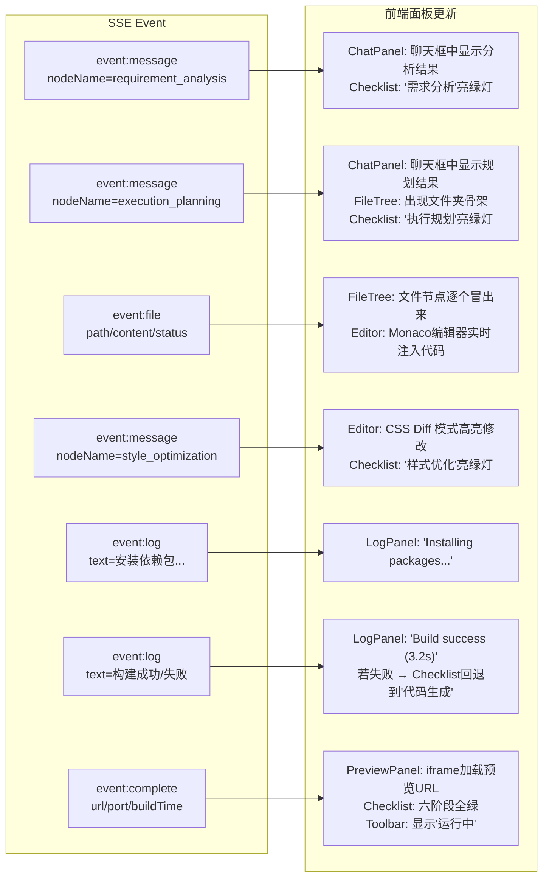

> **设计要点**：`nodeName` 字段是**唯一的映射键**。前端不需要知道后端内部状态，只要根据 `nodeName` 做 `switch/case` 就能驱动所有 UI 更新。这就把"后端业务逻辑"和"前端呈现"解耦了——后端新增一个阶段节点，前端加一个 case 分支即可，不需要改现有代码。

---

### 1.4 统一返回格式

所有 RESTful 接口返回此结构：

```json
{
  "code": 200,
  "success": true,
  "data": { ... },
  "message": "ok"
}
```

- `code=200` 表示成功，其他值（400、404、500 等）是具体的错误码
- `success` 布尔值方便前端直接判断
- `data` 是业务数据载体，类型随接口变化
- `message` 成功时是 `"ok"`，失败时是错误描述

**异常处理**：无论哪层抛出 `BusinessException`，都会被 `GlobalExceptionHandler` 捕获并转为此格式。例如前端传非法参数：

```json
{
  "code": 400,
  "success": false,
  "data": null,
  "message": "name: 项目名称不能为空"
}
```

---

## 二、设计模式大图：为什么不是六个函数串起来？

很多人的直觉是"六个阶段就是六个函数依次调用"。这个理解对，但不完整。灵码工坊的六节点流水线背后用了**五种设计模式**，每一种都解决了一个具体的工程问题。下面逐一展开。

### 2.1 策略模式——一行配置切换模型

**问题**：四个 AI 节点用不同模型（需求分析用 DeepSeek，代码生成用 Claude）。如果硬编码模型在业务逻辑里，换模型就要改代码、重新编译、重新部署。

**解法**：策略模式——把每个模型封装成独立的 Spring Bean，业务节点通过接口 `ChatModel`（策略接口）使用模型，不关心具体是哪个实现。在 `application.yml` 里配置，Java Config 类负责创建 Bean：

```java
// LangChain4jConfig.java —— 创建策略对象（ChatModel Bean）
@Bean
public ChatModel langChain4jChatModel(LingmaAiProperties properties) {
    return OpenAiChatModel.builder()
            .apiKey(properties.apiKey())        // 从配置注入，不用硬编码
            .baseUrl(properties.baseUrl())      // DeepSeek / Qwen 不同 baseUrl
            .modelName(properties.modelName())  // deepseek-chat / qwen-plus
            .maxRetries(properties.maxRetries())
            .build();
}
```

换模型只需要改 application.yml 的一行 `model-name`。策略对象本身由 `OpenAiChatModel` 实现——所有兼容 OpenAI 协议的模型（DeepSeek、通义千问、GPT-4 等）都用同一个创建方式。LangChain4j 把"怎么调模型"这件事抽象成了统一的 `ChatModel` 接口，你的业务代码只依赖接口，不依赖具体模型。

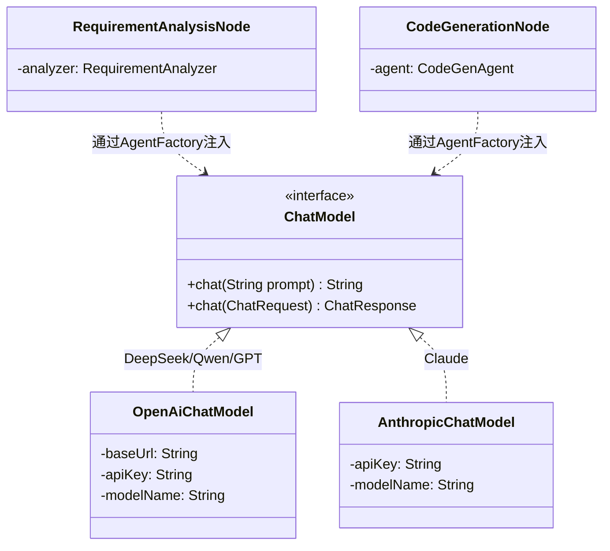

---

### 2.2 模板方法模式——每个节点都走的共同骨架

**问题**：六个节点都要做同一套事——设置线程上下文 → 发 SSE 进度事件 → 调 Agent/执行逻辑 → 清理上下文。如果每个节点都手写这套骨架，六个节点就要写六遍。

**解法**：模板方法模式——把共同骨架抽到抽象基类 `AbstractCodeGenNode`，子类节点只需要实现自己的业务逻辑。

```java
// AbstractCodeGenNode.java —— 定义骨架（两行）
public abstract class AbstractCodeGenNode {
    protected GenerationStreamEmitter setupContext(CodeGenState state) {
        // 1. 从注册中心按 taskId 取出当前任务的 SSE 发射器
        // 2. 注入到 ThreadLocal，让 @Tool 方法能读到项目 ID
        // 3. 返回发射器，供子类发 SSE 事件
    }
    protected void clearContext() {
        // 清理 ThreadLocal，防止内存泄漏
    }
}
```

子类节点（如需求分析节点）只写业务逻辑，骨架由父类提供：

```java
@Component
public class RequirementAnalysisNode extends AbstractCodeGenNode {
    public Map<String, Object> execute(CodeGenState state) {
        // --- 骨架：设置上下文 + 发进度事件 ---
        GenerationStreamEmitter emitter = setupContext(state);
        emitter.emitNode(NODE_NAME, "正在分析需求...", "TEXT");
        try {
            // --- 业务逻辑：调 AI ---
            RequirementSpec spec = analyzer.analyze(userPrompt);
            // --- 骨架：返回状态更新 ---
            return Map.of(CodeGenState.ANALYSIS_RESULT, spec);
        } finally {
            clearContext();  // 骨架：清理上下文
        }
    }
}
```

> **初学者容易混淆的点**：模板方法 ≠ 继承的 `abstract` 方法。这里我们在**节点创建层级**应用模板方法——不强制子类 override 抽象方法，而是在父类提供两个方法（`setupContext` / `clearContext`），子类配合使用。

---

### 2.3 工厂模式——Agent 的配方与实现分离

**问题**：不同 Agent 需要不同的模型、不同的工具、不同的 system prompt。如果把创建逻辑散落在六个节点类里，配置一改就要改六个地方。

**解法**：工厂模式——把 Agent 创建逻辑集中在 `AgentFactory`。节点的构造函数传入 AgentFactory，一行代码拿到配置好的 Agent。

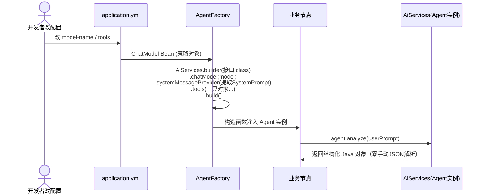

代码实现：

```java
@Component
public class AgentFactory {
    public RequirementAnalyzer createRequirementAnalyzer() {
        return AiServices.builder(RequirementAnalyzer.class)   // 接口契约
            .chatModel(chatModel)                              // 策略注入
            .systemMessageProvider(id -> promptLoader.loadSystemPrompt("requirement-analysis"))  // 提示词
            .build();                                          // 框架自动生成实现
    }
    public CodeGenAgent createCodeGenAgent() {
        return AiServices.builder(CodeGenAgent.class)
            .chatModel(chatModel)
            .systemMessageProvider(id -> promptLoader.loadSystemPrompt("code-generation"))
            .tools(fileTools, projectContextTools)              // 注册 @Tool 工具
            .maxToolCallingRoundTrips(12)                       // 最多循环 12 轮
            .build();
    }
}
```

**关键决策：`AiServices.create` vs `AiServices.builder`**

| 场景 | 用什么 | 为什么 |
|------|--------|--------|
| 需求分析 / 执行规划（无工具） | `AiServices.create(接口.class, model)` 或 `builder` | 单次调用，返回结构化 Java 对象 |
| 代码生成 / 样式优化 / 迭代修改（有工具） | `AiServices.builder().chatModel().tools().build()` | 需要注册 @Tool 方法 + 设置最大循环次数 |

---

### 2.4 观察者模式——SSE 事件流式推送

**问题**：LangGraph4j 的图节点可能在独立的 fork-join 线程上执行——节点怎么找到自己的 SSE 连接？

**解法**：观察者模式 + 注册中心。`GenerationService` 在每个任务启动时把 `GenerationStreamEmitter`（观察者实现）注册到 `GenerationStreamRegistry`（注册中心）。节点通过 taskId 从注册中心取出自己的发射器，推送事件。

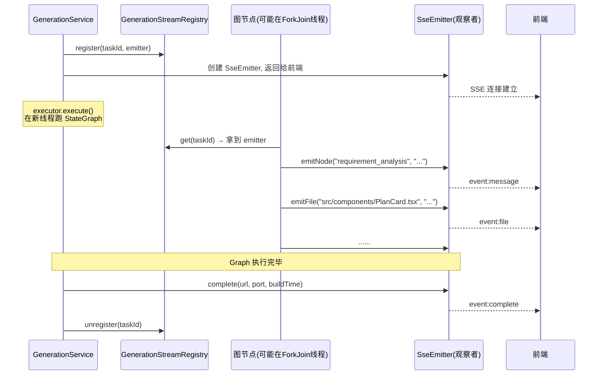

---

### 2.5 状态模式——StateGraph 导演 + 演员 Agent

这是整个系统最核心的架构设计。**StateGraph 是"导演"，各节点的 Agent 是"演员"**。

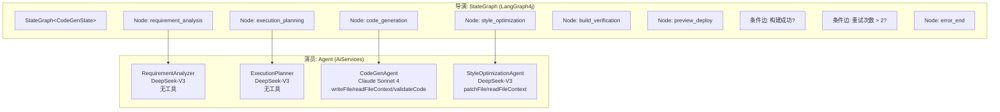

导演只决定**节奏**（顺序）和**条件**（成功/失败分流）。演员决定**怎么演**（需求怎么分析、代码怎么写）。导演可以在构建失败时把演员拉回来重演——这是 StateGraph 条件边的精髓。

**导演的"剧本"（StateGraph 定义，核心代码骨架）：**

```java
// CodeGenPipeline.java
@Component
public class CodeGenPipeline {
    @PostConstruct
    public void init() throws Exception {
        // 创建图，注入状态 Schema（每个字段的类型与合并策略）
        StateGraph<CodeGenState> graph = new StateGraph<>(
            CodeGenState.channels(), CodeGenState::new);

        // 注册六个节点（每个节点是一个 AsyncNodeAction）
        graph.addNode("requirement_analysis", node_async(reqNode::execute));
        graph.addNode("execution_planning",  node_async(planNode::execute));
        graph.addNode("code_generation",     node_async(genNode::execute));
        graph.addNode("style_optimization",  node_async(styleNode::execute));
        graph.addNode("build_verification",  node_async(buildNode::execute));
        graph.addNode("preview_deploy",      node_async(previewNode::execute));
        graph.addNode("error_end",           node_async(this::errorEnd));

        // 连线：线性流程
        graph.addEdge(START, "requirement_analysis");
        graph.addEdge("requirement_analysis", "execution_planning");
        graph.addEdge("execution_planning", "code_generation");
        graph.addEdge("code_generation", "style_optimization");
        graph.addEdge("style_optimization", "build_verification");
        graph.addEdge("preview_deploy", END);

        // 条件边：构建验证后根据结果分流
        graph.addConditionalEdges("build_verification",
            edge_async(this::routeAfterBuild),
            Map.of(
                "preview_deploy", "preview_deploy",    // 成功 → 预览
                "code_generation", "code_generation",  // 失败 → 回退修复
                "error_end", "error_end"               // 超上限 → 终止
            ));

        this.compiledGraph = graph.compile();
    }

    private String routeAfterBuild(CodeGenState state) {
        if (state.buildStatus().orElse(FAILED) == SUCCESS) return "preview_deploy";
        if (state.retryCount().orElse(0) > 2) return "error_end";  // 最多回退 2 次
        return "code_generation";
    }
}
```

**为什么用图（StateGraph）而不用 `for` 循环？**

`for` 循环是**确定的**——A→B→C→D。但构建验证的结果是**不确定**的——可能成功（去预览），可能失败（回去修复），可能反复失败（终止）。`for` 循环无法表达"条件回退到前面的节点"。StateGraph 可以——**条件边**让你在任意两个节点之间跳转，只要在条件函数里定义跳转逻辑。

---

## 三、六阶段流水线：从一句话到一个可运行的应用

### 3.1 全链路时序图

下面这张图是灵码工坊最核心的数据流——用户输入一句话，经过六个阶段，最终变成一个可运行的应用。每个阶段的输入、输出、用什么模型、用不用工具，全部标注。

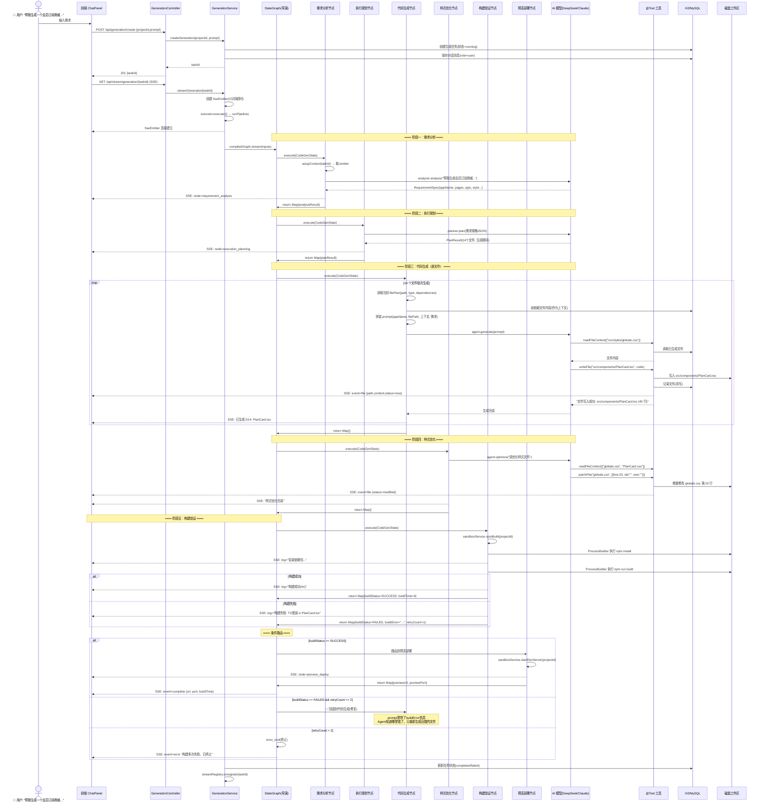

### 3.2 状态黑板：CodeGenState

所有节点共享一块"黑板"——`CodeGenState`。节点不直接传参，全部通过黑板读写：

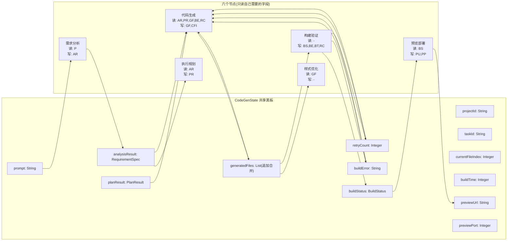

**每个字段有"合并策略"**——`generatedFiles` 使用 AppendingReducer（追加不覆盖），因为代码生成节点每生成一个文件就往黑板上"贴一个便签"，不会被后续节点覆盖。其他字段使用 LastValueReducer（覆盖），因为 `buildStatus` 从 PENDING 变成 SUCCESS 后就应该覆盖。

> **初学者常见疑问**：为什么不直接参数传递？因为**构建失败后流水线要回退到代码生成节点**——代码生成节点需要读 `buildError` 字段，但这个字段是 buildVerification 节点写入的。如果用参数传递，代码生成节点的输入参数需要包含"可能的构建错误"，但这在正常路径上不存在。共享黑板让每个节点可以**按需读取任意字段**。

### 3.3 条件回退：构建失败的"自愈"机制

这是整个系统最巧妙的设计。看这段代码：

```java
// BuildVerificationNode.java —— 增加重试计数
public Map<String, Object> execute(CodeGenState state) {
    BuildResult result = sandboxService.npmBuild(projectId);
    if (result.status() == BuildStatus.FAILED) {
        int retryCount = state.retryCount().orElse(0) + 1;  // 当前次数 +1
        return Map.of(
            "buildStatus", BuildStatus.FAILED,
            "buildError", result.error(),
            "retryCount", retryCount  // 写入黑板
        );
    }
    return Map.of("buildStatus", BuildStatus.SUCCESS);
}
```

```java
// CodeGenPipeline.java —— 条件路由（导演的分流指令）
private String routeAfterBuild(CodeGenState state) {
    if (state.buildStatus().orElse(FAILED) == SUCCESS) return "preview_deploy";
    if (state.retryCount().orElse(0) > 2) return "error_end";  // 最多回退 2 次
    return "code_generation";  // 回退到代码生成，修复代码
}
```

回退时，代码生成节点从黑板读到 `buildError`（如 `"TS2307: Cannot find module './PlanCard'"`），把它注入 prompt——Agent 就知道"上次生成的代码哪几行报了什么错"，然后在局部重做迭代，而不会把已通过验证的文件推倒重来。

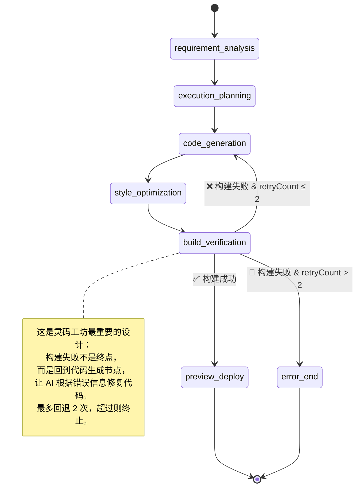

> **"自愈"这个词不是修辞**——当 buildVerification 返回 FAILED 时，流水线自动触发代码生成节点的重新执行。prompt 里带着 buildError，Agent 看到 `"模块 './PlanCard' 未找到"` 就知道该改什么文件。整个过程不需要人工介入——用户看到的是"构建失败 → AI 正在修复 → 重新构建 → 构建成功"的连串 UI 更新。

---

## 四、五个 Agent 的提示词全景

### 4.1 提示词的设计哲学

每个 Agent 的提示词分两层：

| 层 | 文件 | 职责 | 是否可变 |
|----|------|------|---------|
| **System Prompt** | `{nodeName}-system.txt` | 定义角色、任务、工具清单与质量规则 | 固定（变了就改变 Agent 人格） |
| **User Prompt** | `{nodeName}-user.txt` | 当前任务的具体内容（需求文本、文件信息、上下文、构建错误） | 动态（每个任务/每个文件都不同） |

**为什么分两层？** system prompt 是"不变的人格"——同一个 Agent 在不同任务里都应该是"需求分析师"。user prompt 是"变的任务"——"帮用户 A 做电商"和"帮用户 B 做博客"是不同的任务。如果把二者混在一起写，Agent 的人格会随任务漂移。

**提示词存储**：所有提示词都是独立的 `.txt` 文件，放在 `src/main/resources/prompts/` 目录下。修改提示词不需要改 Java 代码，改完重启服务就生效。Git 版本管理让你能追踪每次提示词的变更历史。

---

### 4.2 Agent 一：需求分析师

**角色**：把用户的模糊自然语言翻译成精确的结构化蓝图。

**模型**：DeepSeek-V3（中文理解强、成本低，一次生成调一次，不需要最贵的模型）。

**工具**：无（可选 `readProjectContext` 用于迭代场景）。使用 LangChain4j 的 `AiServices` 接口模式做结构化输出——返回类型就是 Java 类，框架自动生成 JSON Schema、约束模型输出、反序列化为 Java 对象。**零手动 JSON 解析。**

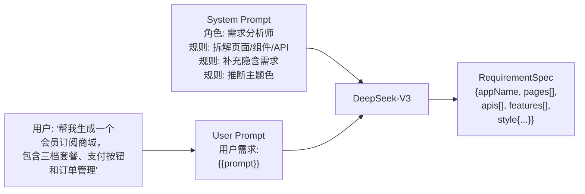

**System Prompt（完整内容）：**

```
你是一个专业的需求分析师。你的任务是将用户的自然语言需求解析为结构化的应用规格。

## 分析规则

1. 拆解页面：用户描述的每个功能模块应对应一个独立页面。如果功能复杂（如订单管理包含列表+详情），拆成子路由。
2. 拆解组件：每个页面内的可独立交互单元应对应一个组件。按钮、卡片、列表、弹窗、筛选器都是独立组件。
3. 补充隐含需求：如果用户没有提到但合理推断需要的功能（如导航栏、登录入口、移动端适配），自动补充。
4. API 定义：每个数据交互场景至少定义一个 API。给出 requestShape 和 responseShape，使用简单类型（string/number/boolean/array/object）。
5. 样式推断：根据应用类型推断主题色。电商类用暖色（橙/红），工具类用冷色（蓝/紫），内容类用中性色（灰/绿）。

## 输出说明

直接输出结构化结果，框架会自动按 Schema 反序列化，无需包裹 JSON 或添加解释文字。
```

**怎么读这个提示词**：

- **第 1 行 "专业的需求分析师"** ——角色定义。不是"程序员"也不是"架构师"。这让模型进入"理解需求、拆解结构"的思维模式。如果这里写成"你是一个程序员"，模型会跳过程序需求分析直接生成代码——和节点的职责完全相反。
- **"拆解页面"规则**——告诉模型"用户说订单管理，你应该拆成列表页 + 详情页两个路由"。这是业务判断，不是格式约束。
- **"补充隐含需求"规则**——这个规则很重要。用户只说了"账单"，但合理的推断是：一个商城一定有导航栏、一定有登录入口、订单列表一定需要分页。如果模型只翻译用户说了的，输出会不完整。规则告诉模型"你可以补充合理需求"。
- **"样式推断"规则**——用启发式规则推断主题色：会员订阅商城是电商类 → 建议暖色主题（橙/红）。不是让模型凭空生成颜色，而是给出了一个稳定的推断逻辑。
- **"直接输出结构化结果"**——这里不再需要写"只输出 JSON，不要加前缀"——因为 `AiServices` 框架在底层自动注入了 JSON Schema 约束，模型按 Schema 输出。提示词只写"怎么做更好"，不写"输出什么格式"。

**User Prompt（完整内容）：**

```
用户需求：
{{prompt}}

请结合项目上下文输出结构化需求规格，包含应用名称、描述、页面列表、API 列表、特性列表与样式主题。
```

User prompt 只有一个占位符 `{{prompt}}`——运行时由 `RequirementAnalysisNode` 从 `CodeGenState` 读出用户的原始输入文本，通过 `PromptTemplateLoader` 替换占位符。`{{prompt}}` 的内容就是用户在输入框里打的那句话。

**输出的 Java 类（部分）**：

```java
public record RequirementSpec(
    String appName,              // "会员订阅商城"
    String description,          // "一个面向 C 端用户的会员订阅付费平台..."
    List<PageSpec> pages,        // [{name:"Home", route:"/", components:[...]}, ...]
    List<ApiSpec> apis,          // [{name:"获取套餐列表", path:"/api/plans", method:"GET", ...}]
    List<String> features,       // ["三档套餐切换对比", "支付确认弹窗", ...]
    StyleSpec style              // {theme:"#6366f1", themeName:"indigo", ...}
) {}
```

---

### 4.3 Agent 二：项目架构师

**角色**：把需求规格拆成文件清单 + 生成顺序。输出什么文件、每个文件做什么、先生成哪个后生成哪个。

**模型**：DeepSeek-V3（结构化规划任务，不需要编程能力）。

**工具**：无。和需求分析一样，用 `AiServices` 结构化输出。

**System Prompt（完整内容）：**

```
你是一个前端应用架构师。你的任务是把需求规格拆解为可生成的文件清单、生成顺序和每个文件的职责。

## 技术栈约束

- 框架: React 18 + TypeScript
- 构建: Vite
- 样式: CSS 变量 + 全局样式
- 路由: React Router v6
- 状态: React Hooks (useState/useEffect)

## 文件类型与优先级

| 类型 | 说明 | 优先级 |
|------|------|--------|
| config | package.json, vite.config.ts, tsconfig.json | 最先生成 |
| style | globals.css, 主题变量 | 第二批 |
| api | Mock API 定义 | 第三批 |
| component | 可复用 UI 组件 | 第四批 |
| page | 页面组合组件 | 第五批（依赖 component） |
| entry | App.tsx, main.tsx, index.html | 最后生成 |

## 规划规则

1. 每个组件对应一个独立文件
2. 每个页面对应一个独立文件
3. 每个 API 对应一个 Mock 接口函数（统一放在 src/api/mock.ts）
4. 配置文件必须包含完整的依赖声明
5. 生成顺序必须遵循依赖关系：先生成被依赖的文件，后生成依赖它的文件
6. dependencies 只列出在当前步骤之前已经生成的文件路径

## 输出说明

直接输出结构化结果，框架会自动按 Schema 反序列化，无需包裹 JSON 或添加解释文字。
```

**怎么读这个提示词**：

- **"技术栈约束"**——限制了模型"发明"什么样式的文件。没有这一节，模型可能会生成 Angular 的 `app.module.ts` 或 Next.js 的 `layout.tsx`。这一节让输出稳定在 React+Vite 的范式里。
- **"文件类型与优先级"表格**——给模型一个明确的生成顺序：配置文件必须先生成（因为是基础），然后是样式（组件需要读主题变量），然后是 Mock API（页面需要数据），然后是组件（页面依赖组件），最后是入口文件（依赖所有页面和路由）。这个顺序不是"喜好"，而是编译依赖链——如果先生成页面，它会引用还没生成的组件，代码里就产生了无效 import。
- **"dependencies 只列出在当前步骤之前已经生成的文件路径"**——防止模型在 dependencies 里写未来文件。比如订阅页面的 dependencies 不应该包含 App.tsx（因为 App.tsx 在所有页面之后才生成）。

**User Prompt（完整内容）：**

```
需求规格：
{{analysisResult}}

请根据上述需求规范规划文件清单、生成顺序与每个文件的职责，按依赖关系排序。
```

**输出的 Java 类**：

```java
public record PlanResult(
    String framework,              // "react-vite-ts"
    String packageManager,         // "npm"
    List<FilePlan> files,          // 文件清单
    List<String> generationOrder,  // 生成顺序列表
    List<String> buildCommands     // ["npm install", "npm run build"]
) {}

public record FilePlan(
    String path,                   // "src/components/PlanCard.tsx"
    String purpose,                // "展示单个套餐的名称、价格、权益和选择按钮"
    String fileType,               // "component"
    List<String> dependencies,     // ["src/styles/globals.css"]
    boolean required               // true
) {}
```

---

### 4.4 Agent 三：资深前端工程师

**角色**：逐文件生成可运行的项目代码，并通过工具写入磁盘。

**模型**：Claude Sonnet 4（代码质量业界最高——import 路径正确率 95%+，TypeScript 类型几乎不需要补，React Hooks 规范几乎不违反）。这是整个流水线中唯一必须用最贵模型的节点。

**工具**：`writeFile`、`readFileContext`、`validateCode`。

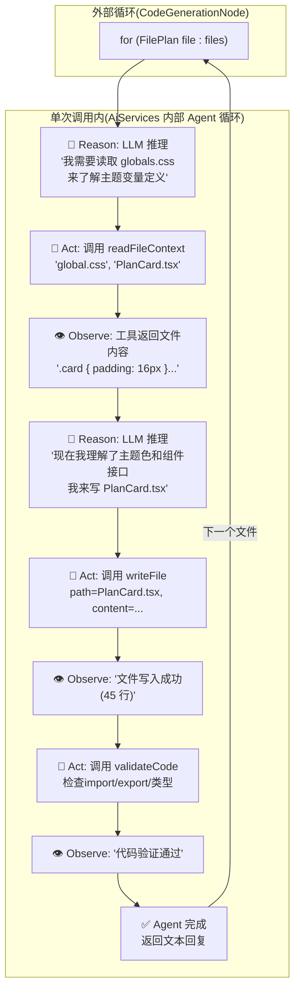

**System Prompt（完整内容）：**

```
你是一个资深前端工程师。你负责根据需求规格和执行规划逐文件生成高质量、可运行的项目代码。

## 技术规范

- React 18 + TypeScript + CSS 变量
- 使用函数组件 + Hooks
- 每个文件必须完整、可独立运行
- 所有 import 路径必须正确，只引用项目中已存在的文件
- TypeScript 类型完整，不使用 any
- React Hooks 使用规范（不在条件语句中调用 useState）

## 工作方式

针对当前指定的文件，必要时先调用 readFileContext 读取依赖文件内容作为上下文，然后调用 writeFile 工具写入完整文件内容。
完成单个文件后即可结束本次调用，外部会循环调用你生成下一个文件。

## 输出要求

1. 调用 writeFile 工具写入文件，参数为 path（文件相对路径）和 content（完整文件内容）
2. 不要在工具调用之外输出代码内容
3. 不要用 ```tsx``` 或 ```css``` 包裹代码
4. 确保 import 路径只引用"可用上下文"中列出的文件或外部依赖包
```

**怎么读这个提示词**：

- **"技术规范"五个约束**——"React 18 + TypeScript + CSS 变量"告诉模型生成什么栈→"避免模型自行切换技术栈"；"只用已存在的文件 import"和"不用 any 类型"和"Hooks 规范"这三条直接减少代码错误，降低构建验证的回退概率。
- **"工作方式"——明确告诉模型要主动调用工具**。模型不会"猜到"readFileContext 的存在——提示词要明确告诉它"你可以先读上下文"。如果没有这句话，模型可能不调用任何工具，直接把代码输出到文本——这个代码就没法落地成文件。
- **"不要用 markdown 代码块包裹"**——早期调试时经常出现这个问题：Claude 在连续多个对话中习惯了输出代码块，会下意识加 ```tsx 前缀。提示词明确禁止这一行为。

**User Prompt（完整内容）：**

```
## 项目概述
应用名称：{{appName}}
描述：{{description}}

## 当前任务
请生成文件: {{filePath}}
文件类型: {{fileType}}
文件描述：{{fileDescription}}

## 可用上下文（已生成的依赖文件）
{{fileContext}}

## 需求规范（来自需求分析）
{{analysisResult}}

## 当前构建错误（若有，请修复相关文件）
{{buildError}}

请调用 writeFile 工具写入该文件的完整内容。
```

**User Prompt 的各段解释**：

- **"当前任务"**——告诉模型"你只需要写一个文件，不是整个项目"。这是上下文窗口控制的关键——如果一次塞入 14 个文件的生成指令，模型会 overflow。
- **"可用上下文"**——已经生成的依赖文件内容。这个内容是代码生成节点在 Java 层根据 `FilePlan.dependencies` 预读的——不是让模型自己调 `readFileContext` 去读（虽然它也可以）。预读的好处：减少 Agent 循环来回，一个文件一般情况下 1-2 轮循环就能完成生成。
- **"当前构建错误"**——回退修复场景的核心字段。正常首次生成时值是"无"。当构建验证失败后回退时，这个字段填了 `npm build` 的真实错误信息（如 `"TS2307: Cannot find module './PlanCard' at line 5"`），Agent 据此定位到底修复哪个文件。

---

### 4.5 Agent 四：界面优化工程师

**角色**：对已生成的样式文件做最后一笔微调——颜色、间距、移动端适配。

**模型**：DeepSeek-V3（轻量 CSS 任务，不需要强编程模型）。

**工具**：`readFileContext`、`patchFile`。

**System Prompt（完整内容）：**

```
你是一个注重可用性和视觉一致性的界面优化工程师。你负责在保持功能稳定的前提下优化样式。

## 工作方式

1. 调用 readFileContext 读取需要优化的样式文件
2. 分析颜色搭配、间距比例、移动端适配的不足
3. 调用 patchFile 工具应用增量补丁，只修改需要调整的行

## 输出要求

- 通过 patchFile 工具应用修改，参数为 path 和 patches 列表（每个 patch 含 line 行号、old 旧行、newContent 新行）
- 不要重写整个文件，保留用户手动修改
- 不要输出代码内容到工具之外
```

**核心设计**：用 `patchFile` 而不是 `writeFile`——只改指定行，保留其他所有行的原始内容。为什么这么重要？因为用户可能在代码编辑器里手动改过某些样式——重写整个文件会把用户的修改丢掉。增量补丁只动"优化目标行"，其他行纹丝不动。

---

### 4.6 Agent 五：前端迭代工程师

**角色**：用户说"把价格改成 ¥29/¥59/¥99"，Agent 定位到 PlanCard.tsx 和 mock.ts 中包含价格的行，用 `patchFile` 只改这三行。

**模型**：Claude Sonnet 4（需要准确定位代码）。

**工具**：`readFileContext`、`searchCode`、`patchFile`、`writeFile`。

**System Prompt（完整内容）：**

```
你是一个前端迭代工程师。你负责在已有项目基础上根据用户的修改指令做增量修改。

## 工作方式

1. 调用 readFileContext 读取相关文件，调用 searchCode 搜索关键词定位需要修改的代码
2. 只修改与修改指令相关的行，调用 patchFile 工具应用增量补丁
3. 必要时可调用 writeFile 重写整个文件（仅当文件需要大规模改动时）

## 原则

- 优先使用 patchFile 做增量修改，保留用户手动修改
- 节省 token，只生成 diff，不重写未改动的文件
- 修改完成后即可结束调用

## 输出要求

- 通过 patchFile 或 writeFile 工具应用修改
- 不要在工具调用之外输出代码内容
```

**迭代 Agent 和代码生成 Agent 的区别**：代码生成 Agent 面对空项目，从零生成完整文件。迭代 Agent 面对已有项目，需要先搜索定位再精准修改——所以它多了一个 `searchCode` 工具。这也是为什么迭代 Agent 的 System Prompt 强调"优先使用 patchFile 而不是 writeFile"。

**迭代修改走短流水线（只有 1 个 Agent），不走六阶段全流程**——因为需求已经分析过了、文件结构已经确定了、不需要重新分析。迭代的流程是：

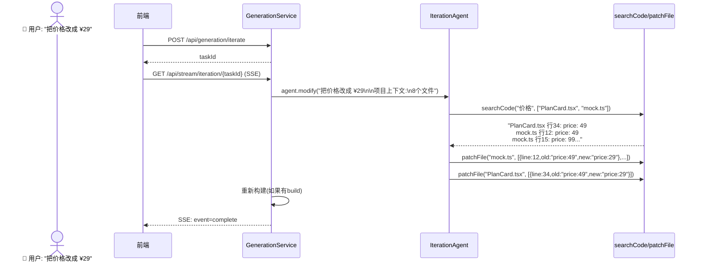

---

## 五、六把手术刀：@Tool 工具体系

`@Tool` 方法是 Agent 的"手脚"。Agent 的大脑（LLM）决定做什么，手脚（Tool）执行具体操作。灵码工坊一共定义了 6 个工具，分布在 3 个类里。

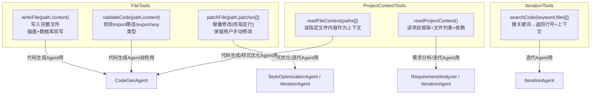

**工具设计五个原则**（每个原则都有具体的工程价值）：

| 原则 | 例子 | 为什么 |
|------|------|--------|
| 一个工具只做一件事 | `writeFile`只写文件，`validateCode`只校验，两者独立 | Agent 决策清晰：想写就调 `writeFile`，想校验就调 `validateCode`。如果 `writeFile` 既写又校验，Agent 不知道文件写完后是否已经被校验过了 |
| 返回结构化文本 | `writeFile` 返回 "文件写入成功: PlanCard.tsx（45行）" | 不是长文本，而是功能化摘要。Agent 通过这些返回信息判断下一步该做什么。如果只返回"成功"，Agent 无法确认文件是否真的落盘了 |
| description 是说明书 | `@Tool("将生成的代码内容写入项目文件，同时更新数据库和推送SSE事件")` | 模糊描述会让 Agent 在不该调的时候调、该调的时候不调。`"处理文件"`就是不好的描述——太模糊了 |
| 自解释参数名 | `writeFile(String path, String content)` | LangChain4j 会根据参数名自动生成 JSON Schema。`path` 和 `content` 让模型一看就知道该填什么。`p` 和 `c` 会让模型猜 |
| 不用手动 JSON 解析 | LangChain4j 自动把参数映射到方法参数 | 这是和 Spring AI Alibaba 的关键区别。不需要写 `parseArgs(functionArgs)`，不需要定义 `WriteFileArgs` DTO 类，不需要 try-catch 处理 JSON 解析失败 |

**writeFile 工具代码（最核心的工具）：**

```java
// FileTools.java
@Tool("将生成的代码内容写入项目文件，同时更新数据库并推送 SSE 事件")
public String writeFile(
        @P("文件相对路径") String path,
        @P("文件的完整内容") String content) {

    // 1. 从 ThreadLocal 拿当前项目 ID
    Long projectId = GenerationContext.get().projectId();
    // 2. 双写：磁盘 + 数据库
    int lines = projectFileService.writeFile(projectId, path, content, "new");
    // 3. 推送 SSE 事件（前端文件树新增节点）
    GenerationContext.get().emitter().emitFile(path, content, "new");
    // 4. 返回结构化结果给 Agent
    return "文件写入成功: " + path + "（" + lines + " 行）";
}
```

**validateCode 工具代码（Agent 的自检能力）：**

```java
@Tool("验证生成的代码质量")
public String validateCode(
        @P("文件相对路径") String path,
        @P("待校验的文件内容") String content) {

    List<String> errors = new ArrayList<>();
    // 1. 提取所有 import 语句，判断目标文件是否存在
    List<String> imports = extractImports(content);
    for (String imp : imports) {
        if (!isExternalPackage(imp) && !existsInProject(imp, path, existing)) {
            errors.add("import 路径不存在: " + imp);
        }
    }
    // 2. 检查是否有 export（确保其他文件能引用此组件）
    if (!content.contains("export")) {
        errors.add("文件缺少 export 声明");
    }
    // 3. 检查是否用了 any（不符合 TypeScript 最佳实践）
    if (content.contains(": any") || content.contains("as any")) {
        errors.add("使用了 any 类型，请使用具体类型替代");
    }
    return errors.isEmpty()
        ? "代码验证通过，质量良好。"
        : "代码验证失败:\n" + String.join("\n", errors);
}
```

---

## 六、数据库设计

灵码工坊有四张核心表，关系很简单：

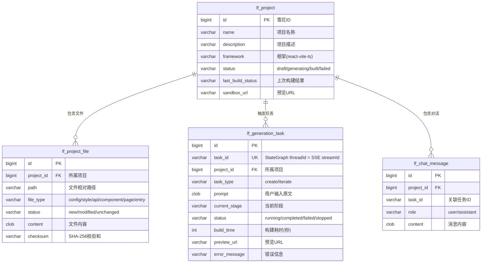

**双写策略**：`lf_project_file.content` 和磁盘文件内容一致，但用途不同——磁盘文件用于 Docker 容器内的 npm build 和 Vite Dev Server 读取；数据库记录用于前端展示（通过 `/api/projects/{id}/file?path=` 读取，不直接访问磁盘）。

---

## 七、从零部署：一步一步跑起来

### 环境要求

| 工具 | 版本 | 说明 |
|------|------|------|
| JDK | 21+ | 需要 records 和 text blocks 支持 |
| Maven | 3.9+ | 项目使用 maven wrapper，可自动下载 |
| H2 | 内嵌 | 开箱即用，无需安装 MySQL |
| Docker | 可选 | M3 沙箱隔离用，当前 ProcessBuilder 可替代 |
| Node.js | 可选 | 仅当 `lingma.sandbox.build-enabled=true` 时需要 |

### 完整启动步骤

```bash
# 1. 克隆并进入项目
cd lingmaForge-backend

# 2. 确保 JAVA_HOME 指向 JDK 21
# （Windows 上如果装的是 IDEA，可以用自带 JBR）
export JAVA_HOME="D:/Develop/DevelopTool/IDEA/IntelliJ IDEA 2025.2.5/jbr"

# 3. 设置 AI 模型 API Key（必选）
# 使用阿里云 DashScope 兼容模式
export AI_DASHSCOPE_API_KEY=sk-xxxxxxxxxxxxxxxx
export AI_OPENAI_COMPATIBLE_BASE_URL=https://dashscope.aliyuncs.com/compatible-mode/v1
export AI_CHAT_MODEL=qwen-plus

# 或者用 DeepSeek
# export AI_DASHSCOPE_API_KEY=sk-xxxxxxxxxxxxxxxx
# export AI_OPENAI_COMPATIBLE_BASE_URL=https://api.deepseek.com/v1
# export AI_CHAT_MODEL=deepseek-chat

# 4. （可选）设置工作区目录
export LINGMA_WORKSPACE_ROOT=./my-workspace

# 5. 启动
./mvnw spring-boot:run
```

**H2 控制台**：启动后访问 `http://localhost:8081/h2-console`，连接信息：JDBC URL `jdbc:h2:file:./data/lingmaforge`，用户名 `sa`，密码留空。

### 快速验证

```bash
# 1. 健康检查
curl http://localhost:8081/api/health

# 2. 创建项目
curl -X POST http://localhost:8081/api/projects \
  -H 'Content-Type: application/json' \
  -d '{"name":"我的第一个应用","framework":"react-vite-ts"}'

# 3. 触发生成（会实际调 AI 模型，请确保 API Key 有效）
curl -X POST http://localhost:8081/api/generation/create \
  -H 'Content-Type: application/json' \
  -d '{"projectId":1, "prompt":"帮我生成一个简单的时间管理Todo应用"}'

# 4. 监听生成进度
curl -N http://localhost:8081/api/stream/generation/{上一步返回的taskId}

# 5. 查看生成的文件
curl http://localhost:8081/api/projects/1/tree
curl 'http://localhost:8081/api/projects/1/file?path=src/App.tsx'
```

---

> **文档版本**: v1.0 | **日期**: 2026-06-26
> **定位**: 灵码工坊后端核心功能教学指南——面向初学者的完整教程
> **关联文档**: [灵码工坊-后端核心功能实现指南.md](./灵码工坊-后端核心功能实现指南.md) · [灵码工坊-AI代码生成核心功能架构方案.md](./灵码工坊-AI代码生成核心功能架构方案.md)
