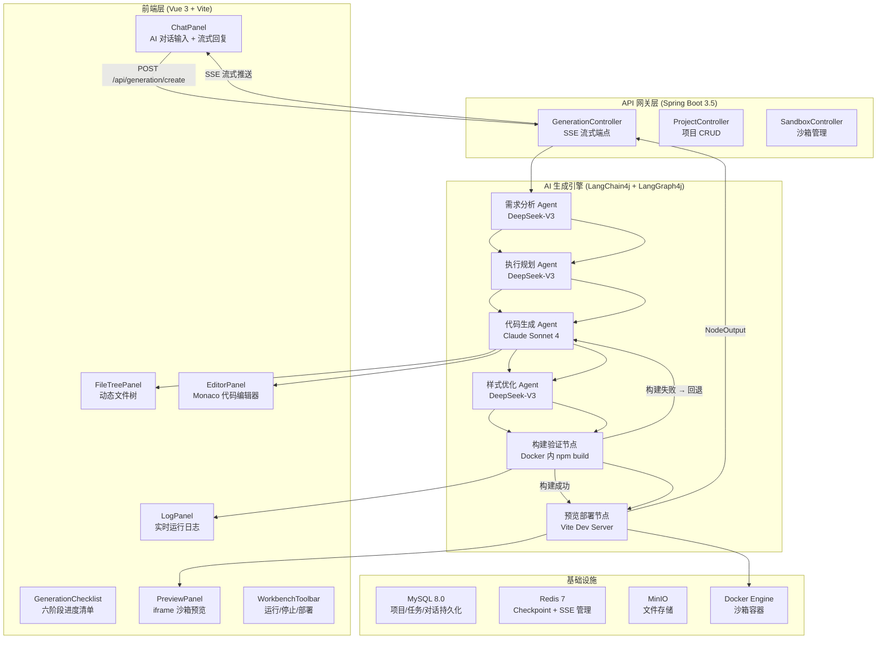
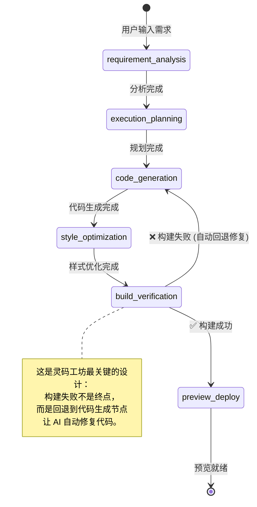
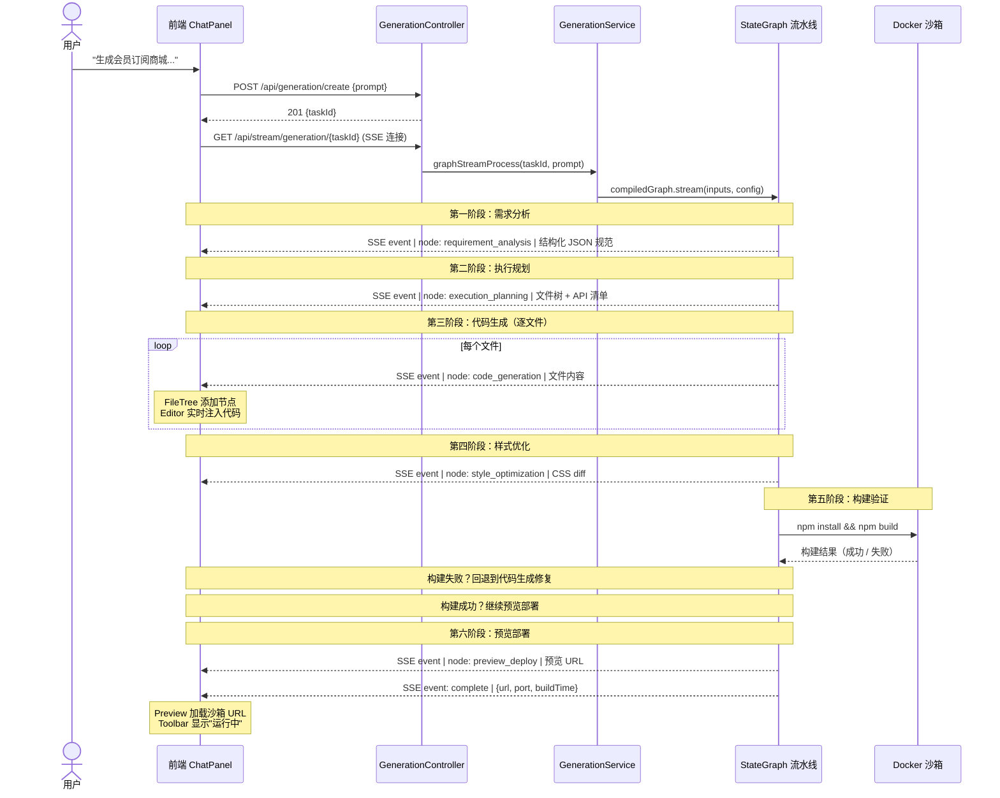
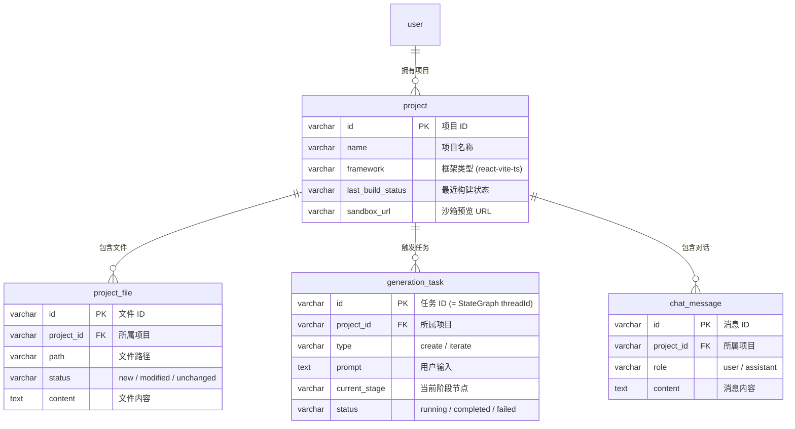
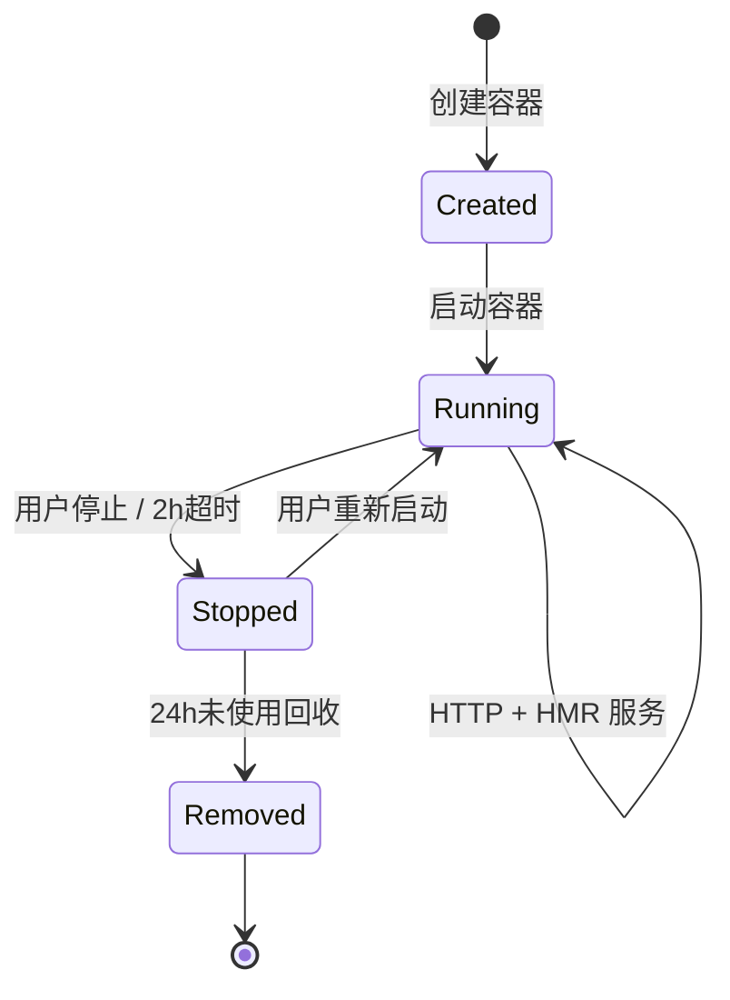
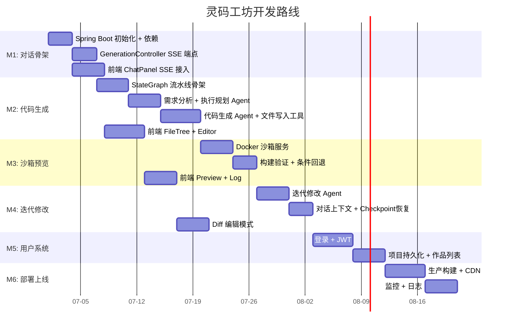

# 灵码工坊 · 项目全景与核心架构规划

> 你正在阅读的是灵码工坊教学项目的第一篇文章。
> 这篇文章不会让你淹没在代码和配置里，而是先用大白话把整个项目讲清楚——**它是什么、为什么要这样设计、第一步为什么是核心组件**——然后再逐步深入技术细节。
> 读完这篇文章，你会对灵码工坊的全貌有一个清晰的认知，知道接下来每一步该做什么、为什么这么做。

---

## 目录

- [一、灵码工坊是什么？](#一灵码工坊是什么)
- [二、用户想要什么体验？](#二用户想要什么体验)
- [三、为什么第一步就做核心组件？](#三为什么第一步就做核心组件)
- [四、系统架构全景图](#四系统架构全景图)
- [五、AI 生成引擎——灵码工坊的心脏](#五ai-生成引擎灵码工坊的心脏)
- [六、前端——用户看到的每一个面板](#六前端用户看到的每一个面板)
- [七、后端——基于 LangChain4j + LangGraph4j 的技术架构](#七后端基于-langchain4j--langgraph4j-的技术架构)
- [八、数据流全链路：从一句话到一个可运行的应用](#八数据流全链路从一句话到一个可运行的应用)
- [九、API 与数据库](#九api-与数据库)
- [十、沙箱：让生成的代码安全地跑起来](#十沙箱让生成的代码安全地跑起来)
- [十一、开发路线：先跑通心脏，再长出骨架](#十一开发路线先跑通心脏再长出骨架)

---

## 一、灵码工坊是什么？

**灵码工坊是一个 AI 代码生成平台。** 它的核心能力可以用一句话概括：

> 用户说一句话，AI 就给你生成一个可以运行的应用。

比如你说"帮我生成一个会员订阅商城，包含三档套餐、支付按钮和订单管理"，灵码工坊就会：

- 分析你的需求，拆解成页面、组件、接口
- 规划出需要生成哪些文件、每个文件做什么
- 逐文件生成完整代码——页面、组件、样式、接口
- 把这些代码放进一个沙箱环境，自动安装依赖、构建、启动开发服务器
- 在你面前实时展示生成进度、文件变更、代码内容、预览页面和运行日志

**最终你看到的是一个完整的、可运行的应用，而不是一段代码片段。**

灵码工坊对标的产品是 Bolt.new、v0、Lovable 这类海外 AI 生成平台。但灵码工坊有自己的定位——**面向中文用户、企业级、创意中心模板市场**。它不是 playground，而是生产力工具。

---

## 二、用户想要什么体验？

让我们站在用户的角度，走一遍完整的生成体验。

用户打开灵码工坊，进入工作台，看到一个简洁的对话界面。他输入：

> "帮我生成一个会员订阅商城，包含三档套餐、支付按钮和订单管理。"

然后 AI 开始回复：

> 好的，正在为您生成会员订阅商城...

紧接着，界面左侧出现一个六阶段进度清单，逐项点亮：

- ✅ 需求分析
- ✅ 执行规划
- ⏳ 页面与组件生成
- ⏸ API 接口生成
- ⏸ 样式优化
- ⏸ 预览验证

中间区域开始出现一个**文件树**——先长出文件夹骨架，然后文件节点一个个冒出来，像一棵树在生长：

```
src/
├── pages/
│   ├── Home.tsx          ← 正在生成...
│   ├── Subscription.tsx  ← 等待
│   └── Orders.tsx        ← 等待
├── components/
│   ├── PlanCard.tsx      ← 等待
│   ├── PaymentButton.tsx ← 等待
│   └── OrderList.tsx     ← 等待
├── api/
│   ├── subscription.ts   ← 等待
│   └── orders.ts         ← 等待
└── styles/
│   └── globals.css       ← 等待
```

右侧预览区域先显示一个加载状态，等待构建完成后加载沙箱 URL。

最下方是运行日志，实时滚动：

```
10:31:22  安装依赖包... (npm install)
10:31:25  依赖安装完成 (512 packages loaded)
10:31:28  页面路由生成完成: 4 pages generated
10:31:29  模块组件生成完成: 12 elements rendered
10:31:31  API 绑定注册成功: 3 database paths mapped
10:31:35  构建成功 (1.23s)
10:31:36  开发服务器运行中 http://localhost:5173
```

生成完成后，界面底部出现本次生成结果卡片：

```
生成完成 ✓
14 文件 | 3 页面 | 2 API
──────────────────
运行状态: 运行中
构建耗时: 1.23s
端口号: 5173
运行环境: Development
```

用户点击预览区，看到完整的会员订阅商城页面——三档套餐、支付按钮、订单管理，全部可以交互。如果不满意，他继续在对话区说"把套餐价格改成 ¥29/¥59/¥99"，AI 就定位到对应文件，生成 diff 修改，重新构建，预览区自动刷新。

**这就是灵码工坊要实现的核心闭环：对话 → 生成 → 预览 → 迭代。**

---

## 三、为什么第一步就做核心组件？

这是很多人会问的问题：为什么不先做登录？为什么不先做项目列表？为什么不先把 UI 做得漂漂亮亮的？

答案很简单：**核心组件是灵码工坊的心脏，其他一切都是骨架。心脏不跳，骨架再漂亮也是死物。**

让我把这个逻辑展开讲清楚。

### 3.1 什么是核心组件？

核心组件就是上面描述的那条完整链路——从用户输入一句话到看到一个可运行的应用。这条链路涉及：

- **AI 对话面板**——接收用户输入，流式展示 AI 回复
- **六阶段生成流水线**——需求分析、执行规划、代码生成、样式优化、构建验证、预览部署
- **文件树 + 代码编辑器**——展示和编辑生成的文件
- **沙箱预览**——让代码在一个隔离环境里运行起来
- **实时日志**——让用户看到构建和运行过程

这五块合在一起，构成了灵码工坊的**最小可用产品**（MVP）。没有这五块，灵码工坊就不是灵码工坊——它只是一个空壳 UI。

### 3.2 为什么登录、项目列表不是核心？

登录系统的价值是什么？是"让用户关掉浏览器后，下次回来还能找到自己的项目"。但这个价值的前提是——**项目里有东西值得回来找**。

如果核心生成链路还没跑通，用户进来发现 AI 只会输出一段文字、代码没有预览、日志全是假的模拟数据，那他不会回来——不是因为没有登录，而是因为产品没有用。

项目列表同理。列表里有项目的前提是项目能被创建，项目能被创建的前提是代码能被生成，代码能被生成的前提是 AI 管线能跑通。链路是从后往前推的，不是从前往后推的。

### 3.3 技术风险决定了开发顺序

开发顺序不是按功能重要性排的，而是按**技术风险**排的。

| 模块 | 技术风险 | 说明 |
|------|---------|------|
| **核心生成管线** | 🔴 极高 | 多模型协同、6 阶段状态流转、SSE 流式中断恢复、Docker 沙箱安全隔离——全是未知领域 |
| **登录系统** | 🟢 极低 | Spring Security + JWT + Redis，方案写了 93KB，全是成熟技术，确定性逻辑 |
| **项目列表** | 🟢 极低 | 标准 CRUD，无任何技术悬念 |

**高风险的东西必须先做。** 如果你拖到最后才发现 AI 管线跑不通——模型输出格式不对、流式中断无法恢复、沙箱构建总是失败——那前面做的登录和项目列表全白费。反过来，核心管线跑通了，登录系统随时可以加上去，接口结构已经预留好了认证位置，改动为零。

### 3.4 一个比喻

想象你在建一栋楼。

- **核心组件**是这栋楼的**脊椎**——没有脊椎，楼就是一堆砖头，立不起来。
- **登录系统**是这栋楼的**门禁**——门禁很重要，但楼没建好之前装门禁有什么意义？谁要进一栋还没建好的楼？
- **项目列表**是这栋楼的**楼层索引**——索引很有用，但楼层还是空的，索引指向什么？

**先让脊椎立起来，再长出骨架，最后装门禁和索引。** 这个顺序不能反。

### 3.5 开发阶段的务实策略

在核心组件开发期间（M1-M4），我们不做真实登录，但**预留认证接口结构**：

```java
// 开发阶段的临时认证 —— 所有请求放行
@Configuration
public class DevSecurityConfig {
    @Bean
    public SecurityFilterChain filterChain(HttpSecurity http) {
        http.csrf().disable()
            .authorizeHttpRequests().anyRequest().permitAll();
        return http.build();
    }
}
```

这样前端 API 层可以先按正式接口设计（`Authorization: Bearer xxx`），后端路径可以先按 `/api/auth/**` 放行、`/api/projects/**` 需认证来规划。到了 M5 把 `permitAll()` 替换为真实的 JWT 过滤器，接口结构零改动。

**先让产品"会干活"，再让产品"能记住谁干的"。**

---

## 四、系统架构全景图

现在你已经知道灵码工坊要做什么、为什么先做核心组件。接下来看系统架构的全貌——**四层结构，从上到下依次是：前端层、API 网关层、AI 生成引擎层、基础设施层。**

下面的架构图把整个系统画成了一棵树。你可以从上到下读：用户在最上面，基础设施在最下面，中间是让一切运转起来的逻辑。



**怎么读懂这张图？**

- **左边竖排**是用户看到的界面——对话区、文件树、编辑器、预览、日志。这些全部由前端 Vue 组件负责。
- **中间横排**是 AI 生成引擎的六阶段流水线——这是灵码工坊的心脏，由 LangGraph4j 的 StateGraph 编排。
- **箭头标注了数据方向**——用户输入通过 POST 发到后端，后端通过 SSE 流式推送回来，同时驱动各 Agent 生成代码、构建项目、启动预览。
- **条件回退边**是这张图的关键细节——如果构建失败，流水线不会停下来报错，而是**自动回退到代码生成节点**，让 AI 修复代码后重新构建。

---

## 五、AI 生成引擎——灵码工坊的心脏

### 5.1 为什么是六阶段？

AI 生成代码不是一个"扔给模型一句 prompt，等它吐出所有代码"的过程。那样的结果通常是一坨不可用的半成品。

灵码工坊把生成过程拆成六个阶段，每个阶段有明确的输入、输出和职责：

| 阶段 | 做什么 | 输出什么 | 用什么模型 |
|------|--------|---------|-----------|
| **需求分析** | 把用户的自然语言需求翻译成结构化 JSON 规范——包含页面列表、组件列表、API 路径、样式主题 | JSON 规范文档 | DeepSeek-V3（中文理解强、成本低） |
| **执行规划** | 根据需求规范，规划出需要生成哪些文件、每个文件的内容大纲 | 文件树 + 每个文件的生成顺序 | DeepSeek-V3（结构化输出好） |
| **代码生成** | 根据规划逐文件生成完整代码 | 所有 .tsx / .ts / .css / .json 文件 | Claude Sonnet 4（代码质量业界最高） |
| **样式优化** | 对生成的 CSS 进行微调，确保视觉一致性 | CSS diff 片段 | DeepSeek-V3（轻量任务） |
| **构建验证** | 在沙箱里运行 npm install + npm build | 构建成功/失败结果 | 无模型（纯逻辑） |
| **预览部署** | 启动 Vite Dev Server，提供预览 URL | 可访问的 http://... 地址 | 无模型（纯逻辑） |

**为什么要分阶段？三个原因：**

1. **可控性**：每个阶段可以独立调试、独立监控、独立回退。如果代码生成阶段出了问题，你不需要从头重来，只需要修复这个阶段的输出。
2. **流式体验**：用户在六阶段清单上逐项看到进度，而不是盯着一个空白屏幕等 30 秒然后一次性看到结果。这是"打字机效果"的升级版——不仅是文字逐字出现，整个生成过程逐阶段可视化。
3. **质量保障**：构建验证阶段发现错误后，流水线自动回退到代码生成阶段修复。这不是人工干预，而是**系统自愈**。

### 5.2 StateGraph——流水线的编排方式

六个阶段不是用 `if-else` 串联的，而是用 **StateGraph**（状态图）编排的。

StateGraph 是 LangGraph4j 提供的图式工作流引擎。你可以像画流程图一样定义阶段之间的连接关系，包括条件分支——比如"构建验证如果失败，就回退到代码生成"。

与 Spring AI Alibaba 内置的 ReactAgent 不同，LangGraph4j 不提供"黑盒 Agent"——你需要**用图显式表达 Agent 的推理循环**。这意味着你可以看到每一步决策：模型什么时候调用了工具、工具返回了什么、模型看到结果后怎么继续。这种透明度对学习和调试至关重要。



**注意那个"构建失败 → 回退到代码生成"的条件边。** 这是 StateGraph 相比普通 `for` 循环的核心优势——它可以定义非线性流程。普通流程是"从头到尾串起来"，而 StateGraph 可以在任意节点之间跳转，只要你在条件边里定义了跳转逻辑。

### 5.3 Agent 循环——每个阶段怎么执行？

四个 AI 阶段（需求分析、执行规划、代码生成、样式优化）使用 **Agent 循环图**驱动。

在 LangGraph4j 中，没有内置的"ReactAgent 黑盒"——你需要用 StateGraph 的节点和边**显式构建** Reasoning → Acting → Observing → Reasoning → ... 的循环：

```java
// agent 节点：调 LLM，生成回复或工具调用请求
NodeAction<CodeGenState> callModel = state -> {
    var response = model.chat(ChatRequest.builder()
        .messages(state.messages())
        .toolSpecifications(toolSpecs)  // 注册 @Tool 方法
        .build());
    return Map.of("messages", response.aiMessage());
};

// tools 节点：执行模型请求的工具
NodeAction<CodeGenState> invokeTools = state -> {
    var aiMessage = (AiMessage) state.lastMessage().orElseThrow();
    var toolNode = ToolNode.of(new CodeGenTools());
    var result = toolNode.execute(aiMessage.toolExecutionRequests());
    return Map.of("messages", result);
};

// 路由条件：模型是否要求调用工具？
EdgeAction<CodeGenState> routeMessage = state -> {
    var lastMessage = state.lastMessage();
    if (lastMessage.get() instanceof AiMessage message
            && message.hasToolExecutionRequests()) {
        return "next";   // 模型要调工具 → 去 tools 节点
    }
    return "exit";        // 模型输出完成 → 结束
};

// 构建循环图
var workflow = new StateGraph<>(CodeGenState.SCHEMA, CodeGenState::new)
    .addNode("agent", node_async(callModel))
    .addNode("tools", node_async(invokeTools))
    .addEdge(START, "agent")
    .addConditionalEdges("agent", edge_async(routeMessage),
        Map.of("next", "tools", "exit", END))
    .addEdge("tools", "agent");  // 工具执行完 → 回到 agent
```

这个循环意味着模型不是一次性吐出所有代码，而是**逐步生成**——先读一下项目上下文，再决定生成哪些文件，每个文件生成后验证一下是否合理，然后继续下一个。

1. **Reasoning**（思考）：agent 节点调用 LLM，模型看到当前状态，决定下一步做什么
2. **Acting**（行动）：如果模型要求调用工具，路由条件把流程导向 tools 节点，执行 `writeFile` / `readFileContext` 等工具
3. **Observing**（观察）：工具返回结果，流程回到 agent 节点，模型看到执行效果
4. **继续循环**：模型根据执行效果继续思考，直到不再需要调用工具，路由条件导向 END

**为什么要用图显式表达 Agent 循环，而不是用内置的 ReactAgent？**

因为图是**白盒**——你能看到每一轮循环，能在 `routeMessage` 条件边里加自定义逻辑（比如"最多循环 20 次就强制退出"），能在每个节点上加 checkpoint 保存中间状态。Spring AI Alibaba 的 ReactAgent 是黑盒——"模型自己决定循环几轮"，你无法介入。**对于学习 Agent 本质，白盒远比黑盒有价值。**

### 5.4 模型路由——不同阶段用不同模型

灵码工坊不是用一个模型干所有事。不同阶段的任务性质不同，需要的模型也不同：

| 阶段 | 任务性质 | 选用模型 | 选型理由 |
|------|---------|---------|---------|
| 需求分析 | 中文理解 + JSON 输出 | DeepSeek-V3 | 中文理解能力强、成本低（$0.14/M tokens） |
| 执行规划 | 结构化规划 | DeepSeek-V3 | JSON mode 稳定 |
| 代码生成 | 代码质量最高 | Claude Sonnet 4 | 业界公认代码质量最强 |
| 样式优化 | CSS 微调 | DeepSeek-V3 | 轻量任务，不需要重型模型 |

**为什么代码生成用 Claude 而其他阶段用 DeepSeek？** 因为代码质量直接影响构建成功率——如果生成的代码有语法错误、import 路径不对、组件引用缺失，构建必然失败。Claude Sonnet 4 在代码生成方面的正确率和完整性远超其他模型。而需求分析和样式优化这类任务，DeepSeek-V3 已经足够好，且成本只有 Claude 的十分之一。

所有模型通过 **LangChain4j 的模型 Builder** 统一接入——DeepSeek 和 Qwen 通过 OpenAI 兼容协议，Claude 通过 Anthropic 原生适配器。切换模型只是换一个 Builder 实例，代码层面是换一个 `ChatModel` Bean。

---

## 六、前端——用户看到的每一个面板

灵码工坊的工作台是一个四列布局：**对话区 | 文件树 | 编辑器 | 预览区**，底部是日志面板。这五个面板各自独立工作，但由同一个 SSE 连接驱动——后端推送一个 `nodeName: CodeGenerationNode` 的事件，文件树就长出一个新节点，编辑器就开始注入代码，预览区等待构建完成。

### 6.1 五个核心面板

**1. ChatPanel（AI 对话面板）**

这是用户交互的入口。用户在这里输入需求、看到 AI 的流式回复、看到六阶段清单逐项点亮、看到变更文件列表。

技术要点：
- 使用 `EventSource`（浏览器原生 SSE API）连接后端 `/api/stream/generation/{taskId}`
- SSE 事件的 `nodeName` 字段驱动 UI 映射：`requirement_analysis` → 清单项"需求分析"亮起
- AI 回复使用 `markdown-it` 渲染
- 对话状态由 `useChatStore`（Pinia）管理

**2. FileTreePanel（文件树面板）**

随着代码生成阶段推进，文件节点一个个长出来——先出现文件夹骨架，然后文件节点按生成顺序冒出来。

技术要点：
- 数据结构是递归的 `FileNode`（name / path / type / children / status / language）
- 随 SSE `execution_planning` 事件初始化骨架，随 `code_generation` 事件逐个添加
- 每个文件节点标注状态：`new`（新增）、`modified`（修改）、`unchanged`

**3. EditorPanel（代码编辑器面板）**

用户点击文件树上的某个文件，编辑器就显示这个文件的内容。代码生成阶段实时注入内容——用户能看到代码一行行被"写"出来。

技术要点：
- 使用 Monaco Editor（VS Code 同款引擎）
- 支持多文件 Tab 切换和 Diff 模式（迭代修改时显示新旧对比）
- SSE `code_generation` 事件实时注入代码

**4. PreviewPanel（预览面板）**

构建验证完成后，沙箱 URL 推回来，iframe 加载这个 URL，用户就能看到生成的应用。

技术要点：
- 使用 iframe sandbox 属性做安全隔离
- `src` 指向沙箱容器内的 Vite Dev Server URL
- 支持刷新（迭代修改后重新构建）

**5. LogPanel（日志面板）**

npm install 的包数量、构建耗时、开发服务器启动状态——全部实时滚动显示。

技术要点：
- 使用 WebSocket `/ws/sandbox/{projectId}/logs` 接收容器日志
- 日志支持颜色分类：INFO（蓝）、SUCCESS（绿）、ERROR（红）、WARN（黄）

### 6.2 前端新增依赖

| 包名 | 做什么 | 为什么需要 |
|------|--------|-----------|
| `monaco-editor` | 代码编辑器 | VS Code 同款引擎，支持语法高亮、Diff、多 Tab |
| `markdown-it` | Markdown 渲染 | AI 回复内容含 Markdown 格式 |
| `splitpanes` | 面板拖拽调整 | 四列布局需要可拖拽的分割线 |
| `axios` | HTTP 客户端 | POST 创建任务、GET 项目列表等非 SSE 请求 |

### 6.3 前端 Pinia Stores

| Store | 管什么 | 核心字段 |
|-------|--------|---------|
| `useChatStore` | 对话状态 | `messages`（对话历史）、`sseConnection`（SSE 连接）、`generating`（是否正在生成）、`checklistState`（六阶段进度） |
| `useProjectStore` | 当前项目 | `projectId`、`fileTree`（动态文件树）、`activeFile`（当前编辑文件）、`openTabs`（打开的 Tab 列表） |
| `useSandboxStore` | 沙箱状态 | `status`（运行/停止）、`url`（预览 URL）、`port`（端口）、`logs`（日志列表） |

---

## 七、后端——基于 LangChain4j + LangGraph4j 的技术架构

### 7.1 为什么选 LangChain4j + LangGraph4j？

灵码工坊的后端核心围绕 AI 展开——LLM 接入、Agent 编排、流式推送、状态管理。我们选择两个框架协作：**LangChain4j 做 LLM 接入和工具调用，LangGraph4j 做图式编排和状态管理。**

| 层级 | 能力 | LangChain4j 负责 | LangGraph4j 负责 |
|------|------|-----------------|-----------------|
| **接入层** | LLM 统一接入 | `OpenAiChatModel` / `AnthropicChatModel` Builder 模式 | — |
| **工具层** | 工具调用 | `@Tool` 注解 + `AiServices` 自动注册 | `ToolNode` 执行工具 |
| **编排层** | 工作流图式编排 | — | `StateGraph` + 条件边 + 子图嵌套 |
| **Agent 层** | 自主推理执行 | — | `agent → tools → agent` 循环图（白盒） |
| **状态层** | 状态管理 | — | `AgentState` + `Channel` + `Reducer` |

**两个框架各司其职，边界清晰：**
- LangChain4j 负责"怎么跟模型对话"——模型配置、提示词、工具定义、结构化输出
- LangGraph4j 负责"怎么编排流程"——节点顺序、条件路由、状态流转、checkpoint 持久化
- `langgraph4j-langchain4j` 桥接模块提供状态序列化和工具节点的互操作

详细的技术选型对比见 [AI 框架技术选型深度对比](./灵码工坊-AI框架技术选型深度对比.md)。

### 7.2 技术栈一览

| 层级 | 技术 | 版本 | 做什么 |
|------|------|------|--------|
| **框架** | Spring Boot | 3.5.8 | 主服务框架 |
| **AI 接入** | LangChain4j | 1.x | LLM 统一接入（DeepSeek/Claude/Qwen） |
| **AI 编排** | LangGraph4j | 1.8+ | StateGraph 图式工作流 + 状态管理 |
| **桥接** | langgraph4j-langchain4j | 1.8+ | LangChain4j 状态序列化 + 工具节点 |
| **结构化输出** | LangChain4j AiServices | — | 接口模式，返回类型即结构化类型 |
| **工具调用** | LangChain4j @Tool | — | 方法注解，无需实现接口 |
| **安全** | Spring Security 6 | — | JWT + RBAC（M5 实现，M1-M4 用 Auth Stub） |
| **ORM** | MyBatis-Plus | 3.5+ | 数据库 CRUD |
| **数据库** | MySQL | 8.0 | 持久化 |
| **缓存** | Redis + Redisson | 7+ | Checkpoint 持久化 + SSE 管理 |
| **对象存储** | MinIO | — | 项目文件存储 |
| **沙箱** | Docker + docker-java | — | 容器化沙箱 |
| **流式推送** | Spring WebFlux Sinks | — | SSE 流式输出 |
| **实时通信** | Spring WebSocket | — | 沙箱日志推送 |

### 7.3 Maven 完整依赖配置

```xml
<?xml version="1.0" encoding="UTF-8"?>
<project xmlns="http://maven.apache.org/POM/4.0.0"
         xmlns:xsi="http://www.w3.org/2001/XMLSchema-instance"
         xsi:schemaLocation="http://maven.apache.org/POM/4.0.0
         https://maven.apache.org/xsd/maven-4.0.0.xsd">
    <modelVersion>4.0.0</modelVersion>

    <parent>
        <groupId>org.springframework.boot</groupId>
        <artifactId>spring-boot-starter-parent</artifactId>
        <version>3.5.8</version>
        <relativePath/>
    </parent>

    <groupId>com.lingmaforge</groupId>
    <artifactId>lingmaforge-server</artifactId>
    <version>0.1.0-SNAPSHOT</version>
    <name>灵码工坊 · 后端服务</name>

    <properties>
        <java.version>17</java.version>
        <!-- AI 框架版本 -->
        <langchain4j.version>1.16.2</langchain4j.version>
        <langgraph4j.version>1.8.19</langgraph4j.version>
        <!-- 基础依赖版本 -->
        <mybatis-plus.version>3.5.9</mybatis-plus.version>
        <redisson.version>3.40.2</redisson.version>
        <docker-java.version>3.3.6</docker-java.version>
    </properties>

    <!-- ===== BOM 统一版本管理 ===== -->
    <dependencyManagement>
        <dependencies>
            <!-- LangChain4j BOM -->
            <dependency>
                <groupId>dev.langchain4j</groupId>
                <artifactId>langchain4j-bom</artifactId>
                <version>${langchain4j.version}</version>
                <type>pom</type>
                <scope>import</scope>
            </dependency>
            <!-- LangGraph4j BOM -->
            <dependency>
                <groupId>org.bsc.langgraph4j</groupId>
                <artifactId>langgraph4j-bom</artifactId>
                <version>${langgraph4j.version}</version>
                <type>pom</type>
                <scope>import</scope>
            </dependency>
        </dependencies>
    </dependencyManagement>

    <dependencies>
        <!-- ===== Spring Boot 基础 ===== -->
        <dependency>
            <groupId>org.springframework.boot</groupId>
            <artifactId>spring-boot-starter-web</artifactId>
        </dependency>
        <dependency>
            <groupId>org.springframework.boot</groupId>
            <artifactId>spring-boot-starter-webflux</artifactId>
        </dependency>
        <dependency>
            <groupId>org.springframework.boot</groupId>
            <artifactId>spring-boot-starter-websocket</artifactId>
        </dependency>

        <!-- ===== LangChain4j 核心 ===== -->
        <!-- LangChain4j 核心库 -->
        <dependency>
            <groupId>dev.langchain4j</groupId>
            <artifactId>langchain4j</artifactId>
        </dependency>
        <!-- OpenAI 兼容（DeepSeek / Qwen / GPT） -->
        <dependency>
            <groupId>dev.langchain4j</groupId>
            <artifactId>langchain4j-open-ai</artifactId>
        </dependency>
        <!-- Anthropic（Claude Sonnet 4） -->
        <dependency>
            <groupId>dev.langchain4j</groupId>
            <artifactId>langchain4j-anthropic</artifactId>
        </dependency>

        <!-- ===== LangGraph4j 核心 ===== -->
        <!-- LangGraph4j 核心库：StateGraph + AgentState + Channel + Checkpoint -->
        <dependency>
            <groupId>org.bsc.langgraph4j</groupId>
            <artifactId>langgraph4j-core</artifactId>
        </dependency>
        <!-- LangGraph4j ↔ LangChain4j 桥接：状态序列化 + ToolNode -->
        <dependency>
            <groupId>org.bsc.langgraph4j</groupId>
            <artifactId>langgraph4j-langchain4j</artifactId>
        </dependency>

        <!-- ===== 数据层 ===== -->
        <dependency>
            <groupId>com.baomidou</groupId>
            <artifactId>mybatis-plus-spring-boot3-starter</artifactId>
            <version>${mybatis-plus.version}</version>
        </dependency>
        <dependency>
            <groupId>com.mysql</groupId>
            <artifactId>mysql-connector-j</artifactId>
        </dependency>
        <dependency>
            <groupId>org.springframework.boot</groupId>
            <artifactId>spring-boot-starter-data-redis</artifactId>
        </dependency>
        <dependency>
            <groupId>org.redisson</groupId>
            <artifactId>redisson-spring-boot-starter</artifactId>
            <version>${redisson.version}</version>
        </dependency>

        <!-- ===== Docker 沙箱 ===== -->
        <dependency>
            <groupId>com.github.docker-java</groupId>
            <artifactId>docker-java</artifactId>
            <version>${docker-java.version}</version>
        </dependency>
        <dependency>
            <groupId>com.github.docker-java</groupId>
            <artifactId>docker-java-transport-httpclient5</artifactId>
            <version>${docker-java.version}</version>
        </dependency>

        <!-- ===== 工具库 ===== -->
        <dependency>
            <groupId>org.projectlombok</groupId>
            <artifactId>lombok</artifactId>
            <optional>true</optional>
        </dependency>
        <dependency>
            <groupId>com.alibaba.fastjson2</groupId>
            <artifactId>fastjson2</artifactId>
            <version>2.0.53</version>
        </dependency>
    </dependencies>
</project>
```

### 7.4 多模型配置

LangChain4j 使用 Java Builder 模式配置模型，不依赖 application.yml 的框架级配置。但我们可以把 API Key 和模型名称放在 yml 中，由 Spring Boot 注入后构建 `ChatModel` Bean：

```yaml
server:
  port: 8080

spring:
  application:
    name: lingmaforge-server

  # ===== 数据库 =====
  datasource:
    url: jdbc:mysql://localhost:3306/lingmaforge?useUnicode=true&characterEncoding=utf-8&serverTimezone=Asia/Shanghai
    username: ${DB_USERNAME:root}
    password: ${DB_PASSWORD:}

  # ===== Redis =====
  data:
    redis:
      host: ${REDIS_HOST:localhost}
      port: 6379

# ===== 灵码工坊 AI 模型配置 =====
lingma:
  models:
    # DeepSeek（通过 OpenAI 兼容协议接入）
    deepseek:
      base-url: https://api.deepseek.com/v1
      api-key: ${DEEPSEEK_API_KEY}
      model-name: deepseek-chat
    # Claude（通过 Anthropic 原生适配器接入）
    claude:
      api-key: ${ANTHROPIC_API_KEY}
      model-name: claude-sonnet-4-20250514

  # 代码生成流水线模型路由
  pipeline:
    analysis-model: deepseek        # 需求分析
    planning-model: deepseek        # 执行规划
    code-gen-model: claude          # 代码生成（主力）
    style-model: deepseek           # 样式优化

  # Docker 沙箱
  sandbox:
    image: lingmaforge-sandbox:latest
    memory-limit: 512m
    cpu-limit: 0.5
    idle-timeout-minutes: 120
    base-preview-host: sandbox.lingmaforge.local

  # 文件存储
  storage:
    minio:
      endpoint: http://localhost:9000
      access-key: ${MINIO_ACCESS_KEY:minioadmin}
      secret-key: ${MINIO_SECRET_KEY:minioadmin}
      bucket: lingmaforge-projects
```

对应的 Java 配置类——用 Builder 模式创建 `ChatModel` Bean：

```java
@Configuration
public class ModelConfig {

    @Bean("deepSeekModel")
    @ConditionalOnProperty(name = "lingma.models.deepseek.api-key")
    public ChatModel deepSeekModel(
            @Value("${lingma.models.deepseek.base-url}") String baseUrl,
            @Value("${lingma.models.deepseek.api-key}") String apiKey,
            @Value("${lingma.models.deepseek.model-name}") String modelName) {
        return OpenAiChatModel.builder()
                .baseUrl(baseUrl)
                .apiKey(apiKey)
                .modelName(modelName)
                .supportedCapabilities(Capability.RESPONSE_FORMAT_JSON_SCHEMA)
                .strictJsonSchema(true)
                .temperature(0.7)
                .maxRetries(2)
                .build();
    }

    @Bean("claudeModel")
    @ConditionalOnProperty(name = "lingma.models.claude.api-key")
    public ChatModel claudeModel(
            @Value("${lingma.models.claude.api-key}") String apiKey,
            @Value("${lingma.models.claude.model-name}") String modelName) {
        return AnthropicChatModel.builder()
                .apiKey(apiKey)
                .modelName(modelName)
                .temperature(0.7)
                .maxRetries(2)
                .build();
    }
}
```

### 7.5 后端三大模块

| 模块 | 包含什么 | 做什么 |
|------|---------|--------|
| **lingmaforge-web** | GenerationController / ProjectController / SandboxController / ChatController | 接收 HTTP 请求、SSE 流端点、WebSocket 端点 |
| **lingmaforge-service** | GenerationService / ProjectService / FileService / SandboxService / ChatService | 业务逻辑、编排 Graph、管理 StreamContext、调度 Docker |
| **lingmaforge-ai** | CodeGenPipeline / 各阶段节点 / @Tool 工具类 | StateGraph 构建、Agent 循环图定义、工具注册 |

---

## 八、数据流全链路：从一句话到一个可运行的应用

这是灵码工坊最核心的数据流——**用户输入一句话，经过六阶段流水线，最终变成一个可运行的应用**。整条链路通过 SSE 流式推送，让前端实时看到每个阶段的进展。

下面的时序图把整条链路从头到尾画了出来。你可以按照箭头方向从上到下读——这就是一个生成请求的完整生命周期。



### 8.1 SSE 流式推送实现

后端使用 `Sinks.Many<ServerSentEvent<GraphNodeResponse>>` 创建一个 unicast 流——一个 SSE 连接对应一个 Sink，一个 Sink 对应一次 Graph 执行。LangGraph4j 的 `graph.stream()` 返回 `AsyncGenerator<NodeOutput>`，我们将其转换为 SSE 事件推送。

核心代码骨架：

```java
@Service
public class GenerationService {

    private final ConcurrentHashMap<String, StreamContext> streamContextMap = new ConcurrentHashMap<>();
    private final CodeGenPipeline pipeline;

    /**
     * 创建 SSE Sink 并启动 Graph 流式执行
     */
    public Flux<ServerSentEvent<GraphNodeResponse>> streamGeneration(
            String taskId, String projectId, String prompt) {

        // 1. 创建 unicast Sink
        Sinks.Many<ServerSentEvent<GraphNodeResponse>> sink =
            Sinks.many().unicast().onBackpressureBuffer();

        // 2. 注册 StreamContext（用于停止/清理）
        StreamContext context = new StreamContext(sink, taskId);
        streamContextMap.put(taskId, context);

        // 3. 构建 StateGraph 输入
        Map<String, Object> inputs = Map.of(
            "prompt", prompt, "projectId", projectId, "taskId", taskId);

        // 4. 异步启动 Graph 流式执行
        //    LangGraph4j 的 stream() 返回 AsyncGenerator<NodeOutput>
        CompletableFuture.runAsync(() -> {
            try {
                for (var nodeOutput : pipeline.getCompiledGraph().stream(inputs)) {
                    handleNodeOutput(nodeOutput, sink, taskId);
                }
                handleStreamComplete(sink, taskId);
            } catch (Exception e) {
                handleStreamError(sink, taskId, e);
            }
        });

        // 5. 返回 SSE Flux
        return sink.asFlux()
            .filter(sse -> sse.data() != null)
            .doOnCancel(() -> stopStreamProcessing(taskId));
    }

    /**
     * 处理 Graph 节点输出 → 转换为 SSE 事件
     *
     * LangGraph4j 的 NodeOutput 包含节点名称和状态更新
     * 我们根据节点名称映射到前端 UI 更新
     */
    private void handleNodeOutput(NodeOutput output,
            Sinks.Many<ServerSentEvent<GraphNodeResponse>> sink, String taskId) {

        String nodeName = output.node();

        // 将节点输出转换为 SSE 事件
        GraphNodeResponse response = GraphNodeResponse.builder()
            .threadId(taskId)
            .nodeName(nodeName)
            .text(formatNodeOutput(output))
            .textType(determineTextType(nodeName))
            .build();

        sink.tryEmitNext(ServerSentEvent.<GraphNodeResponse>builder()
            .data(response)
            .build());
    }
}
```

### 8.2 前端 SSE 客户端

```typescript
// src/utils/sseClient.ts
export interface SSEMessage {
  threadId: string
  nodeName: string        // "requirement_analysis" / "code_generation" 等
  text: string            // 增量内容
  textType: 'TEXT' | 'SQL' | 'JSON' | 'MARK_DOWN' | 'HTML'
  error: boolean
}

export function connectGenerationStream(
  taskId: string,
  handlers: {
    onMessage: (msg: SSEMessage) => void
    onComplete: (data: any) => void
    onError: (error: string) => void
  }
): EventSource {
  const es = new EventSource(`/api/stream/generation/${taskId}`)

  es.addEventListener('message', (e) => {
    const data = JSON.parse(e.data) as SSEMessage
    if (!data.error) handlers.onMessage(data)
  })

  es.addEventListener('complete', (e) => {
    handlers.onComplete(JSON.parse(e.data))
    es.close()
  })

  es.addEventListener('error', () => {
    handlers.onError('SSE 连接异常')
  })

  return es
}
```

### 8.3 SSE 事件与前端 UI 映射

| SSE Event | nodeName 值 | 前端做什么 |
|-----------|------------|-----------|
| `message` | `requirement_analysis` | ChatBubble 展示分析结果 + 清单项"需求分析"亮起 |
| `message` | `execution_planning` | 文件树初始化骨架 + 清单项"执行规划"亮起 |
| `message` | `code_generation` | 文件树逐个添加节点 + 编辑器实时注入代码 |
| `message` | `style_optimization` | CSS diff 展示 |
| `message` | `build_verification` | 日志面板展示构建日志 |
| `message` | `preview_deploy` | 预览面板加载沙箱 URL |
| `complete` | — | 六阶段全绿 + 加载预览 |
| `error` | — | 错误提示 + 重试按钮 |

`nodeName` 字段是映射的关键——`requirement_analysis` → 清单项"需求分析"亮起，`code_generation` → 清单项"代码生成"亮起 + 文件树开始长节点。

---

## 九、API 与数据库

### 9.1 生成相关 API

| 方法 | 路径 | 做什么 |
|------|------|--------|
| POST | `/api/generation/create` | 创建生成任务，返回 taskId |
| GET | `/api/stream/generation/{taskId}` | SSE 流式推送生成进度 |
| POST | `/api/generation/iterate` | 迭代修改（用户说"改一下价格"） |
| DELETE | `/api/generation/{taskId}/stop` | 停止生成 |

### 9.2 SSE 事件规范

| Event 名 | data 结构 | 前端行为 |
|----------|-----------|---------|
| `message` | `{ threadId, nodeName, text, textType, error }` | `nodeName` 匹配阶段 → 更新对应 UI |
| `complete` | `{ threadId, url, port, buildTime }` | 全部完成 + 加载预览 |
| `error` | `{ threadId, nodeName, text: "错误信息" }` | 错误提示 + 重试 |

### 9.3 项目 & 沙箱 API

| 方法 | 路径 | 做什么 |
|------|------|--------|
| GET | `/api/project/list` | 项目列表 |
| GET | `/api/project/{id}/tree` | 文件树 |
| GET | `/api/project/{id}/file?path=` | 读取文件 |
| PUT | `/api/project/{id}/file?path=` | 更新文件 |
| POST | `/api/sandbox/{projectId}/start` | 启动沙箱 |
| POST | `/api/sandbox/{projectId}/stop` | 停止沙箱 |
| GET | `/api/sandbox/{projectId}/status` | 沙箱状态 |
| WS | `/ws/sandbox/{projectId}/logs` | 实时日志 |

### 9.4 数据库 ER 图

灵码工坊的数据库有四张核心表：**project（项目）、project_file（项目文件）、generation_task（生成任务）、chat_message（对话消息）**。它们的关系很简单：一个项目包含多个文件、触发多次生成任务、包含多条对话消息。



---

## 十、沙箱：让生成的代码安全地跑起来

### 10.1 为什么需要沙箱？

生成的代码不能直接在灵码工坊的主服务器上运行——那太危险了。用户生成的代码可能有 bug、可能消耗大量资源、可能有安全漏洞。沙箱的目的是**安全隔离**——每个项目跑在独立的 Docker 容器里，互不干扰，资源受限。

### 10.2 沙箱架构

每个项目 = 一个 Docker 容器：

```
Docker Container (lingmaforge-sandbox:latest)
├── Node.js 22 runtime (Alpine)
├── Vite Dev Server (端口 5173)
├── 项目源码 (/app 挂载目录)
│   ├── src/pages/*.tsx
│   ├── src/components/*.tsx
│   ├── src/api/*.ts
│   └── ...
├── node_modules (容器内安装)
└── HMR WebSocket (Vite 内置热更新)
```

容器资源限制：内存 512MB、CPU 0.5 核、超时 2 小时自动停止、24 小时未使用自动回收。

### 10.3 容器生命周期



### 10.4 预览 URL 方案

用户访问 `https://sandbox-{projectId}.lingmaforge.dev` → Nginx 反向代理 → 匹配子域名 → 路由到 Docker 容器 IP:5173 → 用户看到生成的应用。

---

## 十一、开发路线：先跑通心脏，再长出骨架

开发路线的逻辑很简单：**先跑通核心闭环，再逐步添加周边功能。**

### 11.1 六个里程碑



### 11.2 为什么是这个顺序？

| 里程碑 | 做什么 | 为什么这时候做 |
|--------|--------|--------------|
| **M1 对话骨架** | SSE 连接跑通、前端能看到 AI 回复 | 这是数据通道——没有通道，后面所有东西都推不出来 |
| **M2 代码生成** | StateGraph + ReactAgent + 文件写入 | 这是心脏——没有生成能力，产品没有灵魂 |
| **M3 沙箱预览** | Docker 沙箱 + 构建验证 + 条件回退 | 这是落地——生成的代码能跑起来，用户才能看到结果 |
| **M4 迭代修改** | 对话上下文 + Checkpoint + Diff | 这是闭环——用户能改、改了能看，产品才完整 |
| **M5 用户系统** | 登录 + JWT + 项目持久化 | 这是护城河——核心功能跑通了，用户才需要"记住是谁干的" |
| **M6 部署上线** | 生产构建 + CDN + 监控 | 这是交付——产品成熟了，才能上线 |

### 11.3 M1+M2 任务拆解

**后端任务（优先级最高）**：

| # | 任务 | 对应章节 |
|---|------|---------|
| 1 | Spring Boot 项目初始化 + pom.xml | 第七章 7.3 |
| 2 | application.yml 多模型配置 | 第七章 7.4 |
| 3 | ModelConfig Bean 定义（LangChain4j Builder） | 第五章 5.4 |
| 4 | CodeGenState (AgentState + Channel) | 第五章 5.2 |
| 5 | CodeGenPipeline StateGraph 构建 | 第五章 5.2 |
| 6 | RequirementAnalysis 节点（AiServices） | 第五章 5.3 |
| 7 | CodeGeneration 节点（agent→tools→agent 循环图） | 第五章 5.3 |
| 8 | GenerationService SSE 流式服务 | 第八章 8.1 |
| 9 | GenerationController SSE 端点 | 第九章 9.1 |

**前端任务**：

| # | 任务 | 对应章节 |
|---|------|---------|
| 1 | 安装 monaco-editor + markdown-it + axios | 第六章 6.2 |
| 2 | SSE 客户端封装 `connectGenerationStream()` | 第八章 8.2 |
| 3 | useChatStore Pinia Store | 第六章 6.3 |
| 4 | ChatPanel.vue 改造（接入真实 SSE） | 第六章 6.1 |
| 5 | GenerationChecklist.vue 响应 nodeName | 第六章 6.1 |
| 6 | FileTreePanel.vue 动态构建 | 第六章 6.1 |
| 7 | EditorPanel.vue 集成 Monaco Editor | 第六章 6.1 |
| 8 | PreviewPanel.vue iframe 加载 | 第六章 6.1 |
| 9 | LogPanel.vue 真实日志渲染 | 第六章 6.1 |

### 11.4 技术风险与应对

| 风险 | 怎么应对 |
|------|---------|
| LLM 输出 JSON 解析失败 | LangChain4j AiServices 自动 JSON Schema 约束 + `strictJsonSchema(true)` |
| 代码质量不达标 → 构建失败 | StateGraph 条件回退 → 自动回退到代码生成修复 |
| Docker 资源消耗 | 内存/CPU 限制 + 超时自动回收 |
| SSE 连接中断 | LangGraph4j Checkpoint → 重连后从断点恢复 |
| 上下文窗口溢出 | 逐文件独立生成 + 上下文摘要策略 |

---

## 附录：关键技术决策速查

| 决策 | 选择 | 一句话理由 |
|------|------|-----------|
| **AI 接入** | LangChain4j | `AiServices` 接口模式结构化输出 + `@Tool` 注解工具调用，API 最优雅 |
| **AI 编排** | LangGraph4j StateGraph | 条件边 + Channel + Checkpoint，图编排能力最强，Agent 循环白盒可见 |
| **Agent 模式** | agent→tools→agent 循环图 | 用图显式表达推理循环，透明可调试，学习价值最高 |
| **流式推送** | SSE (Sinks.Many.unicast) | 单客户端流，LangGraph4j stream() 逐节点输出 |
| **状态持久化** | LangGraph4j Checkpoint | 断点续推、Human-in-the-Loop |
| **主力代码模型** | Claude Sonnet 4 | 代码质量业界最高 |
| **辅助模型** | DeepSeek-V3 (OpenAI 兼容协议) | 中文强、成本低、LangChain4j 一行配置切换 |
| **沙箱** | Docker 容器 + Nginx 反代 | 安全隔离、无端口冲突 |
| **编辑器** | Monaco Editor | VS Code 同款 |
| **开发顺序** | 核心组件优先（M1-M4） | 先让产品"会干活"，再让它"能记住" |

---

> **文档版本**: v4.0 | **日期**: 2026-06-26
> **定位**: 教学项目第一篇文章——项目全景 + 核心架构规划
> **参考**: [LangChain4j 官方文档](https://docs.langchain4j.dev) · [LangGraph4j GitHub](https://github.com/langgraph4j/langgraph4j) · [AI 框架技术选型深度对比](./灵码工坊-AI框架技术选型深度对比.md) · [产品需求文档 PRD](./灵码工坊-产品需求文档PRD.md)
