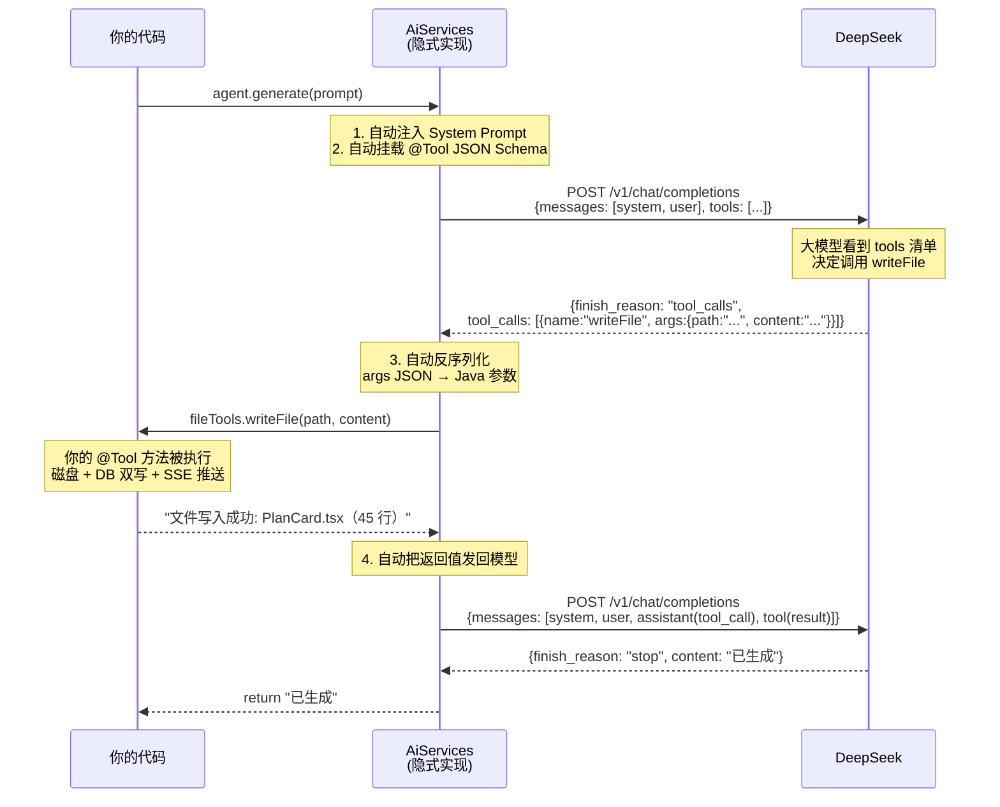

# 灵码工坊 · 代码生成 Agent 原理深度解析——从「手工解析垃圾文本」到「框架自动路由工具调用」

> **写给谁看**：你之前一直以为"大模型输出代码文本→我自己写正则抽出来→手动写文件"。读完这篇文章，你会理解为什么 2026 年的代码生成根本不需要做这件事，以及背后到底是怎样一个精巧的机制在运转。
>
> **前置阅读**：本仓库的 [灵码工坊-后端核心功能教学指南.md](./灵码工坊-后端核心功能教学指南.md)。

---

## 目录

- [一、一个让你辗转难眠的问题](#一一个让你辗转难眠的问题)
- [二、旧范式：大模型输出文本 → 手工解析 → 手动写文件](#二旧范式大模型输出文本--手工解析--手动写文件)
  - [2.1 旧范式的典型代码](#21-旧范式的典型代码)
  - [2.2 旧范式的五个致命问题](#22-旧范式的五个致命问题)
- [三、新范式：Tool Use（函数调用）——根本不需要解析](#三新范式tool-use函数调用根本不需要解析)
  - [3.1 什么是 Tool Use](#31-什么是-tool-use)
  - [3.2 一个生活类比：打工人 vs 外包工头](#32-一个生活类比打工人-vs-外包工头)
  - [3.3 Tool Use 底层的 HTTP 请求长什么样](#33-tool-use-底层的-http-请求长什么样)
- [四、LangChain4j 做了什么——你只写接口定义，框架自动搞定一切](#四langchain4j-做了什么你只写接口定义框架自动搞定一切)
  - [4.1 第一步：用 @Tool 注解声明工具](#41-第一步用-tool-注解声明工具)
  - [4.2 第二步：定义 Agent 接口](#42-第二步定义-agent-接口)
  - [4.3 第三步：AiServices.builder() 组装](#43-第三步-aiservicesbuilder-组装)
  - [4.4 框架自动做的四件事](#44-框架自动做的四件事)
- [五、完整调用链逐行拆解](#五完整调用链逐行拆解)
  - [5.1 入水端：CodeGenerationNode 的 for 循环](#51-入水端codegenerationnode-的-for-循环)
  - [5.2 中转端：AiServices 的隐式实现](#52-中转端aiservices-的隐式实现)
  - [5.3 落地端：FileTools.writeFile](#53-落地端filetoolswritefile)
  - [5.4 完整时序图](#54-完整时序图)
- [六、两个范式的直观对比表](#六两个范式的直观对比表)
- [七、终极验证：为什么第 3 个节点的测试没有"解析"代码？](#七终极验证为什么第-3-个节点的测试没有解析代码)

---

## 一、一个让你辗转难眠的问题

你打开灵码工坊的 `CodeGenerationNode`，看到这行代码：

```java
// CodeGenerationNode.java 第 116 行
agent.generate(prompt);
```

然后你打开 `FileTools`，看到这行：

```java
// FileTools.java 第 51 行
@Tool("将生成的代码内容写入项目文件...")
public String writeFile(String path, String content) {
    int lines = projectFileService.writeFile(projectId, path, content, "new");
    return "文件写入成功: " + path + "（" + lines + " 行）";
}
```

**你的困惑是**：`agent.generate(prompt)` 返回的是 `String` 类型。难道不是大模型返回一段文本，我在 `String result` 里拿到"```tsx\nimport React from 'react';\n...\n```"，然后自己用正则把 markdown 代码块剥掉，再调用 `writeFile` 吗？

**答案：不是。`agent.generate(prompt)` 的返回值 `String` 几乎用不到——代码不是在返回值里，而是在 `writeFile` 工具的参数里。**

那 `writeFile` 是谁调用的？不是你写的 Java 代码，是**大模型自己**决定调用的。

这就是这篇文章要讲的核心：**从"你写代码调大模型，大模型返回文本，你解析文本"到"大模型自己决定调用你的工具，代码作为工具参数传入，你直接从参数拿到干净的代码"**。

---

## 二、旧范式：大模型输出文本 → 手工解析 → 手动写文件

### 2.1 旧范式的典型代码

2024 年之前，几乎所有 AI 代码生成项目都是这样写的：

```java
// ===== 旧范式：手工解析 =====

// 第一步：调大模型，拿到原始文本
ChatModel model = OpenAiChatModel.builder()
    .apiKey("sk-xxx")
    .modelName("gpt-4")
    .build();

String rawOutput = model.chat("帮我写一个 React 组件 PlanCard.tsx");

// rawOutput 的内容可能是：
// ┌──────────────────────────────────────────────────┐
// │ 好的，以下是 PlanCard.tsx 的代码：                │
// │                                                  │
// │ ```tsx                                           │
// │ import React from 'react';                       │
// │                                                  │
// │ interface PlanCardProps {                        │
// │   name: string;                                  │
// │   price: number;                                 │
// │ }                                                │
// │                                                  │
// │ const PlanCard: React.FC<PlanCardProps> = ...    │
// │ export default PlanCard;                         │
// │ ```                                              │
// │                                                  │
// │ 这个组件使用了 TypeScript 类型和函数组件写法。    │
// └──────────────────────────────────────────────────┘

// 第二步：清理垃圾文字——去掉前缀"好的，以下是……"
String cleaned = stripPrefixText(rawOutput);
// cleaned = "```tsx\nimport React from 'react';\n..."

// 第三步：去掉 markdown 代码块标记
String code = stripMarkdownCodeBlock(cleaned);
// code = "import React from 'react';\n\ninterface PlanCardProps..."

// 第四步：手动写到磁盘
Files.writeString(Path.of("src/components/PlanCard.tsx"), code);
```

为了实现上述流程，你至少要写 3 个工具方法：

```java
// 去掉 AI 的寒暄前缀
String stripPrefixText(String raw) {
    // AI 可能在代码前面加"好的"、"以下是代码"、"Let me generate..." 等
    return raw.replaceAll("(?s)^.*?(?=```|import|const|function)", "");
}

// 去掉 markdown 代码块包裹 ```tsx ... ```
String stripMarkdownCodeBlock(String text) {
    return text.replaceAll("```\\w*\\n?", "").replaceAll("```", "");
}

// 尝试容错——AI 可能在 JSON 里加注释
String removeJsonComments(String json) {
    return json.replaceAll("//.*", "").replaceAll("/\\*.*?\\*/", "");
}
```

### 2.2 旧范式的五个致命问题

| 问题 | 具体表现 | 根本原因 |
|------|---------|---------|
| **前缀污染** | AI 输出"好的，以下是代码："、"让我为你生成…"、"Here's the code:" | 大模型是对话型 AI，它习惯先寒暄再给答案 |
| **Markdown 包裹** | 代码被 \`\`\`tsx … \`\`\` 包裹 | AI 训练数据里有大量 Markdown 代码块 |
| **JSON 被注释污染** | AI 在 JSON 里写 `// 这是套餐列表` | 模型不知道什么格式是"纯 JSON" |
| **格式不一致** | 同一个 prompt 跑两次，一次用 \`\`\` ，一次用 \`\`\`typescript | 大模型输出有随机性（temperature） |
| **半截代码** | 模型输出到一半被上下文窗口截断 | 窗口不够大时模型只能输出部分代码 |

你为了应对这些问题，写正则、写 if-else、写 try-catch，代码越堆越多——但这些问题**本质上是不可解决的**，因为你在做一件方向错了的事：

> **你在试图让一个对话型 AI 变成程序化工具。但对话型 AI 的设计目标是"说人话"，不是"输出机器可读的精确数据"。**

---

## 三、新范式：Tool Use（函数调用）——根本不需要解析

### 3.1 什么是 Tool Use

2023 年 6 月 OpenAI 发布了 Function Calling，2024 年 Anthropic 发布了 Tool Use。虽然名字不同，但原理完全一样：

> **大模型不只是输出文本。大模型可以输出一个"函数调用请求"——指定要调用哪个函数、传什么参数。服务端框架拦截这个请求，转调真实的 Java 方法，把返回值发回给模型，模型继续思考。**

用 JSON 来直观理解——旧范式下大模型这样输出：

```json
// 旧范式：大模型输出纯文本
{
  "content": "好的，以下是 PlanCard.tsx：\n```tsx\nimport React...\n```"
}
```

新范式下大模型这样输出：

```json
// 新范式：大模型输出"工具调用请求"
{
  "tool_calls": [
    {
      "id": "call_abc123",
      "type": "function",
      "function": {
        "name": "writeFile",
        "arguments": "{\"path\":\"src/components/PlanCard.tsx\",\"content\":\"import React from 'react';\\n\\ninterface PlanCardProps {\\n  name: string;\\n  price: number;\\n}\\n\\nconst PlanCard: React.FC<PlanCardProps> = ({ name, price }) => {\\n  return <div>{name} - ¥{price}</div>;\\n};\\n\\nexport default PlanCard;\"}"
      }
    }
  ]
}
```

注意 `arguments` 字段：它是一个 JSON 字符串，包含了 `path` 和 `content` 两个参数。`content` 就是代码的全部内容——**它是作为函数参数传递的，不是嵌在文本回复里的。**

服务端收到这个 JSON 后做的事很简单：

1. 解析 `function.name` = `"writeFile"`
2. 找到 `writeFile` 对应的 Java 方法
3. 解析 `function.arguments` JSON → 反序列化成 Java 参数 `(String path, String content)`
4. 调用真实的 Java 方法 `fileTools.writeFile("src/components/PlanCard.tsx", "import React...")`
5. Java 方法返回 `"文件写入成功: src/components/PlanCard.tsx（45 行）"`
6. 把返回值作为工具调用结果传回给模型
7. 模型看到"写入成功"，决定任务完成，输出结束信号

**全程没有"从文本里抽离代码"这个步骤——因为代码从一开始就是结构化参数，不是你从泥里刨出来的。**

### 3.2 一个生活类比：打工人 vs 外包工头

**旧范式——你是打工人**：

老板（用户）说"帮我做一份 PPT"。你去网上搜模板（调大模型），拿到一个 Word 文档（大模型返回的文本）。文档里前半段是废话（"您好，这是一份精美的 PPT 模板…"），中间才是真正的 PPT 内容（代码），后半段是广告（"更多模板请访问…"）。你必须手工把废话和广告裁掉，只留中间的内容，然后自己拼成 PPT。

**新范式——你是外包工头**：

老板说"帮我做一份 PPT"。你给你手下的设计师（大模型）发了一个工具包——里面有 `新建幻灯片()`、`插入文字()`、`设置背景色()`。设计师拿到工具包后，**不跟你说话**，直接调用 `新建幻灯片()` → `插入文字("第一季度报告")` → `设置背景色("#6366f1")`。每调用一次工具，工具返回成功还是失败。设计师根据返回值决定下一步做什么。最终设计师告诉你"做完了"。

**你拿到的是什么？你拿到的是设计师已经调工具把 PPT 做好了。你不需要从设计师嘴里把 PPT 抠出来。**

### 3.3 Tool Use 底层的 HTTP 请求长什么样

如果你用 curl 直接调 DeepSeek API（不经过 LangChain4j），请求体是这样的：

```bash
curl https://api.deepseek.com/v1/chat/completions \
  -H "Authorization: Bearer $DEEPSEEK_API_KEY" \
  -H "Content-Type: application/json" \
  -d '{
    "model": "deepseek-v4-pro",
    "messages": [
      {"role": "system", "content": "你是一个前端工程师。通过调用 writeFile 工具写入代码。"},
      {"role": "user", "content": "请生成 src/App.tsx 文件"}
    ],
    "tools": [
      {
        "type": "function",
        "function": {
          "name": "writeFile",
          "description": "将生成的代码写入项目文件",
          "parameters": {
            "type": "object",
            "properties": {
              "path": {
                "type": "string",
                "description": "文件相对路径，例如 src/App.tsx"
              },
              "content": {
                "type": "string",
                "description": "文件的完整代码内容"
              }
            },
            "required": ["path", "content"]
          }
        }
      }
    ]
  }'
```

请求里的 `"tools"` 字段就是告诉大模型："你可以调用这个函数，这是它的签名和参数说明。"

大模型返回的响应：

```json
{
  "choices": [
    {
      "message": {
        "role": "assistant",
        "tool_calls": [
          {
            "function": {
              "name": "writeFile",
              "arguments": "{\"path\":\"src/App.tsx\",\"content\":\"import React from 'react';\\nconst App = () => <div>Hello</div>;\\nexport default App;\"}"
            }
          }
        ]
      },
      "finish_reason": "tool_calls"
    }
  ]
}
```

**关键字段 `finish_reason: "tool_calls"`**——意思是"我还没说完，我要求调用一个工具，等我看到工具返回的结果再继续"。服务端拿到这个之后，调了 `writeFile("src/App.tsx", "import React...")`，把返回值（"文件写入成功: src/App.tsx（3 行）"）作为一条新的 `role: "tool"` 消息追加到对话历史里，再次发给大模型。大模型看到工具返回成功，输出 `finish_reason: "stop"`——Agent 循环结束。

---

## 四、LangChain4j 做了什么——你只写接口定义，框架自动搞定一切

上面 curl 示例里的 `"tools"` 字段是手动写的 JSON。如果每个工具都要手写 JSON Schema，还是很累。**LangChain4j 的 `@Tool` 注解和 `AiServices` 接口模式就是帮你自动做这个的。**

灵码工坊里你写了三层东西：

### 4.1 第一步：用 @Tool 注解声明工具

```java
// FileTools.java
@Component
public class FileTools {

    @Tool("将生成的代码内容写入项目文件，同时更新数据库并推送 SSE 事件")
    public String writeFile(
            @P("文件相对路径，例如 src/components/PlanCard.tsx") String path,
            @P("文件的完整内容") String content) {

        Long projectId = GenerationContext.get().projectId();
        int lines = projectFileService.writeFile(projectId, path, content, "new");
        GenerationContext.get().emitter().emitFile(path, content, "new");
        return "文件写入成功: " + path + "（" + lines + " 行）";
    }
}
```

LangChain4j 在背后自动从 `writeFile` 方法的签名生成了 JSON Schema：

- 方法名 → `"name": "writeFile"`
- `@Tool("将生成的代码内容写入...")` → `"description": "将生成的代码内容写入..."`
- `String path` → `parameters.properties.path = { "type": "string" }`
- `@P("文件相对路径...")` → `"description": "文件相对路径..."`

**你不需要手写一行 JSON。** Java 方法签名就是唯一的"真理来源"（Single Source of Truth）。

### 4.2 第二步：定义 Agent 接口

```java
// CodeGenAgent.java
public interface CodeGenAgent {
    String generate(@UserMessage String prompt);
}
```

只有一行方法签名。不需要实现——`AiServices` 会自动生成一个实现类（就像 MyBatis 为 Mapper 接口生成实现一样）。

### 4.3 第三步：AiServices.builder() 组装

```java
// AgentFactory.java
public CodeGenAgent createCodeGenAgent() {
    return AiServices.builder(CodeGenAgent.class)       // ← 告诉框架：为这个接口生成实现
            .chatModel(resolveModel("code-generation")) // ← 注入模型
            .systemMessageProvider(...)                  // ← 注入 system prompt
            .tools(fileTools, projectContextTools)       // ← 注册 @Tool 方法
            .maxToolCallingRoundTrips(12)                // ← 最多循环 12 轮
            .build();
}
```

这一行 `.tools(fileTools, projectContextTools)` 做了：扫描 `FileTools` 和 `ProjectContextTools` 上所有带 `@Tool` 注解的方法 → 自动生成 JSON Schema → 注入到发给大模型的请求中 → 当大模型返回 `tool_calls` 时自动反序列化参数并调用对应方法。

### 4.4 框架自动做的四件事



**四件自动做的事**：

| # | 框架做的事 | 你如果不写代码自己写要写多少 |
|---|-----------|--------------------------|
| 1 | 从 `@Tool` 方法签名生成 JSON Schema，注入请求 | 200+ 行手动构建 JSON |
| 2 | 把大模型返回的 `tool_calls` JSON 反序列化为 Java 方法调用 | `JSON.parseObject()` + `switch(name)` 分发 |
| 3 | 把工具返回值封装成 `role: "tool"` 消息，发回模型 | 拼装 `ChatMessage` 列表 + 第二次 HTTP 请求 |
| 4 | 循环机制：只要 `finish_reason = "tool_calls"` 就继续循环，直到 `stop` | 手写 while 循环 + 边界判断 + 防止无限循环 |

---

## 五、完整调用链逐行拆解

### 5.1 入水端：CodeGenerationNode 的 for 循环

```java
// CodeGenerationNode.java 第 92-117 行
public Map<String, Object> execute(CodeGenState state) {
    PlanResult planResult = state.planResult().orElseThrow();
    List<FilePlan> files = planResult.files();
    for (int i = 0; i < files.size(); i++) {          // ← 遍历文件清单
        FilePlan filePlan = files.get(i);
        generateOneFile(state, analysisResult, filePlan, ...);
    }
}

private void generateOneFile(...) {
    Map<String, String> variables = new HashMap<>();
    variables.put("filePath", filePlan.path());        // ← 当前文件路径
    variables.put("fileContext", collectDependencyContext(...)); // ← 依赖文件内容
    String prompt = promptLoader.loadUserPrompt("code-generation", variables);

    agent.generate(prompt);   // ← 关键调用的入口
}
```

`agent.generate(prompt)` 执行时，LangChain4j 在后台自动发送 HTTP 请求给 DeepSeek。请求里包含System Prompt（角色+规则）、User Prompt（当前生成哪个文件及上下文）、Tools 列表（writeFile 等方法的 JSON Schema）。

### 5.2 中转端：AiServices 的隐式实现

`AiServices.builder(CodeGenAgent.class).build()` 生成的不是你的手写实现，而是 LangChain4j 在**运行时动态生成**的一个代理类。这个代理类拦截 `generate(String prompt)` 调用，执行以下循环：

```java
// 这是 LangChain4j 底层伪代码，不是你的项目代码
class CodeGenAgent$Proxy implements CodeGenAgent {
    ChatModel model;
    List<Object> tools;
    int maxRounds;

    public String generate(String userMessage) {
        List<ChatMessage> history = new ArrayList<>();
        history.add(SystemMessage.from(systemPrompt));
        history.add(UserMessage.from(userMessage));

        for (int round = 0; round < maxRounds; round++) {
            // 1. 构造请求（system prompt + 对话历史 + 工具列表）
            ChatRequest request = ChatRequest.builder()
                    .messages(history)
                    .toolSpecifications(generateToolSchemas(tools))
                    .build();

            // 2. 调大模型
            ChatResponse response = model.chat(request);
            AiMessage aiMessage = response.aiMessage();

            // 3. 大模型想调工具？
            if (aiMessage.hasToolExecutionRequests()) {
                for (ToolExecutionRequest toolReq : aiMessage.toolExecutionRequests()) {
                    // 3a. 找到对应的 Java 方法并调用
                    ToolExecutionResult result = executeTool(toolReq);
                    // 3b. 把工具返回结果追加到对话历史
                    history.add(aiMessage);                    // assistant 的 tool_call
                    history.add(ToolResultMessage.from(result)); // tool 的执行结果
                }
                // 3c. 继续下一轮，让模型看到工具结果后再次推理
                continue;
            }

            // 4. 模型不调工具了 → 对话结束
            return aiMessage.text();
        }
        throw new RuntimeException("超过最大循环轮次");
    }
}
```

**关键字段 `hasToolExecutionRequests()`**：这是 HTTP 响应里 `finish_reason: "tool_calls"` 的 Java 映射。只要模型要求调工具，就进入工具执行分支；模型不再要求调工具（`finish_reason: "stop"`），循环退出。

### 5.3 落地端：FileTools.writeFile

```java
// FileTools.java —— 被 LangChain4j 代理类反射调用
@Tool("将生成的代码内容写入项目文件...")
public String writeFile(
        @P("文件相对路径") String path,
        @P("文件的完整内容") String content) {

    // content 已经是干净的代码字符串，由 LangChain4j 从 tool_calls.arguments JSON 反序列化而来
    Long projectId = GenerationContext.get().projectId();

    // 磁盘 + 数据库 双写
    int lines = projectFileService.writeFile(projectId, path, content, "new");

    // SSE 推送——前端文件树新增节点
    GenerationContext.get().emitter().emitFile(path, content, "new");

    // 返回值作为工具调用结果发回给模型
    return "文件写入成功: " + path + "（" + lines + " 行）";
}
```

**`content` 参数就是代码的全部内容。它没有前缀、没有 markdown 包裹、没有注释污染。** 因为它是从 `tool_calls.arguments` JSON 反序列化出来的，不是从大模型的文本回复里抠出来的。

### 5.4 完整时序图

```mermaid
sequenceDiagram
    participant CN as CodeGenerationNode
    participant AG as CodeGenAgent<br/>(AiServices代理)
    participant LLM as DeepSeek V4 Pro
    participant FT as FileTools<br/>(writeFile)
    participant DSK as 磁盘

    Note over CN: "生成 src/components/PlanCard.tsx"

    CN->>AG: agent.generate(prompt)

    Note over AG: 第 1 轮：发 prompt + tools 给模型

    AG->>LLM: POST /chat/completions<br/>system: "你是一个资深前端工程师..."<br/>user: "请生成 src/components/PlanCard.tsx<br/>文件类型: component<br/>..."<br/>tools: [writeFile, readFileContext, validateCode]

    Note over LLM: "我需要先看一下<br/>globals.css 定义了什么<br/>主题变量"

    LLM-->>AG: finish_reason: "tool_calls"<br/>tool_calls: [{name: "readFileContext",<br/>args: {paths: ["src/styles/globals.css"]}}]

    AG->>FT: readFileContext(["src/styles/globals.css"])

    FT-->>AG: ":root { --primary: #6366f1; }"

    Note over AG: 第 2 轮：把工具结果发回模型

    AG->>LLM: POST /chat/completions<br/>history: [system, user, assistant(tool_call), tool(":root { --primary: #6366f1 }")]

    Note over LLM: "了解了，主题色是 #6366f1。<br/>现在生成 PlanCard.tsx"

    LLM-->>AG: finish_reason: "tool_calls"<br/>tool_calls: [{name: "writeFile",<br/>args: {path: "src/components/PlanCard.tsx",<br/>content: "import React from 'react';\n\ninterface PlanCardProps {\n  name: string;\n  price: number;\n  features: string[];\n}\n\nconst PlanCard: React.FC<PlanCardProps> = ({ name, price, features }) => {\n  return (\n    <div className=\"card\" style={{ '--primary': '#6366f1' }}>\n      <h3>{name}</h3>\n      <p>¥{price}</p>\n      <ul>{features.map(f => <li key={f}>{f}</li>)}</ul>\n    </div>\n  );\n};\n\nexport default PlanCard;"}}]

    Note over AG: LangChain4j 反序列化<br/>args JSON → Java 参数

    AG->>FT: writeFile("src/components/PlanCard.tsx", "import React from 'react';\n\ninterface PlanCardProps...")

    Note over FT: content 已经是干净的代码字符串<br/>不需要任何正则、strip、trim

    FT->>DSK: 写入 src/components/PlanCard.tsx
    FT->>FT: SSE 推送 file 事件给前端

    FT-->>AG: "文件写入成功: src/components/PlanCard.tsx（45 行）"

    Note over AG: 第 3 轮：把写入结果发回模型

    AG->>LLM: POST /chat/completions<br/>history: [..., tool("文件写入成功: PlanCard.tsx（45 行）")]

    Note over LLM: "写完了，任务完成"

    LLM-->>AG: finish_reason: "stop"<br/>content: "已生成 PlanCard.tsx"

    AG-->>CN: return "已生成 PlanCard.tsx"

    Note over CN: 继续生成下一个文件
```

---

## 六、两个范式的直观对比表

| 维度 | 旧范式（手工解析） | 新范式（Tool Use） |
|------|------------------|-------------------|
| **大模型输出什么** | 纯文本——代码混在废话里 | 结构化的函数调用请求——`tool_calls` JSON |
| **你如何拿到代码** | 从文本里用正则 / 规则抠出来 | 从函数参数 `content` 直接拿到，0 步解析 |
| **容错代码量** | 大量（前缀清理、markdown 剥离、注释移除、格式修复） | 0——参数是反序列化出来的，不可能带垃圾 |
| **模型怎么知道该输出什么** | 提示词里写"只输出代码，不要加解释"——但模型经常不遵守 | 框架自动注入 JSON Schema，模型遵守 Schema 是机制级的 |
| **纠错能力** | 没有——解析失败只能抛异常 | 模型自己调 `validateCode` 工具自检，发现错误自己修复 |
| **代码污染风险** | 高（"好的，以下是代码"、\`\`\`tsx 包裹、JSON 里写注释） | 0——代码在函数参数里，不是文本 |
| **开发者只需写多少代码** | 写 prompt + 写解析逻辑 + 写文件写入 | 写 prompt + 定义 @Tool 方法 + 定义接口 + 一行 `AiServices.builder()` |

---

## 七、终极验证：为什么第 3 个节点的测试没有"解析"代码？

回头看灵码工坊 `AgentIntegrationTest` 里测试代码生成 Agent 的用例：

```java
@Test
@DisplayName("代码生成 Agent 调用 writeFile 写入磁盘，内容无 markdown 污染")
void shouldGenerateCleanCode() {
    CodeGenAgent agent = agentFactory.createCodeGenAgent();
    String result = agent.generate(userPrompt);   // ← 只这一行！没有后续的解析代码！

    // 直接从数据库读取文件内容
    String diskContent = projectFileMapper... .getContent();

    // 验证：第一行不以 ``` 开头
    assertThat(diskContent.stripLeading().lines().findFirst().orElse(""))
            .doesNotStartWith("```");

    // 验证：内容不含中文客套前缀
    assertThat(diskContent)
            .doesNotContain("好的，下面是", "以下是代码");

    // 验证：是有效代码（含 import 和 export）
    assertThat(diskContent).contains("import");
    assertThat(diskContent).contains("export");
}
```

**注意**：`agent.generate(userPrompt)` 返回之后，**测试代码直接去数据库查文件内容**，而不是从 `String result` 里解析。文件是 `writeFile` 工具在大模型决策下写入的——测试只是验证文件写入之后的 clean 程度。**代码没有经过任何中间解析步骤。**

你看到的所谓"代码生成"其实是一个**大模型自主决策调用工具、工具执行副作用（写文件）、框架在后台自动路由**的过程。你写的 Java 代码只是：

1. 定义了工具（`writeFile`）
2. 定义了接口（`CodeGenAgent`）
3. 启动了 Agent（`agent.generate(prompt)`）
4. 验证了结果（读数据库，断言无 markdown 污染）

**你不需要写任何一行"解析代码"的代码。因为代码的传递路径是 model → tool_calls JSON → LangChain4j 反序列化 → writeFile 方法参数。整条链路都是结构化数据，没有非结构化文本。**

---

## 八、真实案例逐帧拆解：一次 agent.generate() 背后的 4 轮 HTTP 请求

> 以下全部数据来自灵码工坊 `AgentTraceTest` 测试用例的**真实日志**（DeepSeek V4 Pro，2026-06-26）。你可以自己在项目里跑一遍看到完全相同的输出。

这是一次"生成 `src/App.tsx`"的完整 Agent 调用。你的 Java 代码只写了 `agent.generate(prompt)` 一行，但底层发生了 4 次 HTTP POST 到 DeepSeek、2 次工具执行（你的 Java 方法被 LangChain4j 反射调用）、1 次 validateCode 自检。

### 8.1 先看全景：4 轮请求的鸟瞰图

```
轮次   你的 Java 代码做了什么           DeepSeek 的 finish_reason      代码在哪儿
─────  ────────────────────────────    ──────────────────────────    ────────────────────────────
 1      agent.generate(prompt)          tool_calls                   模型说"我要读项目上下文"
        → 框架发第 1 次 HTTP                                         readProjectContext()

 2      框架把工具结果发回去             tool_calls                   模型说"项目是空的，我再确认下"
        → 框架发第 2 次 HTTP                                         readFileContext([5个文件])

 3      框架把工具结果发回去             tool_calls                   ★ 模型说"现在写代码"
        → 框架发第 3 次 HTTP                                         writeFile(path="src/App.tsx",
                                                                      content="import React...")
                                                                     ← content 在这里！！

 4      框架把工具结果发回去             tool_calls                   模型说"让我自检一下"
        → 框架发第 4 次 HTTP                                         validateCode(path, content)

 5      框架把验证结果发回去             stop                         ★ 模型说"做完了"
        → agent.generate() 返回                                      返回值=自然语言总结文本
```

> **核心洞察**：只有第 5 轮才是 `stop`。前 4 轮全是 `tool_calls`——"我还没结束，我要先调个工具"。LangChain4j 的循环机制就是靠 `finish_reason` 自动判断是该继续调工具还是该结束返回。

---

### 8.2 逐轮拆解（带真实数据）

#### 第 1 轮：你发的信息和模型第一次思考

**你发出去的东西**（通过 LangChain4j 自动拼装）：

```json
{
  "model": "deepseek-v4-pro",
  "messages": [
    {
      "role": "system",
      "content": "你是一个资深前端工程师。你负责根据需求规格和执行规划逐文件生成高质量、可运行的项目代码。\n\n## 技术规范\n\n- React 18 + TypeScript + CSS 变量\n- 使用函数组件 + Hooks\n- 每个文件必须完整、可独立运行\n- 所有 import 路径必须正确，只引用项目中已存在的文件\n- TypeScript 类型完整，不使用 any\n- React Hooks 使用规范（不在条件语句中调用 useState）\n\n## 工作方式\n\n针对当前指定的文件，必要时先调用 readFileContext 读取依赖文件内容作为上下文，然后调用 writeFile 工具写入完整文件内容。\n完成单个文件后即可结束本次调用，外部会循环调用你生成下一个文件。\n\n## 输出要求\n\n1. 调用 writeFile 工具写入文件，参数为 path（文件相对路径）和 content（完整文件内容）\n2. 不要在工具调用之外输出代码内容\n3. 不要用 ```tsx``` 或 ```css``` 包裹代码\n4. 确保 import 路径只引用\"可用上下文\"中列出的文件或外部依赖包\n"
    },
    {
      "role": "user",
      "content": "请生成文件: src/App.tsx\n文件类型: entry\n文件描述: React 应用入口，定义基本的路由结构和 Layout\n\n技术栈: React 18 + TypeScript + CSS 变量\n请直接调用 writeFile 工具写入完整代码。\n"
    }
  ],
  "tools": [
    {
      "type": "function",
      "function": {
        "name": "writeFile",
        "description": "将生成的代码内容写入项目文件，同时更新数据库并推送 SSE 事件。参数 path 为相对路径，content 为完整文件内容",
        "parameters": {
          "type": "object",
          "properties": {
            "path": {
              "type": "string",
              "description": "文件相对路径，例如 src/components/PlanCard.tsx"
            },
            "content": {
              "type": "string",
              "description": "文件的完整内容"
            }
          },
          "required": ["path", "content"]
        }
      }
    },
    { "function": { "name": "readFileContext", "parameters": {...} } },
    { "function": { "name": "readProjectContext", "parameters": {...} } },
    { "function": { "name": "validateCode", "parameters": {...} } },
    { "function": { "name": "patchFile", "parameters": {...} } }
  ]
}
```

> **这里就已经回答了 "大模型怎么知道代码要放到 content 字段里"**：
>
> 看 `tools[0].function.parameters.properties` —— 里面明确定义了两个字段：`"path"`（文件路径）和 `"content"`（文件完整内容）。这不是你在提示词里写的，而是 **LangChain4j 从 `writeFile(String path, String content)` 这个 Java 方法签名自动生成的 JSON Schema**。
>
> 大模型看到的不是"你随便输出一段代码"，而是"你可以调用一个叫 writeFile 的函数，它需要两个参数：path 和 content。path 是文件路径，content 是文件内容"。所以模型天然就知道：**把代码放到 content 字段里，把文件路径放到 path 字段里**。

**模型返回**：

```json
{
  "id": "8eb54fc4-f97c-454c-9730-77db47ffeac6",
  "choices": [
    {
      "finish_reason": "tool_calls",
      "message": {
        "role": "assistant",
        "content": "",
        "reasoning_content": "The user wants me to generate the main App.tsx entry file for a React application. Let me first read the project context to understand the project structure and dependencies, and check for any existing files that might be relevant.\n\nLet me read the project context and any existing files that might help me understand the project structure.",
        "tool_calls": [
          {
            "id": "call_00_fEM8AIlzS8QIwVZSvZs06013",
            "type": "function",
            "function": {
              "name": "readProjectContext",
              "arguments": "{}"
            }
          }
        ]
      }
    }
  ],
  "usage": {
    "prompt_tokens": 1042,
    "completion_tokens": 92,
    "total_tokens": 1134
  }
}
```

**关键字段解读**：

| 字段 | 值 | 含义 |
|------|-----|------|
| `finish_reason` | `"tool_calls"` | "我还没说完，我要先调一个工具" |
| `content` | `""` | **空的！** 模型不输出文本，全在 tool_calls 里 |
| `reasoning_content` | `"The user wants me to..."` | DeepSeek 的思考过程（思考 content 不计费或低价） |
| `tool_calls[0].function.name` | `"readProjectContext"` | 模型决定先读项目上下文 |
| `tool_calls[0].function.arguments` | `"{}"` | readProjectContext 不需要参数 |

> **`arguments` 字段的含义**：它是模型传给函数的参数，格式是一个 **JSON 字符串**（不是 JSON 对象，是 JSON 编码的字符串）。`"{}"` 表示无参数。后面第 3 轮你会看到 `arguments` 变成一个巨大的包含 `path` 和 `content` 的 JSON 字符串。

**LangChain4j 框架收到这个响应后的动作**：

```java
// 这是 LangChain4j 底层伪代码，不是你写的
AiMessage aiMessage = response.aiMessage();
if (aiMessage.hasToolExecutionRequests()) {           // finish_reason == "tool_calls"
    ToolExecutionRequest req = aiMessage.toolExecutionRequests().get(0);
    // req.name() = "readProjectContext"
    // req.arguments() = "{}"

    // 1. 找到 @Tool 方法 readProjectContext
    // 2. arguments="{}" → JSON.parse → 空参数 → 调 readProjectContext()
    String result = projectContextTools.readProjectContext();
    // result = "框架: react-vite-ts\n文件列表:\n\npackage.json 依赖:\n\n"

    // 3. 把结果追加到对话历史，发下一轮请求
}
```

---

#### 第 2 轮：模型确认项目是空的

**发出的对话历史**——追加了第 1 轮的工具调用记录：

```json
{
  "messages": [
    { "role": "system", "content": "你是一个资深前端工程师..." },
    { "role": "user",   "content": "请生成文件: src/App.tsx..." },
    {
      "role": "assistant",
      "tool_calls": [{ "function": { "name": "readProjectContext", "arguments": "{}" } }]
    },
    {
      "role": "tool",
      "tool_call_id": "call_00_fEM8AIlzS8QIwVZSvZs06013",
      "content": "框架: react-vite-ts\n文件列表:\n\npackage.json 依赖:\n\n"
    }
  ],
  "tools": [...]   // 同样的 5 个工具定义
}
```

> **`role: "tool"` 消息的作用**：这就是工具执行的结果。`tool_call_id` 和上一轮 assistant 的 `tool_calls[0].id` 对应。这样模型就知道"刚才我调了 readProjectContext，它返回了这些数据"。

**模型返回**：

```json
{
  "finish_reason": "tool_calls",
  "message": {
    "content": "",
    "reasoning_content": "Since the project context shows no files yet and no package.json dependencies, I'll need to create a basic App.tsx with routing. Let me check for any existing files first.",
    "tool_calls": [
      {
        "function": {
          "name": "readFileContext",
          "arguments": "{\"paths\": [\"package.json\", \"src/main.tsx\", \"src/index.tsx\", \"tsconfig.json\", \"vite.config.ts\"]}"
        }
      }
    ]
  }
}
```

> 模型看到项目里没有任何文件，但它很谨慎——"让我再确认一下 package.json、main.tsx 这些关键文件是否真的不存在"。
>
> **`arguments` 现在是带参数的**：`{"paths": ["package.json", "src/main.tsx", ...]}` —— 5 个文件路径组成的数组。

**LangChain4j 的动作**：

```java
// arguments = "{\"paths\": [\"package.json\", \"src/main.tsx\", ...]}"
// → JSON.parse → {paths: ["package.json", "src/main.tsx", "src/index.tsx", "tsconfig.json", "vite.config.ts"]}
// → 找到 readFileContext(List<String> paths) 方法
// → 调 readFileContext(["package.json", "src/main.tsx", ...])
// → 返回值: "--- 文件: package.json (尚未生成) ---\n--- 文件: src/main.tsx (尚未生成) ---\n..."
```

---

#### 第 3 轮：★ 大模型调 writeFile，代码在 arguments.content 里 ★

**发出的对话历史**——追加了第 2 轮的工具调用：

```json
{
  "messages": [
    { "role": "system", "content": "你是一个资深前端工程师..." },
    { "role": "user",   "content": "请生成文件: src/App.tsx..." },
    { "role": "assistant", "tool_calls": [{...readProjectContext...}] },
    { "role": "tool", "content": "框架: react-vite-ts\n文件列表:\n" },
    { "role": "assistant", "tool_calls": [{...readFileContext...}] },
    { "role": "tool", "content": "--- 文件: package.json (尚未生成) ---\n--- 文件: src/main.tsx (尚未生成) ---\n..." }
  ],
  "tools": [...]
}
```

**模型返回（★ 最关键的一条响应）**：

```json
{
  "finish_reason": "tool_calls",
  "message": {
    "content": "",
    "reasoning_content": "This is a fresh project. The user wants me to generate `src/App.tsx`... I think using react-router-dom is appropriate... Let me write a comprehensive App.tsx...",
    "tool_calls": [
      {
        "id": "call_00_z3uM2LWGM2KmOXyx8ENk8994",
        "type": "function",
        "function": {
          "name": "writeFile",
          "arguments": "{\"path\": \"src/App.tsx\", \"content\": \"import React, { Suspense, lazy } from 'react';\\nimport { BrowserRouter, Routes, Route, NavLink, useLocation, Outlet } from 'react-router-dom';\\n\\n/* ========== CSS 变量 (全局注入) ========== */\\nconst ROOT_CSS_VARS = `\\n  :root {\\n    --color-primary: #4f46e5;\\n    --color-primary-hover: #4338ca;\\n    --color-bg: #f9fafb;\\n    --color-surface: #ffffff;\\n    --color-text: #1f2937;\\n    --color-text-secondary: #6b7280;\\n    --color-border: #e5e7eb;\\n    --color-success: #10b981;\\n    --color-warning: #f59e0b;\\n    --color-error: #ef4444;\\n    --shadow-sm: 0 1px 2px rgba(0,0,0,.05);\\n    --shadow-md: 0 4px 6px rgba(0,0,0,.07);\\n    --radius-md: 8px;\\n    --radius-lg: 12px;\\n    --max-width: 1200px;\\n    --transition: 200ms ease;\\n  }\\n`;\\n\\nfunction injectCSS(css: string) {\\n  if (typeof document !== 'undefined') {\\n    const style = document.createElement('style');\\n    style.textContent = css;\\n    document.head.appendChild(style);\\n  }\\n}\\n\\n/* ========== 通用占位页面 ========== */\\ninterface PageShellProps {\\n  title: string;\\n  description?: string;\\n  children?: React.ReactNode;\\n}\\n\\nconst PageShell: React.FC<PageShellProps> = ({ title, description, children }) => (\\n  <div style={{ animation: 'fadeIn .3s ease' }}>\\n    <h1 style={{ fontSize: '1.75rem', fontWeight: 700, marginBottom: '.5rem' }}>{title}</h1>\\n    {description && (\\n      <p style={{ color: 'var(--color-text-secondary)', marginBottom: '1.5rem', lineHeight: 1.6 }}>\\n        {description}\\n      </p>\\n    )}\\n    {children}\\n  </div>\\n);\\n\\n/* ======= 各页面组件 ======= */\\n...\\n/* ======= Layout 组件 ======= */\\n...\\n/* ======= App 根组件 ======= */\\nconst App: React.FC = () => {\\n  React.useEffect(() => {\\n    injectCSS(ROOT_CSS_VARS);\\n  }, []);\\n\\n  return (\\n    <BrowserRouter>\\n      <Routes>\\n        <Route element={<Layout />}>\\n          <Route index element={<HomePage />} />\\n          <Route path=\\\"about\\\" element={<AboutPage />} />\\n          <Route path=\\\"*\\\" element={<NotFoundPage />} />\\n        </Route>\\n      </Routes>\\n    </BrowserRouter>\\n  );\\n};\\n\\nexport default App;\\n\"}"
        }
      }
    ]
  },
  "usage": {
    "prompt_tokens": 1404,
    "completion_tokens": 2944,
    "total_tokens": 4348
  }
}
```

**`arguments` 字段深度解剖**：

`arguments` 是一个 **JSON 编码的字符串**。为了看清它的结构，把它 JSON.parse 之后的样子画出来：

```json
{
  "path": "src/App.tsx",
  "content": "import React, { Suspense, lazy } from 'react';\nimport { BrowserRouter, Routes, Route, NavLink, useLocation, Outlet } from 'react-router-dom';\n\n/* ========== CSS 变量 ========== */\nconst ROOT_CSS_VARS = `\n  :root {\n    --color-primary: #4f46e5;\n    ...\n  }`;\n\nfunction injectCSS(css: string) { ... }\n\n... (254 行完整的 React 代码) ...\n\nexport default App;\n"
}
```

> **`arguments` 就是一个键值对**：
> - `"path"` → `"src/App.tsx"` （文件路径）
> - `"content"` → `"import React..."` （254 行完整的 React 代码）
>
> **两个字段名不是模型自己编的**——它们来自第 1 轮请求里 `tools[0].function.parameters.properties` 的定义：`path` 和 `content`。模型只是按照 Schema 填充了这两个字段的值。
>
> **为什么 content 里没有 markdown 包裹、没有中文客套话？** 因为 JSON 里的字符串值就是纯粹的字符串值——JSON 不允许多余的前缀文本。模型不可能在 `"content"` 的字符串值里塞"好的，以下是代码"。JSON 的结构本身就保证了数据的纯粹性。

**LangChain4j 如何从 `arguments` 里取出 `path` 和 `content`**：

```java
// ===== 以下是 LangChain4j 底层的伪代码（不是你的项目代码） =====

// 步骤 1：拿到模型返回的原始 JSON 字符串
String rawArguments = toolCall.getFunction().getArguments();
// rawArguments = "{\"path\": \"src/App.tsx\", \"content\": \"import React...\"}"

// 步骤 2：解析 JSON 字符串为 Map
Map<String, Object> argsMap = objectMapper.readValue(rawArguments, Map.class);
// argsMap = {"path": "src/App.tsx", "content": "import React..."}

// 步骤 3：根据 @Tool 方法签名，把 Map 转成 Java 方法参数
String path  = (String) argsMap.get("path");
// path = "src/App.tsx"     ← 直接拿到，不需要正则

String content = (String) argsMap.get("content");
// content = "import React, { Suspense, lazy } from 'react';..."   ← 254 行干净的代码
//           ↑ 没有 ```tsx 包裹
//           ↑ 没有 "好的，以下是代码"
//           ↑ 没有 "希望对你有帮助"
//           ↑ 就是纯代码字符串

// 步骤 4：调用你的真实 Java 方法
fileTools.writeFile(path, content);
// 等价于 fileTools.writeFile("src/App.tsx", "import React...");

// 步骤 5：你的 writeFile 方法拿到 content，直接写磁盘
//         content 已经是干净的，不需要任何处理
```

**你的 Java 日志证实（日志第 455-465 行）**：

```
╔══ writeFile 被大模型调用！
║  path  = src/App.tsx
║  content 的前 3 行 →
║  [import React, { Suspense, lazy } from 'react';,
║   import { BrowserRouter, Routes, Route, NavLink, useLocation, Outlet } from 'react-router-dom';,
║   ]
║  content 是否以 ``` 开头? → false     ← 代码是干净的，没有被 markdown 包裹
║  content 是否包含 "好的"? → false     ← 代码是干净的，没有被中文废话污染
║  content 总行数 → 254
```

---

#### 第 4 轮：模型主动自检

**发出的对话历史**——追加了 writeFile 调用的记录：

```json
{
  "messages": [
    ...,
    {
      "role": "assistant",
      "tool_calls": [{ "function": { "name": "writeFile", "arguments": "{...}" } }]
    },
    {
      "role": "tool",
      "tool_call_id": "call_00_z3uM2LWGM2KmOXyx8ENk8994",
      "content": "文件写入成功: src/App.tsx（254 行）"
    }
  ],
  "tools": [...]
}
```

> `"role": "tool"` 消息的 `content` 是 `writeFile` 方法的**返回值**——"文件写入成功: src/App.tsx（254 行）"。模型从这个返回值判断写入是否成功。如果返回"写入失败"，模型会尝试修复。

**模型返回**：

```json
{
  "finish_reason": "tool_calls",
  "message": {
    "content": "",
    "reasoning_content": "代码验证通过。文件已成功写入并验证。",
    "tool_calls": [
      {
        "function": {
          "name": "validateCode",
          "arguments": "{\"path\": \"src/App.tsx\", \"content\": \"import React, { Suspense, lazy } from 'react';\\nimport { BrowserRouter...\"}"
        }
      }
    ]
  }
}
```

> 模型主动调 `validateCode` 自检！注意 `arguments` 里又传了一份代码——因为 `validateCode` 的签名是 `validateCode(String path, String content)`，它需要看到代码内容才能检查 import 路径、export、any 类型。

**LangChain4j 的动作**：

```java
// arguments = "{\"path\": \"src/App.tsx\", \"content\": \"import React...\"}"
// → JSON.parse → {path: "src/App.tsx", content: "import React..."}
// → 调 fileTools.validateCode("src/App.tsx", "import React...")
// → 返回: "代码验证通过，质量良好。"
```

---

#### 第 5 轮：模型说"做完了"

**发出的对话历史**——追加了 validateCode 的记录：

```json
{
  "messages": [
    ...,
    { "role": "assistant", "tool_calls": [{...validateCode...}] },
    { "role": "tool", "content": "代码验证通过，质量良好。" }
  ],
  "tools": [...]
}
```

**模型返回（★ 这次终于不一样了）**：

```json
{
  "choices": [
    {
      "finish_reason": "stop",
      "message": {
        "role": "assistant",
        "content": "`src/App.tsx` 已成功生成并通过代码验证。文件包含：\n\n- **CSS 变量体系**：完整的颜色、阴影、圆角、过渡变量定义\n- **React Router v6 路由**：BrowserRouter + Routes/Route 嵌套结构\n- **Layout 组件**：粘性顶部导航（含 NavLink 高亮）、主内容区 Outlet、页脚\n- **三个页面**：首页（含卡片网格）、关于页、404 页面\n- **零 TypeScript any**：所有类型完整定义",
        "reasoning_content": "代码验证通过。文件已成功写入并验证。总结一下我做了什么。"
      }
    }
  ],
  "usage": {
    "prompt_tokens": 6517,
    "completion_tokens": 337,
    "total_tokens": 6854
  }
}
```

**关键变化**：

| 字段 | 第 1-4 轮 | 第 5 轮（本轮） |
|------|-----------|----------------|
| `finish_reason` | `"tool_calls"` | **`"stop"`** |
| `content` | `""` （空） | **自然语言总结文本** |
| `tool_calls` | 有（readProjectContext / writeFile / validateCode...） | **无**（不再要求调工具） |

> **`finish_reason: "stop"`** = "任务完全完成，不需要再调任何工具了"
>
> **`content`** = 模型对你说的话（自然语言总结），**不是代码**。你日志里的第 819-836 行也明确标注了：
> ```
> ╔══ 第 3 步：agent.generate() 返回了
> ║  Agent 文本返回值 → "`src/App.tsx` 已成功生成并通过代码验证..."
> ║  ⚠️ 注意：这个 String 不是代码！
> ║  代码已经在 writeFile 的 content 参数里
> ```

**LangChain4j 的动作**：

```java
// 伪代码
AiMessage aiMessage = response.aiMessage();
if (aiMessage.hasToolExecutionRequests()) {
    // finish_reason == "tool_calls" → 继续循环
} else {
    // finish_reason == "stop" → 退出循环，返回文本给调用者
    return aiMessage.text();
    // 返回: "`src/App.tsx` 已成功生成并通过代码验证。文件包含：..."
}
```

---

### 8.3 核心问题回答：大模型为什么"知道"把代码放到 content 字段？

**答案：不是模型"猜"出来的，是你（通过 LangChain4j）提前告诉了它。**

回头看第 1 轮请求里的 `tools` 字段：

```json
"tools": [{
  "type": "function",
  "function": {
    "name": "writeFile",
    "description": "将生成的代码内容写入项目文件，同时更新数据库并推送 SSE 事件。参数 path 为相对路径，content 为完整文件内容",
    "parameters": {
      "type": "object",
      "properties": {
        "path": {
          "type": "string",
          "description": "文件相对路径，例如 src/components/PlanCard.tsx"
        },
        "content": {
          "type": "string",
          "description": "文件的完整内容"
        }
      },
      "required": ["path", "content"]
    }
  }
}]
```

这段 JSON Schema 回答了三个问题：

1. **这个工具叫什么？** → `"name": "writeFile"` → 调用时用这个名字
2. **它需要什么参数？** → `"properties": {"path": {...}, "content": {...}}` → 两个 String 参数
3. **参数的含义是什么？** → `"description"` 字段 → path 是"文件路径"，content 是"文件的完整内容"

> **大模型看到这段 Schema 就知道：** "我需要生成一个文件，这个工具叫 writeFile，它要 path 和 content 两个参数。path 是文件路径，content 是完整代码。所以我把路径写到 path 里，把代码写到 content 里。"
>
> 这和你调用一个 REST API 时的思考过程一模一样：你看到 API 文档写着参数有 `{name: string, email: string}`，你就知道 `name` 填名字、`email` 填邮箱。模型也是同样的逻辑——只是它读的不是 API 文档，是 JSON Schema。

**这段 Schema 是从哪来的？** 来自你的 Java 代码：

```java
// FileTools.java —— 你写的 Java 方法签名
@Tool("将生成的代码内容写入项目文件...")
public String writeFile(
        @P("文件相对路径，例如 src/components/PlanCard.tsx") String path,
        @P("文件的完整内容") String content) {
    ...
}
```

| Java 代码 | 自动生成的 JSON Schema |
|-----------|----------------------|
| 方法名 `writeFile` | `"name": "writeFile"` |
| `@Tool("将生成的代码内容写入...")` | `"description": "将生成的代码内容写入..."` |
| `@P("文件相对路径...") String path` | `"path": {"type": "string", "description": "文件相对路径..."}` |
| `@P("文件的完整内容") String content` | `"content": {"type": "string", "description": "文件的完整内容"}` |

> **你再也不需要在提示词里写"输出 JSON，字段名是 content，值是代码"——因为 Java 方法签名就是唯一的真理来源。** 改了 Java 代码（比如把 content 改成 sourceCode），JSON Schema 自动跟着变，模型的输出也会自动用 `sourceCode` 而不是 `content`。不存在"提示词和代码定义不一致"的问题。

---

### 8.4 LangChain4j 是怎么把 arguments 里的 content 取出来传给 writeFile 的？

整个过程 LangChain4j 在背后自动完成，你不需要写一行解析代码：

```
第 3 轮 HTTP Response Body
    │
    │  choices[0].message.tool_calls[0].function.arguments
    │  = "{\"path\":\"src/App.tsx\", \"content\":\"import React...\"}"
    │
    ▼
步骤 1: JSON.parse(arguments)
    │  将 JSON 字符串解析为 Map
    │  {"path": "src/App.tsx", "content": "import React..."}
    │
    ▼
步骤 2: 参数映射
    │  根据 writeFile 方法的参数名，匹配 Map 的 key
    │  path    ← argsMap.get("path")    → "src/App.tsx"
    │  content ← argsMap.get("content") → "import React..."
    │
    ▼
步骤 3: 反射调用
    │  调你的真实 Java 方法
    │  fileTools.writeFile("src/App.tsx", "import React...")
    │                                    ↑ 已经是干净的 String
    │
    ▼
步骤 4: 你的 writeFile 方法执行
    │  content 已经是纯代码，直接写磁盘
    │  projectFileService.writeFile(projectId, "src/App.tsx", content, "new");
    │
    ▼
步骤 5: 返回值作为工具结果
    │  return "文件写入成功: src/App.tsx（254 行）";
    │  → 这条返回值被 LangChain4j 打包成 role: "tool" 消息
    │  → 追加到对话历史
    │  → 发第 4 轮 HTTP 请求给 DeepSeek
```

### 8.5 一张图看懂完整的 4 轮循环

```
┌─────────────────────────────────────────────────────────────────────┐
│                    你的代码: agent.generate(prompt)                   │
└─────────────────────────────────────────────────────────────────────┘
                                    │
                                    ▼
╔═══════════════════════════════════════════════════════════════════════╗
║                    LangChain4j AiServices 代理类                       ║
║                                                                       ║
║  for (int round = 0; round < maxRounds; round++) {                   ║
║                                                                       ║
║    ┌─ 发 HTTP → DeepSeek ──────────────────────────────────────────┐ ║
║    │  { messages: [system, user, + 历史], tools: [...] }           │ ║
║    └────────────────────────────────────────────────────────────────┘ ║
║                              │                                        ║
║                              ▼                                        ║
║    ┌─ DeepSeek 响应 ───────────────────────────────────────────────┐ ║
║    │  finish_reason: "tool_calls" 还是 "stop" ?                     │ ║
║    └────────────────────────────────────────────────────────────────┘ ║
║                              │                                        ║
║              ┌───────────────┴───────────────┐                       ║
║              │                               │                       ║
║         "tool_calls"                      "stop"                     ║
║              │                               │                       ║
║              ▼                               ▼                       ║
║  ┌─────────────────────────┐    ┌──────────────────────────┐        ║
║  │ JSON.parse(arguments)   │    │ return aiMessage.text()  │        ║
║  │ → 调你的 @Tool 方法     │    │ "已生成 src/App.tsx..."   │        ║
║  │ → 结果追加到对话历史    │    └──────────────────────────┘        ║
║  │ → 继续下一轮循环        │          │                              ║
║  └─────────────────────────┘          ▼                              ║
║              │                 agent.generate() 返回                  ║
║              │                 给你的调用代码                          ║
║              └───────────────────→ (回到循环顶部)                     ║
║  }                                                                    ║
╚═══════════════════════════════════════════════════════════════════════╝
```

### 8.6 最终确认：日志中的关键证据

你日志里第 455-465 行的输出已经完全证明了整个过程：

```
╔══ writeFile 被大模型调用！
║  path  = src/App.tsx
║  content 的前 3 行 →
║  [import React, { Suspense, lazy } from 'react';
║   import { BrowserRouter, Routes, Route, NavLink, useLocation, Outlet } from 'react-router-dom';
║   ]
║  content 是否以 ``` 开头? → false      ★ 没有 markdown 包裹
║  content 是否包含 "好的"? → false      ★ 没有中文废话
║  content 总行数 → 254                  ★ 完整代码，一行不少
╚══════════════════════════════════════════╝
```

以及第 819-836 行：

```
║  agent.generate() 返回了
║  Agent 文本返回值 → "src/App.tsx 已成功生成并通过代码验证..."
║  ⚠️ 注意：这个 String 不是代码！
║  代码已经在 writeFile 的 content 参数里
║  被 LangChain4j 直接传给了 FileTools.writeFile()
║  然后写入了磁盘。
║  这个 String 只是 AI 最后说的一句话
```

**所以你问的三个问题答案如下**：

1. **`arguments` 里有 `content` 和 `path`，我们怎么把 `content` 取出来的？** → LangChain4j 自动解析 `arguments` JSON 字符串 → 反序列化为 Map → 按 Java 方法参数名匹配 key → 反射调用你的 `writeFile(path, content)` 方法。你不需要写任何解析代码。

2. **是大模型知道要把代码放到 `content` 里面吗？** → 是的。但这不叫"大模型自己知道"，而是因为你在第 1 轮请求的 `tools` 字段里通过 JSON Schema 告诉了它——"writeFile 函数有两个参数：`path` 和 `content`，`content` 是文件的完整内容"。模型只是按照 Schema 的定义填充了值。这和你调用 REST API 时按 API 文档填参数是一模一样的道理。

3. **为什么 `content` 里的代码是干净的？** → 因为 `content` 是 JSON 字符串里的一个字符串值。JSON 不允许在字符串值的前面或后面附加额外的非 JSON 内容。模型不是在"写 Markdown 回复"，而是在"填 JSON 参数"。JSON 的结构本身就保证了没有前缀废话、没有 markdown 代码块包裹。

---

> **文档版本**: v2.0 | **日期**: 2026-06-27
> **定位**: 灵码工坊代码生成 Agent 原理深度解析——旧范式 vs 新范式的完整对比 + 真实日志逐帧拆解
> **关联文档**: [后端核心功能实现指南](./灵码工坊-后端核心功能实现指南.md) · [后端核心功能教学指南](./灵码工坊-后端核心功能教学指南.md)
