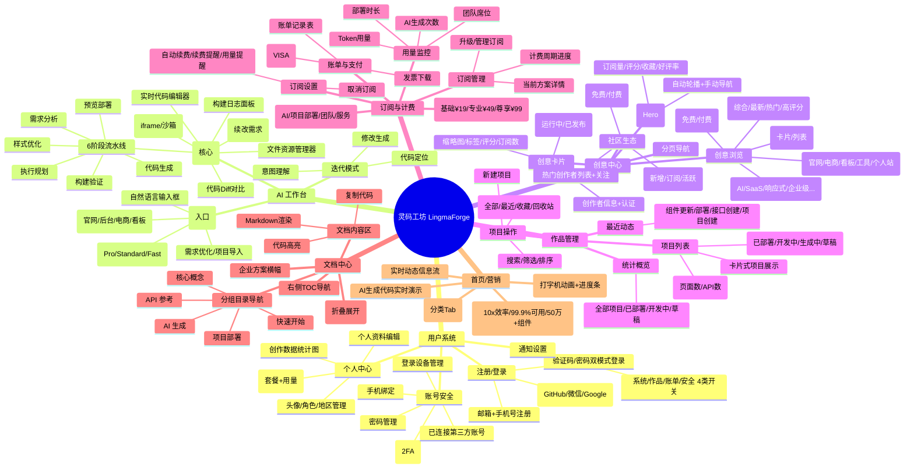
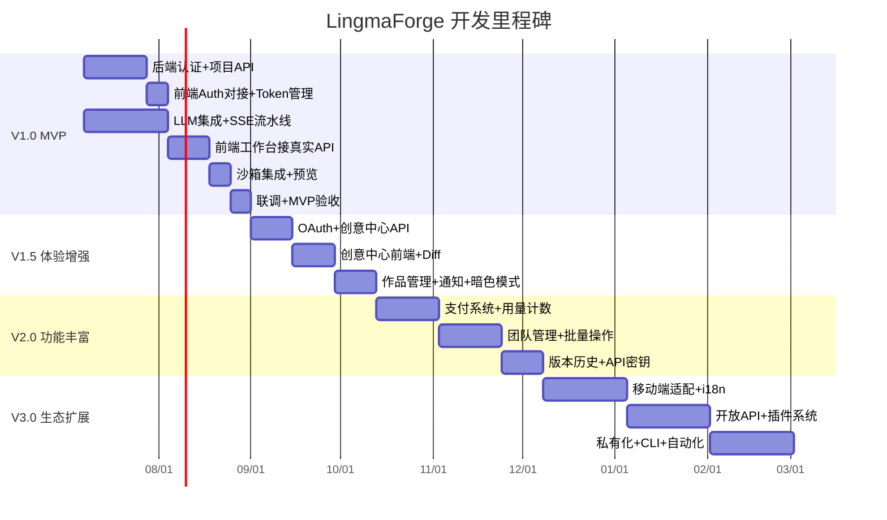

# 灵码工坊 LingmaForge — 项目需求迭代文档

> **项目定位**：企业级 AI 应用生成平台 — 用户通过自然语言对话，一键生成前端应用，预览、编辑代码、部署上线，全流程闭环。
> **技术栈**：Vue 3 + TypeScript + Pinia + Vue Router（前端）/ Spring Boot + Maven（后端）
> **文档基于**：对现有 9 个页面原型的逆向分析 + 代码库完整审计

---

## 一、功能全景图（MindMap）

---

## 二、功能详细说明

### 2.1 用户系统

| 功能模块 | 子功能 | 用户角色 | 功能描述 | 业务价值 | 依赖条件 | 当前状态 |
|---------|--------|---------|---------|---------|---------|---------|
| 注册/登录 | 邮箱/手机号注册 | 游客 | 输入邮箱或手机号完成注册 | 用户增长入口 | 短信/邮件服务 | ⚠️ 仅UI |
| 注册/登录 | 验证码登录 | 已注册用户 | 6位短信验证码快捷登录 | 降低登录摩擦 | 短信网关API | ⚠️ 仅UI |
| 注册/登录 | 密码登录 | 已注册用户 | 邮箱/手机+密码组合登录 | 传统登录方式 | 密码加密存储 | ⚠️ 仅UI |
| 注册/登录 | OAuth登录 | 游客/用户 | GitHub/微信/Google一键登录 | 降低注册成本 | 第三方OAuth配置 | ⚠️ 仅UI |
| 个人中心 | 个人资料编辑 | 登录用户 | 修改用户名、邮箱、简介、角色、地区 | 用户画像完善 | 用户API | ⚠️ 仅UI |
| 个人中心 | 账户概览 | 登录用户 | 展示当前套餐、续费日、支付方式、用量进度 | 用户留存与增购 | 订阅系统 | ⚠️ 仅UI |
| 个人中心 | 创作数据 | 登录用户 | 7天趋势图展示AI生成/新增作品/阅读/收藏 | 创作者激励 | 数据统计服务 | ⚠️ 仅UI |
| 账号安全 | 双重验证(2FA) | 登录用户 | 启用TOTP或短信二次验证 | 账号安全保障 | TOTP库 | ⚠️ 仅UI |
| 账号安全 | 登录设备管理 | 登录用户 | 查看/登出已登录设备列表 | 安全审计 | Session管理 | ⚠️ 仅UI |
| 通知设置 | 4类通知开关 | 登录用户 | 系统/作品/账单/安全通知独立开关 | 减少干扰 | 通知服务 | ⚠️ 仅UI |

### 2.2 AI 工作台（核心模块）

| 功能模块 | 子功能 | 用户角色 | 功能描述 | 业务价值 | 依赖条件 | 当前状态 |
|---------|--------|---------|---------|---------|---------|---------|
| 简洁模式 | 自然语言输入 | 登录用户 | 用户描述需求，一键触发AI生成 | **核心价值主张** | LLM API | ✅ UI + Mock |
| 简洁模式 | 模板快捷选择 | 登录用户 | 4类模板(官网/后台/电商/看板)预填提示词 | 降低使用门槛 | 模板数据 | ✅ UI + Mock |
| 简洁模式 | 模型切换 | 登录用户 | Pro/Standard/Fast 三档模型选择 | 差异化体验 | 多模型后端 | ✅ UI + Mock |
| 生成模式 | 6阶段流水线 | 登录用户 | 需求分析→执行规划→代码生成→样式优化→构建→部署 | 生成过程透明化 | SSE流式传输 | ✅ UI + Mock |
| 生成模式 | 实时代码编辑器 | 登录用户 | 展示/编辑AI生成的代码文件 | 用户可二次修改 | Monaco Editor | ✅ UI + Mock |
| 生成模式 | 文件资源管理器 | 登录用户 | 树形展示项目文件结构，点击切换文件 | 项目结构可视化 | 文件树组件 | ✅ UI + Mock |
| 生成模式 | 代码Diff对比 | 登录用户 | 对比迭代前后代码差异 | 变更可追溯 | Diff算法 | ✅ UI + Mock |
| 生成模式 | 实时预览 | 登录用户 | iframe沙箱内实时预览生成的应用 | 所见即所得 | WebContainer/沙箱 | ✅ UI + Mock |
| 生成模式 | 对话式迭代 | 登录用户 | 在生成结果基础上，通过对话继续修改 | 迭代式开发 | LLM + 上下文管理 | ✅ UI + Mock |
| 生成模式 | 构建日志 | 登录用户 | 展示构建过程的控制台输出 | 调试定位 | 日志流转发 | ✅ UI + Mock |

### 2.3 创意中心

| 功能模块 | 子功能 | 用户角色 | 功能描述 | 业务价值 | 依赖条件 | 当前状态 |
|---------|--------|---------|---------|---------|---------|---------|
| 创意浏览 | 分类筛选 | 所有用户 | 按官网/电商/看板/工具/个人站筛选 | 精准发现 | 分类标签系统 | ⚠️ 仅UI |
| 创意浏览 | 标签云 | 所有用户 | AI/SaaS/响应式等多维度标签 | 多路径探索 | 标签数据 | ⚠️ 仅UI |
| 创意浏览 | 价格筛选 | 所有用户 | 免费/付费(Pro)筛选 | 变现分层 | 定价系统 | ⚠️ 仅UI |
| 精选轮播 | Hero轮播 | 所有用户 | 4张精选创意自动轮播+手动导航 | 内容运营推荐 | 运营后台 | ✅ UI完成 |
| 社区生态 | 热门创作者 | 所有用户 | 创作者列表+关注按钮 | UGC生态激励 | 用户关系链 | ⚠️ 仅UI |
| 社区生态 | 创意趋势 | 所有用户 | 7天趋势图(新增/订阅/活跃) | 平台活跃度展示 | 统计服务 | ⚠️ 仅UI |
| 创意操作 | 订阅/克隆 | 登录用户 | 订阅创意或克隆为自己的项目 | 内容复用+变现 | 项目Fork系统 | ⚠️ 仅UI |

### 2.4 作品管理

| 功能模块 | 子功能 | 用户角色 | 功能描述 | 业务价值 | 依赖条件 | 当前状态 |
|---------|--------|---------|---------|---------|---------|---------|
| 项目列表 | 卡片式展示 | 登录用户 | 项目缩略图+状态+标签+统计 | 项目全貌一览 | 项目CRUD API | ⚠️ 仅UI |
| 项目操作 | 新建项目 | 登录用户 | 创建空白或模板项目 | 创作入口 | 项目API | ⚠️ 仅UI |
| 项目操作 | 搜索筛选排序 | 登录用户 | 按名称/类型/关键词搜索，多维排序 | 高效检索 | 全文搜索 | ⚠️ 仅UI |
| 项目操作 | 作品发布 | 登录用户 | 一键将项目发布为创意模板，支持设置名称、标签、价格 | 促进创意变现与分享，丰富社区生态 | 创意中心对接 | ⚠️ 仅UI |
| 最近动态 | 活动时间线 | 登录用户 | 组件更新/部署/接口创建等操作记录 | 操作可追溯 | 活动日志系统 | ⚠️ 仅UI |

### 2.5 订阅与计费

| 功能模块 | 子功能 | 用户角色 | 功能描述 | 业务价值 | 依赖条件 | 当前状态 |
|---------|--------|---------|---------|---------|---------|---------|
| 套餐选择 | 3档定价 | 所有用户 | 基础¥19/专业¥49/尊享¥99 按月/年 | 营收分层 | 支付网关 | ✅ UI完成 |
| 功能对比 | 对比表 | 所有用户 | AI/项目/团队/服务 4维度对比 | 辅助决策 | 无 | ✅ UI完成 |
| 用量监控 | 4项指标 | 订阅用户 | AI次数/Token/部署时长/团队席位 | 成本透明 | 用量计数服务 | ⚠️ 仅UI |
| 账单支付 | 账单记录 | 订阅用户 | 历史账单列表+发票下载 | 财务合规 | 账单系统 | ⚠️ 仅UI |
| 支付方式 | 银行卡管理 | 订阅用户 | VISA/微信/支付宝管理 | 支付闭环 | 支付网关 | ⚠️ 仅UI |

### 2.6 文档中心

| 功能模块 | 子功能 | 用户角色 | 功能描述 | 业务价值 | 依赖条件 | 当前状态 |
|---------|--------|---------|---------|---------|---------|---------|
| 文档导航 | 分组目录 | 所有用户 | 5大分组(快速开始/核心/AI/部署/API)可折叠 | 文档可发现性 | CMS/Markdown | ✅ UI完成 |
| 文档阅读 | 内容渲染 | 所有用户 | Markdown渲染+代码高亮+复制按钮 | 开发者体验 | Markdown解析器 | ✅ UI完成 |
| FAQ | 折叠问答 | 所有用户 | 常见问题手风琴展开 | 自助答疑 | 无 | ✅ UI完成 |

---

## 三、版本迭代规划

### V1.0 — MVP 最小可行产品（预计 6~8 周）

**版本目标**：核心「对话 → 生成 → 预览」流程跑通，用户可注册登录并完成一次完整的 AI 应用生成体验。

#### 包含功能（优先级高→低）

| 优先级 | 功能 | 说明 |
|-------|------|------|
| P0 | 注册/登录（邮箱+验证码） | 最小化认证闭环，暂不接OAuth |
| P0 | 工作台简洁模式 | 自然语言输入 + 模板选择 + 模型选择 |
| P0 | 工作台生成模式（6阶段流水线） | 接入真实LLM API，SSE流式返回 |
| P0 | 代码编辑器 + 文件树 | 集成Monaco Editor，支持查看/编辑生成代码 |
| P0 | 实时预览（沙箱） | WebContainer/iframe 沙箱运行生成代码 |
| P1 | 对话式迭代 | 在已生成项目上继续修改 |
| P1 | 首页（营销落地页） | 保持现有Hero动效，跳转工作台 |
| P1 | 项目持久化（基础CRUD） | 项目保存到数据库，用户可查看历史项目 |
| P2 | 基础个人中心 | 个人资料查看/编辑 |

#### 技术实现要点

| 层面 | 方案 |
|------|------|
| 前端框架 | Vue 3 + TypeScript + Vite（已搭建） |
| 状态管理 | Pinia — `workbench.ts` 已建立核心状态机，需替换Mock为真实SSE |
| 路由 | Vue Router — 现有路由结构合理，无需调整 |
| API层 | `api/request.ts` 已封装统一请求，需补充 Auth API + 错误拦截 + Token刷新 |
| 代码编辑器 | 集成 `@monaco-editor/vue` 或 `monaco-editor` |
| 沙箱方案 | 优先 WebContainer API（@webcontainer/api），降级为 iframe + srcdoc |
| SSE流式 | `EventSource` 或 `fetch + ReadableStream` 接收生成流水线事件 |
| 后端 | Spring Boot — 补充 User/Auth/Project/Generation 四个核心 Controller |
| 数据库 | MySQL/PostgreSQL — 用户表、项目表、生成记录表 |
| 认证 | JWT + Refresh Token 方案 |

#### 验收标准

- [ ] 新用户可完成注册 → 登录 → 输入需求 → 看到6阶段流水线进度 → 查看生成代码 → 预览应用 → 保存项目
- [ ] 流水线总耗时 < 60s（简单应用）
- [ ] 代码编辑器支持 Vue/JS/CSS/HTML 语法高亮
- [ ] 预览沙箱可正确渲染生成的单页应用
- [ ] 单次对话迭代可在已有项目上新增/修改组件

---

### V1.5 — 体验增强（预计 4~6 周）

**版本目标**：交互打磨、数据可视化、性能优化，用户体验从"能用"提升到"好用"。

#### 包含功能（优先级高→低）

| 优先级 | 功能 | 说明 |
|-------|------|------|
| P0 | OAuth登录（GitHub + 微信） | 降低注册摩擦，优先接GitHub |
| P0 | 代码Diff对比 | 迭代修改前后高亮差异 |
| P0 | 构建日志面板 | 实时展示构建输出，支持错误定位 |
| P1 | 创意中心（浏览+筛选） | 分类/标签/排序/分页真实数据 |
| P1 | 创意订阅/克隆 | 一键Fork他人创意为自己的项目 |
| P1 | 作品管理（完整CRUD） | 项目搜索/筛选/排序/删除/回收站 |
| P1 | 个人中心完善 | 创作数据图表、账户概览、安全设置 |
| P2 | 通知系统（站内） | 系统/作品/账单/安全 4类站内通知 |
| P2 | 响应式适配 | Tablet断点适配（≥768px） |
| P2 | 暗色模式 | 全局暗色主题切换 |

#### 技术实现要点

| 层面 | 方案 |
|------|------|
| OAuth | `passport-github2` + 微信开放平台回调 → 后端中转 |
| Diff | `monaco-editor` 内置 DiffEditor 组件 |
| 图表 | ECharts 或 Chart.js — 个人中心+订阅用量+创意趋势 |
| 通知 | WebSocket 推送 + Pinia 通知 Store |
| 暗色模式 | CSS 变量（`global.css` 已有设计令牌基础）+ `prefers-color-scheme` |
| 性能 | 路由级代码分割（已有懒加载）+ 图片懒加载 + 虚拟滚动（创意列表） |

#### 验收标准

- [ ] GitHub OAuth 完整流程 < 5s
- [ ] Diff 对比可清晰展示增/删/改行
- [ ] 创意中心可按分类、标签、价格筛选，结果准确率 100%
- [ ] 作品列表支持关键词搜索，响应 < 200ms
- [ ] Lighthouse Performance 得分 ≥ 85

---

### V2.0 — 功能丰富（预计 6~8 周）

**版本目标**：订阅付费闭环、团队协作基础、高级项目管理。

#### 包含功能（优先级高→低）

| 优先级 | 功能 | 说明 |
|-------|------|------|
| P0 | 订阅套餐购买 | 3档套餐 + 微信/支付宝支付 |
| P0 | 用量监控 | AI次数/Token/部署时长/席位 实时统计 |
| P0 | 账单与发票 | 历史账单列表 + PDF发票下载 |
| P1 | 多模板系统 | 管理后台可配置创意模板 |
| P1 | 创意发布 | 用户可将项目发布为创意供他人订阅 |
| P1 | 团队管理（基础） | 邀请成员、角色分配（管理员/编辑/查看） |
| P1 | 项目批量操作 | 批量删除/归档/导出 |
| P2 | 项目版本历史 | Git式提交记录，支持回滚 |
| P2 | API密钥管理 | 用户可生成API Key调用开放接口 |
| P2 | Google OAuth | 补充第三方登录渠道 |

#### 技术实现要点

| 层面 | 方案 |
|------|------|
| 支付 | 微信Native支付 + 支付宝当面付 → 后端回调确认 |
| 用量计数 | Redis 原子计数 + 定时同步MySQL |
| 发票 | PDF生成库（iText / Puppeteer） |
| 团队 | RBAC 权限模型 — 组织→团队→角色→权限 |
| 批量操作 | 前端 Checkbox多选 + 后端批量API |
| 版本历史 | 项目快照存储（JSON Diff / Git仓库） |

#### 验收标准

- [ ] 用户可完成 选择套餐 → 扫码支付 → 自动开通 → 用量生效 全流程
- [ ] 用量统计精度 ≥ 99%，延迟 < 5s
- [ ] 团队成员权限隔离正确（编辑者无法删除项目）
- [ ] 批量操作支持同时处理 ≥ 50 个项目

---

### V3.0 — 生态扩展（预计 8~12 周）

**版本目标**：开放生态、移动端适配、自动化能力，从工具走向平台。

#### 包含功能（优先级高→低）

| 优先级 | 功能 | 说明 |
|-------|------|------|
| P0 | 移动端适配 | 全站 Mobile-First 响应式重构 |
| P0 | 开放API | RESTful API + Webhook + SDK |
| P1 | 自动化规则 | 定时构建/条件部署/告警规则 |
| P1 | 插件系统 | 支持自定义组件库/样式包/提示词库 |
| P1 | 多语言(i18n) | 中文/英文/日文切换 |
| P2 | 私有化部署 | Docker镜像 + Helm Chart |
| P2 | CLI工具 | 命令行创建/部署/管理项目 |
| P2 | AI对话历史 | 完整对话上下文持久化 + 搜索 |
| P2 | 创意市场评论 | 创意作品评分 + 评论系统 |
| P3 | 数据分析看板（运营） | 平台级DAU/MAU/转化漏斗 |
| P3 | 企业SSO/SAML | 企业级统一身份认证 |

#### 技术实现要点

| 层面 | 方案 |
|------|------|
| 移动端 | CSS Container Queries + 触控交互适配 + PWA |
| 开放API | OpenAPI 3.0规范 + Rate Limiting + API Gateway |
| 自动化 | 定时任务调度（Quartz/Spring Scheduler）+ 规则引擎 |
| 插件 | 动态加载 ESM 模块 + 插件注册表 |
| i18n | `vue-i18n` + 语言包按需加载 |
| 私有化 | Docker多阶段构建 + docker-compose + K8s Helm |
| CLI | Node.js CLI（Commander.js）+ REST API |

#### 验收标准

- [ ] 移动端 Lighthouse 得分 ≥ 90
- [ ] 开放API响应 P99 < 500ms
- [ ] 自动化规则可在无人值守下完成构建+部署
- [ ] 插件系统支持热加载，无需重启应用
- [ ] 中英双语覆盖率 ≥ 95%

---

## 四、实施建议

### 4.1 开发顺序

> **建议策略**：前后端并行开发。后端优先产出 API 契约文档（OpenAPI Spec），前端基于 Mock 数据先行开发 UI，API 就绪后切换。现有 `api/request.ts` 已支持统一拦截，切换成本低。

### 4.2 风险点与缓解策略

| 风险 | 影响等级 | 缓解策略 |
|------|---------|---------|
| **LLM生成质量不稳定** | 🔴 高 | 建立Prompt模板库 + 多模型降级 + 人工Review兜底 |
| **沙箱安全隔离** | 🔴 高 | WebContainer API + CSP + 资源限制 + 独立域名 |
| **原型→真实数据差距大** | 🟡 中 | 现有UI全部为Mock数据，需逐页对接API，建议先跑通工作台核心链路 |
| **支付合规** | 🟡 中 | 提前申请支付资质、ICP备案、营业执照 |
| **前端状态复杂度** | 🟡 中 | `workbench.ts` 核心状态机已建立（311行），需严格遵循 reducer 模式，避免状态混乱 |
| **性能瓶颈（大量文件）** | 🟢 低 | 虚拟滚动 + Web Worker 解析 + 增量更新 |
| **需求变更频繁** | 🟡 中 | 按版本锁定范围，变更走 Change Request 流程 |

### 4.3 沟通机制

| 频率 | 活动 | 参与人 | 产出 |
|------|------|-------|------|
| 每日 | 站会 (15min) | 全员 | 昨日进展 + 今日计划 + 阻塞项 |
| 每周一 | 需求评审 (1h) | PM + 前端 + 后端 + 设计 | 本周 Sprint Backlog 确认 |
| 每周五 | 原型Review (30min) | PM + 设计 + 前端 | 下周需交付的页面原型细化确认 |
| 每两周 | Sprint Demo (1h) | 全员 + 利益相关方 | 可演示的增量版本 |
| 每月 | 技术架构Review (1h) | Tech Lead + 核心开发 | 技术债评估 + 架构改进方案 |

### 4.4 组件复用策略

> [!IMPORTANT]
> 现有代码已体现了良好的复用意识（`BaseLayout`、`TheHeader`、`TheFooter`、`icon-sprite.svg`），后续应延续并强化：

| 层面 | 策略 |
|------|------|
| **布局组件** | `BaseLayout` 已统一导航+页脚，工作台独立布局，保持不变 |
| **图标系统** | SVG Sprite 已建立（`icon-sprite.svg`），新增图标统一追加 |
| **样式体系** | `global.css` 定义设计令牌（颜色/间距/圆角），各页面CSS按模块隔离 |
| **表单组件** | 从 `ProfileView` 中抽取通用 FormInput / FormSelect / Switch 组件 |
| **卡片组件** | `cc-card`（创意卡片）已被 `CreativeView` 和 `WorksView` 共享，需正式提取 |
| **指标组件** | `metric-card` 在首页/个人中心/订阅页多次出现，需统一封装 |
| **状态标签** | 各处 badge/status 样式不统一，需建立 Badge 组件规范 |

---

## 五、当前代码库审计总结

> [!NOTE]
> 以下为对现有代码库现状的客观评估，帮助团队明确起点。

### 已完成的工作（资产）

| 资产 | 详情 |
|------|------|
| **9个页面UI** | Home / Auth / Creative / Workbench(Simple+Generation) / Profile / Works / Pricing / Subscription / Doc |
| **路由系统** | [index.ts](file:///d:/Develop/Code_github/LingmaForge/lingmaForge-frontend/src/router/index.ts) — 共享布局 + 独立页面分离 |
| **状态管理** | [workbench.ts](file:///d:/Develop/Code_github/LingmaForge/lingmaForge-frontend/src/stores/workbench.ts) — 311行完整的工作台状态机（含Mock流水线） |
| **API层** | [request.ts](file:///d:/Develop/Code_github/LingmaForge/lingmaForge-frontend/src/api/request.ts) — 统一HTTP请求封装 |
| **类型系统** | `types/` 下已定义 chat / generation / project / sandbox 类型 |
| **设计系统** | `global.css` + 各页面独立CSS，设计令牌体系基本建立 |
| **后端骨架** | Spring Boot + Maven 项目已初始化 |

### 待完成的工作（详细开发任务清单）

针对目前代码库“仅有UI和静态Mock数据”的现状，以下是开发团队需要实现的完整功能清单（按模块划分）：

#### 1. 用户与认证系统 (User & Auth)
- [ ] **用户注册/登录 API**：支持邮箱/手机号注册，验证码获取及校验，密码安全存储（盐值加密）。
- [ ] **OAuth 登录**：对接 GitHub 登录接口，处理第三方回调、自动创建用户及绑定。
- [ ] **JWT 认证机制**：前端存储 Access Token 和 Refresh Token，请求拦截器实现自动刷新与 401 路由守卫拦截。
- [ ] **账号安全管理**：开发双重验证（2FA）配置接口、绑定手机更换接口、已登录设备查询与下线管理。
- [ ] **个人资料与用量看板**：开发个人信息编辑接口，并对接后端用量限额接口实现统计图表数据动态加载。

#### 2. AI 工作台核心 (AI Workbench)
- [ ] **真实 SSE 管道对接**：重构 `workbench.ts` 中的 `startMockPipeline`，使用 EventSource 替换 `setTimeout` 模拟，对接后端大模型代码生成流。
- [ ] **代码版本与持久化**：开发 Monaco 编辑器代码修改的保存与版本历史记录接口，文件管理器（添加、重命名、删除文件）的后端持久化。
- [ ] **WebContainer 沙箱集成**：在前端 iframe 预览区域集成 `@webcontainer/api`，能读取当前文件树并执行 `npm run dev`，实现动态预览。
- [ ] **对话式迭代修改**：实现增量 prompt 解析，能将用户的对话请求转换为精确的代码补丁（Patches）进行热更新。
- [ ] **构建日志捕获**：流式转发后端构建（Vite / Webpack）的控制台日志。

#### 3. 创意中心与社区 (Creative Center)
- [ ] **创意市场过滤与搜索**：对接后端接口，根据分类、标签、付费方案进行动态 SQL 检索，实现最新/最热排序与分页。
- [ ] **作品订阅与 Fork**：实现“克隆创意”按钮后端逻辑，在后端完整复制对应的模板项目结构到当前用户的工作空间。
- [ ] **作者关系链与关注**：开发创作者主页关注、本周上新、新增趋势分析的后端 API。

#### 4. 作品与项目管理 (Works Management)
- [ ] **项目基础 CRUD**：新建项目模板初始化、删除项目并移入回收站、还原或彻底删除项目。
- [ ] **项目检索与动态**：项目列表中按照名称和标签搜索，获取项目 API 数量、页面数量等实时统计，以及项目的历史活动操作日志。

#### 5. 订阅与计费系统 (Billing & Subscriptions)
- [ ] **实时用量计量**：统计 AI 生成次数、Token 用量、部署服务时长，并接入 Redis 保证并发计数准确性。
- [ ] **支付网关集成**：对接微信/支付宝/Stripe 支付回调，支持扫码支付与订单状态监听。
- [ ] **发票与账单明细**：后台自动生成发票 PDF 提供下载，并显示每月的计费清单。

#### 6. 后端底座与工程化 (Backend Infrastructure)
- [ ] **Spring Boot 核心架构**：编写 Controller, Service, Mapper(DAO) 层核心逻辑，搭建通用权限认证框架。
- [ ] **项目自动化测试**：补充前端组件/组件商店单元测试，后端核心生成流程的集成测试。
- [ ] **部署托管平台**：搭建静态应用部署服务，使用 Docker / 静态托管平台将生成的前端产物一键部署到云端，分配二级预览域名。
