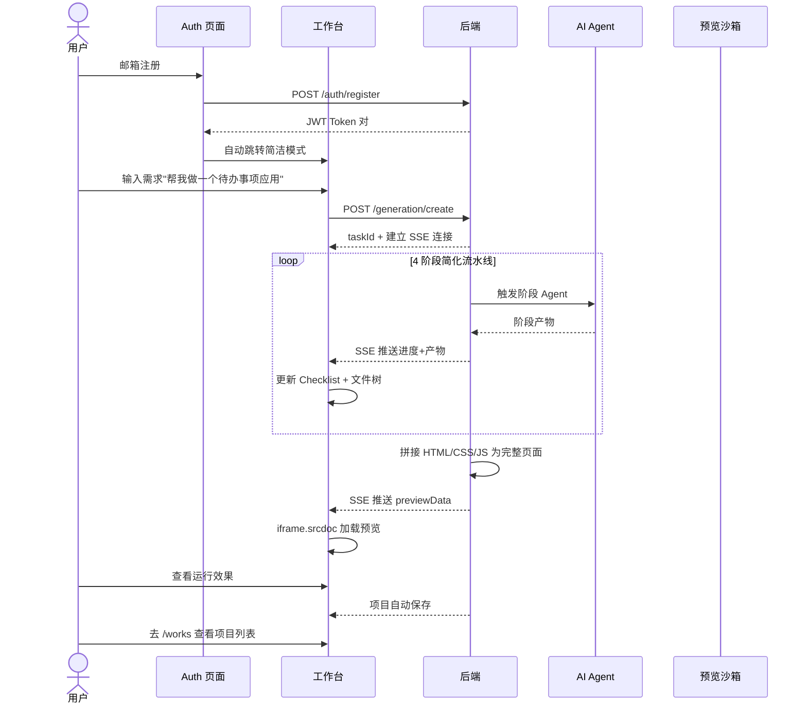
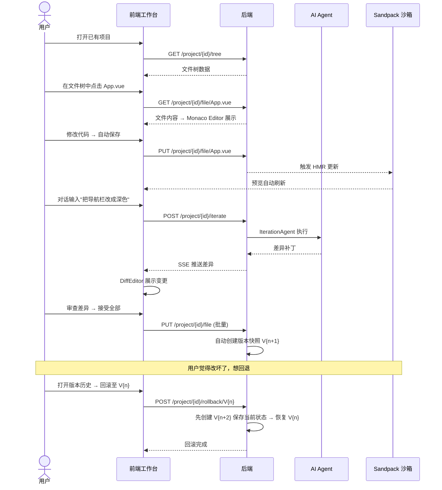
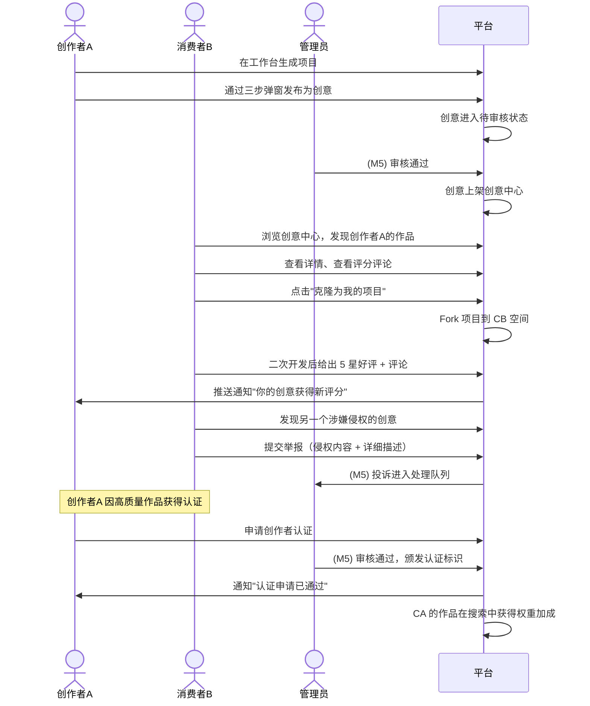
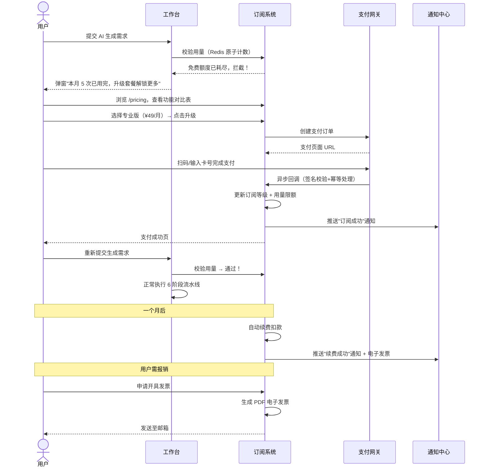
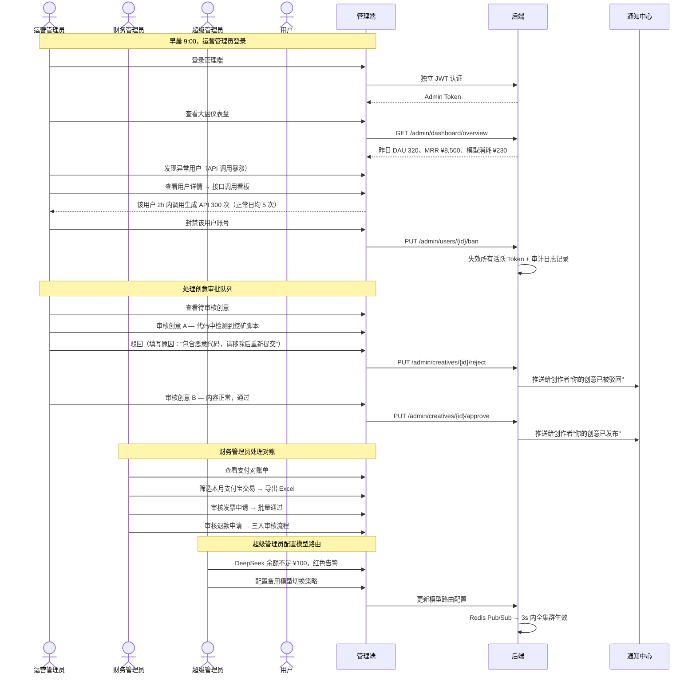
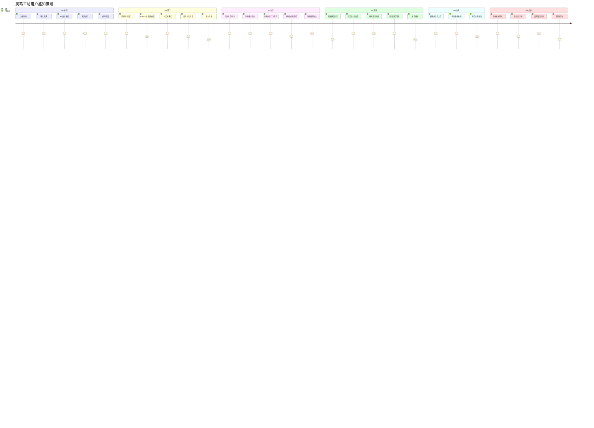
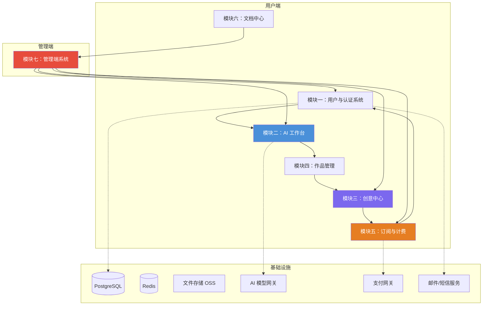
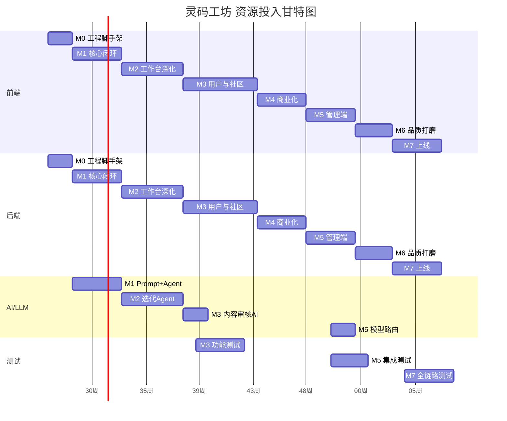

# 灵码工坊 LingmaForge — 项目迭代路线图

> **文档版本**：V1.2（技术架构同步版）  
> **创建日期**：2026-06-29  
> **最后修订**：2026-06-29（基于实际代码库审计同步技术架构层）  
> **文档性质**：全生命周期迭代规划——面向开发、测试、产品、运营全体团队  
> **对应需求文档**：《项目页面需求全景功能文档》V1.0

---

## 目录

1. [项目总览与战略目标](#一项目总览与战略目标)
2. [总体里程碑规划](#二总体里程碑规划)
3. [M0：工程化基础设施](#三m0工程化基础设施)
4. [M1：核心闭环 MVP——"一句话生成应用"](#四m1核心闭环-mvp一句话生成应用)
5. [M2：工作台深化——"专业级在线 IDE"](#五m2工作台深化专业级在线-ide)
6. [M3：用户与内容生态——"从工具到社区"](#六m3用户与内容生态从工具到社区)
7. [M4：商业化——"从免费到付费"](#七m4商业化从免费到付费)
8. [M5：管理端与治理——"看见并掌控全局"](#八m5管理端与治理看见并掌控全局)
9. [M6：体验与品质——"打磨每一个像素"](#九m6体验与品质打磨每一个像素)
10. [M7：上线与持续运营](#十m7上线与持续运营)
11. [里程碑总览图](#十一里程碑总览图)
12. [风险与应对策略](#十二风险与应对策略)
13. [团队与资源建议](#十三团队与资源建议)

---

## 一、项目总览与战略目标

### 1.1 项目定义

灵码工坊（LingmaForge）是一款 **AI 驱动的在线应用生成平台**。用户通过自然语言描述需求，平台自动完成需求分析、架构规划、代码生成、样式优化、构建验证和预览部署的完整流水线，最终交付一个可运行的前端应用。在此基础上，平台围绕"创作—分享—消费—变现"构建了完整的 UGC 社区生态和订阅计费体系。

**核心对标**：Bolt.new / v0.dev / Lovable，差异化在于面向中文开发者的全链路本土化体验 + UGC 社区 + 完整的商业化闭环。

### 1.2 战略目标

| 阶段 | 目标 | 成功指标 |
|------|------|----------|
| **M0-M2（种子期）** | 完成核心闭环，验证"AI 生成应用"的可行性 | 内部团队可在 3 分钟内从一句话描述到可运行应用 |
| **M3-M4（成长期）** | 构建用户体系和商业化，验证付费意愿 | DAU 500+、付费转化率 ≥ 5% |
| **M5-M6（成熟期）** | 完善治理体系，打磨体验，准备规模化 | 月流水 ¥50K+、NPS ≥ 50 |
| **M7+（规模期）** | 正式上线，持续运营和迭代 | MAU 10,000+、MRR ¥100K+ |

### 1.3 技术底座

```
前端：Vue 3.5 + Vite 8 + TypeScript 6.0 + Pinia 3.0 + Vue Router 5.1 +Naive UI
      CSS 设计令牌体系（全局 var() 变量） + 分页手写 CSS（无 Tailwind）
      HTTP：fetch 原生封装（request()）+ SSE：EventSource 客户端
      预览：M1 iframe+srcdoc → M2+ Sandpack 自托管（待引入）
      编辑器：M1 textarea → M2 Monaco Editor（待引入）

后端：Spring Boot 3.5.7 + Java 21
      ORM：MyBatis-Plus 3.5.15（非 JPA）
      数据库：H2（本地/开发）+ MySQL（生产）；schema.sql 初始化（非 Flyway）
      缓存：待引入 Redis（当前无）
      AI：LangChain4j 1.16.2 + LangGraph4j 1.8.19
          多模型路由（AgentFactory + AiServices）+ 分 Agent PromptTemplate
          6 节点 StateGraph 流水线 + 条件路由（构建失败回退）

沙箱：ProcessBuilder 本地进程执行 npm install/build（M1-M2）
      M3+ 迁移至独立 Docker 容器（待实现）

通信：SSE（SseEmitter，named events：message/file/log/complete/error）+ RESTful API
```

### 1.3.1 当前技术架构详解

以下是基于实际代码库审计的完整技术架构说明，供开发团队参考。

**前端架构层**：

| 层 | 技术选型 | 说明 |
|----|----------|------|
| 构建 | Vite 8 + vue-tsc | 路径别名 `@/` → `src/`，`VITE_API_BASE_URL` 环境变量 |
| 框架 | Vue 3.5 (Composition API) | `<script setup lang="ts">` 全量使用 |
| 路由 | Vue Router 5.1 | createWebHistory，BaseLayout 父路由 + 工作台/认证独立路由 |
| 状态管理 | Pinia 3.0 | 核心 Workbench Store 采用纯函数 reducer 模式（`generationCore.mjs`），状态不可变更新 |
| HTTP | fetch 原生封装 | `src/api/request.ts`：request<T>() 泛型，自动解析 `Result<T>` 响应体 |
| SSE | 原生 EventSource | `src/utils/sseClient.ts`：GenerationSSEClient 类，支持自动重连（最多 5 次） |
| CSS | 设计令牌 var() | `src/styles/global.css` 定义 `--ink/--soft/--paper/--line/--muted` 等令牌，按页面拆分 CSS 文件 |
| 图标 | SVG Sprite | IconSprite.vue 内联注入 + AppIcon.vue 按名引用 |
| 其他 | oxlint + ESLint + Prettier | 代码质量统一控制 |

**前端目录结构（当前实际）**：

```
src/
├── api/                   # HTTP 接口封装
│   ├── request.ts          # fetch 封装（baseURL/Result解析）
│   ├── generation.ts       # 生成/迭代 API
│   ├── project.ts          # 项目 CRUD API
│   └── sandbox.ts          # 沙箱 API
├── components/             # 公共组件
│   ├── BaseLayout.vue      # 共享导航布局（Header+Footer+RouterView）
│   ├── TheHeader.vue       # 全局顶栏
│   ├── TheFooter.vue       # 全局页脚
│   ├── AppIcon.vue         # SVG 图标
│   ├── IconSprite.vue      # SVG Sprite 注入
│   └── workbench/
│       ├── SimpleMode.vue  # 简洁模式（输入框+模板+模型选择）
│       └── GenerationMode.vue  # 生成模式（文件树+对话+预览三栏）
├── composables/
│   └── useGenerationStream.ts  # SSE 流管理 Hook
├── core/
│   ├── generationCore.d.ts     # 核心状态类型定义
│   └── generationCore.mjs.d.ts # 纯函数实现类型
├── router/
│   └── index.ts            # 路由配置（10 条路由）
├── stores/
│   └── workbench.ts        # 工作台状态管理（mock pipeline 当前）
├── styles/
│   ├── global.css          # 设计令牌 + 全局基础样式
│   └── pages/              # 分页面样式（10 个 CSS 文件）
├── types/
│   ├── index.ts            # 类型统一导出
│   ├── generation.ts       # 生成相关类型
│   ├── project.ts          # 项目相关类型
│   ├── chat.ts             # 对话相关类型
│   └── sandbox.ts          # 沙箱相关类型
├── utils/
│   └── sseClient.ts        # GenerationSSEClient 类
├── views/                  # 页面视图（9 个）
│   ├── HomeView.vue        # 首页落地页
│   ├── AuthView.vue        # 认证页（登录/注册）
│   ├── WorkbenchView.vue   # 工作台（全屏独立路由）
│   ├── WorksView.vue       # 我的作品
│   ├── CreativeView.vue    # 创意中心
│   ├── SubscriptionView.vue # 订阅管理
│   ├── PricingView.vue     # 定价页
│   ├── DocView.vue         # 文档中心
│   └── ProfileView.vue     # 个人中心
├── App.vue                 # 根组件
└── main.ts                 # 入口（createPinia + router）
```

**后端架构层**：

| 层 | 技术选型 | 说明 |
|----|----------|------|
| 框架 | Spring Boot 3.5.7 | Java 21，嵌入式 Tomcat |
| ORM | MyBatis-Plus 3.5.15 | `BaseMapper<T>` 继承，Lambda 查询，`assign_id` 主键策略 |
| DB | H2（本地）+ MySQL（生产） | 通过 `application-{profile}.yml` 切换数据源 |
| 表初始化 | `schema.sql` | `spring.sql.init.mode=always`，非 Flyway |
| LLM | LangChain4j 1.16.2 | OpenAI 协议适配（DeepSeek/Qwen/Moonshot）+ Anthropic 原生适配 |
| 工作流 | LangGraph4j 1.8.19 | StateGraph 6 节点编排 + 条件路由（构建失败回退） |
| Agent | AiServices | `@SystemMessage` + `@Tool` 注解，结构化输出 |
| 构建 | ProcessBuilder | 本地进程执行 npm install/build（待升级为 Docker 沙箱） |
| SSE | SseEmitter | named events: message / file / log / complete / error |
| API 文档 | springdoc-openapi 2.8.10 | 自动生成 Swagger UI 与 OpenAPI 3.0 文档 |
| 异步 | `@EnableAsync` + ThreadPoolTaskExecutor | 流水线异步执行，不阻塞 HTTP 线程 |

**后端目录结构（当前实际）**：

```
src/main/java/com/lingmaforge/backend/
├── LingmaForgeBackendApplication.java   # 启动类
├── admin/web/
│   └── AdminDashboardController.java    # 管理端仪表盘
├── auth/web/
│   └── AuthController.java              # 认证接口（注册/登录）
├── billing/web/
│   └── SubscriptionController.java      # 订阅接口
├── common/
│   ├── api/Result.java                 # 统一响应体 Result<T>
│   ├── exception/                      # 异常体系
│   │   ├── BusinessException.java
│   │   ├── ExceptionUtils.java
│   │   ├── GlobalExceptionHandler.java
│   │   └── ResultCode.java
│   ├── log/ControllerLogAspect.java    # 请求日志 AOP
│   ├── model/                          # 跨模块 DTO/VO（20+ 个）
│   └── web/TraceFilter.java            # 请求追踪过滤器
├── creative/web/
│   └── CreativeController.java         # 创意接口
├── doc/web/
│   └── DocController.java              # 文档接口
├── infra/
│   ├── config/                         # 配置类
│   │   ├── WebConfig.java              # CORS 配置
│   │   ├── LangChain4jConfig.java      # 多模型 ChatModel Bean
│   │   ├── LingmaModelsProperties.java # @ConfigurationProperties
│   │   ├── LingmaSandboxProperties.java
│   │   ├── MybatisPlusConfig.java
│   │   ├── AsyncConfig.java            # 自定义线程池
│   │   └── OpenApiConfig.java          # Swagger/OpenAPI
│   └── health/HealthController.java
└── workbench/
    ├── ai/
    │   ├── factory/AgentFactory.java    # Agent 创建工厂（多模型路由）
    │   ├── node/                       # 6 个流水线节点
    │   │   ├── RequirementAnalysisNode.java
    │   │   ├── ExecutionPlanningNode.java
    │   │   ├── CodeGenerationNode.java
    │   │   ├── StyleOptimizationNode.java
    │   │   ├── BuildVerificationNode.java
    │   │   └── PreviewDeployNode.java
    │   ├── observer/                   # SSE 推送基础设施
    │   │   ├── GenerationContext.java
    │   │   ├── GenerationStreamEmitter.java
    │   │   └── GenerationStreamRegistry.java
    │   ├── pipeline/
    │   │   ├── CodeGenPipeline.java    # StateGraph 编排（6节点+条件路由）
    │   │   └── CodeGenState.java       # AgentState 定义（15个Channel）
    │   ├── service/                    # AI Service 接口（@SystemMessage + @Tool）
    │   │   ├── RequirementAnalyzer.java
    │   │   ├── ExecutionPlanner.java
    │   │   ├── CodeGenAgent.java
    │   │   ├── StyleOptimizationAgent.java
    │   │   └── IterationAgent.java
    │   └── tool/                       # Tool 定义
    │       ├── FileTools.java
    │       ├── IterationTools.java
    │       └── ProjectContextTools.java
    ├── entity/                         # MyBatis-Plus Entity
    │   ├── ProjectEntity.java
    │   ├── ProjectFileEntity.java
    │   ├── GenerationTaskEntity.java
    │   └── ChatMessageEntity.java
    ├── mapper/                         # MyBatis-Plus Mapper
    │   ├── ProjectMapper.java
    │   ├── ProjectFileMapper.java
    │   ├── GenerationTaskMapper.java
    │   └── ChatMessageMapper.java
    ├── service/                        # 业务服务
    │   ├── GenerationService.java      # 生成主服务（SSE+流水线调度）
    │   ├── GenerationTaskService.java
    │   ├── ProjectService.java
    │   ├── ProjectFileService.java
    │   ├── SandboxService.java         # 沙箱服务（ProcessBuilder 构建）
    │   └── PromptTemplateLoader.java   # System Prompt 加载器
    └── web/                            # Controller
        ├── GenerationController.java
        ├── ProjectController.java
        └── SandboxController.java
```

**数据库当前表（schema.sql 实际定义）**：

| 表名 | 行数 | 核心字段 | 说明 |
|------|:----:|----------|------|
| `lf_project` | 4 列 | id/name/description/framework/status/sandbox_url | 项目主表 |
| `lf_project_file` | 6 列 | id/project_id/path/file_type/status/content/checksum | 项目文件（磁盘+DB 双写） |
| `lf_generation_task` | 8 列 | id/task_id/project_id/task_type/prompt/current_stage/status/preview_url | 生成任务记录 |
| `lf_chat_message` | 4 列 | id/project_id/task_id/role/content | 对话历史 |

> **说明**：M0 阶段当前仅有 4 张工作台核心表。路线图 M0 §3.1 规划的 25 张完整表将在 M1-M5 各里程碑中随功能开发逐步建表（通过新增 schema-{milestone}.sql 增量脚本）。

**AI 流水线当前状态**：
- StateGraph 已编译完整的 6 节点 → 6 边 + 1 条件路由
- 条件路由：构建成功 → 预览部署；构建失败且未超上限(2次) → 回退代码生成；超上限 → error_end
- AgentFactory 支持按 Agent 名称路由到不同 ChatModel（便宜模型做分析、贵模型写代码）
- 当前配置：需求分析/执行规划/样式优化 → deepseek-flash；代码生成/迭代修改 → deepseek-pro
- 备选模型已配置：qwen-coder、qwen-plus、kimi-code（未设置 api-key 则自动跳过）
- Prompt 模板通过 PromptTemplateLoader 从 `resources/prompts/` 目录按名称加载

### 1.4 核心设计原则

1. **核心闭环优先**：AI 工作台是平台的命脉，每次迭代必须保证"一句话→可运行应用"的路径完整可用
2. **每个里程碑可演示**：不追求模块内部完整，但追求端到端可感知
3. **先 Fake 后 Real**：先用 mock 数据/简单实现跑通流程并验证假设，再逐层替换为真实实现
4. **支撑页面不提前做**：定价页、文档中心等支撑性页面在对应功能需要时才开发，不过早投入资源
5. **数据安全第一**：所有涉及支付、用户隐私、认证安全的模块必须优先考虑合规性

---

## 二、总体里程碑规划

### 2.1 里程碑一览

| 里程碑 | 代号 | 周期 | 核心交付 | 状态 |
|--------|------|------|----------|------|
| **M0** | 地基 | 第 1-2 周 | 工程脚手架、数据库 schema、CI/CD、Auth 骨架 | 🔲 |
| **M1** | 初见 | 第 3-6 周 | 简洁模式 + 4 阶段流水线 + iframe 预览 + 项目 CRUD（含收藏/导出）+ 简化注册登录 | 🔲 |
| **M2** | 精工 | 第 7-11 周 | Monaco 编辑器 + 文件树 + 对话迭代 + Diff + 构建日志 + 版本历史 | 🔲 |
| **M3** | 社区 | 第 12-17 周 | 创意中心全套（浏览/详情/评分/评论/举报/发布）、用户中心全套、创作者认证 | 🔲 |
| **M4** | 变现 | 第 18-21 周 | 三级套餐 + 订阅管理 + 用量监控 + 支付 + 账单发票 | 🔲 |
| **M5** | 治理 | 第 22-25 周 | 管理端全套（大盘/用户/审批/财务/模型调度/文档管理）+ 管理员认证权限 | 🔲 |
| **M6** | 品质 | 第 26-28 周 | 暗色模式、i18n 三语言、首页落地页、客服工单对接、性能优化、安全加固 | 🔲 |
| **M7** | 启航 | 第 29-32 周 | 集成测试、灰度发布、正式上线、文档补齐、运营准备 | 🔲 |

### 2.2 整体架构演进

```mermaid
graph LR
    subgraph M0["M0 地基"]
        A0[工程脚手架]
        B0[数据库 schema]
        C0[CI/CD]
    end
    
    subgraph M1["M1 初见"]
        A1[简洁模式]
        B1[4阶段流水线]
        C1[SSE 进度]
        D1[iframe+srcdoc]
        E1[项目CRUD+收藏+导出]
    end
    
    subgraph M2["M2 精工"]
        A2[Monaco 编辑器]
        B2[文件资源管理器]
        C2[对话式迭代]
        D2[代码差异对比]
        E2[构建日志面板]
        F2[版本历史]
        G2[6阶段流水线+Sandpack]
    end
    
    subgraph M3["M3 社区"]
        A3[创意中心]
        B3[用户中心]
        C3[评分评论]
        D3[消息通知]
    end
    
    subgraph M4["M4 变现"]
        A4[三级套餐]
        B4[订阅管理]
        C4[支付系统]
        D4[用量监控]
    end
    
    subgraph M5["M5 治理"]
        A5[管理端大盘]
        B5[用户运营]
        C5[内容审批]
        D5[财务审批]
    end
    
    subgraph M6["M6 品质"]
        A6[暗色模式]
        B6[多语言]
        C6[首页落地页]
        D6[性能优化]
    end

    M0 --> M1 --> M2 --> M3 --> M4 --> M5 --> M6
```



### 2.3 各版本功能闭环交付

在深入每个里程碑之前，我们先明确每个版本完成后，用户可以完成的端到端闭环：

```mermaid
graph TB
    subgraph M1闭环["M1 闭环：生成即所得"]
        C11[注册/登录] --> C12[输入自然语言需求] --> C13[观察 4 阶段流水线] --> C14[iframe 实时预览] --> C15[保存到项目列表（含收藏/导出）]
    end

    subgraph M2闭环["M2 闭环：迭代即精修"]
        C21[打开已生成项目] --> C22[文件树定位] --> C23[Monaco 编辑器修改] --> C24[对话式迭代修改] --> C25[Diff 审查变更] --> C26[接受变更 + 版本快照]
    end

    subgraph M3闭环["M3 闭环：创作即分享"]
        C31[浏览创意市场] --> C32[评分评论互动] --> C33[克隆心仪创意] --> C34[二次创作] --> C35[发布为自己的创意] --> C36[消息通知触达]
    end

    subgraph M4闭环["M4 闭环：使用即付费"]
        C41[免费额度耗尽] --> C42[浏览套餐对比] --> C43[选择套餐扫码支付] --> C44[额度自动扩充] --> C45[用量实时监控] --> C46[账单发票管理]
    end

    subgraph M5闭环["M5 闭环：运营即掌控"]
        C51[大盘数据监控] --> C52[用户问题处理] --> C53[创意内容审核] --> C54[模型成本调控] --> C55[财务对账退款]
    end
```



### 2.4 里程碑评审门禁

每个里程碑完成后，在进入下一里程碑前，必须通过以下评审门禁（Go/No-Go Gate）：

| 门禁节点 | 评审内容 | 评审人 | 通过标准 |
|----------|----------|--------|----------|
| **M0 → M1** | 工程脚手架可用性、数据库 schema 完整性、CI/CD 流水线稳定性 | Tech Lead + DevOps | `docker-compose up` 一键启动全栈环境；Flyway 全部迁移成功；CI 全绿 |
| **M1 → M2** | 核心闭环可演示、4 阶段流水线成功率、SSE 稳定性 | 产品经理 + Tech Lead | 内部团队可完成"注册→生成→预览→保存"完整路径；连续 10 次生成成功率 ≥ 80% |
| **M2 → M3** | 工作台 IDE 体验、迭代修改成功率、Sandpack 预览稳定性 | 产品经理 + UI/UX | Monaco Editor 9 种语言高亮正确；3 轮对话迭代生成成功率 ≥ 70%；HMR 延迟 < 2s |
| **M3 → M4** | 用户体系完整性、创意中心 UGC 闭环、通知触达正确性 | 产品经理 + 运营 | OAuth 三通道可用；创意发布→审批→浏览→克隆闭环可走通；通知 WebSocket 推送正确 |
| **M4 → M5** | 商业化闭环、支付安全性、用量监控准确性 | 产品经理 + 财务 | 支付端到端跑通（含回调幂等）；用量计数与 Redis 一致；PCI-DSS 合规确认 |
| **M5 → M6** | 管理端功能完整性、审批流正确性、审计日志可追溯性 | 产品经理 + 运营 + 财务 | 三种角色权限正确隔离；创意审批流端到端走通；对账单 Excel 导出正确 |
| **M6 → M7** | 品质达标、性能基线、安全审计 | Tech Lead + DevOps + 安全 | Lighthouse ≥ 85；三语言覆盖率 ≥ 95%；OWASP Top 10 无高危漏洞；沙箱子域名隔离生效 |
| **M7 上线** | 灰度验证通过、监控告警就绪、应急预案就绪 | 全体 | 灰度全阶段错误率 < 0.5%；监控告警通道验证可用；备份恢复演练成功 |

---

## 三、M0：工程化基础设施

> **代号**：地基  
> **周期**：第 1-2 周（2 周）  
> **目标**：搭好台子，让后续开发不因基础设施问题而受阻  
> **交付物**：可运行的前后端项目骨架 + 数据库完整 schema + CI/CD 流水线  
> **面向角色**：前后端开发者、DevOps

### 3.1 本里程碑做什么

M0 不交付任何面向用户的业务功能，但它是所有后续工作的前提。我们在这个阶段需要完成以下四个基础板块的建设：

**前端工程化**方面，用 Vite 创建 Vue 3 + TypeScript 项目，配置好 Pinia 状态管理、Vue Router 路由、Axios 请求封装（拦截器统一处理 JWT Token 注入和 401 响应跳转）。同时引入 Tailwind CSS 作为原子化样式方案，定义好 CSS 设计令牌（颜色、间距、字体、阴影等），为后续的暗色模式预留 `var()` 变量体系。工程层面配置 ESLint + Prettier，确保团队代码风格一致；引入 Husky + lint-staged 做提交前检查。

**后端工程化**方面，基于现有 Spring Boot 3.5.7 项目骨架，已配置 MyBatis-Plus 3.5.15（非 JPA）做 ORM，H2 内嵌数据库（本地开发）+ MySQL（生产环境）。表初始化通过 `schema.sql` 自动执行（`spring.sql.init.mode=always`），非 Flyway 迁移。已有全局异常处理（`@ControllerAdvice` + `GlobalExceptionHandler`）、统一响应体 `Result<T>` 封装、请求日志 AOP 切面（`ControllerLogAspect`）、请求追踪过滤器（`TraceFilter`）。CORS 已配置（`WebConfig`），支持 `GET/POST/PUT/PATCH/DELETE/OPTIONS`。

**数据库设计**方面，根据需求文档中的功能树，设计完整的数据库 ER 模型。M0 需创建以下核心表（约 25 张），建表语句通过 Flyway 迁移脚本管理，M0 只建表不写业务逻辑：

| 表名 | 所属模块 | 用途 |
|------|----------|------|
| `lf_user` | M1 认证 | 用户账号（email/phone/password_hash/nickname/avatar/status/verified_type） |
| `lf_user_preferences` | M1 认证 | 用户偏好（theme/language/notification_settings） |
| `lf_user_session` | M1 认证 | 登录设备/Session 记录 |
| `lf_project` | M4 作品 | 项目主表（name/description/status/generation_version/user_id） |
| `lf_project_file` | M4 作品 | 项目文件（path/content/status/hash） |
| `lf_project_snapshot` | M4 作品 | 版本快照（snapshot_data/trigger_type/file_count） |
| `lf_project_favorite` | M4 作品 | 项目收藏关联（user_id/project_id） |
| `lf_activity_log` | M4 作品 | 活动日志/最近动态 |
| `lf_generation_record` | M2 工作台 | AI 生成记录（task_id/status/model/token_used） |
| `lf_chat_message` | M2 工作台 | 对话迭代历史（project_id/role/content/created_at） |
| `lf_template` | M2 工作台 | 快捷模板（name/category/prompt/thumbnail/enabled） |
| `lf_creative` | M3 创意 | 创意主表（name/description/category/tags/price_type/status/creator_id） |
| `lf_creative_comment` | M3 创意 | 评论（content/parent_id/useful_count） |
| `lf_creative_rating` | M3 创意 | 评分（score/user_id/creative_id，UNIQUE 约束） |
| `lf_creative_report` | M3 创意 | 举报记录（type/description/status/reporter_id） |
| `lf_user_follow` | M3 创意 | 用户关注关系（follower_id/followee_id） |
| `lf_plan` | M5 计费 | 套餐定义（name/price/monthly_gen_limit/model_access） |
| `lf_subscription` | M5 计费 | 用户订阅记录（plan_id/start_date/end_date/status） |
| `lf_payment_order` | M5 计费 | 支付订单（order_no/gateway/amount/status） |
| `lf_invoice` | M5 计费 | 发票记录（title/tax_no/type/amount/status） |
| `lf_notification` | M1 认证 | 通知消息（user_id/type/title/content/is_read） |
| `lf_admin` | M7 管理端 | 管理员账号（email/password_hash/role） |
| `lf_admin_audit_log` | M7 管理端 | 管理端操作审计日志 |
| `lf_doc_article` | M6 文档 | 文档文章（group/slug/content_zh/content_en/content_ja/status） |
| `lf_faq` | M6 文档 | FAQ 问答（category/question/answer 多语言字段） |

**CI/CD 与部署**方面，配置 GitHub Actions 自动化流水线：代码推送 → 代码格式化检查 → 单元测试 → 构建 Docker 镜像 → 推送至容器仓库。使用 Docker Compose 编排本地开发环境（PostgreSQL + Redis + 前后端容器）。

### 3.2 怎么做（技术实施要点）

```
前端项目（基于当前实际骨架）：
已就绪：
1. Vite 8 + Vue 3.5 + TS 6.0 + Pinia 3.0 + Vue Router 5.1 ✓
2. 路径别名 @/ → src/ ✓
3. 基础布局组件：BaseLayout / TheHeader / TheFooter / AppIcon / IconSprite ✓
4. fetch 封装：request<T>() + Result<T> 解析 ✓
5. 10 条路由全部就位（/ | /creative | /subscription | /pricing | /doc | /profile | /works | /workbench | /auth | /*） ✓
6. CSS 设计令牌体系（--ink/--soft/--paper/--line/--muted） ✓
7. 分页面 CSS 文件（10 个） ✓
8. oxlint + ESLint + Prettier 配置 ✓

M0 需补充：
1. 全局暗色模式 CSS 变量预置（:root + [data-theme="dark"]，M6 前仅定义变量不启用切换 UI）
2. TypeScript 路径映射与 tsconfig 整理

后端项目（基于当前实际骨架）：
已就绪：
1. Spring Boot 3.5.7 + Java 21 ✓
2. MyBatis-Plus 3.5.15 + H2/MySQL ✓
3. schema.sql 表初始化 ✓（当前 4 张表：lf_project/lf_project_file/lf_generation_task/lf_chat_message）
4. 统一响应体：Result<T> { code, message, data } ✓
5. 全局异常处理：GlobalExceptionHandler + BusinessException + ResultCode ✓
6. CORS 配置：/api/** 路径 ✓
7. 请求日志 AOP：ControllerLogAspect ✓
8. 请求追踪：TraceFilter ✓
9. LangChain4j 1.16.2 + LangGraph4j 1.8.19 ✓
10. 多模型配置：LingmaModelsProperties + LangChain4jConfig ✓
11. AgentFactory + 5 个 AiServices Agent ✓
12. 6 节点 StateGraph 流水线 + 条件路由 ✓
13. SSE 推送基础设施：GenerationStreamEmitter + GenerationStreamRegistry ✓
14. SandboxService（ProcessBuilder 本地构建） ✓
15. PromptTemplateLoader（resources/prompts/ 加载） ✓
16. springdoc-openapi 2.8.10 ✓

M0 需补充：
1. 补齐 schema.sql 中的剩余表（从当前 4 张扩展至约 25 张完整表清单）
2. 多环境 profile 完善（dev/test/prod）
3. Redis 依赖引入与配置（为 M1 验证码存储准备）
4. 异步线程池配置调优

数据库：
已就绪：
1. lf_project / lf_project_file / lf_generation_task / lf_chat_message 4 张核心表 ✓
2. MyBatis-Plus BaseMapper + assign_id 主键策略 ✓

M0 需补充：
按 25 张完整表清单编写增量 schema-m0.sql：
- lf_user / lf_user_preferences / lf_user_session
- lf_project_snapshot / lf_project_favorite
- lf_activity_log
- lf_template（预置 4 条 seed 数据）
- lf_creative / lf_creative_comment / lf_creative_rating / lf_creative_report
- lf_user_follow
- lf_plan / lf_subscription / lf_payment_order / lf_invoice
- lf_notification
- lf_admin / lf_admin_audit_log
- lf_doc_article / lf_faq

CI/CD：
1. .github/workflows/ci.yml：checkout → setup-java → setup-pnpm → lint → test → build
2. docker-compose.yml：MySQL + app + web 三个 service（无需 Redis 容器，M1 再加入）
```

### 3.3 M0 完成标准

- [x] 前端项目 `pnpm dev` 正常启动，10 条路由全部就位，基础布局骨架可见 ✓（**已就绪**）
- [x] 后端项目 `mvn spring-boot:run` 正常启动，H2 数据库连接正常，schema.sql 执行成功 ✓（**已就绪**）
- [x] fetch 封装完成，能调用后端 `/api/health` 并正确解析 `Result<T>` 响应 ✓（**已就绪**）
- [x] LangChain4j + LangGraph4j 6 节点 StateGraph 编译成功 ✓（**已就绪**）
- [x] AgentFactory 多模型路由可用 ✓（**已就绪**）
- [ ] 补齐 schema.sql 至 25 张完整表清单（当前 4 张）
- [ ] 预置 lf_template 表 4 条 seed 数据（官网/后台/电商/看板）
- [ ] Redis 依赖引入並配置（为 M1 验证码存储准备）
- [ ] CI 流水线跑通（lint → test → build）
- [ ] Docker Compose 一键启动全栈开发环境

### 3.4 M0 不做什么

- 不做任何业务接口（`/api/health` 除外）—— 但已就绪的 GenerationController/ProjectController/SandboxController/SubscriptionController/CreativeController/DocController/AuthController 的骨架方法保留
- 不做前端真实页面（只有布局占位）—— 但已就绪的 9 个 View 和 2 个 workbench 组件的 HTML/CSS 骨架保留
- 不做认证鉴权的实际校验逻辑（仅在 request.ts 拦截器预留位置）
- 不做 SSE 生产级对接（当前 Workbench Store 为 mock pipeline，M1 替换为真实 SSE）
- 不做 Redis（M1 引入）

---

## 四、M1：核心闭环 MVP——"一句话生成应用"

> **代号**：初见  
> **周期**：第 3-6 周（4 周）  
> **目标**：完成"注册→输入需求→AI 生成→预览→保存"的核心闭环  
> **交付物**：可演示的 MVP，内部团队可从一句话描述到可运行应用  
> **涉及需求模块**：M1 用户与认证（部分）+ M2 AI 工作台（核心部分）+ M4 作品管理（基本 CRUD）

### 4.1 本里程碑做什么

M1 是整个项目最关键的一个里程碑——它必须跑通"AI 生成应用"这条平台的命脉链路。我们需要让一个真实的用户从注册开始，输入一句自然语言描述，观察 AI 分阶段生成代码，最终在浏览器中看到可运行的应用，并能把项目保存下来。具体来说包含以下功能块：

**用户认证系统（简化版）**：实现邮箱注册和密码登录两个核心通道。注册时发送验证码→填写验证码和密码→生成 JWT Token→自动登录。登录时输入邮箱密码→校验→返回 Token 对（Access 2h / Refresh 7d）。前端实现 Auth Store 管理登录态，路由守卫拦截未登录用户。M1 阶段暂不实现 OAuth 第三方登录和忘记密码功能，这些留到 M3 做。

**AI 工作台（简洁模式 + 生成模式）**：这是 M1 的核心重头戏。简洁模式是用户输入需求的入口页面——居中大输入框 + 四类快捷模板（官网/后台/电商/看板） + 模型选择器（Pro/Standard/Fast）。四类模板的初始数据在 M0 阶段以硬编码 seed 数据方式写入 `lf_template` 表（含名称、分类、预设提示词、缩略图占位），确保 M1 上线时模板即刻可用；模板的管理端 CRUD 配置界面在 M5 实现。

用户输入需求点击"生成"后，自动切换到生成模式。M1 的生成模式实现 **4 阶段简化流水线**（与 M2 完整 6 阶段形成递进关系）：

1. **需求分析**：Agent 解析自然语言，输出结构化 `RequirementSpec`（应用名称、页面列表、功能特性、样式偏好）。前端以"需求确认清单"形式渲染。
2. **执行规划**：Agent 生成文件创建计划 `PlanResult`（文件列表、类型、依赖关系、生成顺序）。M1 阶段 Agent 被约束为仅规划纯静态文件（HTML + CSS + vanilla JS），不生成需要构建工具的框架项目。前端渲染为"文件生成计划表"。
3. **代码生成**：Agent 按计划逐文件生成代码，通过 SSE 实时推送每个文件的路径和内容。前端实时更新文件树节点状态（pending → generating → generated）。M1 阶段 Agent 的 `write_file` 工具产出限定为 HTML/CSS/JS 三种文件类型。
4. **预览部署**：所有文件生成完毕后，后端将 HTML/CSS/JS 拼接为完整 HTML 字符串（内联 CSS 和 JS），返回 previewUrl，前端通过 `iframe.srcdoc` 渲染。此阶段无构建步骤、无 npm 依赖。

> **M1 vs M2 流水线差异说明**：M1 的 4 阶段流水线是 M2 完整 6 阶段流水线的子集。M2 将新增第 4 阶段"样式优化"和第 5 阶段"构建验证"，并将第 6 阶段"预览部署"从 iframe+srcdoc 升级为 Sandpack 自托管沙箱（支持 npm 依赖和框架项目）。M1 生成的项目类型限定为纯静态页面；M2 升级后，新建项目支持 Vue/React 等框架，但 M1 阶段生成的历史项目继续以 iframe+srcdoc 方式预览（不强制迁移——新旧两套预览方案在 M2 后并存，通过项目创建时的 `generation_version` 字段区分）。

整个流水线的状态通过 SSE（Server-Sent Events）从后端实时推送到前端。SSE 的通信模式为：前端 `POST /api/generation/create` 创建任务并获取 `taskId` → 前端 `GET /api/generation/{taskId}/stream` 建立 SSE 长连接订阅进度（SSE 基于 GET，任务创建通过 POST 独立完成）。前端用 Pinia Workbench Store 管理流水线状态机，通过纯函数 reducer 处理每条 SSE 消息，渲染为 Checklist 式的进度面板（已完成/进行中/待处理）。EventSource 支持自动重连（最多 5 次，间隔递增）。

**实时预览**：在 M1 阶段，预览采用最简单可靠的方案——iframe + srcdoc。后端将生成的 HTML/CSS/JS 拼接为完整 HTML 字符串返回，前端通过 `iframe.srcdoc` 渲染。这个方案省去了沙箱服务部署的复杂性，能最快跑通闭环。iframe 必须设置 `sandbox="allow-scripts allow-same-origin"` 属性，禁止顶层导航。预览 URL 使用与主站独立的子域名（如 `*.lingma-preview.dev`），防止恶意生成代码通过 XSS 窃取主站 Token。M1 生成的项目限定为纯静态页面（单文件 HTML 或多文件拼接）。

**项目列表（基本 CRUD + 收藏 + 导出）**：生成完成后的项目自动保存到用户的项目列表中。`/works` 页面以卡片网格展示用户的所有项目，每张卡片显示项目名称、缩略图、状态标签（生成中/就绪/已部署/错误）和更新时间。页面顶部工具栏含搜索框（300ms 防抖模糊匹配）、分类筛选标签栏（全部 / 最近 7 天 / 收藏 / 回收站）、排序选择器（更新时间/创建时间/文件数量）。支持右键菜单操作：打开编辑（跳转工作台）、重命名、**标记收藏/取消收藏**（`POST/DELETE /project/{id}/favorite`，乐观更新策略）、发布为创意（跳转按钮 M3 生效）、删除（软删除进回收站，30 天后自动清理）。**项目导出**功能：用户可导出项目为 ZIP 压缩包（`GET /project/{id}/export`），包含完整源代码文件与 `package.json` 依赖配置，下载后可在本地环境直接运行。回收站中的项目支持"还原"或"彻底删除"操作。

### 4.2 怎么做（技术实施要点）

```
第 3 周：用户认证 + 简洁模式
┌─────────────────────────────────────────────────────┐
│ 后端：                                              │
│  • POST /api/auth/register — 注册接口               │
│  • POST /api/auth/login — 登录接口                  │
│  • POST /api/auth/send-code — 发送验证码            │
│  • POST /api/auth/refresh — Token 刷新              │
│  • JWT Token 签发工具类（access 2h / refresh 7d）   │
│  • Redis 存储验证码（TTL 5min）                     │
│                                                     │
│ 前端：                                              │
│  • AuthView.vue — 注册/登录 Tab 切换（已有骨架）    │
│  • Auth Store（Pinia）— 登录态管理 + 路由守卫       │
│  • request.ts 拦截器扩展 — Token 注入 + 401 跳转    │
│    （当前 request() 为基础封装，M1 需扩展为携带      │
│     Authorization: Bearer <token> 并处理 401 刷新）  │
│  • SimpleMode.vue — 输入框 + 模板卡片 + 模型选择    │
│    （当前已有组件，M1 对接真实 API 替换 mock）       │
│  • Workbench Store — 替换 mock pipeline 为真实      │
│    SSE 流对接（useGenerationStream composable）      │
└─────────────────────────────────────────────────────┘

第 4-5 周：4 阶段简化流水线（后端核心）
┌─────────────────────────────────────────────────────┐
│ 后端（基于当前已就绪的流水线基础设施扩展）：      │
│  • CodeGenPipeline 已编译完整的 6 节点 StateGraph    │
│    M1 通过 Agent prompt 约束实现"4 阶段简化效果"：    │
│    - 节点 1（RequirementAnalysisNode）→ 约束输出为   │
│      纯静态项目（HTML+CSS+JS）                       │
│    - 节点 2（ExecutionPlanningNode）→ 约束文件类型   │
│    - 节点 3（CodeGenerationNode）→ write_file 工具   │
│      仅接受 HTML/CSS/JS（现有 FileTools 已就绪）     │
│    - 节点 4-5（样式优化/构建验证）→ M1 阶段快速通过  │
│      （StyleOptimizationNode 仅做最小检查；           │
│       BuildVerificationNode 通过 SandboxService       │
│       的 buildEnabled=false 跳过真实构建）            │
│    - 节点 6（PreviewDeployNode）→ M1 输出 srcdoc     │
│      内容而非 Sandpack URL                           │
│  • SandboxService：已有 buildEnabled 开关，M1 置为   │
│    false 跳过 npm build，直接拼接静态 HTML 返回       │
│  • GenerationService：已有完整的 SSE 推送 + 流水线   │
│    驱动逻辑（runPipeline/runIteration），M1 直接复用  │
│  • POST /api/generation/create — 已就绪 ✓            │
│  • GET /api/stream/generation/{taskId} — 已就绪 ✓    │
│  • SseEmitter named events — 已就绪 ✓                │
│    （message / file / log / complete / error）        │
│                                                     │
└─────────────────────────────────────────────────────┘

第 6 周：项目列表 + 集成联调
┌─────────────────────────────────────────────────────┐
│ 后端（基于当前已就绪的 ProjectController 扩展）： │
│  • GET /api/projects — 项目列表 ✓（已有，需扩展分页）│
│  • POST /api/projects — 创建项目 ✓（已有）         │
│  • PUT /api/projects/{id} — 更新项目元信息          │
│  • DELETE /api/projects/{id} — 软删除               │
│  • PUT /api/projects/{id}/restore — 从回收站还原     │
│  • DELETE /api/projects/{id}/permanent — 彻底删除    │
│  • POST /api/projects/{id}/favorite — 标记收藏       │
│  • DELETE /api/projects/{id}/favorite — 取消收藏     │
│  • GET /api/projects/{id}/export — 导出 ZIP          │
│  • lf_project_favorite 表 + 回收站定时清理任务       │
│  • ProjectService → 新增分页/搜索/筛选参数          │
│  • ProjectMapper → 新增收藏关联查询                  │
│                                                     │
│ 前端：                                              │
│  • /works 页面 — 卡片网格 + 搜索 + 筛选标签栏       │
│  • 筛选标签栏：全部/最近/收藏/回收站                 │
│  • 项目卡片组件 — 缩略图 + 状态标签 + 右键菜单       │
│  • 收藏操作乐观更新（即时切换 UI + 失败回滚）        │
│  • 回收站视图（还原/彻底删除操作）                   │
│  • 导出下载触发 + 进度提示                           │
└─────────────────────────────────────────────────────┘
```

### 4.3 M1 完成的闭环



**闭环描述**：用户从零开始，经过注册→输入需求→观察 6 阶段流水线→看到运行的应用→项目自动保存，整个链路在 3-5 分钟内完成。这个闭环验证了平台的核心价值主张——"让不懂代码的人也能创建应用"。

### 4.4 M1 完成标准

- [ ] 用户可以邮箱注册并登录，JWT Token 正确签发和刷新（`POST /auth/refresh` 端点可用）
- [ ] 简洁模式展示四类模板（seed 数据预置），用户可输入需求并选择模型后提交
- [ ] 4 阶段简化流水线完整执行：需求分析→执行规划→代码生成→预览部署
- [ ] SSE 实时推送每个阶段的进度和产物，前端 Checklist 正确展示
- [ ] 生成的代码可在 iframe.srcdoc 中正常预览运行（纯静态 HTML/CSS/JS）
- [ ] 项目自动保存至用户项目列表（含项目收藏/取消收藏功能：`POST/DELETE /project/{id}/favorite`）
- [ ] 项目列表支持按收藏状态筛选（全部/最近/收藏/回收站四个筛选标签）
- [ ] 项目支持重命名、软删除（进回收站）、还原操作
- [ ] 项目支持导出为 ZIP 压缩包（`GET /project/{id}/export`，含完整源码和 package.json）

### 4.5 M1 不做什么

- 不做 OAuth 登录（GitHub/微信/Google）和忘记密码 —— M3
- 不做验证码快捷登录 —— M3
- 不做样式优化阶段和构建验证阶段（流水线为 4 阶段简化版，6 阶段完整版在 M2）
- 不集成 Monaco Editor（仍用基础 textarea 展示代码）—— M2
- 不做对话式迭代修改 —— M2
- 不做创意中心任何功能 —— M3
- 不做订阅计费 —— M4
- 不做 Sandpack 自托管沙箱（先用 iframe+srcdoc）—— M2
- 不做项目统计概览卡片（4.3）—— M3

---

## 五、M2：工作台深化——"专业级在线 IDE"

> **代号**：精工  
> **周期**：第 7-11 周（5 周）  
> **目标**：将工作台从"生成结果查看器"升级为"专业级在线 IDE"  
> **交付物**：完整的在线编码、迭代、预览、版本管理一体化工作台  
> **涉及需求模块**：M2 AI 工作台（全部子模块）+ M4 作品管理（版本历史 + 最近动态）

### 5.1 本里程碑做什么

M1 跑通了"生成"闭环，但用户只能看代码不能改代码，AI 只能生成一次不能迭代修改，且流水线只有 4 阶段（需求分析→执行规划→代码生成→预览部署），仅支持纯静态页面。M2 的核心使命是解决这三个问题——将流水线扩展为完整 6 阶段（新增样式优化和构建验证阶段，预览从 iframe+srcdoc 升级为 Sandpack），让用户能够在平台内完成专业的代码编辑，并能通过对话式迭代持续改进生成结果。具体来说：

**Monaco Editor 集成**：引入 `@guolao/vue-monaco-editor`（当前尚未安装，M2 为首次引入），提供 VS Code 级别的代码编辑体验。支持 HTML、CSS、JavaScript、TypeScript、JSX、TSX、Vue SFC、JSON、Markdown 等语言的语法高亮和自动补全。编辑器顶部展示文件路径和语言类型，底部状态栏展示行列位置、编码格式、缩进设置。每次修改触发 500ms 防抖自动保存（通过已有的 `PUT /api/projects/{id}/file` 接口）。特别需要实现 `.vue` 文件的 SFC 分段高亮（template/script/style），这是项目生成最常用的文件格式。当前 M1 阶段代码展示使用基础 textarea，Monaco Editor 按需懒加载不阻塞工作台首屏渲染。

**文件资源管理器**：左侧文件树以树形结构展示项目完整目录。节点类型包括目录节点（可展开/折叠，状态持久化到 localStorage）和文件节点（展示语言图标和修改状态标记：蓝色=新生成、橙色=已修改、无标记=未变动）。右键弹出上下文菜单提供重命名、删除、复制路径、下载文件操作。顶部工具栏提供新建文件和新建目录按钮。文件状态标记直接关联 2.5 差异对比的基线数据。

**对话式迭代**：在工作台中部的 AI 对话面板中，用户可以继续用自然语言提出修改需求——"把导航栏改成深色主题"、"增加一个用户列表页面"、"修复移动端按钮过小的问题"。迭代 Agent 的工作分为三步：意图理解（判断修改范围和类型）→代码定位（通过 searchCode 工具搜索目标代码）→修改生成（通过 patchFile 工具以最小化增量修改代码）。修改完成后自动触发差异对比视图。

**代码差异对比**：利用 Monaco Editor 内置的 DiffEditor 组件，左右并排展示"修改前"和"修改后"的代码差异。变更行以绿色（新增）、红色（删除）、蓝色（修改）高亮。侧边提供变更文件列表（按修改程度降序排列）。用户可以选择"接受全部变更"、"拒绝全部变更"或逐文件接受/拒绝。支持内联差异模式（对于小幅修改）。

**构建日志面板**：底部诊断面板以终端风格展示构建过程的实时日志输出。stderr 以红色高亮，日志自动滚动到底部，用户手动上滚后暂停自动滚动。支持关键词搜索过滤和按级别（INFO/WARN/ERROR）筛选。ERROR 行提供"一键复制"和"AI 诊断"按钮。"AI 诊断"功能通过以下方式实现：收集当前错误行及前后 20 行上下文日志 → 调用轻量级 `/api/project/{id}/diagnose` 端点 → 后端将错误信息与项目文件列表一起发送给 AI（使用与 IterationAgent 不同的 system prompt，专用于错误诊断场景，不修改文件仅返回诊断报告）→ 前端在日志面板内以折叠卡片展示诊断结果（错误原因 + 建议修复方案 + 是否触发迭代修改的快捷按钮）。与 IterationAgent 的关系：复用底层 LLM 调用基础设施和项目文件上下文构建逻辑，但拥有独立的 prompt 模板和输出约束。构建完成后显示摘要（耗时、警告数、错误数）。

**实时预览升级**：M2 将预览从 iframe+srcdoc 升级为 Sandpack 自托管沙箱（`sandpack-vue3`，当前尚未安装）。Sandpack 是 CodeSandbox 开源的浏览器内打包器，可以在浏览器中直接运行 npm 依赖的项目。这个升级让用户生成的不再局限于纯静态页面，而是可以包含 Vue/React 组件、第三方依赖的完整项目。同时实现设备尺寸切换器（Desktop 1440px / Tablet 768px / Mobile 375px）。代码修改后通过已有的 `PUT /api/projects/{id}/file` → 触发 Sandpack Provider 更新。M1 阶段生成的 v1 项目（generation_version="v1"）继续使用 iframe+srcdoc 预览；M2 新建项目标记为 v2，使用 Sandpack 预览。

**项目版本历史**：为每个项目维护快照链。快照在 AI 生成完成、用户接受迭代修改、用户手动保存时自动创建。每个快照包含编号、时间、触发方式、文件数量和代码总行数。用户可以查看任意快照的只读文件树、对比两个版本之间的差异（复用 DiffEditor）、或回滚至任意版本（回滚前自动创建新快照保存当前状态）。

**最近动态时间线**：`/works` 页面右侧展示用户的所有项目操作记录——生成完成、文件更新、部署事件、创意发布、克隆记录等。每条动态以时间线形式展示，含操作图标、描述、时间戳和可点击的跳转链接。

### 5.2 怎么做（技术实施要点）

```
第 7-8 周：Monaco Editor + 文件树
┌─────────────────────────────────────────────────────┐
│ 前端（基于当前已就绪的组件扩展）：              │
│  • 安装 @guolao/vue-monaco-editor（新增依赖）      │
│  • GenerationMode.vue 代码面板改造：                │
│    - 将当前 textarea 替换为 Monaco Editor           │
│    - 多 Tab 文件切换（复用当前 activeFile 机制）    │
│    - 语法高亮（HTML/CSS/JS/TS/JSX/TSX/Vue/JSON/MD）│
│    - 500ms 防抖自动保存 → PUT /api/projects/{id}/file│
│    - Vue SFC Monarch tokenizer 自定义              │
│                                                     │
│  • FileTree 组件完善（GenerationMode.vue 左侧面板）：│
│    - 从 generationCore.mjs 的 FileNode[] 渲染树     │
│    - 展开/折叠状态 localStorage 持久化               │
│    - 三种文件状态标记（new=蓝/modified=橙/unchanged）│
│    - 右键菜单 + 新建文件/目录                        │
│  • 后端 ProjectController：已有文件树/读写 API ✓     │
│    GET /api/projects/{id}/tree + /{id}/file          │
└─────────────────────────────────────────────────────┘

第 9-10 周：对话迭代 + Diff + 构建日志
┌─────────────────────────────────────────────────────┐
│ 后端（基于当前已就绪的基础设施扩展）：          │
│  • 流水线激活：M2 打开 SandboxService.buildEnabled=true│
│    节点 4（StyleOptimizationNode）和节点 5            │
│    （BuildVerificationNode）全量执行真实逻辑          │
│  • IterationAgent：已有 AiServices 接口定义 +        │
│    IterationTools（searchCode/patchFile）✓           │
│    M2 完善 prompt 模板与工具调用链路                  │
│  • POST /api/generation/iterate — 已就绪 ✓           │
│  • GET /api/stream/iteration/{taskId} — 已就绪 ✓     │
│  • GenerationService.runIteration() — 已就绪 ✓       │
│  • 构建日志：BuildVerificationNode 通过 SandboxService│
│    的 ProcessBuilder 执行 npm build，输出逐行捕获     │
│    并通过 SSE named event "log" 推送                 │
│  • 新项目 generation_version="v2" + Sandpack 预览    │
│    M1 的 v1 项目保持 iframe+srcdoc 不变              │
│                                                     │
│ 前端（基于 generationCore.mjs 的 DiffFile 类型）：│
│  • GenerationMode.vue 集成 Monaco DiffEditor：       │
│    - 左右并排差异视图（original vs modified）        │
│    - 变更文件列表（按行数差异排序）                   │
│    - 接受全部 / 拒绝全部 / 逐文件操作                │
│    - 快捷键：Ctrl+Shift+. 下一差异 / Ctrl+Shift+, 上一│
│    - 复用 generationCore.d.ts 的 DiffFile 接口       │
│    - 复用 workbench store 的 showDiff/editorMode     │
│                                                     │
│  • 封装 BuildLogPanel 组件：                         │
│    - 终端风格渲染                                    │
│    - 实时流式追加（stdout/stderr 分色）              │
│    - 自动滚动 / 手动暂停                              │
│    - 搜索过滤 + 级别筛选（INFO/WARN/ERROR）          │
│    - 虚拟滚动（仅渲染可见行）                         │
│    - "AI 诊断"按钮 → 复用 IterationAgent             │
│                                                     │
│  • 工作台四栏布局完善                                 │
└─────────────────────────────────────────────────────┘

第 11 周：Sandpack 升级 + 版本历史 + 动态时间线
┌─────────────────────────────────────────────────────┐
│ 前端：                                              │
│  • Sandpack 集成（sandpack-vue3）：                  │
│    - 替换 iframe+srcdoc 方案                         │
│    - 支持 npm 依赖的完整项目预览                      │
│    - 设备尺寸切换器                                  │
│    - 沙箱状态指示灯（绿/黄/红）                       │
│                                                     │
│  • 封装 VersionHistory 组件：                        │
│    - 快照时间线列表                                  │
│    - 只读文件树预览                                  │
│    - 版本对比（复用 DiffEditor）                     │
│    - 回滚操作（二次确认 + 自动备份当前状态）          │
│                                                     │
│  • 封装 ActivityTimeline 组件：                      │
│    - 时间线布局                                     │
│    - 类型图标 + 描述文字 + 时间戳 + 跳转链接          │
│    - "加载更多"分页                                  │
│                                                     │
│ 后端：                                              │
│  • POST /api/project/{id}/snapshot — 手动创建快照    │
│  • GET /api/project/{id}/snapshots — 快照列表        │
│  • POST /api/project/{id}/rollback/{snapshotId}      │
│  • GET /api/project/{id}/activities — 活动日志        │
│  • lf_activity_log 表 — 各事件异步写入               │
└─────────────────────────────────────────────────────┘
```

### 5.3 M2 完成的闭环



**闭环描述**：用户可以在专业级编辑器中修改任何代码文件，通过对话式迭代让 AI 辅助修改，通过差异对比精确把控每次变更，通过版本历史随时安全回退。整个工作流覆盖了"编辑→迭代→审查→提交→追溯"的完整开发循环。

### 5.4 M2 完成标准

- [ ] Monaco Editor 支持全部 9 种语言的语法高亮和自动补全
- [ ] 文件树支持展开/折叠/右键菜单/新建/重命名/删除，1000 节点渲染 < 500ms
- [ ] 对话迭代成功执行意图理解→代码定位→修改生成三阶段
- [ ] DiffEditor 正确展示新增/删除/修改差异，支持逐文件接受/拒绝
- [ ] 构建日志面板支持实时追加、滚动控制、搜索过滤、级别筛选
- [ ] Sandpack 沙箱支持 npm 依赖项目的预览和 HMR 热更新
- [ ] 版本历史支持快照查看、版本对比和回滚操作
- [ ] 最近动态时间线正确展示活动和可点击跳转

### 5.5 M2 不做什么

- 不做创意中心（创意发布入口在 /works 预留按钮但不通）—— M3
- 不做生成记录的用量计数对接订阅 —— M4
- 不做管理端任何功能 —— M5

---

## 六、M3：用户与内容生态——"从工具到社区"

> **代号**：社区  
> **周期**：第 12-17 周（6 周）  
> **目标**：完成用户体系完整化 + 创意中心 UGC 生态 + 消息通知体系  
> **交付物**：完整的用户中心、可运营的创意市场、完善的通知触达  
> **涉及需求模块**：M1 用户与认证（全部）+ M3 创意中心（全部）+ M4 作品管理（创意发布）

### 6.1 本里程碑做什么

M2 完成后，平台已经是一个强大的 AI 代码生成工具。但工具的生命周期天花板很低——用户用完即走，没有留存和裂变。M3 要做的就是跳出"工具"的定位，把平台升级为"创作社区"。用户不仅能生成应用，还能把自己的作品发布到创意市场供他人浏览、评分、评论、克隆，形成 UGC 内容生态的正向循环。具体来说：

**用户认证系统完善**：在 M1 简化版认证的基础上，补齐 OAuth 第三方登录（GitHub / 微信开放平台 / Google OAuth 2.0）、验证码快捷登录、忘记密码（验证码验证→重置密码→全设备强制登出→安全通知）。这些功能让用户的登录体验完整覆盖所有场景。

**个人中心**：左侧导航 + 右侧内容区的经典布局，包含五个子模块。**个人资料**：昵称、头像（上传裁剪 512×512px / 2MB）、简介（200 字）、职业角色、地区。**账户概览**：订阅套餐名称、续费倒计时、月度用量进度条（数据来自 M5 但 M3 阶段用 mock 预设）。**创作数据看板**：过去 7 天的 AI 生成次数、新增作品数、页面阅读量、作品收藏数的折线图/面积图趋势。

**项目统计概览（4.3）**：在 `/works` 页面顶部新增四张统计卡片——全部项目数、已部署数、开发中数、草稿数，每张卡片含大字号数字 + 环比变化百分比 + 点击切换到对应状态筛选。数据通过 `GET /project/stats` 获取，响应时间 P99 < 300ms。数字变化带过渡动画增强感知。

**账号安全中心**：五项安全能力统一管理。密码修改（旧密码验证）和密码重置（忘记密码入口）、TOTP 双重验证（Base32 密钥 + ZXing 二维码 + Google Authenticator 绑定）、登录设备管理（设备列表 + IP + 时间 + 一键登出）、第三方账号绑定管理（绑定/解绑，防锁死校验）、账号注销（前置校验未结清订阅→二次身份验证→30 天冷静期→数据清除→创意匿名化）。这个模块是平台信任感的基石——完整的注销机制尤其体现了对用户数据自主权的尊重。

**消息通知中心**：全局顶栏铃铛图标 + 红点未读计数。点击展开下拉面板（宽度 380px），顶部横向 Tab 分类（全部/系统/作品/账单/安全），展示最近 10 条通知。通知卡片含类型图标（蓝系统/绿作品/橙账单/红安全）、标题、正文摘要、相对时间戳。未读通知以淡蓝背景标识，点击标记已读并跳转关联页面。底部"查看全部通知"跳转独立全屏通知列表页（`/notifications`），支持分页、筛选、排序和批量删除。整个通知体系由后端 `lf_notification` 表存储，WebSocket 实时推送增量未读计数。

**通知设置**：四类通知的独立开关控制（系统/作品/账单/安全），Toggle Switch 实时生效。安全通知关闭时弹出二次确认。

**创意中心（全套）**：这是 M3 工作量最大的模块。**创意浏览与筛选**：左侧筛选面板（分类 Checkbox + 标签云 + 价格筛选 + 排序选择）+ 右侧卡片网格视图（缩略图 + 创作者信息 + 评分 + 价格标签）或列表视图。筛选条件以 URL 查询参数存储，支持分页。**精选轮播（Hero）**：4 张精选创意自动轮播（5 秒间隔，淡入淡出动画），手动圆点导航，鼠标悬停暂停，点击跳转详情。内容由管理端 M5 配置。

**创意详情页**：大尺寸缩略图轮播、详细描述、标签列表（可点击筛选）、技术栈说明、文件结构预览（只读简化文件树）、实时演示链接。右侧创作者信息卡片（头像/昵称/认证标记/作品总数/关注按钮）。核心操作：订阅（加入收藏）和克隆为我的项目（Fork 创意模板到用户空间，需校验套餐权限）。

**评分与评论系统**：5 星评分（需登录+需克隆使用过该创意），平均评分精确到小数点后 1 位。Redis Sorted Set 维护评分聚合缓存。评论区支持 Markdown 基本语法（500 字），两级嵌套回复（回复最长 300 字），敏感词过滤（本地词库或第三方 API），"有用"按钮计数。评论者本人可编辑删除，创意作者可删除任意评论。评论排序支持"热门"（按有用计数）和"最新"两种模式，分页加载。

**创意举报**：用户发现违规创意可举报（选择类型：侵权/恶意代码/不当内容/虚假描述/垃圾广告/其他 + 补充说明 500 字 + 截图上传 3 张）。7 天内同一创意仅可举报 1 次，每日最多 10 次举报。举报记录进入 M5 管理端投诉处理队列，处理后通知举报人。

**社区生态组件**：热门创作者列表（订阅数 Top 5 + 认证标记 + 关注按钮）、本周上新（本周新发布创意，6-8 个缩略卡片）、创意趋势图（7 天每日新增创意数/新增订阅数/活跃用户数折线图）、创作者认证体系（用户申请→M5 管理端审核→个人认证蓝色 V / 机构认证金色 V→搜索排序权重加成）。

**创意发布**：用户从 `/works` 项目列表触发发布。三步弹窗：填写创意信息（名称 80 字+描述 500 字 Markdown +分类+标签 5 个）→设置定价与预览（M3 阶段定价 UI 完整展示但所有创意实质为免费——付费选项选择后前端展示但后端不执行定价校验和支付拦截，M4 接入支付后将定价字段生效；缩略图上传 800×600px / 500KB，沙箱演示链接可选）→确认发布。提交后进入 M5 管理端审批队列（待审核→已发布/已驳回）。驳回后用户可查看驳回原因→修改→重新提交（最多 3 次，超次永久拒绝）。已发布创意支持编辑和主动下架。

**创意状态机**完整实现：`draft → pending_review → published ←→ unpublished → banned`，以及 `pending_review → rejected → pending_review（重新提交≤3 次）→ permanently_rejected`。

### 6.2 怎么做（技术实施要点）

```
第 12-13 周：用户认证完善 + 个人中心 + 安全中心
┌─────────────────────────────────────────────────────┐
│ 后端：                                              │
│  • OAuth 2.0 流程：GitHub/微信/Google 回调处理       │
│  • 忘记密码：验证码发送→校验→密码重置→全设备 Token 失效│
│  • 2FA TOTP：Base32 密钥生成 + 二维码（ZXing）       │
│  • 设备管理：Session 记录查询 + 单设备登出            │
│  • 账号注销：状态机 + 30 天定时任务 + 数据清除        │
│  • PUT /api/user/profile — 个人资料编辑              │
│  • GET /api/user/stats?days=7 — 创作数据聚合         │
│                                                     │
│ 前端：                                              │
│  • /profile 页面 — 左侧导航 + 右侧内容布局            │
│  • 个人资料编辑表单（头像裁剪上传）                   │
│  • 账户概览（mock 用量数据）                          │
│  • 创作数据看板（ECharts 折线图）                     │
│  • 账号安全各子模块                                  │
│  • 注销流程（三次确认 + 冷静期提示）                  │
└─────────────────────────────────────────────────────┘

第 14 周：消息通知体系
┌─────────────────────────────────────────────────────┐
│ 后端：                                              │
│  • lf_notification 表 + CRUD                        │
│  • WebSocket 推送未读计数（或 SSE 兼容方案）         │
│  • GET /api/user/notifications — 分页查询            │
│  • PUT /api/user/notifications/{id}/read — 标记已读  │
│  • PUT /api/user/notification-settings — 偏好设置    │
│  • 各业务事件 → 异步写入通知                          │
│                                                     │
│ 前端：                                              │
│  • TheHeader 铃铛图标 + 红点角标（WebSocket 实时更新）│
│  • 通知下拉面板（分类 Tab + 10 条卡片 + 点击跳转）    │
│  • /notifications 全屏列表页（分页+筛选+批量操作）    │
│  • 通知设置页（四类 Toggle Switch）                   │
└─────────────────────────────────────────────────────┘

第 15-16 周：创意中心核心（浏览/详情/发布/评分/评论/举报）
┌─────────────────────────────────────────────────────┐
│ 后端：                                              │
│  • CreativeController：list/detail/create/update     │
│  • CreativeRatingController：rate/aggregate          │
│  • CreativeCommentController：comment/reply/delete   │
│  • CreativeReportController：report                  │
│  • 敏感词过滤器（Trie 树 + 第三方 API 降级）         │
│  • Redis Sorted Set 评分缓存 + 定时同步 MySQL        │
│  • 创意状态机：@Enumerated + 状态流转校验            │
│                                                     │
│ 前端：                                              │
│  • /creative 页面 — 筛选面板 + 卡片网格 + 分页       │
│  • Hero 轮播组件（自动播放 + 手动导航 + 淡入淡出）    │
│  • 创意详情页（Modal 或独立路由）                     │
│  • 5 星评分组件 + 评论区（嵌套回复 + 有用按钮）       │
│  • 举报弹窗（类型选择 + 描述 + 截图上传）             │
│  • 创意发布三步弹窗（信息→定价预览→确认）             │
│  • 驳回后修改重新提交界面                              │
└─────────────────────────────────────────────────────┘

第 17 周：社区生态 + 集成联调
┌─────────────────────────────────────────────────────┐
│ 后端：                                              │
│  • GET /api/creative/creators — 热门创作者           │
│  • POST/DELETE /api/user/follow/{userId} — 关注      │
│  • GET /api/creative/trends?days=7 — 趋势数据        │
│  • 创作者认证申请/审核 API                            │
│  • 定时任务：每小时聚合趋势、每日更新创作者排名       │
│                                                     │
│ 前端：                                              │
│  • 热门创作者侧边栏                                  │
│  • 本周上新区域                                      │
│  • 创意趋势图（ECharts）                              │
│  • 创作者认证申请表单                                 │
│  • 认证标识组件（蓝色 V / 金色 V）                    │
└─────────────────────────────────────────────────────┘
```

### 6.3 M3 完成的闭环



**闭环描述**：这个闭环完成了"创作→发布→审核→消费→反馈→治理"的完整 UGC 生态循环。创作者 A 生成应用并发布为创意 → 消费者 B 浏览、评分、克隆并二次创作 → 管理员在后端审核内容和处理举报 → 平台在各个环节通过通知中心保持信息触达。认证体系为高质量创作者提供了身份背书和流量倾斜。

### 6.4 M3 完成标准

- [ ] OAuth 登录三条通道（GitHub/微信/Google）完整可用
- [ ] 忘记密码全流程可用（验证码→重置→全设备登出→通知）
- [ ] 2FA 双重验证绑定和登录校验可用
- [ ] 设备管理列表正确展示并可一键登出
- [ ] 账号注销全流程可用（前置校验→30 天冷静期→数据清除→创意匿名化）
- [ ] 消息通知下拉面板和全屏列表页正确展示，未读计数 WebSocket 实时更新
- [ ] 通知四类开关独立控制生效
- [ ] 创意中心浏览页支持四维筛选 + 分页
- [ ] Hero 轮播自动播放 + 手动导航可用
- [ ] 创意详情页信息完整展示，克隆操作成功
- [ ] 评分系统正确聚合，Redis 缓存与 MySQL 一致
- [ ] 评论支持两级嵌套回复和敏感词过滤
- [ ] 举报提交成功，7 天/每日频次限制生效
- [ ] 创意发布三步弹窗完成，进入待审核状态
- [ ] 创意驳回→修改→重新提交流程可用（3 次限制）
- [ ] 创意状态机所有流转路径正确
- [ ] 热门创作者、本周上新、趋势图数据正确

### 6.5 M3 不做什么

- 不做订阅计费的真实数据对接（个人中心用量展示 mock 数据）—— M4
- 不做管理端的审核操作（创意提交后待审核但不处理）—— M5
- 不做创作者认证的审核端（申请提交但不处理）—— M5
  > **M3→M5 过渡策略**：M3 阶段在 `lf_admin` 表中 seed 一个超级管理员账号，通过后端 API 直接操作数据库的方式手动审批认证申请和创意发布（不依赖 M5 管理端 UI）。M5 管理端上线后用标准审批流替换此临时方案。
- 不做付费创意的定价校验 —— M4

---

## 七、M4：商业化——"从免费到付费"

> **代号**：变现  
> **周期**：第 18-21 周（4 周）  
> **目标**：完成三级订阅套餐、支付系统、用量监控的完整商业化闭环  
> **交付物**：用户可付费订阅、系统可自动计费扣款、管理员可对账审批的完整商业化体系  
> **涉及需求模块**：M5 订阅与计费（全部）

### 7.1 本里程碑做什么

M3 构建了社区生态，用户有创作和消费的动机。M4 要做的就是让这个生态具备变现能力——用户免费试用后发现额度不够，自然会想要升级套餐获得更多生成次数和高级功能。这个里程碑的核心是让"付费"这个动作发生的每一步都顺畅无摩擦。具体来说：

**三级套餐展示**：`/pricing` 页面以三列卡片展示基础版（¥19/月）、专业版（¥49/月）、尊享版（¥99/月）。每张卡片突出年付折扣价和总节省金额，按年/按月通过 Toggle 切换。权益以勾号/叉号清晰标识，CTA 按钮根据用户状态动态变化（未登录→免费开始，免费用户→立即升级，已是该套餐→当前方案灰色，更高套餐→不显示）。套餐数据由后端配置驱动（`lf_plan` 表），运营可通过 M5 管理端修改套餐参数而无需前端发布。

**功能对比表**：在套餐卡片下方以分组表格（AI 能力/项目部署/团队协作/服务支持）详细对比三级套餐的功能差异。表头粘性定位（sticky），每行含 Tooltip 详细说明。移动端降级为折叠卡片模式。

**订阅管理**：`/subscription` 页面展示当前方案详情（套餐名称、续费日期、计费周期进度条、核心权益列表）、用量监控区域（四项仪表式卡片见下）、操作区域（升级/管理支付方式/取消订阅）。底部展示订阅历史。**取消订阅**触发挽留弹窗（列出取消后将丧失的权益），确认后当前周期结束后降级为免费版。

**用量监控**：四项仪表式卡片：AI 生成次数（已用/总量 + 进度条 + 预估剩余天数）、Token 用量（已消耗/上限）、部署时长（沙箱运行累计小时数/月限额）、团队席位（已占用/总数——此指标为预留占位，团队协作功能不在 M0-M7 范围内，M4 阶段固定展示"1/1"并在卡片底部标注"团队协作即将上线"）。进度条按比例着色（<60% 绿 / 60-90% 橙 / >90% 红），超过 90% 触发通知提醒。用量数据通过 Redis 原子计数实时更新，超限时拦截生成请求并弹窗引导升级。每月 1 日 00:00（UTC+8）自动重置月度计数器。

**账单与支付**：**支付方式管理**：支持绑定 VISA/MasterCard（通过 Stripe Token，不存储完整卡号）、微信支付、支付宝。**账单记录表**：按时间范围/状态筛选、查看详情。**支付流程**：用户点击升级 → 创建订单 → 跳转支付（Stripe Checkout / 微信 Native / 支付宝当面付）→ 支付网关异步回调 → 校验签名 → 幂等处理 → 更新订阅状态 → 推送通知。**发票下载**：已支付账单可申请开具发票，填写抬头+纳税号，后端生成 PDF 电子发票（iText 或 Puppeteer HTML→PDF），支持普通发票和增值税专用发票。

**订阅设置**：自动续费开关、续费提醒开关（提前 3 天+1 天）、用量提醒开关（超过 80%+95% 时）。自动续费扣款失败时重试 3 次（间隔 24 小时），全部失败后降级并通知。

**对接 M1/M2/M3**：M4 的功能开发完成后，需要回插到前面的模块中。用户的套餐等级影响 2.1 模型选择器的可用选项（免费仅 Fast、付费可 Pro）、2.2 生成流水线的用量拦截（超出限额时拒绝创建任务并弹窗引导升级）、3.3 创意克隆的权限校验（免费用户仅可克隆免费创意）、1.3 个人中心账户概览的真实数据替换 mock。

### 7.2 怎么做（技术实施要点）

```
第 18-19 周：套餐系统 + 订阅管理 + 用量监控
┌─────────────────────────────────────────────────────┐
│ 后端：                                              │
│  • lf_plan 表 — 套餐定义（可配置）                   │
│  • lf_subscription 表 — 用户订阅记录                 │
│  • GET /api/plan/list — 套餐列表                    │
│  • GET /api/subscription — 当前订阅状态             │
│  • PUT /api/subscription/cancel — 取消订阅          │
│  • GET /api/subscription/usage — 用量查询            │
│  • Redis 原子计数器：gen_count:{userId}:{month}      │
│  • 定时任务：每月 1 日重置计数器                     │
│  • 用量超限拦截器（2.2 生成接口前置校验）            │
│                                                     │
│ 前端：                                              │
│  • /pricing 页面 — 三列套餐卡片 + 年/月 Toggle       │
│  • 功能对比表（分组折叠 + sticky 表头）              │
│  • /subscription 页面 — 当前方案+用量仪表+操作区     │
│  • 用量仪表卡片（环形进度条 + 颜色分级 + 预估天数）  │
│  • 取消挽留弹窗                                     │
│  • 订阅设置（Toggle Switch 组）                      │
└─────────────────────────────────────────────────────┘

第 20 周：支付 + 发票
┌─────────────────────────────────────────────────────┐
│ 后端：                                              │
│  • 支付网关集成（Stripe / 微信 / 支付宝）           │
│    - 统一下单接口                                   │
│    - 支付回调接口（签名校验 + 幂等处理）             │
│    - 退款接口                                       │
│  • lf_payment_order 表 — 支付订单                   │
│  • lf_invoice 表 — 发票记录                         │
│  • POST /api/payment/order — 创建支付订单           │
│  • POST /api/payment/callback/{gateway} — 回调处理   │
│  • POST /api/invoice/apply — 申请开票               │
│  • PDF 发票生成（iText 或 Puppeteer）                │
│  • PCI-DSS 合规：不存储完整卡号，仅 Token + 后 4 位  │
│                                                     │
│ 前端：                                              │
│  • 支付方式管理（绑定/解绑/默认标记）                │
│  • 账单记录表格（筛选+详情）                         │
│  • 发票申请表单（抬头+纳税号+类型）                  │
│  • 发票下载入口                                     │
└─────────────────────────────────────────────────────┘

第 21 周：回插对接 + 全链路测试
┌─────────────────────────────────────────────────────┐
│ 回插对接清单（每项需修改的具体位置）：                │
│                                                     │
│  回插点 1：M1 个人中心 账户概览                      │
│    文件：frontend/src/views/profile/AccountOverview.vue│
│    改动：将 mock 用量数据替换为 GET /subscription/usage│
│          真实 API 调用，展示套餐名/续费倒计时/进度条  │
│                                                     │
│  回插点 2：M2 工作台 简洁模式 模型选择器              │
│    文件：frontend/src/views/workbench/SimpleMode.vue  │
│    改动：模型选项（Fast/Standard/Pro）按套餐等级过滤  │
│          免费用户仅可选 Fast，Pro 选项灰显+升级引导   │
│                                                     │
│  回插点 3：M2 工作台 生成流水线 用量拦截              │
│    文件：frontend/src/stores/workbench.ts             │
│          backend: GenerationController.create()       │
│    改动：POST /generation/create 前置校验用量（Redis）│
│          超限返回 429 + 错误码 OUT_OF_QUOTA          │
│          前端弹窗引导升级（当前用量+推荐套餐）        │
│                                                     │
│  回插点 4：M3 创意中心 克隆操作 权限校验              │
│    文件：frontend/src/views/creative/CreativeDetail.vue│
│          backend: CreativeController.clone()          │
│    改动：免费用户克隆付费创意时返回 402 + 引导升级    │
│          前端按钮状态按套餐动态变化                   │
│                                                     │
│  回插点 5：M3 通知中心 账单类通知接入                 │
│    文件：backend: NotificationService.java            │
│    改动：支付成功/续费/发票/用量告警事件→自动写通知   │
│          确保通知设置中"账单通知"开关对以上事件生效    │
│                                                     │
│  回插点 6：M3 创意发布 定价字段生效                   │
│    文件：backend: CreativeService.publish()           │
│    改动：M3 已发布创意的 price_type 从默认"免费"更新  │
│          为创作者选择的值，克隆时校验 price_type       │
│                                                     │
│  端到端测试：                                        │
│  • 注册→免费使用→额度耗尽→拦截弹窗→跳转定价→选套餐   │
│    →扫码支付→回调成功→额度扩充→生成恢复→续费→取消降级│
│  • 所有回插点回归测试（确保未破坏原有功能）           │
└─────────────────────────────────────────────────────┘
```

### 7.3 M4 完成的闭环



**闭环描述**：用户从免费额度耗尽被拦截 → 浏览套餐对比 → 选择升级 → 扫码支付 → 额度自动扩充 → 用量实时可见 → 自动续费 → 申请发票，整个付费链路无断点。用量监控的"预警→拦截→引导升级"机制在用户体验和商业变现之间取得了平衡——不是粗暴地在额度耗尽时直接报错，而是通过进度条颜色变化和提前通知让用户有心理准备。

### 7.4 M4 完成标准

- [ ] `/pricing` 页面展示三级套餐，年/月 Toggle 切换正确，CTA 按钮状态正确
- [ ] 功能对比表四个分组完整展示，sticky 表头生效
- [ ] `/subscription` 页面当前方案信息正确，升级/取消操作可用
- [ ] 用量监控四项指标实时准确，进度条颜色分级正确，超限拦截生效
- [ ] 支付流程（微信/支付宝/Stripe）端到端跑通
- [ ] 支付回调实现幂等处理，重复回调不产生重复扣款
- [ ] 发票申请→生成 PDF→邮箱发送完整可用
- [ ] 自动续费扣款成功/失败/重试逻辑正确
- [ ] 订阅状态变更正确联动各模块（模型选择、用量限额、克隆权限）
- [ ] PCI-DSS 合规性审查通过（不存储完整卡号）

### 7.5 M4 不做什么

- 不做管理端财务对账和退款审批 —— M5
- 不做团队协作的席位管理 —— 后续迭代
- 不做优惠券和促销系统 —— 后续迭代

---

## 八、M5：管理端与治理——"看见并掌控全局"

> **代号**：治理  
> **周期**：第 22-25 周（4 周）  
> **目标**：完成独立管理端项目，让运营和财务团队能够全面掌控平台运转  
> **交付物**：独立 Vue 3 管理端项目，完整的管理员认证、大盘监控、用户运营、内容审批和财务管理功能  
> **涉及需求模块**：M7 管理端系统（全部）

### 8.1 本里程碑做什么

前面 M1-M4 构建的用户端功能需要一个管理后台来支持运营。M5 创造一个全新的独立前端项目，面向内部管理员提供用户管理、内容审核、资源监控、财务对账等核心治理能力。管理端与用户端物理隔离——独立的域名（或 `/admin` 路由）、独立的 JWT 认证体系、独立的登录页面。具体来说：

**管理员认证与权限体系**：管理员账号不对外开放注册，仅由超级管理员在管理端内部手动创建（填写邮箱、初始密码、分配角色）。三种预置角色——超级管理员（全部权限）、运营管理员（大盘+用户+内容，不可碰财务核心操作）、财务管理员（大盘资金板块+全量财务功能，不可封禁用户和审批创意）。权限控制在前端路由级别（`meta.roles` 过滤菜单）和后端 API 级别（`@RequireRole` 注解）双重实施。管理端所有敏感操作（封禁/审批/退款/创建管理员/修改系统配置）自动记录完整审计日志（操作人/时间/类型/对象/前后状态/IP/UA），存储于 `lf_admin_audit_log` 表，保留不少于 1 年。

**大盘指标监控**：管理端首页（`/dashboard`）以可视化仪表盘展示三大数据板块。**运营总览**：累计注册用户/DAU/MAU/活跃项目数/创意上架数，每个指标以数字卡片 + 环比变化 + 微型趋势折线图呈现。**资金与计费总览**：累计充值金额/本月 MRR/ARR 增长曲线/付费转化率漏斗图（注册→活跃→试用→付费→续费，每层标注转化率）。**大模型消耗总量**：按模型通道（DeepSeek/Qwen/Moonshot/Claude）分别展示当日/当周 Token 消耗与 API 调用费用，堆叠柱状图/饼图展示占比，同时显示各通道 P50/P99 响应延迟。支持按时间范围（今日/本周/本月/自定义）筛选，图表支持导出 PNG。

**用户运营管理**：用户列表以表格展示（ID/昵称/邮箱/手机脱敏/注册时间/套餐/来源/状态），支持多维筛选和排序。点击用户行进入详情页——左侧基本信息+操作历史，右侧两个看板：接口调用看板（近 7 天各 API 端点调用频次折线图 + Token 消耗总量）和用户操作面板（手动调整套餐/发放配额或优惠券/封禁解封用户）。**创作者认证审核**：管理员查看用户提交的认证申请（申请人/时间/类型/身份材料/代表作链接），做出"通过"（分配个人或机构认证标识）或"驳回"（填写原因）的决定。已认证创作者可被撤销认证。

**内容审批**：创意审批队列按提交时间排序，管理员进入审批详情页查看创意完整信息（左侧详情+中间源码预览+右侧沙箱预览 iframe）。做出"通过"（创意立即可见）或"驳回"（填写原因模板或手动补充）的决定。**已上架创意管理**：搜索/筛选/查看详情/查看投诉记录/下架操作。**投诉处理**：逐条审核用户举报，做出"确认违规并下架"或"驳回举报"的决定。**模板管理**：配置工作台简洁模式的快捷模板（名称/分类/提示词/缩略图/启用状态），支持新增/编辑/启用/禁用/删除。**文档内容管理**：为文档中心（M6）提供内容生产端。管理员可创建/编辑/发布文档文章（Markdown 编辑器 + 实时预览），按分组（快速开始/核心概念/AI 生成/项目部署/API 参考）组织目录结构，为每篇文章分别录入中文/英文/日文三个语言版本。FAQ 管理支持按分类（账号相关/生成问题/部署相关/计费疑问）创建/编辑/删除问答条目。文档和 FAQ 的发布状态（草稿/已发布/已下线）独立控制，已下线的文章在前端文档中心不可见但保留内容。**项目资源审计**：全站项目列表查看，识别异常项目（文件数异常多/构建时间异常长）。**异常应用拦截**：自动监控沙箱 CPU 使用率和网络流量，超标自动告警，支持一键终止可疑实例。

**Token 与模型调度**：**API Key 资金看板**——以卡片形式展示各模型厂商的实时信息（厂商名称/当前余额/当月消耗/调用成功率/P50-P99 延迟），余额低于阈值红色高亮并全局告警。点击进入厂商详细分析（消耗趋势/用户 Top 10/模型分布）。**模型路由配置**：设置主备模型映射（主模型可用率 < 95% 自动切换备用）、不同套餐的模型权限（免费→Fast、付费→Pro）、全局 Rate Limit（每分钟最多 N 次生成请求）。配置变更通过 Redis 发布订阅 3 秒内全集群生效。

**资金与财务管理**：**支付对账单**：全平台支付流水明细表格，支持多条件筛选和 Excel 导出。**发票审批**：用户发票申请列表，管理员查看详情→审批通过（生成 PDF 发送）或驳回。**退款审批**：用户退款申请列表，管理员审核→同意退款（原路退回）或驳回。退款审批建议采用三人审核机制：运营发起→财务复核→超级管理员终批。

### 8.2 怎么做（技术实施要点）

```
第 22 周：管理端项目初始化 + 认证权限体系
┌─────────────────────────────────────────────────────┐
│ 前端（独立项目 lingmaforge-admin）：                 │
│  • Vite + Vue 3 + TS 项目初始化                      │
│  • 基础布局：AdminSidebar + AdminHeader + 内容区     │
│  • 管理端登录页（与用户端 /auth 物理隔离）            │
│  • Admin Auth Store — 独立 JWT 管理                  │
│  • 路由守卫 + 角色过滤（meta.roles）                 │
│                                                     │
│ 后端：                                              │
│  • 独立 JWT 密钥对（与用户端分离）                   │
│  • AdminController：创建管理员/登录/Token 刷新       │
│  • @RequireRole 注解 + AOP 切面校验                  │
│  • 操作审计日志 AOP 切面自动记录                      │
│  • lf_admin 表 / lf_admin_audit_log 表               │
└─────────────────────────────────────────────────────┘

第 23 周：大盘监控 + 用户运营管理
┌─────────────────────────────────────────────────────┐
│ 后端：                                              │
│  • GET /api/admin/dashboard/overview — 运营指标      │
│  • GET /api/admin/dashboard/finance — 资金指标       │
│  • GET /api/admin/dashboard/models — 模型消耗        │
│  • 定时任务：每小时/每日聚合预计算                    │
│  • GET /api/admin/users — 用户列表（分页+筛选）      │
│  • GET /api/admin/users/{id} — 用户详情              │
│  • PUT /api/admin/users/{id}/plan — 调整套餐         │
│  • PUT /api/admin/users/{id}/quota — 发放配额        │
│  • PUT /api/admin/users/{id}/ban — 封禁/解封         │
│  • 创作者认证审核 API                                │
│                                                     │
│ 前端：                                              │
│  • /dashboard 页面 — 三板块指标卡片 + 图表           │
│  • /users 页面 — 用户表格 + 多条件筛选               │
│  • 用户详情页 — 信息+看板+操作面板                   │
│  • 认证审核子模块 — 待审核列表 + 详情 + 通过/驳回    │
│  • ECharts 图表（趋势线、漏斗图、堆叠柱状图）        │
└─────────────────────────────────────────────────────┘

第 24 周：内容审批 + 模型调度
┌─────────────────────────────────────────────────────┐
│ 后端：                                              │
│  • GET /api/admin/creatives/pending — 待审核创意     │
│  • PUT /api/admin/creatives/{id}/approve — 通过      │
│  • PUT /api/admin/creatives/{id}/reject — 驳回       │
│  • PUT /api/admin/creatives/{id}/offline — 下架      │
│  • GET /api/admin/reports/pending — 待处理投诉       │
│  • PUT /api/admin/reports/{id}/handle — 处理投诉     │
│  • 模板管理 CRUD（lf_template 表）                   │
│  • 文档管理 CRUD：POST/GET/PUT/DELETE /api/admin/docs │
│    - lf_doc_article 表（title/group/slug/content_zh/content_en/content_ja/status）│
│  • FAQ 管理 CRUD：POST/GET/PUT/DELETE /api/admin/faq │
│    - lf_faq 表（question_zh/question_en/question_ja/answer_zh/answer_en/answer_ja/category/status）│
│  • 沙箱异常检测定时任务（每分钟轮询）                 │
│  • 模型路由配置管理 API                              │
│  • Rate Limit 配置 API                               │
│                                                     │
│ 前端：                                              │
│  • /content 页面 — 审批队列 + 已上架 + 投诉 + 模板   │
│  • /content/docs 子模块 — 文档文章编辑器（Markdown + 实时预览 + 三语言 Tab）│
│  • /content/faq 子模块 — FAQ 条目管理（分类筛选 + 手风琴编辑）│
│  • 审批详情页（信息 + 源码预览 + iframe 预览）       │
│  • /models 页面 — 资金看板 + 详细分析 + 路由配置     │
└─────────────────────────────────────────────────────┘

第 25 周：资金与财务管理 + 集成联调
┌─────────────────────────────────────────────────────┐
│ 后端：                                              │
│  • GET /api/admin/finance/orders — 支付对账单        │
│  • GET /api/admin/finance/invoices/pending — 发票待审│
│  • PUT /api/admin/finance/invoices/{id}/approve      │
│  • GET /api/admin/finance/refunds/pending — 退款待审  │
│  • PUT /api/admin/finance/refunds/{id}/approve       │
│  • Excel 导出（Apache POI）                          │
│  • 财务操作二次身份认证 + 三人审核流程               │
│                                                     │
│ 前端：                                              │
│  • /finance 页面 — 对账单 + 发票审批 + 退款审批      │
│  • Excel 导出按钮                                    │
│  • 财务操作二次验证弹窗                              │
└─────────────────────────────────────────────────────┘
```

### 8.3 M5 完成的闭环



**闭环描述**：运营管理员每日登录后先看大盘了解平台健康度 → 发现异常用户及时封禁 → 处理创意审批队列确保内容质量 → 处理投诉维护社区秩序。财务管理员负责对账导出一致性、发票审批和退款审核（需三人机制）。超级管理员关注模型成本、配置路由策略和系统级安全设置。三条角色线各司其职，审计日志全程记录确保操作可追溯。

### 8.4 M5 完成标准

- [ ] 管理端独立登录页可用，与用户端认证完全隔离
- [ ] 三种管理员角色权限控制正确（前端路由+后端 API 双重校验）
- [ ] 管理端所有敏感操作产生完整审计日志
- [ ] 大盘仪表盘三大板块数据正确，支持时间范围筛选和图表导出
- [ ] 用户列表支持多条件筛选和服务端分页
- [ ] 用户封禁/解封 1 秒内生效
- [ ] 创意审批完整流程可用（查看详情→通过/驳回→用户收到通知）
- [ ] 投诉处理流程可用（确认下架/驳回举报→通知相关方）
- [ ] 模板管理 CRUD 完整，简洁模式正确展示启用模板
- [ ] 文档管理 CRUD 完整（Markdown 编辑 + 三语言版本 + 分组目录 + 发布状态控制）
- [ ] FAQ 管理 CRUD 完整（分类 + 多语言问答编辑）
- [ ] 模型厂商资金看板数据准确，余额告警正确触发
- [ ] 模型路由配置变更 3 秒内全集群生效
- [ ] 支付对账单支持 Excel 导出
- [ ] 发票审批和退款审批流程可用（含三人审核）

### 8.5 M5 不做什么

- 不做管理端的移动端适配 —— M6 也不做（管理端为桌面专属）
- 不做高级 BI 报表和自定义数据看板 —— 后续迭代
- 不做第三方客服工单系统的深度集成 —— M6 对接
- 不做团队协作的席位管理 —— 后续迭代（M4 用量监控中团队席位为预留占位）

---

## 九、M6：体验与品质——"打磨每一个像素"

> **代号**：品质  
> **周期**：第 26-28 周（3 周）  
> **目标**：完成系统级全局能力、性能优化、安全加固，让产品从"能用"到"好用"  
> **交付物**：暗色模式、三语言国际化、首页落地页、客服工单对接、全平台性能和安全审计通过  
> **涉及需求模块**：系统级全局能力（暗色模式、i18n、首页、客服）+ 全模块性能优化

### 9.1 本里程碑做什么

前面五个里程碑基本覆盖了所有的功能需求。M6 的目标不是新增业务功能，而是把产品打磨到可以对外展示的品质水准。这里的工作横跨前端、后端、基础设施，每一项都不大但缺一不可。具体来说：

**暗色模式**：当前 CSS 设计令牌体系（`global.css`）已定义了 `--ink`、`--soft`、`--paper`、`--line`、`--muted` 等核心变量，所有页面样式均引用令牌变量。M6 需要做的是：在 `:root` 和 `[data-theme="dark"]` 下分别定义两组完整的令牌值（当前仅有亮色组）。暗色模式下主背景切为 `#0d1117` 深蓝灰，卡片阴影减弱。逐个审查 10 个分页 CSS 文件和所有组件，确保无硬编码颜色值遗漏。Monaco Editor（M2 引入后）同步切换暗色主题。切换入口在 TheHeader 用户菜单和系统偏好自动检测（`prefers-color-scheme`）。过渡动画 300ms。选择持久化至 localStorage 和用户偏好表。设计令牌已在 M0 预置变量名，M6 只需补齐暗色值——非"重构"而是"补全"。

**多语言国际化（i18n）**：引入 `vue-i18n` 实现中文（简体）、英文、日文三语言切换。语言文件按模块拆分为独立 JSON 包（如 `auth.zh-CN.json` / `auth.en.json` / `auth.ja.json`），按需懒加载控制首屏体积。切换入口在全局页脚"语言"下拉选择器。所有界面文本（导航、按钮、表单标签、提示、错误信息）即时替换。用户生成内容（项目名称、创意描述、代码注释）不做翻译。文档中心（M6）的文档内容由运营通过 M5 管理端的文档管理模块录入（支持三语言版本分别编辑、分组目录组织、草稿/已发布/已下线状态控制）。前端通过 `GET /doc/menu` 获取分组目录树、`GET /doc/article/{slug}` 获取文档内容（根据当前语言自动匹配对应版本，无匹配回退中文）、`GET /doc/faq` 获取 FAQ 列表。M6 阶段运营需在管理端完成至少六组文档 + 30 条 FAQ 的中英文录入。

**首页/营销落地页**：这是平台的品牌门面，面向未登录访客传达"灵码工坊是什么、能做什么、为什么选我们"的价值主张。页面结构包括：Hero 区（大标题 + 副标题 + "开始创作"主按钮 + 动态背景或产品演示视频）、模板预览卡片区（展示几类典型应用模板 + "试试这个"按钮点击填入简洁模式输入框）、动态信息流区（展示平台实时动态如"xxx 刚刚用 AI 生成了一个电商后台"——数据来源为后端 `GET /api/platform/activity-feed` 接口，从 `lf_activity_log` 表中聚合最近 20 条公开的生成完成事件，脱敏展示用户名，缓存 5 分钟）、底部 CTA 横幅（"查看定价"跳转 `/pricing`）。所有需要登录的功能入口在未登录状态重定向至 `/auth` 并附带 `redirect` 参数。首页需要独立设计并追求视觉品质——这是用户对产品的第一印象。

**客服与工单系统对接**：不自建完整工单系统，而是对接第三方客服 SaaS（如 Intercom / 美洽）。以下功能点上集成：右下角浮动聊天气泡（已登录自动携带用户 ID 和套餐信息）；全局页脚"问题反馈"链接（弹出简洁表单→生成工单→邮件通知支持团队）；退款申请入口（5.3 取消挽留弹窗和 5.5 账单详情中提供"客服介入"链接，跳转在线客服并预设退款标签）。

**全平台性能优化**：这是 M6 的重要工作。前端方面，需要覆盖首屏加载优化（路由懒加载 + 组件异步加载 + Monaco Editor 按需加载不阻塞首屏）、图片优化（缩略图 CDN + WebP 格式 + 懒加载）、构建产物优化（Vite 代码分割 + Tree Shaking + Gzip/Brotli 压缩）、渲染性能优化（虚拟滚动用于长列表如 10000 行日志和 1000 条通知）。后端方面，需要覆盖 API 响应优化（慢查询索引优化 + 热点数据 Redis 缓存 + 数据库连接池调优）、N+1 查询消除（JPA `@EntityGraph` + `@BatchSize`）、异步化改造（通知写入、活动日志写入从同步改为异步消息队列）。

**安全加固**：这一项必须认真做。前端方面需要 CSP（Content Security Policy）头配置防止 XSS、iframe sandbox 属性限制防止沙箱越权、依赖审计（`pnpm audit`）修复已知漏洞。后端方面需要 OWASP Top 10 全面检查、SQL 注入防护（JPA 参数绑定验证）、CSRF 防护（SameSite Cookie 配置）、Rate Limiting（防止 API 滥用）、敏感数据加密（用户手机号/邮箱 AES-256 加密存储）。特别需要关注沙箱安全——确保预览 iframe 与主站用独立子域名隔离（如 `*.lingma-preview.dev`），防止恶意生成代码通过 XSS 窃取主站 Token。

### 9.2 M6 完成标准

- [ ] 暗色模式覆盖所有页面（auth/workbench/works/creative/profile/subscription/pricing/doc/首页/notifications）和全部组件，切换过渡平滑
- [ ] 系统偏好自动检测正确，手动切换持久化
- [ ] 三语言（中/英/日）覆盖率 ≥ 95%，切换响应 < 200ms
- [ ] 语言包按需加载，首屏体积增量 < 50KB
- [ ] 首页 FCP < 1.5s，Hero 动效不阻塞交互
- [ ] 客服聊天气泡正确集成，问题反馈表单可用
- [ ] 全站 Lighthouse 评分 ≥ 85（Performance / Accessibility / Best Practices）
- [ ] 后端 API P99 响应时间降低 ≥ 30%（与 M5 基线对比）
- [ ] OWASP Top 10 安全检查通过
- [ ] CSP 头配置正确，沙箱子域名隔离生效
- [ ] 依赖审计无已知高危漏洞

---

## 十、M7：上线与持续运营

> **代号**：启航  
> **周期**：第 29-32 周（4 周）  
> **目标**：完成全面的集成测试、灰度发布流程和正式上线准备  
> **交付物**：正式上线的灵码工坊平台、完整的测试报告、运维手册、运营启动方案

### 10.1 本里程碑做什么

M7 是项目从开发到运营的临界点。功能已经全部就位，现在的核心任务是确保这些功能在真实用户场景下稳定、可靠、安全地运行。这不是"写完代码就上线"的草率，而是需要经过严格测试、灰度验证和运营准备后的一次慎重发布。

**全链路集成测试**：按照需求文档中的功能路径逐一验证每个闭环。测试团队需要编写覆盖所有用户角色（游客/免费用户/基础订阅/专业订阅/尊享订阅/运营管理员/财务管理员/超级管理员）的测试用例矩阵。核心闭环测试包括但不限于：注册→生成→预览→保存、浏览→克隆→编辑→发布→审核→消费、免费→额度耗尽→拦截→升级→支付→额度扩充→自动续费、创建→迭代→审查→回滚、发布→驳回→修改→重新提交→通过、举报→审核→下架→通知。异常路径测试覆盖：网络超时重连、SSE 断线重连、支付回调失败重试、并发冲突冲突、用量超限拦截。性能测试验证 M1-M6 规定的所有非功能需求指标。

**灰度发布**：采用逐步放量的策略降低上线风险。第一阶段（第 30 周前半）：内部团队全员使用，收集 Bug 和体验反馈。第二阶段（第 30 周后半）：邀请 50-100 名种子用户参与内测，通过微信群/邮件收集反馈。第三阶段（第 31 周）：灰度 10% → 30% → 50% → 100% 逐步放量，监控错误率、API 响应时间、AI 生成成功率、支付成功率等核心指标。每个阶段设置放量检查点——如果错误率超过阈值则自动回滚。

**正式上线**：第 32 周执行正式上线。上线检查清单包括：SSL 证书配置（全站 HTTPS）、域名解析配置（用户端 + 管理端 + 沙箱子域名）、CDN 配置（静态资源 + 缩略图加速）、监控告警配置（Prometheus + Grafana 或云厂商监控）、备份策略确认（数据库每日全量 + 每小时增量备份）、应急预案确认（回滚流程 + 值班安排 + 升级联系人）。

**文档补齐与运营准备**：文档中心（M6）的六组文档（快速开始/核心概念/AI 生成/项目部署/API 参考）需要全部录入至少中英文版本。FAQ 录入至少 30 条常见问题。运营侧需要准备种子创意内容（平台官方发布 20-30 个高质量模板创意作为冷启动内容）、创作者邀请计划（邀请 5-10 位有影响力的开发者入驻认证）、首月运营活动方案（如"发布 3 个创意送 1 个月专业版"）。

**运维手册**：编写完整的运维手册，涵盖日常巡检清单（数据库连接数/Redis 内存/磁盘使用率/API 错误率）、告警响应流程（告警级别定义 + 响应时间 SLA + 升级路径）、常见问题处理 SOP（如 AI 生成成功率下降→排查模型厂商 API 状态→切换备用模型→通知用户）、备份与恢复流程（数据库恢复演练每月一次）。

### 10.2 M7 完成标准

- [ ] 全链路集成测试通过率 ≥ 98%，无 P0/P1 级遗留缺陷
- [ ] 性能测试全部非功能需求指标达标
- [ ] 安全渗透测试通过，无高危漏洞
- [ ] 灰度发布全阶段核心指标正常（错误率 < 0.5%、API P99 无明显劣化）
- [ ] 全站 HTTPS + CSP + 沙箱子域名隔离生效
- [ ] 监控告警配置完成，告警通知通道验证可用
- [ ] 数据库备份策略配置并验证可恢复
- [ ] 文档中心至少六组文档中英文版本上线
- [ ] FAQ 至少 30 条上线
- [ ] 至少 20 个官方种子创意上线
- [ ] 运维手册交付

---

## 十一、里程碑总览图

### 11.1 用户感知演进



### 11.2 模块交付矩阵

下表展示每个里程碑交付了哪些模块的哪些功能（●=完整交付、◐=部分交付、○=预留占位）：

| 模块 | 子功能 | M0 | M1 | M2 | M3 | M4 | M5 | M6 | M7 |
|------|--------|:--:|:--:|:--:|:--:|:--:|:--:|:--:|:--:|
| **M1 认证** | 邮箱注册 | | ● | | | | | | |
| | 密码登录 | | ● | | | | | | |
| | OAuth 登录 | | | | ● | | | | |
| | 忘记密码 | | | | ● | | | | |
| | 个人中心 | | | | ● | | | | |
| | 账号安全（密码/2FA/设备/注销） | | | | ● | | | | |
| | 通知设置 | | | | ● | | | | |
| | 创作数据看板 | | | | ● | | | | |
| | 消息通知中心 | | | | ● | | | | |
| **M2 工作台** | 简洁模式 | | ● | | | | | | |
| | 6 阶段流水线 | | ● | | | | | | |
| | Monaco 编辑器 | | | ● | | | | | |
| | 文件资源管理器 | | | ● | | | | | |
| | 代码差异对比 | | | ● | | | | | |
| | 实时预览 | | ● | ●(升级) | | | | | |
| | 对话式迭代 | | | ● | | | | | |
| | 构建日志面板 | | | ● | | | | | |
| **M3 创意** | 创意浏览与筛选 | | | | ● | | | | |
| | 精选轮播 Hero | | | | ● | | | | |
| | 创意详情（订阅/克隆） | | | | ● | | | | |
| | 评分与评论 | | | | ● | | | | |
| | 创意举报 | | | | ● | | | | |
| | 社区生态（创作者/趋势）| | | | ● | | | | |
| | 创意发布 | | | | ● | | | | |
| | 驳回重新提交 | | | | ● | | | | |
| **M4 作品** | 项目列表与搜索 | | ● | | | | | | |
| | 项目 CRUD（含导出 ZIP） | | ● | | | | | | |
| | 项目收藏 | | ● | | | | | | |
| | 项目统计概览 | | | | ● | | | | |
| | 最近动态时间线 | | | ● | | | | | |
| | 项目版本历史 | | | ● | | | | | |
| **M5 计费** | 套餐选择 | | | | | ● | | | |
| | 功能对比表 | | | | | ● | | | |
| | 订阅管理 | | | | | ● | | | |
| | 用量监控 | | | | | ● | | | |
| | 账单与支付 | | | | | ● | | | |
| | 订阅设置 | | | | | ● | | | |
| **M6 文档** | 分组目录导航 | | | | | | | ● | |
| | 文档内容渲染 | | | | | | | ● | |
| | TOC 导航同步 | | | | | | | ● | |
| | FAQ 问答 | | | | | | | ● | |
| **M7 管理端** | 管理员认证权限 | | | | | | ● | | |
| | 大盘指标监控 | | | | | | ● | | |
| | 用户运营管理 | | | | | | ● | | |
| | 项目与创意审批 | | | | | | ● | | |
| | Token 与模型调度 | | | | | | ● | | |
| | 资金与财务管理 | | | | | | ● | | |
| | 文档内容管理 | | | | | | ● | | |
| | 模板管理 | | | | | | ● | | |
| **全局能力** | 暗色模式 | | | | | | | ● | |
| | 多语言 i18n | | | | | | | ● | |
| | 首页落地页 | | | | | | | ● | |
| | 客服工单对接 | | | | | | | ● | |

### 11.3 完整架构总图



---

## 十二、风险与应对策略

| 风险类别 | 具体风险 | 影响程度 | 发生概率 | 应对策略 |
|----------|----------|:--------:|:--------:|----------|
| **AI 技术** | LLM API 调用成功率和响应时间不稳定 | 🔴 高 | 🟡 中 | 1) 多模型主备切换（DeepSeek→Qwen 自动降级）；2) 超时重试机制（2 次）；3) 管理端实时监控+告警 |
| **AI 技术** | 生成的代码质量参差不齐，用户不满意 | 🟡 中 | 🔴 高 | 1) 6 阶段流水线中的样式优化和构建验证自动修复；2) 对话式迭代允许用户持续改进；3) 模板系统提供高质量基线 |
| **安全** | 沙箱逃逸/恶意代码执行 | 🔴 高 | 🟢 低 | 1) iframe sandbox 属性严格限制；2) 独立子域名隔离；3) 沙箱实例 24h 自动销毁；4) 管理端异常应用自动检测 |
| **安全** | 支付数据泄露/PCI 不合规 | 🔴 高 | 🟢 低 | 1) 不存储完整卡号（仅 Token+后 4 位）；2) 支付网关直连不经过自有服务器；3) 全站 HTTPS |
| **进度** | M2 Monaco Editor + Sandpack 首次集成调试耗时 | 🔴 高 | 🟡 中 | 1) `@guolao/vue-monaco-editor` 为成熟 Vue 3 封装（当前未安装，M2 引入）；2) Sandpack 先用 iframe+srcdoc（当前方案）过渡，再替换为 `sandpack-vue3`；3) Diff 用 Monaco 内置 DiffEditor 组件；4) M1 已有完整的 SSE 流 + 文件树数据结构作为基础 |
| **进度** | OAuth 多平台接入调试耗时 | 🟡 中 | 🟡 中 | 1) 先做 GitHub（文档最清晰）作为样板；2) 微信和 Google 复用相同 OAuth2.0 抽象层 |
| **进度** | 管理端审批流程复杂，三人审核机制实现繁琐 | 🟡 中 | 🟡 中 | 1) M5 先实现单人审核跑通流程；2) 三人审核在 M6/M7 作为增强补充 |
| **资源** | 团队人力不足，并行开发效率低 | 🔴 高 | 🔴 高 | 1) 严格按里程碑优先级分配资源；2) 每个里程碑明确"做什么"和"不做什么"；3) 非核心功能先 mock |
| **合规** | 用户数据隐私法规（个保法/GDPR）合规要求 | 🟡 中 | 🟡 中 | 1) 账号注销 30 天冷静期 + 数据清除已设计；2) M6 安全加固阶段专项审查；3) 隐私政策和用户协议在 M7 上线前就绪 |
| **市场** | 竞品（Bolt.new/v0）功能迭代速度超过我们 | 🟡 中 | 🔴 高 | 1) 聚焦差异化：UGC 社区 + 中文开发者体验 + 本土支付；2) 核心闭环优先保证可用性；3) M3 创造网络效应壁垒 |

---

## 十三、团队与资源建议

### 13.1 建议团队配置

| 角色 | 人数 | M0-M2 | M3-M5 | M6-M7 | 职责 |
|------|:----:|:-----:|:-----:|:-----:|------|
| 前端工程师 | 2-3 | 2 | 3 | 2 | Vue 3 组件开发、状态管理、SSE 对接、Monaco/Sandpack 集成 |
| 后端工程师 | 2-3 | 2 | 3 | 2 | Spring Boot API、LangGraph4j 流水线、数据库、Redis、支付集成 |
| AI/LLM 工程师 | 1 | 1 | 1 | 0.5 | Prompt 工程、Agent 工具设计、模型路由、生成质量优化 |
| UI/UX 设计师 | 1 | 0.5 | 1 | 1 | 交互设计、暗色模式设计令牌、首页视觉、多语言适配 |
| 测试工程师 | 1 | 0.5 | 1 | 1 | 测试用例编写、自动化测试、性能测试、安全测试 |
| DevOps | 1 | 1 | 0.5 | 1 | CI/CD、Docker 编排、灰度发布、监控告警、备份策略 |
| 产品经理 | 1 | 1 | 1 | 1 | 需求优先级、里程碑验收、种子用户招募、运营方案 |

### 13.2 各里程碑资源投入强度



---

## 附录

### A. 版本与需求文档映射

| 路线图里程碑 | 对应需求文档版本 | 交付范围 |
|:-----------:|:---------------:|----------|
| M0 | V1.0 基础设施 | 补齐 schema.sql、预置模板数据、Redis 引入、CI/CD（已有工程骨架：Vue3.5+Vite8+SpringBoot3.5.7+MyBatisPlus+LangChain4j+LangGraph4j 6节点流水线） |
| M1 | V1.0 核心 | 简洁模式 + 4 阶段流水线 + iframe 预览 + 项目 CRUD（含收藏/导出）+ 简化注册登录 |
| M2 | V1.0 深度 | Monaco 编辑器 + 文件树 + 迭代 + Diff + 日志 + 版本历史 + 6 阶段流水线（扩展 M1）+ Sandpack |
| M3 | V2.0 社区 | OAuth + 忘记密码 + 个人中心 + 安全中心 + 通知 + 创意中心全套 |
| M4 | V2.0 商业 | 套餐 + 订阅管理 + 支付 + 用量 + 账单发票 |
| M5 | V3.0 治理 | 管理端独立项目 + 大盘 + 用户管理 + 内容审批（含文档管理+模板管理） + 财务 + 模型调度 |
| M6 | V3.0 品质 | 暗色模式 + i18n + 首页 + 客服 + 性能优化 + 安全加固 |
| M7 | V3.0 上线 | 集成测试 + 灰度发布 + 正式上线 + 文档 + 运营 |

### B. 术语对照

| 术语 | 全称/解释 |
|------|-----------|
| MVP | Minimum Viable Product，最小可行产品 |
| UGC | User Generated Content，用户生成内容 |
| SSE | Server-Sent Events，服务端推送事件 |
| JWT | JSON Web Token，JSON 网络令牌 |
| 2FA | Two-Factor Authentication，双因素认证 |
| TOTP | Time-based One-Time Password，基于时间的一次性密码 |
| HMR | Hot Module Replacement，模块热替换 |
| OAuth | Open Authorization，开放授权协议 |
| MRR | Monthly Recurring Revenue，月度经常性收入 |
| ARR | Annual Recurring Revenue，年度经常性收入 |
| DAU | Daily Active Users，日活跃用户数 |
| MAU | Monthly Active Users，月活跃用户数 |
| CSP | Content Security Policy，内容安全策略 |
| PCI-DSS | Payment Card Industry Data Security Standard，支付卡行业数据安全标准 |
| P50/P95/P99 | 第 50/95/99 百分位响应时间 |
| FCP | First Contentful Paint，首次内容渲染 |

---

> **文档结束**。  
> 本路线图基于《项目页面需求全景功能文档》V1.0 编写，覆盖灵码工坊平台从零到正式上线的完整 32 周迭代规划。  
> 路线图应在每次里程碑结束时进行回顾和调整——它不是一成不变的教条，而是团队对齐方向的指南针。  
> **下一步行动**：团队评审本路线图 → 确认里程碑周期和资源分配 → 启动 M0 工程化基础设施。

### C. 修订记录

| 版本 | 日期 | 修订人 | 修订内容 |
|------|------|--------|----------|
| V1.0 | 2026-06-29 | 产品负责人 | 初始版本，基于需求全景文档 V1.0 编写 |
| V1.2 | 2026-06-29 | 产品负责人（技术架构同步） | 基于实际代码库审计，全面修正技术架构层：<br>**前端修正** — (1) 技术栈修正：CSS 为手写设计令牌体系（非 Tailwind），HTTP 为 fetch 封装（非 Axios），当前无 Monaco Editor/Sandpack/ECharts/vue-i18n；(2) 新增 §1.3.1 完整前端目录结构文档（10 路由、9 View、2 Workbench 组件、generationCore.mjs 纯函数 reducer 模式）；(3) M0/M1/M2/M6 实现细节全部对齐实际组件名和代码路径<br>**后端修正** — (4) ORM 修正：MyBatis-Plus 3.5.15（非 JPA）；(5) 数据库修正：H2/MySQL + schema.sql 初始化（非 PostgreSQL + Flyway）；(6) 版本号修正：Spring Boot 3.5.7 + Java 21 + LangChain4j 1.16.2 + LangGraph4j 1.8.19；(7) 新增 §1.3.1 完整后端目录结构文档（AgentFactory/AiServices/StateGraph 6 节点/SSE named events/ProcessBuilder 沙箱）；(8) 当前 schema.sql 实际仅 4 张表，M0 需扩展至 25 张<br>**基础设施修正** — (9) M0 标注了就绪项（✓）和待补充项；(10) 风险表对齐实际技术栈；(11) 版本映射表 M0 更新为包含实际已有工程骨架 |
